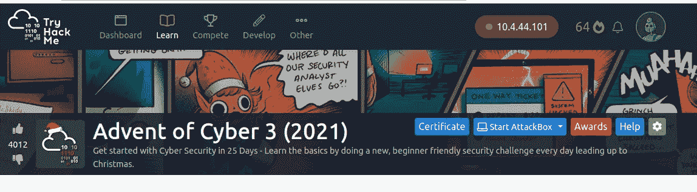
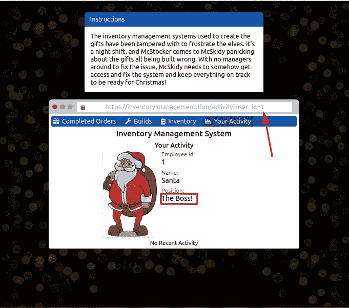
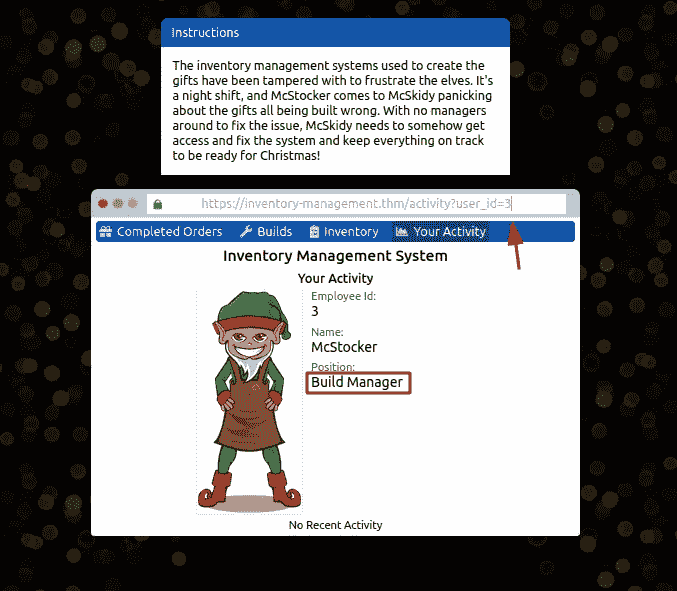
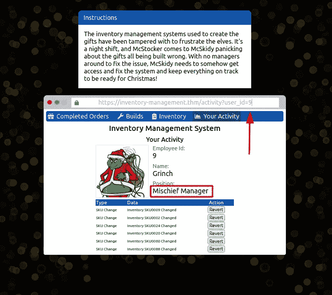
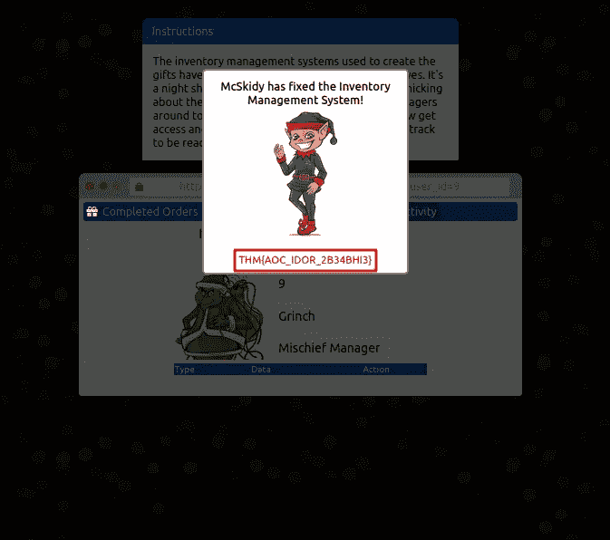

# [第一天]网络开发拯救礼物|网络 3 的到来(2021 年)

> 原文：<https://infosecwriteups.com/advent-of-cyber-3-2021-day-1-web-exploitation-save-the-gifts-800602bedba?source=collection_archive---------1----------------------->

对赛博 3 的到来非常兴奋，因为我对赛博 2 的到来有麻烦，哈哈。

赛博 3 的到来(2021)

从 2021 年 12 月 1 日开始，到 2021 年 12 月 25 日结束。25 天的挑战，我希望能享受这种学习。

# [第一天]网络开发保存礼物

1.  找到圣诞老人的账号后，他们在公司的职位是什么？

> 将用户标识改为 **1。**

2.找到麦克斯托克的账户后，他们在公司的地位如何？

> 将用户标识改为 **3。**

3.找到篡改负责的账号后，他们在公司是什么地位？

> 将 user_id 改为 **9。**你可以看到这个配置文件比其他配置文件有一些额外的表格，所以这可能非常有用。

4.McSkidy 修复库存管理系统时收到的标志是什么？

> 点击全部**回复**按钮，旗帜将出现

5.如果你想了解更多关于 IDOR 漏洞的信息，我们建议试试这个房间[https://tryhackme.com/room/idor](https://tryhackme.com/room/idor)

> 点击**问题完成**

6.每天发布的任务变得越来越难(但仍然有演练视频指导)。明天再来参加第二天的任务！

> 点击**问题完成**

## **结论**

到目前为止，第一天是关于 IDOR 的，你可以结束这个房间([https://tryhackme.com/room/idor](https://tryhackme.com/room/idor))来获得更多的知识。

谢谢