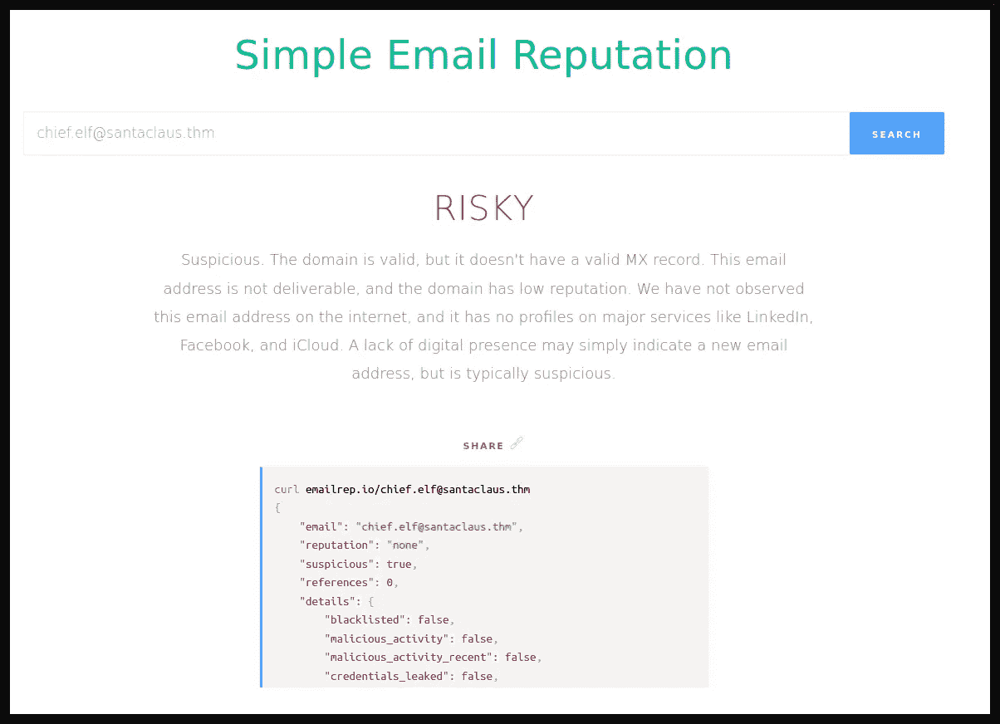
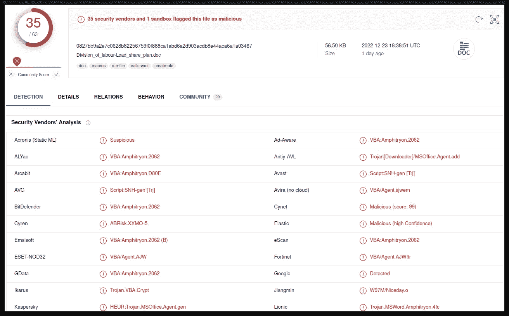
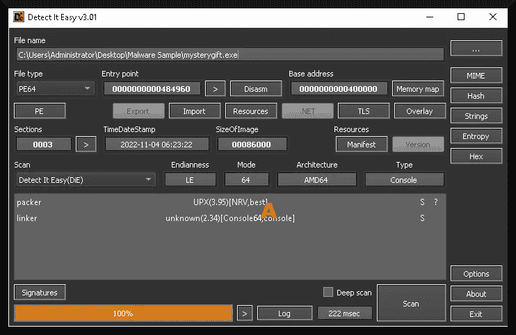
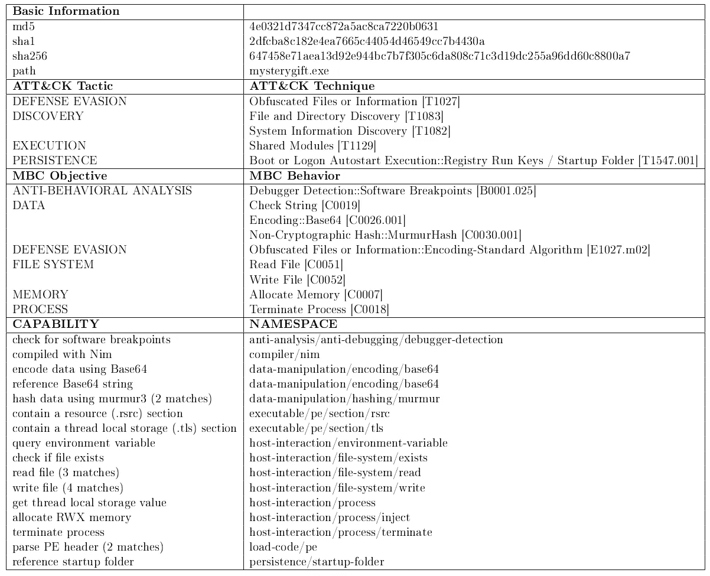
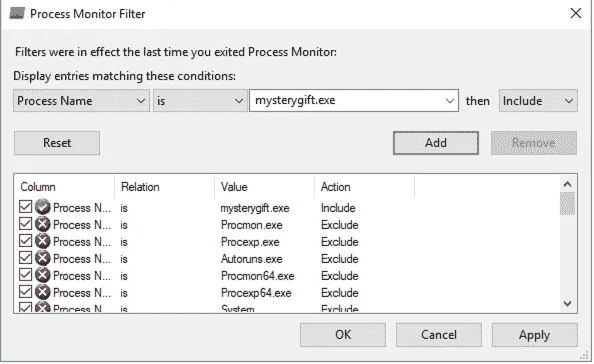
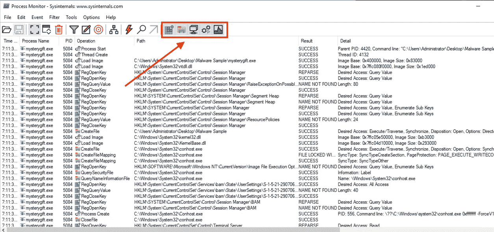

# Cyber 4 writeup 的出现:数字取证和事件响应案例研究

> 原文：<https://infosecwriteups.com/advent-of-cyber-4-writeup-a-case-study-in-digital-forensics-and-incident-response-4988aae9f48b?source=collection_archive---------0----------------------->

D *数字取证和事件响应*，一个通常简称为“DFIR”的术语，对于任何想要保证其计算机系统以及存储在其中的数据安全的组织来说，都是一个必要的过程。有足够动机的恶意黑客最终会找到侵入目标计算机系统的方法——有时甚至当有问题的计算机系统没有连接到互联网时([Berg hel 2015](https://doi.org/10.1109/mc.2015.179)；[格林伯格 2018](https://www.wired.com/story/air-gap-researcher-mordechai-guri/)； [Fino 2021](https://www.sciencebuddies.org/science-fair-projects/project-ideas/Cyber_p006/cybersecurity/air-gap-computer-hacking) )。在这篇文章中，我将通过一个虚构的案例来讨论我解决 DFIR 问题的经验。


部分图像成分来自:[神奇瓢虫(2022)](https://youtu.be/tUzcGXXtXF8)[《kuraxmasha》(未注明)](https://www.wattpad.com/713896884-miraculous-ladybug-and-chat-noir-picture)。

# 目录一览

1.  背景
2.  程序
3.  讨论
4.  结论
5.  参考

# 背景

数字取证可被定义为"*使用科学推导和[经验证明]的方法来保存、收集、验证、识别、分析、解释、记录和展示来自数字来源的数字证据，[…]* " ( [Reith 2022](https://www.just.edu.jo/~Tawalbeh/nyit/incs712/digital_forensic.pdf) )而事件响应可被定义为"*一种有组织的方法来处理和管理安全漏洞或网络攻击的后果* " ( [Chai 等人，c.a. 2022](https://www.techtarget.com/searchsecurity/definition/incident-response) )。人们可以推断，DFIR 可以被视为数字取证和事件响应的融合，以减轻网络攻击，这在某种程度上是成功的。在美国，“信息安全分析师”的就业市场正在迅速增长([职业展望手册 n.d.](https://www.bls.gov/ooh/computer-and-information-technology/information-security-analysts.htm) )，DFIR 工具甚至可以在非正式场合发挥作用( [Enoka 2022](https://nostarch.com/cybersecurity-small-networks) )。

在他们教育大众的永无止境的努力中，[“tryhackme”(2022)](https://tryhackme.com/room/adventofcyber4)设计了一个圣诞主题的房间来教授各种技能，这些技能已经显示出在实际的网络安全中是有用的。这个房间介绍了信息安全中不同子领域的技能组合，并使用了一个虚构的故事，涉及一个邪恶的雪人对圣诞老人和他的北极工作室执行计算机网络操作。这个房间让用户扮演为圣诞老人工作的各种“精灵”的角色，作为网络安全专家。这个房间的地址是 DFIR，我将处理一些具体的相关任务，以完成一个更大的任务，那就是分析一封附有恶意载荷的电子邮件。

# 程序

相关子任务的前提是，一个名为 *Elf McBlue* 的安全工程师发现了一封确实有理由怀疑恶意的邮件。我将讨论任务 6、7、11、12 和 13，以及我如何从一封可疑的电子邮件发展到找出一个恶意软件的行为并分析数据包捕获。

## 电子邮件分析

任务 6 从评估可疑电子邮件开始。我首先启动与该任务相关的虚拟机，并通过“分屏”访问它。我打开终端，做了一点“家务”来准备分析:

```
**ubuntu@ip-10-10-84-135:~$ cd Desktop
ubuntu@ip-10-10-84-135:~/Desktop$ mv "Urgent:.eml" Urgent.eml
ubuntu@ip-10-10-84-135:~/Desktop$**
```

为了分析可疑的电子邮件，我使用了`emlAnalyzer`实用程序(Wahl n.d .)来获取关于`Urgent.eml`的信息

```
**ubuntu@ip-10-10-84-135:~/Desktop$ emlAnalyzer -i Urgent.eml --header --html -u --text --extract-all**
 ==============
 ||  Header  ||
 ==============
X-Pm-Content-Encryption.....end-to-end
X-Pm-Origin.................internal
Subject.....................Urgent: Blue section is down. Switch to the load share plan!
From........................Chief Elf <chief.elf@santaclaus.thm>
Date........................Tue, 6 Dec 2022 00:00:01 +0000
Mime-Version................1.0
Content-Type................multipart/mixed;boundary=---------------------03edd9c682a0c8f60d54b9e4bb86659f
To..........................elves.all@santaclaus.thm <elves.all@santaclaus.thm>
X-Attached..................Division_of_labour-Load_share_plan.doc
Message-Id..................<QW9DMjAyMl9FbWFpbF9BbmFseXNpcw==>
X-Pm-Spamscore..............3
Received....................from mail.santaclaus.thm by mail.santaclaus.thm; Tue, 6 Dec 2022 00:00:01 +0000
X-Original-To...............elves.all@santaclaus.thm
Return-Path.................<murphy.evident@bandityeti.thm>
Delivered-To................elves.all@santaclaus.thm

 =========================
 ||  URLs in HTML part  ||
 =========================
[+] No URLs found in the html

 =================
 ||  Plaintext  ||
 =================
[+] Email contains no plaintext

 ============
 ||  HTML  ||
 ============
<span>Dear Elves,</span><div><br></div><div><span>Due to technical problems in the blue section of our toy factory, we are having difficulties preparing some toys. </span></div><div><br></div><div><span>There
 are a few days left to Christmas, so we need to use time efficiently to
 prepare every wishlist we receive. Due to that, the blue section's 
workload is shared with the rest to avoid any toy production delay.</span></div><div><br></div><div><span>The detailed division of labour is included in the attached document.</span></div><div><br></div><div><span>Good luck to you all.</span></div><div><br></div><div><b><span>Chief Elf</span></b></div><div><br></div>

 =============================
 ||  Attachment Extracting  ||
 =============================
[+] Attachment [1] "Division_of_labour-Load_share_plan.doc" extracted to eml_attachments/Division_of_labour-Load_share_plan.doc

**ubuntu@ip-10-10-84-135:~/Desktop$**
```

我从这个输出中注意到了许多有用的信息:

*   发件人的电子邮件地址是`chief.elf@santaclaus.thm`
*   收件人的电子邮件地址是`elves.all@santaclaus.thm`
*   寄信人地址是`murphy.evident@bandityeti.thm`
*   这封邮件是代表"精灵首领"发出的。
*   该电子邮件的`X-Spam`分数为 3。

`X-Spam`是指[Apache SpamAssassin(n . d .)](https://spamassassin.apache.org/)分配给邮件的一个编号，用来定量表示是否是垃圾邮件( [Rankin n.d.](https://dl.acm.org/doi/fullHtml/10.5555/1631670.1631679) )。为了进一步调查`Urgent.eml`是否是垃圾邮件，我在[简单电子邮件信誉(n.d.)](https://emailrep.io/) 服务上查找了发件人的电子邮件地址，看看我能找到什么。图 1 描述了我的结果:



图 1

这可以看作是进一步调查的基础。作为分析的一部分，`emlAnalyzer`创建一个名为`eml_attachments`的文件夹，其中包含从电子邮件文件中提取的附件。以下是提取的附件列表:

```
**ubuntu@ip-10-10-84-135:~/Desktop$ ls -l eml_attachments**
total 60
-rw-r--r-- 1 ubuntu ubuntu 57856 Dec 25 00:43 Division_of_labour-Load_share_plan.doc
**ubuntu@ip-10-10-84-135:~/Desktop$**
```

一份名为`Division_of_labour-Load_share_plan.doc`的[文档被附在可疑邮件中。鉴于电子邮件的“风险”性质，对这份文件进行一些分析是适当的。我使用了`sha256sum`命令来计算这个文档的阿沙-256 哈希(](https://www.microsoft.com/en-us/microsoft-365/word) [Eastlake & Hansen 2011](https://www.rfc-editor.org/rfc/rfc6234) ):

```
**ubuntu@ip-10-10-84-135:~/Desktop/eml_attachments$ sha256sum Division_of_labour-Load_share_plan.doc**
0827bb9a2e7c0628b82256759f0f888ca1abd6a2d903acdb8e44aca6a1a03467  Division_of_labour-Load_share_plan.doc
**ubuntu@ip-10-10-84-135:~/Desktop/eml_attachments$**
```

哈希可以被视为这个特定附件的唯一标识符，我可以用它来查询分析过这个文件的信息安全研究人员的数据库。我在 VirusTotal 上查找这个散列，得到了以下结果(图 2， [VirusTotal n.d.](https://www.virustotal.com/gui/file/0827bb9a2e7c0628b82256759f0f888ca1abd6a2d903acdb8e44aca6a1a03467) ):



图 2:来自 [VirusTotal(未标明](https://www.virustotal.com/gui/file/0827bb9a2e7c0628b82256759f0f888ca1abd6a2d903acdb8e44aca6a1a03467))的截图

鉴于所有这些证据，我现在将着手分析附件中最有可能是恶意行为的内容。

## 恶意附件

之前的任务让我分析一封可疑的电子邮件，我提取了一份(很可能是)恶意的微软 Word 文档。在这里，我将使用 [CyberChef (n.d.)](https://gchq.github.io/CyberChef/) 对 Word 文档中的恶意软件和方得( [Rowe & Rrushi 2016](https://doi.org/10.1007/978-3-319-41187-3_10) )各自的网址进行去泡沫处理。

我首先打开赛博咖啡馆，把之前分析过的`Division_of_labour-Load_share_plan.doc`加载进去。图 3 描述了我是如何完成后者的:


图 3:改编自[“tryhackme”(2022)](https://tryhackme.com/room/adventofcyber4)

然后，我根据任务说明创建了一个食谱。下面的 JSON 是我想出的将在 *Word* 文档中找到的信息转换成一些有用的威胁情报的方法:

```
[
  { "op": "Strings",
    "args": ["Single byte", 258, "All printable chars (A)", false, false, false] },
  { "op": "Find / Replace",
    "args": [{ "option": "Regex", "string": "[\\[\\]_\\n]" }, "", true, false, true, false] },
  { "op": "Drop bytes",
    "args": [0, 124, false] },
  { "op": "From Base64",
    "args": ["A-Za-z0-9+/=", true, false] },
  { "op": "Decode text",
    "args": ["UTF-16LE (1200)"] },
  { "op": "Find / Replace",
    "args": [{ "option": "Regex", "string": "['()+\"']" }, "", true, false, true, false] },
  { "op": "Find / Replace",
    "args": [{ "option": "Regex", "string": "]b2H_" }, "http", true, false, true, false] },
  { "op": "Extract URLs",
    "args": [false, false, false] },
  { "op": "Split",
    "args": ["@", "\\n"] },
  { "op": "Defang URL",
    "args": [true, true, true, "Valid domains and full URLs"] }
]
```

以下是对 Word 文档运行此配方时的输出:

```
hxxps[://]cdn[.]bandityeti[.]thm/files/mysterygift[.]exe
hxxps[://]google[.]com/
hxxps[://]www[.]secretSanta[.]THM/Goldenticket/**[redacted]**
hxxps[://]cdn[.]bandityeti[.]THM/files/index/
```

那个`mysterygift.exe`可执行文件看起来是进一步分析的一个很好的候选。

## 恶意软件分析:内存取证

在前面的任务中，我算出了四(4)个与恶意 Word 文档相关联的 URL。其中一个 URL 链接到一个名为`mysterygift.exe`的可执行文件，该文件托管在域名`cdn.bandityeti.thm`上。土匪雪人已经成功地将他们的恶意软件安装到北极车间的一些计算机系统上，因此分析受感染系统的内存转储可能会给我们一个“幕后窥视”

*Volatility Framework*([Volatility Foundation n . d .](https://www.volatilityfoundation.org/))是用于 DFIR 和其他计算机科学应用的“go to”内存取证工具。首先，我启动了与该任务相关的虚拟机，并开始获取`workstation.vmem`转储的 Windows 配置文件，以便我可以指示 Volatility 在正确假设受感染系统上运行的特定操作系统的情况下进行分析:

```
**elfmcblue@aoc2022-day-11:~/volatility3$ python3 vol.py -f workstation.vmem windows.info**
Volatility 3 Framework 2.4.1
Progress:  100.00PDB scanning finished                        
Variable Value

Kernel Base0xf803218a8000
DTB0x1ad000
Symbolsfile:///home/elfmcblue/volatility3/volatility3/symbols/windows/ntkrnlmp.pdb/E0093
F3AEF15D58168B753C9488A4043-1.json.xz
Is64BitTrue
IsPAEFalse
layer_name0 WindowsIntel32e
memory_layer1 FileLayer
KdVersionBlock0xf80321cd23c8
Major/Minor15.18362
MachineType34404
KeNumberProcessors4
SystemTime2022-11-23 10:15:56
NtSystemRootC:\Windows
NtProductTypeNtProductWinNt
NtMajorVersion10
NtMinorVersion0
PE MajorOperatingSystemVersion10
PE MinorOperatingSystemVersion0
PE Machine34404
PE TimeDateStampMon Apr 14 21:36:50 2104
**elfmcblue@aoc2022-day-11:~/volatility3$**
```

这个房间只是让它的用户对`workstation.vmem`内存转储做一个非常粗略和初步的分析。我首先获得了一个正在运行的进程列表:

```
**elfmcblue@aoc2022-day-11:~/volatility3$ python3 vol.py -f workstation.vmem windows.pslist**
Volatility 3 Framework 2.4.1
Progress:  100.00PDB scanning finished                        
PID PPID ImageFileName Offset(V) Threads Handles SessionId Wow64 CreateTime ExitTime File output

40System0xc0090b286040141-N/AFalse2022-11-23 09:43:
13.000000 N/ADisabled
1044Registry0xc0090b2dd0804-N/AFalse2022-11-2
3 09:43:04.000000 N/ADisabled
3164smss.exe0xc0090e4384002-N/AFalse2022-11-2
3 09:43:13.000000 N/ADisabled
436428csrss.exe0xc0090ea6514010-0False2022-11-2
3 09:43:18.000000 N/ADisabled
512504csrss.exe0xc0090f35e14012-1False2022-11-2
3 09:43:19.000000 N/ADisabled
536428wininit.exe0xc0090f2c00801-0False2022-11-2
3 09:43:19.000000 N/ADisabled
584504winlogon.exe0xc0090f3830803-1False2022-11-2
3 09:43:19.000000 N/ADisabled
656536services.exe0xc0090e5323405-0False2022-11-2
3 09:43:20.000000 N/ADisabled
680536lsass.exe0xc0090f3a50806-0False2022-11-2
3 09:43:20.000000 N/ADisabled
792656svchost.exe0xc0090fa3324012-0False2022-11-2

[... snip ...]

**2040 5888 mysterygift.ex 0xc0090b52e4c0 3 - 1 False 2022-11-23 10:15:19.000000 N/A Disabled**

[... snip ...]
```

从这个输出中，我了解到`mysterygift.exe`的进程 ID (PID)是 2040。然后，我转储了与`workstation.vmem`相关的工件，以供进一步分析:

```
**elfmcblue@aoc2022-day-11:~/volatility3$ python3 vol.py -f workstation.vmem windows.dumpfiles**
Volatility 3 Framework 2.4.1
Progress:  100.00PDB scanning finished                        

Cache File Object FileName Result

DataSectionObject0xc0090ba87280USBXHCI.SYS.muiError dumping file
DataSectionObject0xc0090e5cad50EtwRTEventlog-Security.etlError dumping f
ile
SharedCacheMap0xc0090e5cad50EtwRTEventlog-Security.etlError dumping file
DataSectionObject0xc0090e5c8680EtwRTEventLog-Application.etlError dumping f
ile
SharedCacheMap0xc0090e5c8680EtwRTEventLog-Application.etlError dumping file
DataSectionObject0xc0090e5c9930EtwRTDefenderAuditLogger.etlError dumping f
ile

[... snip ...]
```

在转储文件时，输出报告了一些错误，但是我仍然坚持并开始进行下一阶段的分析。

## 恶意软件分析:二进制分析

恶意植入程序存储在一个名为`mysterygift.exe`的可执行文件中。在前一个任务中，我将它转储到磁盘上的一个文件中，在这个任务中，我将使用静态和动态分析技术来分析它的行为。

像往常一样，我启动了与这个任务相关联的虚拟机，然后登录到它。然后，在开始分析之前，我在命令提示符下做了一些整理工作:

```
FLARE
**C:\Users\Administrator>cd Desktop\"Malware Sample"**

FLARE
**C:\Users\Administrator\Desktop\Malware Sample>mv mysterygift mysterygift.exe**
```

我从使用*Detect It Easy*("[Hors " n . d .](https://github.com/horsicq/Detect-It-Easy))分析二进制文件的属性开始——这将允许我查看是否有任何打包应用到可执行文件以减小其文件大小或使分析更加困难。图 4 描述了初步分析的结果:



图 4

从这些结果中，我可以看到这个二进制文件中包含了[upx(n . d .)](https://upx.github.io/)——这使得分析变得更加困难。为了减轻这个困难，我用安装在任务虚拟机上的`upx`实用程序对它进行了解包:

```
FLARE
**C:\Users\Administrator\Desktop\Malware Sample>upx -d mysterygift.exe**
                       Ultimate Packer for eXecutables
                          Copyright (C) 1996 - 2020
UPX 3.96w       Markus Oberhumer, Laszlo Molnar & John Reiser   Jan 23rd 2020

        File size         Ratio      Format      Name
   --------------------   ------   -----------   -----------
    502169 <-    227737   45.35%    win64/pe     mysterygift.exe

Unpacked 1 file.

FLARE
**C:\Users\Administrator\Desktop\Malware Sample>**
```

然后，我将`capa` ( [Mandiant n.d.](https://www.mandiant.com/resources/blog/capa-automatically-identify-malware-capabilities) )与`mysterygift.exe`进行了对比，以进一步了解它的行为:

```
**C:\Users\Administrator\Desktop\Malware Sample>capa mysterygift.exe**
loading : 100%|████████████████████████████████████████████████████████████| 485/485 [00:00<00:00, 1724.35     rules/s]
matching: 100%|██████████████████████████████████████████████████████████████| 573/573 [00:17<00:00, 33.21 functions/s]

[... snip ...]
```

表 1 描述了在`mysterygift.exe`上运行时`capa`的输出:



表 1

从这些信息中可以收集到许多有用的信息，例如恶意软件根据[米特 ATT & CK 框架【n . d .】](https://attack.mitre.org/)显示出哪些能力，以及它表现出哪些具体行为。特别是，恶意软件样本采用了一些反分析技术、数据收集(和可能的渗透)，并通过 *Windows 注册表* ( [White et al. 2021](https://learn.microsoft.com/en-us/windows/win32/sysinfo/registry) )和启动文件夹( [Microsoft Learn](https://support.microsoft.com/en-us/windows/add-an-app-to-run-automatically-at-startup-in-windows-10-150da165-dcd9-7230-517b-cf3c295d89dd) )中的条目登录启动。

为了更好地了解恶意软件的行为，我用*进程监视器* ( [Russinovich 2022](https://learn.microsoft.com/en-us/sysinternals/downloads/procmon) )进行了一些基本的动态分析。我配置了*进程监视器*来根据进程名`mysterygift.exe`缩小信息范围(参见图 5):



图 5:改编自[《tryhackme》(2022)](https://tryhackme.com/room/adventofcyber4)

然后我配置*进程监视器*来收集关于恶意软件如何与 Windows 注册表、文件系统、网络和计算机系统的其他功能交互的信息。图 6 描述了这一点:



图 6:改编自[《tryhackme》(2022)](https://tryhackme.com/room/adventofcyber4)

进行这种分析揭示了许多有用的信息:

*   该恶意软件通过在 Windows 注册表中的当前用户的`Run`键中引入一个值来生存。具体来说，它将值`C:\Users\Administrator\AppData\Roaming\Microsoft\Windows\Start Menu\Programs\Startup\wishes.bat`写入`Run`键。
*   恶意软件在管理员文件夹下创建文件`test.jpg`和`wishes.bat`。具体来说，`wishes.bat`在管理员的启动文件夹中。
*   恶意软件连接到两(2)个域:`bestfestivalcompany.thm`和`virustotal.com` —它开始访问前一个域上名为`favicon.ico`的文件。

这一切都非常有趣——尤其是网络通信。我现在将继续分析恶意软件如何与`bestfestivalcompany.thm`域通信。

## 数据包分析

在之前的任务中，我观察到`mysterygift.exe`恶意软件与名为`bestfestivalcompany.thm`的域进行通信。我使用了 [Wireshark (n.d.)](https://www.wireshark.org/) 来分析数据包嗅探器，并在此简要讨论我的发现:

*   在计算 HTTP 通信的“数据包百分比”时，我发现它占 Wireshark 条目的 0.3%。
*   恶意软件使用协议与攻击者进行通信([梁等 2021](https://learn.microsoft.com/en-us/troubleshoot/windows-server/remote/understanding-remote-desktop-protocol) )。
*   滴管有用户代理`Nim httpclient/1.6.8`。做一点小小的研究就可以发现这个滴管可能是用 [Nim 编程语言(n.d.)](https://nim-lang.org/) 编写的。
*   `mysterygift.exe`文件的 SHA-256 哈希是`0ce160a54d10f8e81448d0360af5c2948ff6a4dbb493fe4be756fc3e2c3f900f`

我认为，这是对入侵者留下的恶意软件工件的足够分析，足以对事件做出响应。

# 讨论

其他 TryHackMe 用户已经写下了他们对这些关于我在本文中所做的 DFIR 任务的 Cyber 4 任务的体验([巴尔冈 2022 a](/tryhackme-advent-of-cyber-2022-day-6-its-beginning-to-look-a-lot-like-phishing-no-answers-p-66b57be74cb3)；[Nagaraj 2022 a](/advent-of-cyber-2022-day5-email-analysis-its-beginning-to-look-a-lot-like-phishing-by-978dab792ebf)；[夏皮罗](https://electronicsreference.com/thm/advent-of-cyber-2022/day-6/)；[Breth n . d .](https://jbcsec.com/advent-of-cyber-2022/)；[巴尔冈 2022 b](/tryhackme-advent-of-cyber-2022-day-7-maldocs-roasting-on-an-open-fire-no-answers-p-d9d90522bc94)； [Nagaraj 2022b](/advent-of-cyber-2022-day-12-malware-analysis-forensic-mcblue-to-the-revscue-write-up-44fc80e95c7) 。这些学生、研究人员和其他类型的 TryHackMe 用户都有自己有趣的方法，并采用了在这个房间里展示的 DFIR 技术。

我觉得我可以尝试一些不同的东西，把相关的任务链接在一起，并展示它们之间的关系。为了提高本文的可读性，我省略了一些我个人认为不相关的细节。

这篇文章的一个缺点是，我没有报告任务所要求的所有信息。尽管如此，我确实认为我提供了关于基本数字取证和事件响应技术的观点，这将使潜在的 SOC 分析师能够收集有用的威胁情报，用于减轻恶意黑客的攻击。

# 结论

但愿我已经让读者相信，数字取证和事件响应技能对于信息安全的防御甚至进攻都是有用的。关于安全工程的防御方面，这些技术有助于抓住恶意黑客。但是对于安全工程的攻击性方面，本文中的信息可以用来建立一个简单的基线，用于在进行渗透测试时测试防御规避策略。

# 参考

Apache SpamAssassin(未注明日期)。2022 年 12 月 24 日检索自:[https://spamassassin.apache.org/](https://spamassassin.apache.org/)

Ballenthin 和 m . Raabe(2020 年)。 *capa:自动识别恶意软件能力*。曼迪昂特。2022 年 12 月 24 日检索自:[https://www . man diant . com/resources/blog/capa-automatically-identify-malware-capabilities](https://www.mandiant.com/resources/blog/capa-automatically-identify-malware-capabilities)

巴尔冈，标准普尔(2022 年 a)。*TryHackMe Cyber 2022 来临[第 6 天]这开始看起来很像网络钓鱼——没有答案:P* 。信息安全报道。2022 年 12 月 24 日检索自:[https://infosecwriteups . com/tryhackme-advent-of-cyber-2022-day-6-its-beging-look-a-lot-like-now-answers-p-66b 57 be 74 CB 3](/tryhackme-advent-of-cyber-2022-day-6-its-beginning-to-look-a-lot-like-phishing-no-answers-p-66b57be74cb3)

巴尔冈，标准普尔(2022 年 b)。*TryHackMe Cyber 2022 来临【第 7 天】马尔多克斯在明火上烤——没有答案:P* 。信息安全报道。2022 年 12 月 24 日检索自:[https://infosecwriteups . com/tryhackme-advent-of-cyber-2022-day-7-maldocs-baking-on-an-open-fire-no-answers-p-d9d 90522 BC 94](/tryhackme-advent-of-cyber-2022-day-7-maldocs-roasting-on-an-open-fire-no-answers-p-d9d90522bc94)

伯格赫尔(2015 年)。告别空气间隙，第 1 部分。*在《计算机》(第 48 卷第 6 期第 64–68 页)*。电气和电子工程师协会。[https://doi.org/10.1109/mc.2015.179](https://doi.org/10.1109/mc.2015.179)

两者，D. (2019)。打击垃圾邮件。*在使用和管理 Linux:第 3 卷(第 187-213 页)*。阿普瑞斯。[https://doi.org/10.1007/978-1-4842-5485-1_9](https://doi.org/10.1007/978-1-4842-5485-1_9)

布雷斯法官(未注明)。网络 2022 演练的到来。jbc 安全公司。2022 年 12 月 24 日检索自:[https://jbcsec.com/advent-of-cyber-2022/](https://jbcsec.com/advent-of-cyber-2022/)

柴，比弗 k .和罗森克兰斯，l .(中华民国 2022 年)。*什么是事件响应*？TechTarget。2022 年 12 月 24 日检索自:[https://www . techtarget . com/search security/definition/incident-response](https://www.techtarget.com/searchsecurity/definition/incident-response)

网络咖啡馆(未注明日期)。2022 年 12 月 24 日检索自:[https://gchq.github.io/CyberChef/](https://gchq.github.io/CyberChef/)

d .伊斯特莱克和 t .汉森(2011 年)。*美国安全哈希算法(SHA 和基于 SHA 的 HMAC 和 HKDF)* 。互联网工程任务组。2022 年 12 月 24 日检索自:【https://www.rfc-editor.org/rfc/rfc6234 

Enoka，S. (2022)。*小型网络的网络安全:给合理偏执者的一本实用指南*。没有淀粉压机。

菲尼奥，B. (2021)。*黑客入侵 Air Gap:从一台没有联网的电脑上窃取数据。*2022 年 12 月 24 日检索自:[https://www . science buddies . org/science-fair-projects/project-ideas/Cyber _ p006/Cyber security/air-gap-computer-hacking](https://www.sciencebuddies.org/science-fair-projects/project-ideas/Cyber_p006/cybersecurity/air-gap-computer-hacking)

格林伯格，A. *注意差距:这位研究人员用噪音、光和磁铁窃取数据*。连线杂志。2022 年 12 月 24 日检索自:[https://www . wired . com/story/air-gap-research-morde chai-guri/](https://www.wired.com/story/air-gap-researcher-mordechai-guri/)

“霍斯”(未注明)。*轻松检测:用于确定 Windows、Linux 和 MacOS 文件类型的程序*。GitHub 仓库。2022 年 12 月 24 日检索自:[https://github.com/horsicq/Detect-It-Easy](https://github.com/horsicq/Detect-It-Easy)

Johansen，G. (2017)。*数字取证和事件响应:部署数字取证技术以应对网络安全事件的实用指南*。包装出版公司。

“kuraxmasha”(未注明)。*神奇瓢虫动漫 1* 。瓦特帕德。2022 年 12 月 25 日检索自:[https://www . watt pad . com/713896884-神奇瓢虫-聊天-黑色图片](https://www.wattpad.com/713896884-miraculous-ladybug-and-chat-noir-picture)

梁等(2021)。*了解远程桌面协议(RDP)* 。微软学习。2022 年 12 月 24 日检索自:[https://learn . Microsoft . com/en-us/trouble shooting/windows-server/remote/understanding-remote-desktop-protocol](https://learn.microsoft.com/en-us/troubleshoot/windows-server/remote/understanding-remote-desktop-protocol)

微软学习(未注明日期)。*在 Windows 10 中添加一个启动时自动运行的 app*。2022 年 12 月 24 日检索自:[https://support . Microsoft . com/en-us/windows/add-an-app-to-run-at-startup-in-windows-10-150 da 165-DCD 9-7230-517 b-cf 3c 295d 89 DD](https://support.microsoft.com/en-us/windows/add-an-app-to-run-automatically-at-startup-in-windows-10-150da165-dcd9-7230-517b-cf3c295d89dd)

微软 Word(未注明日期)。2022 年 12 月 24 日检索自:【https://www.microsoft.com/en-us/microsoft-365/word 

神奇的瓢虫(2022)。*奇迹般的|* 🐞❄️ *圣诞老人爪子* ❄️🐾 *|全集|瓢虫的故事&黑色猫*。YouTube 视频。2022 年 12 月 25 日检索自:[https://youtu.be/tUzcGXXtXF8](https://youtu.be/tUzcGXXtXF8)

米特 ATT 和 CK 框架(未标明)。2022 年 12 月 24 日检索自:[https://attack.mitre.org/](https://attack.mitre.org/)

蒙塔萨里、卡彭特、v .和希尔(2019 年)。数字取证研究路线图:在数字取证中建立设计科学研究过程的新方法。*载于《国际电子安全与数字取证杂志》(第 11 卷第 2 期第 194 页)*。Inderscience 出版社。[https://doi.org/10.1504/ijesdf.2019.098784](https://doi.org/10.1504/ijesdf.2019.098784)

k . nagaraj(2022 a)。网络 2022 [Day6]电子邮件分析的出现——它开始看起来很像 Karthikeyan Nagaraj 的网络钓鱼。信息安全报道。2022 年 12 月 24 日检索自:[https://infosecwriteups . com/advent-of-cyber-2022-day 5-email-analysis-its-beginning-to-look-a-lot-like-phishing-by-978 dab 792 ebf](/advent-of-cyber-2022-day5-email-analysis-its-beginning-to-look-a-lot-like-phishing-by-978dab792ebf)

k . nagaraj(2022 b)。*赛博 2022【第 12 天】来临——恶意软件分析法医 McBlue 到 REVscue* ！写上去。信息安全报道。2022 年 12 月 24 日检索自:[https://infosecwriteups . com/advent-of-cyber-2022-day-12-malware-analysis-forensic-MC blue-to-the-revscue-write-up-44 fc 80 e 95 c 7](/advent-of-cyber-2022-day-12-malware-analysis-forensic-mcblue-to-the-revscue-write-up-44fc80e95c7)

Nim 程序设计语言。2022 年 12 月 24 日检索自:[https://nim-lang.org/](https://nim-lang.org/)

职业展望手册(未注明)。*信息安全分析师*。劳工统计局。2022 年 12 月 24 日检索自:[https://www . bls . gov/ooh/computer-and-information-technology/information-security-analysts . htm](https://www.bls.gov/ooh/computer-and-information-technology/information-security-analysts.htm)

兰金，k .(未注明)。*黑客和/ —垃圾邮件:火腿黑客*。计算机机械协会。2022 年 11 月 24 日检索自:[https://dl.acm.org/doi/fullHtml/10.5555/1631670.1631679](https://dl.acm.org/doi/fullHtml/10.5555/1631670.1631679)

Reith，c . Carr 和 g . gun sch(2002)。数字法医模型的检验。*载于《国际数字证据杂志》(第 1 卷第 3 期)*。尤蒂卡大学。[https://www . Utica . edu/academic/institutes/ecii/publications/articles/a 04 a 40 DC-a6 F6-F2 C1-98 f 94 f 16 af 57232d . pdf](https://www.utica.edu/academic/institutes/ecii/publications/articles/A04A40DC-A6F6-F2C1-98F94F16AF57232D.pdf)

北卡罗来纳州 Rowe 和 j . Rrushi(2016 年)。防御性社会工程。*网络欺骗简介(第 121-131 页)*。斯普林格国际出版公司。[https://doi.org/10.1007/978-3-319-41187-3_10](https://doi.org/10.1007/978-3-319-41187-3_10)

Russinovich，M. (2022)。*过程监控 3.92 版*。微软学习。2022 年 12 月 24 日检索自:[https://learn . Microsoft . com/en-us/sysinternals/downloads/proc mon](https://learn.microsoft.com/en-us/sysinternals/downloads/procmon)

夏皮罗(未注明)。赛博 2022 来临——第六天演练。电子参考。2022 年 12 月 24 日检索自:[https://electronics reference . com/thm/advent-of-cyber-2022/day-6/](https://electronicsreference.com/thm/advent-of-cyber-2022/day-6/)

简单电子邮件信誉(未注明)。2022 年 12 月 24 日检索自:[https://emailrep.io/](https://emailrep.io/)

“tryhackme”等人(2022 年)。*网络 2022 年来临:24 天内开始学习网络安全——通过在圣诞节前每天做一个新的、初学者友好的安全挑战来学习基础知识*。TryHackMe。2022 年 12 月 24 日检索自:[https://tryhackme.com/room/adventofcyber4](https://tryhackme.com/room/adventofcyber4)

upx(未标明)。*可执行文件的终极打包器*。2022 年 12 月 24 日检索自:【https://upx.github.io/ 

病毒总数(未标明)。*档案-0827 bb 9 a 2e 7c 0628 b 82256759 f0f 888 ca 1 ab d6a 2d 903 CDB 8 e 44 ACA 6a 1a 03467*。2022 年 12 月 24 日检索自:[https://www . virus total . com/GUI/file/0827 bb 9 a 2e 7c 0628 b 82256759 f0f 888 ca 1 ab d6a 2d 903 CDB 8 e 44 ACA 6a 1a 03467](https://www.virustotal.com/gui/file/0827bb9a2e7c0628b82256759f0f888ca1abd6a2d903acdb8e44aca6a1a03467)

波动基金会(未标明)。*开源内存取证*。2022 年 12 月 24 日检索自:[https://www.volatilityfoundation.org/](https://www.volatilityfoundation.org/)

沃尔，女(未注明)。*emlan analyzer:分析 eml 格式电子邮件的 cli 脚本，用于查看邮件头、提取附件等*。GitHub 仓库。2022 年 12 月 24 日检索自:[https://github.com/wahlflo/eml_analyzer](https://github.com/wahlflo/eml_analyzer)

怀特等人(2021 年)。*注册表*。微软学习。2022 年 12 月 24 日检索自:[https://learn . Microsoft . com/en-us/windows/win32/sysinfo/registry](https://learn.microsoft.com/en-us/windows/win32/sysinfo/registry)

Wireshark(未标明)。2022 年 12 月 24 日检索自:[https://www.wireshark.org/](https://www.wireshark.org/)

## 来自 Infosec 的报道:Infosec 每天都有很多内容，很难跟上。[加入我们的每周简讯](https://weekly.infosecwriteups.com/)以 5 篇文章、4 个线程、3 个视频、2 个 GitHub Repos 和工具以及 1 个工作提醒的形式免费获取所有最新的 Infosec 趋势！