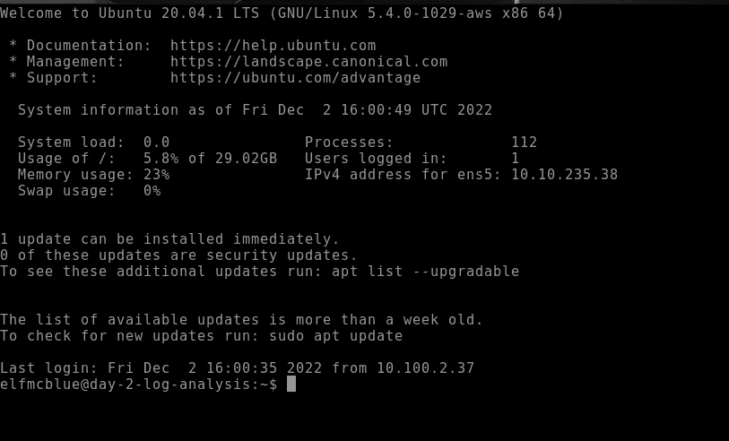
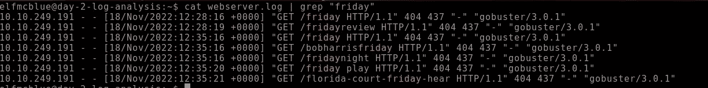
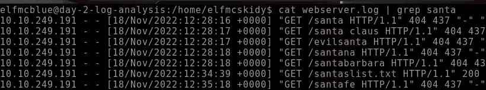

# 网络 2022 的来临[第二天]

> 原文：<https://infosecwriteups.com/advent-of-cyber-day-2-log-analysis-santas-naughty-nice-log-ff194383a9e3?source=collection_archive---------1----------------------->

## **日志分析**圣诞老人的淘气&漂亮的日志

Cyber-4 第 2 天的来临——2022 年 12 月 2 日~ Karthikeyan Nagaraj


1.  使用`ls`命令列出当前目录中的文件。有多少日志文件？

首先连接到机器或攻击箱



然后键入 ls 命令列出文件和文件夹


```
Ans: 2
```

2.Elf McSkidy 设法捕获了 web 服务器生成的日志。该日志文件的名称是什么？


```
Ans: webserver.log
```

3.从问题 3 开始研究日志文件，回答以下问题。

```
Ans: No Answer Needed
```

4.圣诞老人的淘气和乖孩子名单在哪一天被偷了？

> 让我们通过 Grep 来调查这个文件

```
cat webserver.log | grep “friday”
```



```
Ans: friday
```

5.攻击者的 IP 地址是什么？

> 由于日志文件显示了攻击者的 IP


```
Ans: 10.10.249.191
```

6.攻击者从圣诞老人那里偷走的重要名单叫什么？

```
cat webserver.log | grep santa
```



```
Ans: santaslist.txt
```

7.查看日志文件中的标志。标志的格式是:THM{}

```
grep -r "THM"
```


```
Ans: The Answer is in the Above Image
```

8.对日志分析感兴趣？我们推荐 [Windows 事件日志](https://tryhackme.com/room/windowseventlogs)室或者[端点安全监控模块](https://tryhackme.com/module/endpoint-security-monitoring)。

```
Ans: No Answer Needed
```

感谢您的阅读！！

黑客快乐~

```
Author : Karthikeyan Nagaraj ~ Cyberw1ng
```

Tryhackme，Tryhackme 赛博降临 2022 年 12 月 2 日第 2 天任务 7【第 2 天】**日志分析**圣诞老人的淘气&不错的日志，赛博降临 2022 第 2 天答案

## 来自 Infosec 的报道:Infosec 每天都有很多内容，很难跟上。[加入我们的每周简讯](https://weekly.infosecwriteups.com/)以 5 篇文章、4 个线程、3 个视频、2 个 GitHub Repos 和工具以及 1 个工作提醒的形式免费获取所有最新的 Infosec 趋势！