# 代理 Sudo | TryHackMe 演练

> 原文：<https://infosecwriteups.com/agent-sudo-tryhackme-walkthrough-51f498173149?source=collection_archive---------0----------------------->

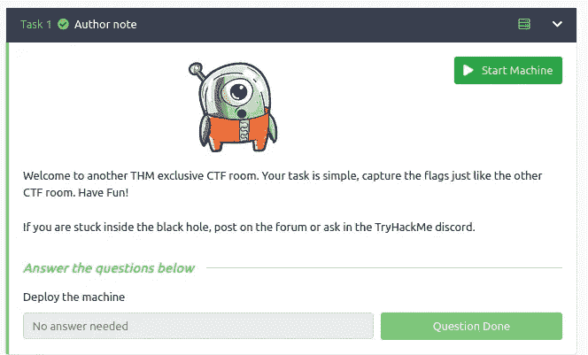

整理来自 TryHackMe 的一些 CTF 房间，磨砺一下黑客技术，*。因此，今天我将解释关于解决代理 Sudo 房间的演练。*

***让我们抓住那个特工……***

## *列举*

*1.有多少个开放的港口？*

> *3*

*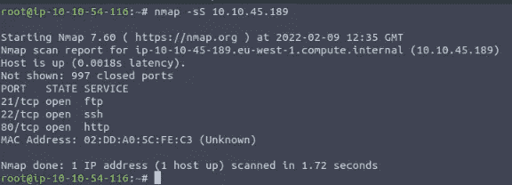*

*2.你如何将自己重定向到一个秘密页面？*

> *用户代理*

*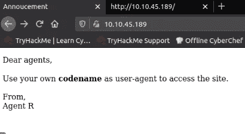*

*我从网页上找到了线索。让我们截取连接，并用 **C.** 更改用户代理*

*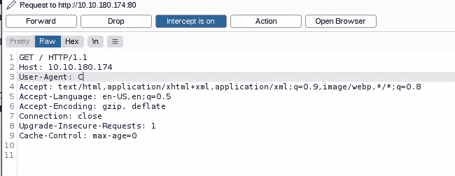*

*是的，我们做到了。*

*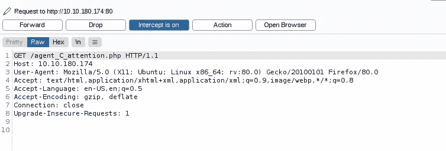*

*这是重定向页面的输出。*

*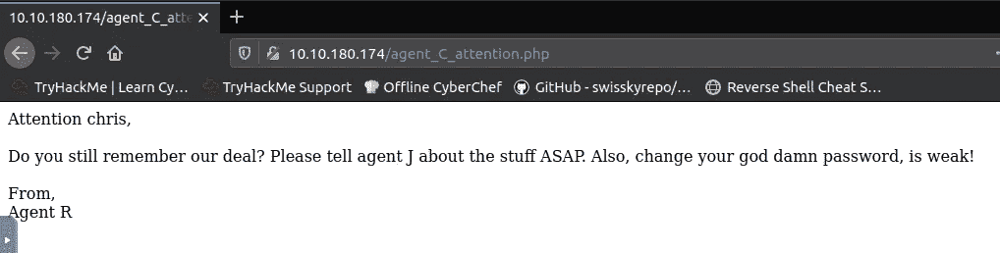*

## *哈希破解和暴力破解*

*在枚举步骤中，FTP 服务在端口 22(默认端口)上处于活动状态。
所以，有了之前的线索，导致密码较弱，我有兴趣用**九头蛇**蛮力破解密码。*

*是的，答对了。*

> *FTP 密码= ***水晶****

*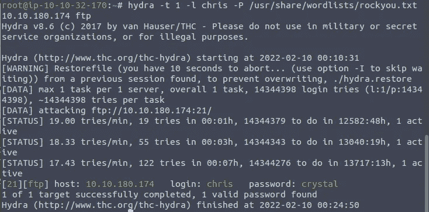*

*尝试使用 FTP 登录到服务器。*

*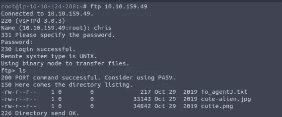*

*有 3 个文件，很有意思。*

*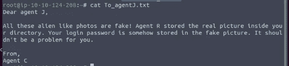*

*喔，我们有一些隐写术文件。
然后用 binwalk 分析，我得到**cutie.png**有几个隐藏文件。*

*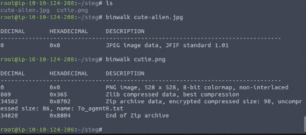*

*尝试解压文件，有一个名为 8702.zip 的压缩文件
然后把 zip 文件转换成 John hashes，用**开膛手 John 破解。***

*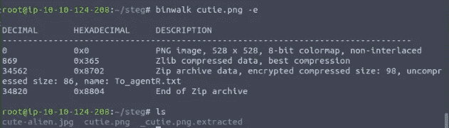*

*最后，zip 文件的密码是**外星人***

*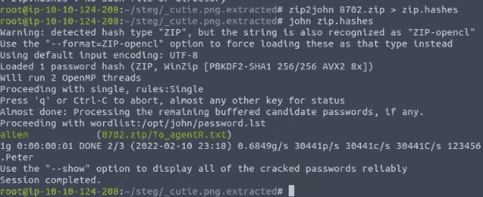*

*然后尝试打开该文件。*

*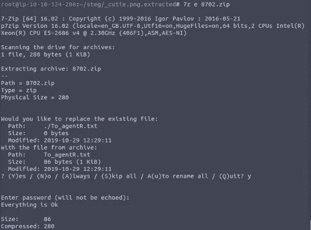*

*这就像一个秘密信息，但 QXJlYTUx 似乎与众不同。*

*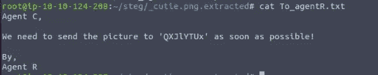*

*尝试一些解码器，base64 就是答案。隐写密码是 **Area51** 。*

**

*用 **steghide** 从另一个 png 文件中提取消息。*

*另一名特工的名字是**詹姆斯**。*

*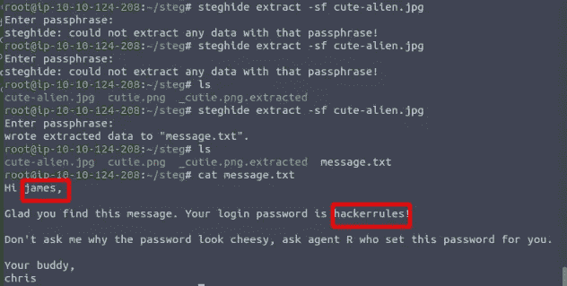*

*尝试使用**詹姆斯** : **黑客规则登录服务器！**，我在服务器上。*

*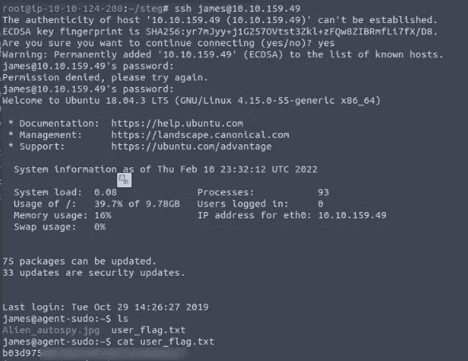*

*用谷歌图片搜索图片。*

*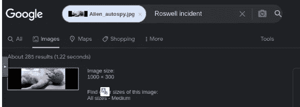***

## ***权限提升***

*对于 priv esc，我使用自动化程序。*

*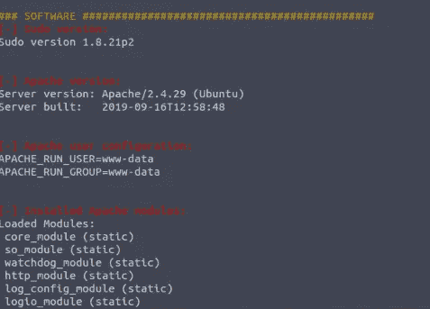*

*看到须藤版了吗？让我们检查一下..*

*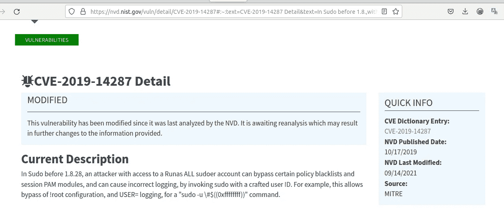*

*使用 CVE-2019–14287， **sudo.sh** 的脚本利用机器*

*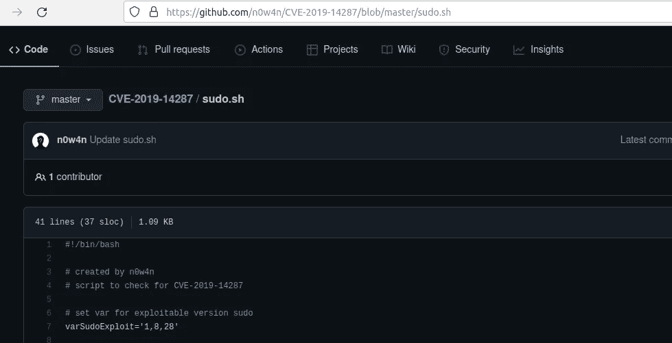*

*我们找到了根。*

*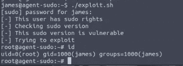**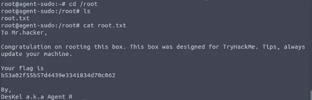*

## *结论*

*这个房间是一个在道德黑客或渗透测试中练习很多技巧的令人惊奇的房间。从枚举、破解和暴力破解开始，寻找漏洞并获取特权用户。*

> *不断前进，做专家。*

*感谢阅读。*

*Infosec Writeups 团队刚刚完成了我们的第一次虚拟网络安全会议和网络活动。我们有 16 位出色的演讲者，他们主持了非常有价值和鼓舞人心的会议。要查看演讲者和主题列表，请点击此处。*

* [## IWCon2022 — Infosec 书面报告虚拟会议

### 与世界上最优秀的信息安全专家建立联系。了解网络安全专家如何取得成功。将新技能添加到您的…

iwcon.live](https://iwcon.live/)*