# 代理 Sudo 演练-Tryhackme

> 原文：<https://infosecwriteups.com/agent-sudo-walkthrough-tryhackme-d0abf6f2c6a1?source=collection_archive---------0----------------------->

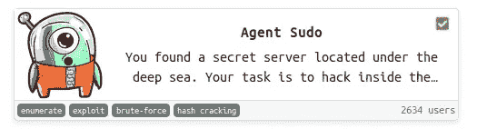

代理 Sudo 是由 Deskel 创建的 Tryhackme 上的一个简易房间。该机器需要枚举、哈希破解、隐写术和权限提升。

我们从 Nmap 扫描开始了解开放的端口。

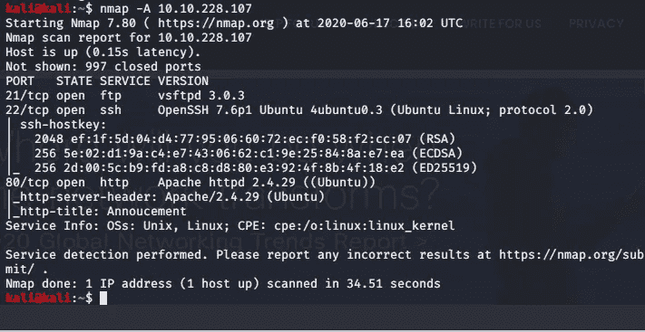

我们有 3 个端口，所以首先，我们检查网页浏览器的端口 80。

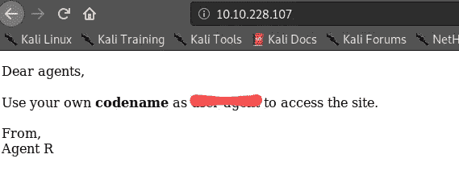

因此，从网页上，我们看到了来自代理 r 的代理公告。tryhackme 提示是将“用户代理”改为“C”。所以我们启动了 Burpsuite 来拦截这个请求。

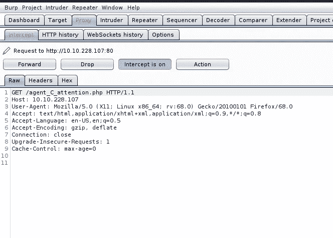

在捕获请求后，我们用“C”修改了“用户代理”,并转发请求。

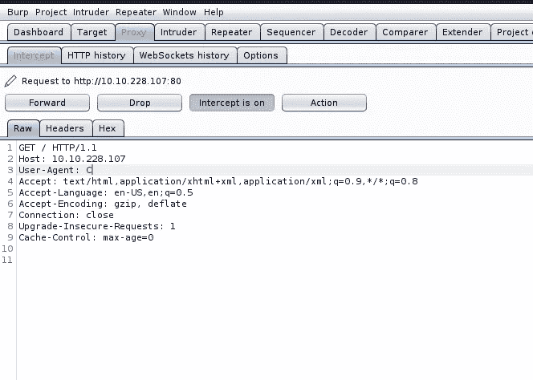

当我们在 Burpsuite 上收到成功消息后，我们查看了网页。

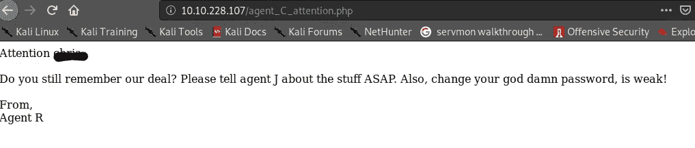

我们得到了一个代理的名字，从消息中，我们知道代理的密码很弱，所以现在我们可以用 Hydra 来强制 FTP。

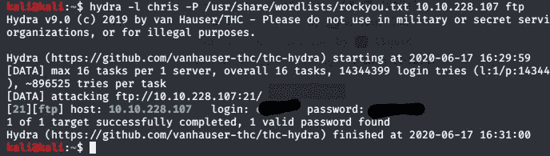

现在我们知道了可以通过 FTP 登录的代理的密码。

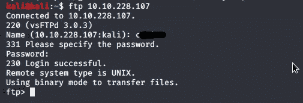

我们已经通过 FTP 成功登录，我们检查了内容，我们得到了图像和一个文本文件，我们使用“get command”下载了所有文件。

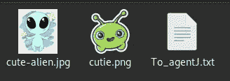

通过查看“To_agentJ.txt”文件，该消息是克里斯的登录密码存储在假图片中。

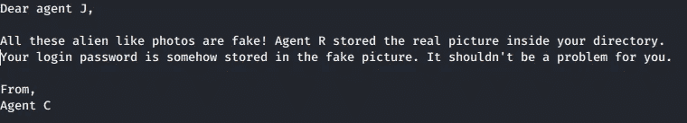

因此，我们使用“Steghide”来检索一些隐藏的信息，并通过“ExifTool”检查“cutie.png”文件，但在我们尝试使用“binwalk”后，什么也没有出现，我们在“cutie.png”文件中获得了一个 zip 文件，并从“cutie.png”中提取了它，但它是加密的。

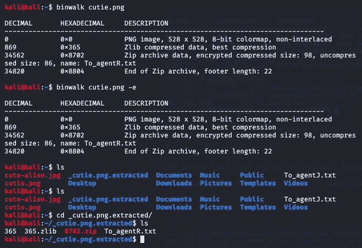

因此，我们使用“zip2john”来破解这个命令的密码 zip 文件

> 。/zip2john 8702.zip > Output.txt

然后我们利用约翰来破解。

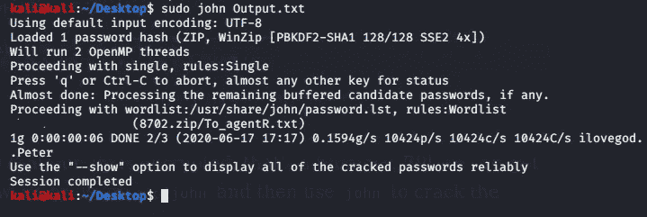

我们得到了“a****”密码，所以我们尝试解压缩 zip 文件，但是 unzip 命令不起作用，所以我们使用了这个命令

> 7z e 8702.zip

输入密码并解压 zip 文件后，我们收到了这条消息。

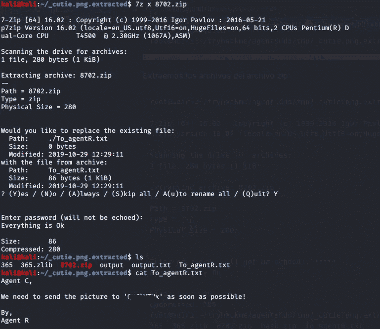

这条信息来自特工 R，我们用电脑破解了这条“Q******”信息。Cyberchef 建议自动解码。

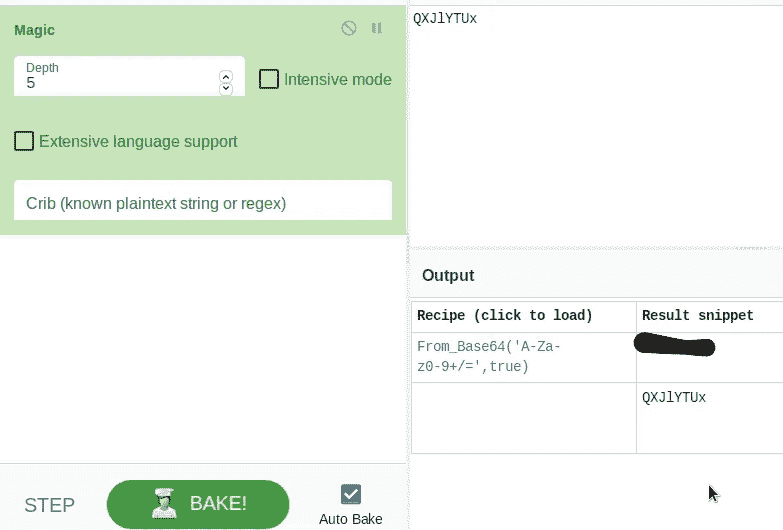

我们得到了密码，现在只剩下图片文件“可爱的外星人。jpg ”,所以我们使用“隐藏”工具来检索隐藏的信息。

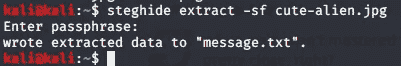

信息被提取到“message.txt ”,在查看消息后，我们得到了用户名和密码。

现在，我们使用找到的用户名和密码通过 SSH 登录到计算机，现在我们可以读取用户标志了

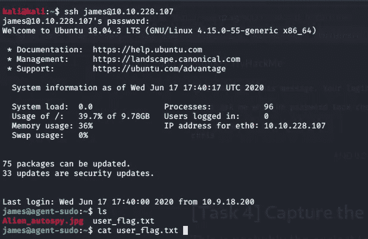

# 特权限制

我们检查了用户对“sudo -l”命令的权限。

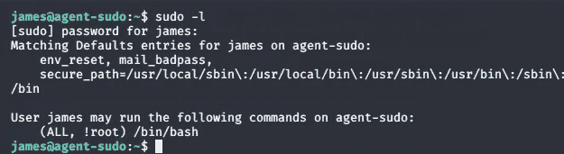

我们在谷歌上搜索，发现 Sudo 1 . 8 . 28 版本存在漏洞，所以我们检查了 Sudo 的版本

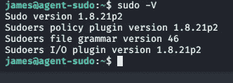

我们的 sudo 版本低于 1.8.28，所以我们可以利用机器。

您可以阅读关于此漏洞的信息

[CVE-2019-14287](https://nvd.nist.gov/vuln/detail/CVE-2019-14287#:~:text=CVE-2019-14287%20Detail&text=In%20Sudo%20before%201.8.,with%20a%20crafted%20user%20ID.)

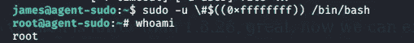

嗯，我们现在是根了！

我希望你已经学到了一些东西