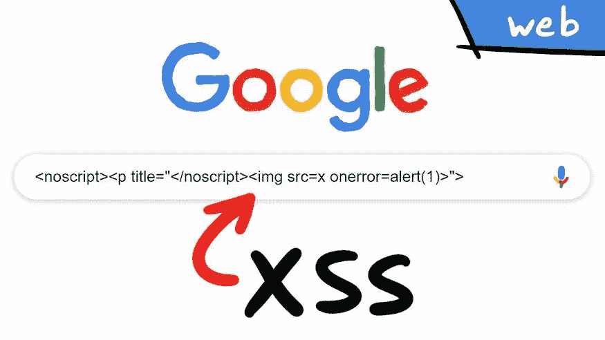

# 关于跨站点脚本的一切(XSS)

> 原文：<https://infosecwriteups.com/all-about-cross-site-scripting-xss-406a2db6c330?source=collection_archive---------2----------------------->

你好神奇的黑客们，

希望你们做得很好，并狩猎大量的昆虫和美元！

好了，让我们开始学习跨站点脚本攻击和发现它们的方法。

> **什么是跨站脚本(XSS)**

跨站点脚本(XSS)是当今 web 应用程序中最常见的漏洞之一。此漏洞可用于在用户的 web 浏览器中执行恶意 JavaScript。这可能会被用来窃取用户的令牌、cookies 和其他一些敏感信息。这是由于 web 应用程序中输入字段的不正确清理造成的。

*这通常可以通过在客户端和服务器端进行适当的输入验证来解决。*

> **跨站脚本的类型:-**

*   反映了 XSS
*   存储的 XSS
*   基于 DOM 的 XSS

> **映 XSS**

反射 XSS 也是一种流行的非持久 XSS，当 web 应用程序在错误消息/搜索结果中立即返回用户输入，或者用户作为请求的一部分提供的输入，而没有永久存储用户提供的数据时，就会出现这种情况。

*这是 XSS 中影响最小的一类，因为利用该漏洞需要手工创建一个包含嵌入式 JavaScript 的请求，任何发出请求的用户都会反映该请求。*

> **存储的 XSS**

存储 XSS 也称为持久性 XSS，当应用程序接受用户输入并将输入存储在后端数据库中，然后未经适当的过滤和净化就显示给其他用户时，就会出现这种情况。

*这比反射 XSS 更有影响力，因为利用该漏洞需要手工创建一个包含嵌入式 JavaScript 的请求，该请求会反射给访问易受攻击的 web 应用程序的所有用户。*

> **基于 DOM 的 XSS**

当应用程序包含一些以不安全的方式处理来自不可信来源的数据的客户端 JavaScript 时，就会出现基于 DOM 的 XSS(也称为 [DOM XSS](https://portswigger.net/web-security/cross-site-scripting/dom-based) )。

> **如何找到 XSS :-**

*   要找到 xss，你必须查看每一个客户端输入，即请求头、cookies、表单输入、POST 参数、GET 参数。
*   如果你的输入反馈给你，在那里给出任何输入。
*   然后，通过查看页面的 HTML 源代码，尝试注入任何有效的有效负载，这将帮助您理解如何构建 xss 有效负载

这就是发现 XSS 漏洞的方法，但让我向您介绍另一种类型的 XSS :-

> **盲人 XSS**

顾名思义，这种攻击是指攻击者/用户看不到存储的 XSS 负载的执行，只有管理员或后端员工才能看到。虽然这种攻击可能非常有害，因为它能够攻击后端用户，但它经常被忽略。

> **如何找到盲 Xss :-**

这也类似于反射的 xss 或存储的 xss，但是您不会得到任何反射，但是您会在服务器上得到响应。

1.  类似的方法如上所述，除了尝试把有效载荷，可以给你的服务器上执行时回调。
2.  你可以使用 https://xsshunter.com/的[或者使用 burp collaborator 或者 ngrok。](https://xsshunter.com/)
3.  在联系人表单或类似功能上尝试一下。

> **如何防范 XSS 袭击** :-

*   验证输入。
*   验证输出。
*   消除危险的插入点。

参考资料:-

 [## 跨站点脚本(XSS)

### 作者:柯尔斯顿供稿人:吉姆·马尼科，杰夫·威廉姆斯，戴夫·威彻斯，阿达尔·魏德曼，罗曼，艾伦·杰克斯，安德鲁·史密斯…

owasp.org](https://owasp.org/www-community/attacks/xss/)  [## swisskyrepo/payloads all things

### Web 应用程序安全和 Pentest/CTF-swisskyrepo/payloads all things 的有用负载和旁路列表

github.com](https://github.com/swisskyrepo/PayloadsAllTheThings/tree/master/XSS%20Injection) 

希望这对你们有用

黑客快乐！

推特句柄:-[https://twitter.com/Xch_eater](https://twitter.com/Xch_eater)