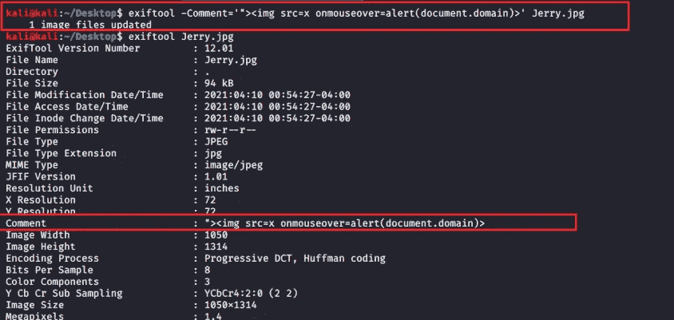
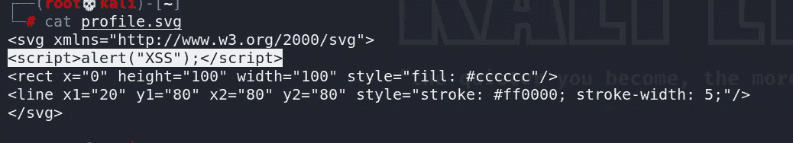

# 所有关于文件上传 XSS

> 原文：<https://infosecwriteups.com/all-about-file-upload-xss-c72c797aaba3?source=collection_archive---------1----------------------->

你好黑客们，

希望你们做得很好，并狩猎大量的昆虫和美元！

我们已经在之前的文章《 [**关于 XSS**](/all-about-cross-site-scripting-xss-406a2db6c330) 的一切》中讨论过 XSS。让我给你介绍另一种找到 XSS 的方法，通过文件上传。

**文件上传是为 web 应用程序寻找跨站脚本(XSS)的重要机会。**

正如我们所知，许多网络应用程序允许客户或他们的用户为许多不同的目的上传文件，这只是在他们身上找到漏洞的机会。因此，让我们看看如何攻击这些允许文件上传到那里的入口点，以便找到 XSS。

> **XSS 通过文件名**

当您上传任何文件时，文件名总是反映在网页上，因此您可以使用 XSS 有效负载更改文件名，并尝试在 web 应用程序上上传它。XSS 可能会在那里被触发。

 [## HackerOne 上披露的 Node.js 第三方模块:[天马-static]...

### 我想报告一下天马中存储的 xss 静态的，它允许任何人执行任意的 javascript 来做任何事情…

hackerone.com](https://hackerone.com/reports/403692) 

> **XSS 穿越元数据**

*什么是元数据？*

元数据是提供关于其他数据的信息的数据。你可以简单地称之为数据的数据。

它给你关于数据的基本信息。出于许多其他原因，可以手动创建它，但今天我们将使用元数据来触发我们的 XSS 有效负载。对于手动创建元数据，您可以使用 [ExifTool](https://github.com/exiftool/exiftool) 来帮助您完成此过程。

在元数据中写入 xss 有效负载

 [## Shopify 在 HackerOne 上披露:XSS 通过上传头像 PNG 存储...

### 你好团队，我发现在 https://accounts.shopify.com/accounts/通过头像无限制上传文件，而 XSS 存储在…

hackerone.com](https://hackerone.com/reports/964550) 

只有当 exif 元数据没有从文件中剥离时，才会出现这种情况。

> **XSS 通过 SVG 文件**

如果 web 应用程序允许上传 SVG(可缩放矢量图形)文件扩展名，这也是一种图像类型。然后尝试通过 SVG 文件手工制作 XSS 有效载荷。

*可缩放矢量图形(SVG)是一种基于 XML 的二维图形矢量图像格式，支持交互性和动画。*

有效载荷

 [## Paragon Initiative Enterprises 在 HackerOne 上披露:存储的 XSS...

### 浏览器处理 SVG 文件的方式很糟糕。如果你提供的是用户可以上传的 SVG 文件，* *只允许…

hackerone.com](https://hackerone.com/reports/148853) 

有效载荷

 [## swisskyrepo/payloads all things

### Web 应用程序安全和 Pentest/CTF-swisskyrepo/payloads all things 的有用负载和旁路列表

github.com](https://github.com/swisskyrepo/PayloadsAllTheThings/tree/master/XSS%20Injection#xss-in-js-context) 

希望这对你们有用

快乐黑客

推特账号:-[https://twitter.com/Xch_eater](https://twitter.com/Xch_eater)