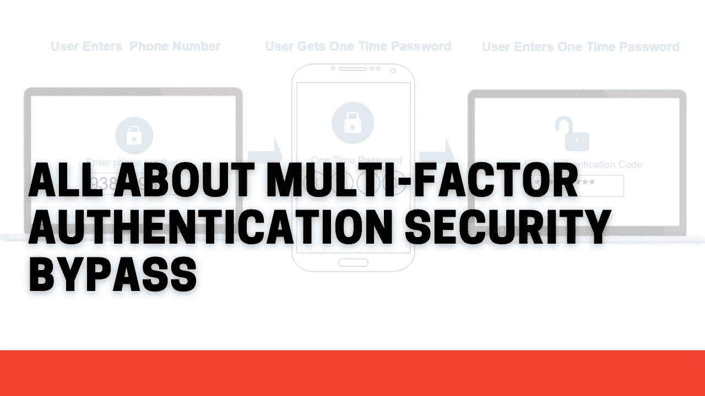

# 关于多重身份认证安全旁路的所有信息

> 原文：<https://infosecwriteups.com/all-about-multi-factor-authentication-security-bypass-f1a95f9b6362?source=collection_archive---------0----------------------->

你好黑客们，

希望你们做得很好，并狩猎大量的昆虫和美元！

那么，今天我们将讨论一个非常热门的话题，即多因素身份认证。在进入这个话题之前，让我们先了解一些关于 MFA 的基本概念。

> **什么是多重身份认证？**

这也是受欢迎的双因素认证(2FA ),这也是另一种验证身份的方法。基本上，通常在单因素身份验证中，您只需通过用户名和密码来验证自己的身份。但是为了增加一层安全，我们使用 2FA 来验证用户两次。因此，无论如何，如果攻击者能够获得用户名和密码，他仍然需要多一种方法来验证他的身份。这加强了用户帐户的安全性。

但是使用 2FA 并不意味着 web 应用程序是完全安全的，有一些方法可以绕过它。所以让我们开始学习如何在这个函数中寻找 bug。

> **反应操纵**

在响应中，如果“成功”:false，则将其更改为“成功”:true

*如何打猎:-*

*   输入正确的动态口令
*   拦截并捕获响应
*   然后注销
*   输入不正确的动态口令
*   用正确的 OTP 响应拦截和更改响应
*   然后尝试登录

 [## GitLab 在 HackerOne 上披露:绕过...

### 此漏洞允许在为…启用双因素身份验证时绕过密码身份验证

hackerone.com](https://hackerone.com/reports/128085) 

> **状态代码操作**

如果状态代码是 4xx，尝试将其更改为 200 OK，并查看它是否绕过限制

*如何狩猎:-*

*   输入正确的动态口令
*   拦截并捕获响应，仔细查看状态代码
*   然后注销
*   输入不正确的动态口令
*   拦截&用正确的 OTP 状态代码更改响应
*   然后登录

> **2FA 码泄漏响应**

有时，web 应用程序在发起请求 2FA 时会在响应体的某个地方泄漏 2FA。阅读响应体并了解是否有任何可能导致绕过 MFA 的泄漏总是一个好主意。

*如何狩猎:-*

*   请求 2FA 代码并拦截该请求
*   分析响应，看看 2FA 代码是否泄漏

> **2FA 代码可重用性**

当应用程序没有使以前使用的 OTP 失效，并且过期时间相当长，比如说 1 天。攻击者可以滥用它来暴力破解或猜测有效的(甚至复杂的)OTP 并绕过限制。

*如何狩猎:-*

*   请求一个 2FA 代码并使用它
*   现在，尝试重复使用相同的 2FA 代码，如果它被使用，那么你可以认为它是一个 bug
*   如果它不工作，然后等待一段时间，并尝试重用它

 [## Automattic 在 HackerOne 上披露:的验证码问题...

### 你好，我注意到了两个关于验证码的问题，验证码是作为两步认证发送到手机的…

hackerone.com](https://hackerone.com/reports/67660) 

> **缺乏暴力保护**

暴力攻击使用试错法来猜测登录信息、加密密钥或找到隐藏的网页。黑客们尝试了所有可能的组合，希望能猜对。

由于缺乏暴力保护或速率限制，攻击者可以通过暴力来猜测实际的 2FA 代码。

*如何狩猎:-*

*   在 2FA 验证页面捕获请求
*   暴力破解 2FA 代码
*   分析响应
*   您也可以在请求 2FA 代码时尝试同样的方法

 [## Algolia 在 HackerOne 上披露:两个因素中没有速率限制...

### 双因素认证旁路允许用户无需输入验证码即可访问应用程序，并且没有速率限制…

hackerone.com](https://hackerone.com/reports/128777) 

> **直接请求/强行浏览**

这是破坏访问控制的缺陷，其中 web 应用程序未能检查授权，这允许攻击者通过给出确切资源的路径来访问他们不应该能够访问的资源。

*如何狩猎:-*

*   直接请求 2FA 后到达的页面或应用程序的任何其他验证页面
*   看这个行不行

> **备份代码滥用/基于时间的一次性密码**

备份代码是一些一次性代码，您可以在启用 2FA 时专门为您的帐户生成。您需要备份代码，以防您想要登录您的帐户，但无法访问主要的一次性代码生成器。

*如何狩猎:-*

*   应用我们用来绕过 2FA 的所有技术。

> **CSRF &点击 2FA 禁用功能上的千斤顶**

您可以执行 CSRF 或点击劫持来禁用 2FA，如果您可以执行此操作，则可以认为这是一个漏洞。

*如何狩猎:-*

*   注册两个账户。其中第一个是攻击者的帐户，第二个是受害者的帐户
*   登录攻击者帐户，在 Burp suite 中捕获禁用 2FA 请求，并生成 CSRF POC。
*   以扩展名. HTML 保存 CSRF POC 文件
*   现在在私人浏览器中登录受害者的账户，打开 CSRF 的文件。现在，您可以看到它禁用了 2FA，导致 2FA 旁路。

 [## HackerOne 上披露的 HackerOne:当...

### 嗨，当我向一个要求“2FA”的程序提交报告时，我注意到如果你试图禁用这个选项…

hackerone.com](https://hackerone.com/reports/587910)  [## Mail.ru 在 HackerOne 上披露:通过 CSRF 禁用 2FA(导致 2FA...

### pandao.ru 中的 CSRF 漏洞允许禁用 2FA。pandao.ru 属于扩展范围

hackerone.com](https://hackerone.com/reports/670329) 

> **JS 文件分析**

有时，应用程序使用动态 JavaScript 文件来存储 OTP 的副本，该副本与用户收到的 OTP 进行匹配，以在客户端执行检查并验证用户。

触发 2FA 代码请求时，分析响应中包含的所有 js 文件，查看是否有任何 JS 文件包含可以支持绕过 2FA 代码的信息。

> **密码&电子邮件更改禁用 2FA**

*如何狩猎:-*

*   如果网络应用程序允许你改变你的电子邮件或密码，用任何方法都可以
*   然后检查 2FA 在此之后是否被禁用或保持不变
*   有时，2FA 在密码或电子邮件被更改后被禁用，如果发生这种情况，您可以将其视为一个漏洞

> **2FA 发送空白代码旁路**

这是对输入代码的空检查失败。简单来说，登录时的 2FA 可以通过发送空白代码来绕过。这可能是因为输入的代码与真实代码的比较不正确。在比较代码之前进行预验证(可能是空检查)可以解决这个问题。

*如何狩猎:-*

*   在询问 OTP 的地方捕获请求
*   删除 2FA 代码或给一个空值，然后转发请求

 [## 黑客 One 上披露的 Glassdoor:通过发送空白代码绕过 2FA

### 摘要:** █████████.这是对输入代码的空检查失败。简单来说，登录时的 2FA

hackerone.com](https://hackerone.com/reports/897385) 

> **启用 2FA 不会使之前的会话过期**

*如何狩猎:-*

*   在两个不同的浏览器中登录应用程序，并从第一个会话中启用 2FA
*   使用第二个会话，如果未过期，则可能被视为漏洞

 [## 在 HackerOne 上公开的语法:以前创建的会话...

### @brdoors3 在 MFA 实现中发现一个设计问题:以前创建的会话在 MFA 后不会失效…

hackerone.com](https://hackerone.com/reports/667739) 

检查这些报告

 [## HackerOne 上披露的法律机器人:2FA 用户枚举通过...

### 在启用附加的 2FA 选项时，一名安全研究人员发现，在密码重置期间，用户…

hackerone.com](https://hackerone.com/reports/249431)  [## 比特币基地在 HackerOne 上披露:2 个因素中的错误配置...

### 对于一些用户来说，比特币基地不小心在 2FA 手机上泄露了用户电话号码的后 8 位数字…

hackerone.com](https://hackerone.com/reports/119129) 

这就是关于 2FA bypass 的全部内容，我在这里提到了我的一些发现和所有已知的开源技术。

希望这对你们有用

黑客快乐！

推特账号:-[https://twitter.com/Xch_eater](https://twitter.com/Xch_eater)