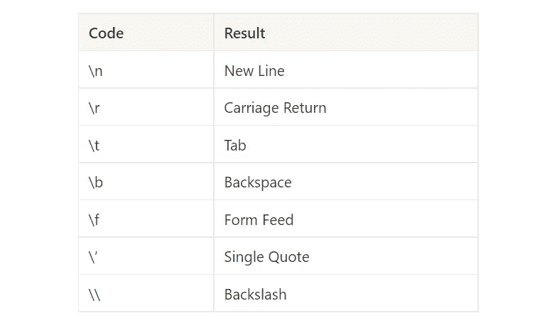
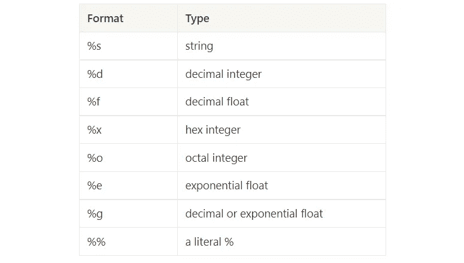

# Python 中的字符串

> 原文：<https://infosecwriteups.com/all-about-string-in-python-b13d2306029f?source=collection_archive---------0----------------------->

## python 中字符串的介绍和简要指南


杰里米·毕晓普在 [Unsplash](https://unsplash.com/) 上拍摄的照片

Python 是一种高级编程语言，便于各种背景的人学习，是一种面向对象的语言。Python 有各种数据类型，如整数、浮点、布尔和字符串。字符串是一系列字符。大多数程序员会更多地使用字符串而不是数字。

# **如何创建字符串？**

要创建字符串，必须用引号将字符括起来。在这里，您可以自由使用单引号(`‘...‘`)或双引号(`“...”`)。

```
>>> print('python') 
python

>>> print("assembly")
assembly
```

但是在实际操作中，你可能会同时使用单引号和双引号。例如，创建包含引号字符的字符串。在这里，您可以在双引号内使用单引号，反之亦然。

```
>>> print('Dad says, "Python is a fun programming language!"')
Dad says, "Python is a fun programming language!"

>>> print("Mom sings I don't care")
Mom sings I don't care
```

但是如何创建多行字符串呢？创建多行字符串有两种方法，第一，使用三个单引号(`’’'...'''`)或三个双引号(`"""...”””`)以及使用用反斜杠转义的特殊字符(`\n`)。你可以查看下表，了解更多关于转义字符的信息。



除了使用引号，您还可以使用内置函数`str()`创建字符串。其他数据类型，比如整型、浮点型或布尔型，也可以使用`str()`函数转换成字符串。

```
>>> str(10_000_000) 
'10000000'

>>> str(3.141592653589793) 
'3.141592653589793'

>>> str(False) 
'False'
```

# **字符串上的数学运算**

只有两种类型的数学运算可以应用于字符串，即乘法运算`*`和加法运算`+`。加法运算通常用于连接字符串，而乘法运算通常用于复制字符串。

```
>>> print("Cat " + "and" + " Dog") #addition operation
Cat and Dog

>>> name = "William"
>>> job = "Data scientist"
>>> print(name + " now working as " + job)
William now working as Data scientist

>>> print('python ' * 3) #multiplication operation
python python python
```

如果使用除加法和乘法之外的数学运算，它将返回一个错误。

```
>>> print("Cat" - "Dog")
Traceback (most recent call last):
  File "<stdin>", line 1, in <module>
TypeError: unsupported operand type(s) for -: 'str' and 'str'
```

# **分度和切片**

因为字符串是一个字符序列，所以我们可以使用括号操作符(`[...]`)来访问字符串中的字符。要进行索引和切片，必须在字符串名称或包含字符串的变量名后的方括号内指定其偏移量。

```
>>> animal = "Crocodile"
>>> animal[0] #get the first character
'C'

>>> animal[-1] #get the last character
'e'

>>> animal[5] #get the sixth character
'd'
```

如果指定的偏移量大于字符串的长度，将会返回错误。您也可以使用`len()`功能找出您的字符串的长度。

```
>>> animal[10] #will return an error
Traceback (most recent call last):
  File "<stdin>", line 1, in <module>
IndexError: string index out of range

>>> len(animal)
9
```

就像索引一样，分割子串也使用括号操作符。分割子字符串时，在方括号中可以指定一个*开始*偏移，一个*结束*偏移，以及它们之间的*步*计数(可选)。

```
>>> sentence = "python programming language"
>>> sentence[:] #get an entire string
'python programming language'

>>> sentence[7:]
'programming language'

>>> sentence[:18] 
'python programming'

>>> sentence[7:18]
'programming'

>>> sentence[3:20:2]
'hnpormigl'

>>> sentence[::-1] #reverse a string
'egaugnal gnimmargorp nohtyp'
```

这里应该注意，索引和切片的值必须是一个整数。如果使用 float，它将返回一个错误。

```
>>> letter = 'brawijaya university'
>>> letter[3.5]
Traceback (most recent call last):
  File "<stdin>", line 1, in <module>
TypeError: string indices must be integers

>>> letter[1:5.5]
Traceback (most recent call last):
  File "<stdin>", line 1, in <module>
TypeError: slice indices must be integers or None or have an __index__ method
```

# **字符串方法**

当我们创建一个字符串时，它实际上是 string 类的一个实例。因为 python 是面向对象的编程，所以 python 中的一切都是对象。每个对象或实例都有可以使用的特定方法。我们不能对 string 对象使用 integer 对象方法，它会返回一个错误。

```
>>> type(letter)
<class 'str'>
```

String 确实有很多方法，但是你不需要记住它的所有行为，如果你忘记了你可以看一下[文档](https://www.w3schools.com/python/python_strings_methods.asp)。在实际操作中，可能有几种方法是经常使用的，你应该熟悉它们。我将介绍一些可能被普遍应用的方法。

如果您想设置文本的大小写，您可以使用`.upper()`方法将字符串转换成大写字母，使用`.lower()`方法将字符串转换成小写字母，使用`.capitalize()`方法将第一个字符转换成大写字母[3]。

```
>>> letter = "cOmPuTeR sCiEnCe"
>>> letter.upper()
'COMPUTER SCIENCE'

>>> letter.lower()
'computer science'

>>> letetr.capitalize()
'Computer science'
```

当你想把一个字符串拆分成子串时，你可以使用`.split()`方法，如果你想合并一个字符串，你可以使用`.join()`方法[3]。

```
>>> letter = "I found a python in the forest"
>>> letter.split()
['I', 'found', 'a', 'python', 'in', 'the', 'forest']

>>> fruit = ["banana", "apple", "watermelon"]
>>> ",".join(fruit)
'banana,apple,watermelon'
```

字符串是不可变的，这意味着您不能修改现有的字符串。然而，您可以使用`.replace()`方法进行简单的子串替换，但它仍然不会替换现有的字符串[3]。

```
>>> sentence= "Anthony eats pizza"
>>> sentence.replace('pizza', 'banana')
'Anthony eats banana'

>>> sentence
'Anthony eats pizza'
```

此外，如果您想计算字符串中的某些字母或单词，可以使用`.count()` [3]。

```
>>> sentence = "I'm camping in a random forest"
>>> sentence.count('a') 
3

>>> fruit = "apple, banana, apple, watermelon, apple"
>>> fruit.count("apple") 
3
```

# **字符串格式**

您可以使用`+`符号来连接一个字符串。然而，在实践中，这可能会使您的语法难以阅读和调试。在 python 中，有 3 种不同的方式来格式化字符串，包括*旧样式*(在 Python 2 和 3 中受支持)*新样式* (Python 2.6 和更高版本)，以及 *f-strings* (Python 3.6 和更高版本)[2]。

首先，我们将尝试使用旧的样式(%)来格式化字符串。当我们使用旧的样式时，我们需要使用%符号，后面跟着特殊的字母来表示不同的数据类型。

```
>>> name = "anthony"
>>> age = 20
>>> print('his name is %s and now he is %s years old' % (name, age))
his name is anthony and now he is 20 years old

>>> print('the book costs, %d' % 10_000)
the book costs, 10000

>>> print('pi has a value of %f' % 3.141593)
pi has a value of 3.141593
```

在上面的例子中，当我们使用`%s`时，python 会将所有数据类型转换成字符串。同时，当我们想要一个整数数据类型时，那么使用`%d`和`%f`作为浮点数据类型。更详细的信息，可以看下表。



然后我们将在字符串格式中使用新的样式。当我们使用新的样式时，那么编写代码必须遵循这样的规则`string{}.format(data)`。

```
>>> name = "Jonathan"
>>> age = 35
>>> print('{}.format(name)')
Jonathan

>>> print('{} now {} years old'.format(name, age))
Jonathan now 35 years old

>>> print('{name} have 3 {fruit}'.format(name='Jony', fruit='apples'))
Jony have 3 apples
```

实际上，这个新的样式规则几乎和旧的样式一样。这里需要注意的是`{}`和`.format()`的用法。但是在 python 3 和更高版本中，有一个 f 字符串。编写字符串格式强烈推荐使用 f-sting，因为它非常容易阅读和调试。

它们被称为 F 字符串，因为你需要在一个字符串前面加上字母“F”或“F”来创建一个 F 字符串。几乎就像用新的风格写作，但是 f 弦不需要`.format()`。要使用 f-sting，您必须在单引号或双引号前以字母“f”开头，在引号内，您可以添加可以引用变量或文字值的`{...}`。这里有一个例子:

```
>>> name = "Jonathan"
>>> age = 35
>>> print('{name} now {age} years old')
Jonathan now 35 years old

>>> print(f'the result of 5 plus 10 is {5+10}')
the result of 5 plus 10 is 15

>>> school = 'brawijaya university'
>>> print(f'I am now studying at {school.upper()}')
I am now studying at BRAWIJAYA UNIVERSITY
```

如果您想了解有关字符串格式的更多信息，请访问此[网站](https://mkaz.blog/code/python-string-format-cookbook/)。

# **结论**

字符串是 Python 中的一种数据类型，是一个字符序列。在本文中，我们开始了解 python 中的字符串，从如何创建字符串、字符串的数学运算、索引和切片、字符串方法和字符串格式开始。

**参考文献:**

[1]唐尼，A. B. (2015 年)。思考 Python:如何像计算机科学家一样思考？奥莱利媒体。

[2]卢巴诺维奇，B. (2019)。Python 简介:简单包中的现代计算。奥莱利媒体。

[3][https://docs . python . org/3/library/stdtypes . html # string-methods](https://docs.python.org/3/library/stdtypes.html#string-methods)

***来自 Infosec 的报道:****Infosec 上每天都在发生很多让人难以跟上的事情。加入我们的* ***每周简讯*** *以 5 篇文章、4 个线程、3 个视频、2 个 Github Repos 和工具以及 1 个* ***工作提醒的形式免费获取所有最新的信息安全趋势！****[*https://weekly.infosecwriteups.com/*](https://weekly.infosecwriteups.com/)*