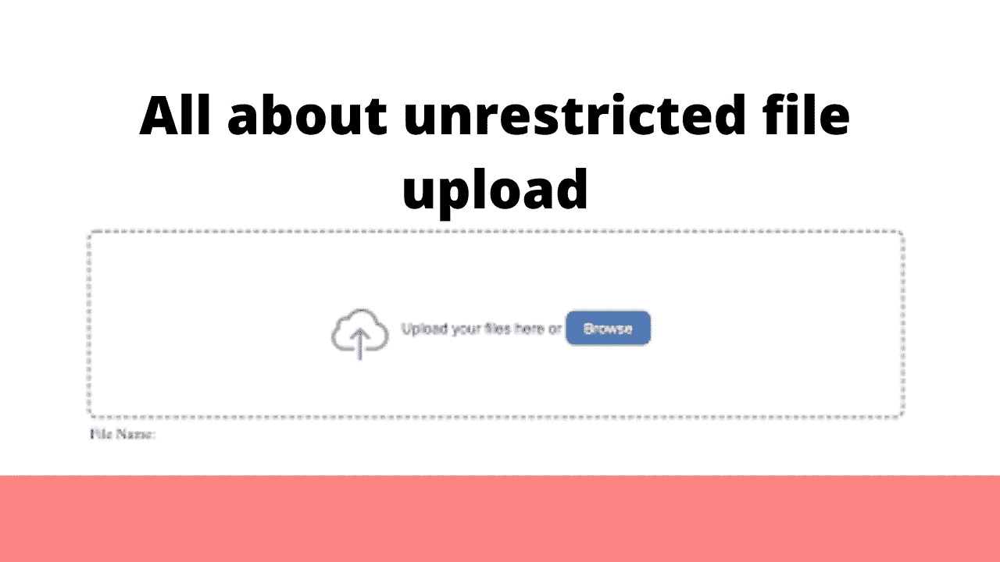
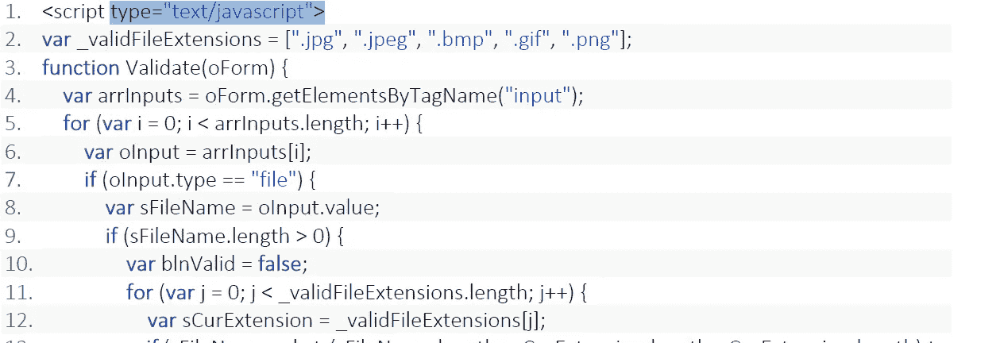
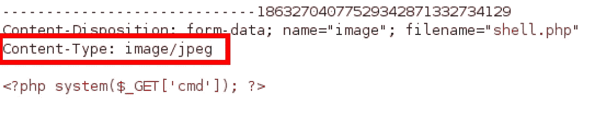

# 所有关于无限制文件上传

> 原文：<https://infosecwriteups.com/all-about-unrestricted-file-upload-a4ecf243b86b?source=collection_archive---------1----------------------->

你好黑客们，

希望你们做得很好，并狩猎大量的昆虫和美元！

我总是喜欢在任何网络应用程序的文件上传功能上寻找漏洞。文件上传中的漏洞通常会给你带来严重程度很高的错误，而且当时也不太安全。那么，今天我们来谈谈网络中一个非常容易被利用的部分，那就是文件上传功能。

在渗透测试中，我们看到了许多文件上传功能，这些功能允许用户将文件从用户的计算机传输到服务器。因为它直接与服务器通信，所以我们必须管理好那里的安全卫生。

> **出于安全原因，我们在 web 应用程序上实现了两种类型的清理:-**

**客户端验证** —当 web 应用程序使用客户端验证时，用户的所有输入都在用户的浏览器中进行验证。它不需要往返服务器。这种验证是在浏览器端使用 JavaScript 或 HTML5 attribute 等脚本语言完成的。

**服务器端验证** —用户提交的输入被发送到服务器，并使用一种服务器端脚本语言(如 Asp.net、PHP 等)进行验证，这也是防范恶意用户的最佳实践。

但这并不意味着 web 应用程序在文件上传功能上是完全安全的，有一些方法可以绕过它。所以让我们开始学习如何在这个函数中寻找 bug。

**客户端过滤器旁路—** 正如我已经提到的，客户端验证是在浏览器上使用脚本语言(如 java script)完成的。所以这个 java 脚本只在你的请求被发送到服务器之前处理它，并验证我们上传的文件类型。如果文件看起来无效，那么它会返回一条错误消息。但主要担心的是，这种安全性过于依赖浏览器，可以通过代理工具(Burp suite，OWASP zap)操纵浏览器，并篡改它以更改上传文件的内容和文件名。

**绕过文件扩展名检查:-**

当服务器通过比较文件扩展名来验证上传的文件时，这种验证基于两种方式进行:将文件扩展名列入黑名单和列入白名单。

1.  **尝试在末尾添加特殊字符**

file . PHP % 20
file . PHP % 0a
file . PHP % 00
file . PHP % 0d % 0a
file.php/
file . PHP . \
file。
file.php…
file.pHp5…

**2。尝试通过双分机绕过**

file.png.php
file . png . PHP 5

**3。尝试通过空字节或添加垃圾数据来绕过**

shell . PHP % 00 . JPEG

shell . PHP % 0 delete 0 . jpg
file . PHP junk 123 png

**4。尝试通过在执行扩展**前添加有效扩展来绕过

file.png.php
file . png . PHP 5

**5。尝试通过使用大写和小写字母来绕过**

file.jPg

文件。挽救（saving 的简写）

file.asP

> **内容类型验证—** 服务器通过检查文件的 MIME 类型来验证文件的内容，这可以在 HTTP 请求体中显示。

1.  **通过更改内容类型头的值绕过内容类型验证**

 [## 常见 MIME 类型- HTTP | MDN

### 这里是一个 MIME 类型的列表，按照文档类型关联，按照它们的通用扩展名排序。两个主要的哑剧…

developer.mozilla.org](https://developer.mozilla.org/en-US/docs/Web/HTTP/Basics_of_HTTP/MIME_types/Common_types)  [## 在 HackerOne 上公开的 open-exchange:[XSS/CSRF]过滤器内容类型...

### 你好。我发现了为文件注入任何内容类型技巧。如果内容类型包含`，那么浏览器(Chrome，Firefox)…

hackerone.com](https://hackerone.com/reports/304098) 

> **内容长度验证—** 服务器检查上传文件内容的长度&限制文件大小不能超过。

1.  **通过改变内容长度头的值绕过内容类型验证**

 [## HackerOne 上披露的 Gratipay:内容长度限制绕过...

### 你好团队，##简介既然你在规则中提到你的 github 库上列出的所有库都是…

hackerone.com](https://hackerone.com/reports/203388) 

> **上传文件可实现的 10 大目标:-**

*   SVG:存储的 XSS / SSRF / XXE
*   HTML / JS : HTML 注入/ XSS /打开重定向
*   ASP/ASPX/PHP 5/PHP/PHP 3:Webshell/RCE
*   GIF:存储的 XSS / SSRF
*   CSV: CSV 注射
*   PNG / JPEG:像素洪水攻击(DoS)
*   邮编:RCE 途经 LFI /多斯
*   PDF / PPTX: SSRF /盲人 XXE
*   XML: XXE
*   AVI: LFI / SSRF

参考资料:-

 [## 无限制文件上传

### 上传的文件给应用程序带来了巨大的风险。许多攻击的第一步是获取一些代码到…

owasp.org](https://owasp.org/www-community/vulnerabilities/Unrestricted_File_Upload) 

希望这对你们有用

黑客快乐！

推特账号:-[https://twitter.com/Xch_eater](https://twitter.com/Xch_eater)