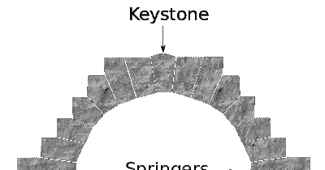
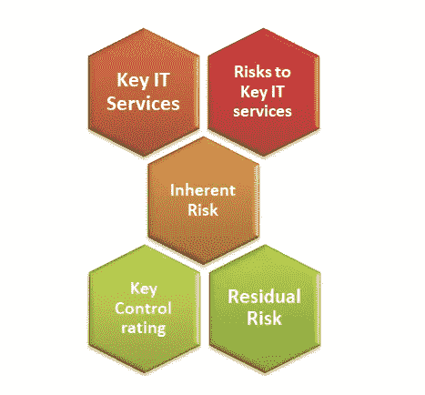
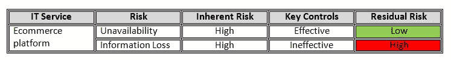

# 所有风险都不是关键风险

> 原文：<https://infosecwriteups.com/all-risks-are-not-key-risks-234709ba266d?source=collection_archive---------1----------------------->

作为风险专家，我们经常谈论*关键风险*和*关键控制*；虽然这些表述很常见，但我也遇到过关键风险的概念使用不当的情况。这是我试图阐明的。

在这种情况下，我想花一点时间谈谈“Key”这个词。关键风险中的“关键”是“[Keystone”](https://en.wikipedia.org/wiki/Keystone_(architecture))的简称。维基百科:“*拱顶石(也称为 capstone)是砖石拱门顶端的楔形石头，或者是拱顶或拱门顶端的典型圆形石头。它是施工过程中放置的最后一块，将所有的石头锁定到位，让拱门或拱顶承受重量。”没有拱心石，拱门就无法站立。*

类似地,*关键业务流程*是一项活动，没有它，业务就无法运作，在某些情况下甚至无法存在。比如你是电商的话；网站的正常运行时间至关重要；任何可能对网站正常运行时间产生负面影响的事情都将是一个*关键风险。*

我发现在与领导团队的讨论中提出这个概念很有帮助，它有助于专注于真正重要的事情，并对控制活动进行优先排序，以减轻关键风险。作为风险从业者，我们知道风险是无法消除的，我们需要确保不要因为试图消除所有风险而错过创造价值的机会。

识别 IT 关键风险的第一步 *(IT 风险包括信息和技术风险)*是考虑并列出业务识别的关键风险，并将它们与技术组织提供的企业服务联系起来。并根据*保密性*、*完整性*和*可用性*进一步记录与这些服务相关的风险。

继续以之前的电子商务业务为例，一些 IT 风险可以表述为:

*   风险:停机或不可用:*网站对客户不可用的风险*
*   风险:信息丢失:*客户/支付信息丢失或被盗的风险*

风险评估应该是这样的。

*最初发表于*[*https://securityriskandcompliance.blogspot.com*](https://securityriskandcompliance.blogspot.com/2019/12/all-risks-are-not-key-risks.html)*。*

*关注* [*Infosec 报道*](https://medium.com/bugbountywriteup) *获取更多此类精彩报道。*

 [## 信息安全报道

### 收集了世界上最好的黑客的文章，主题从 bug 奖金和 CTF 到 vulnhub…

medium.com](https://medium.com/bugbountywriteup)