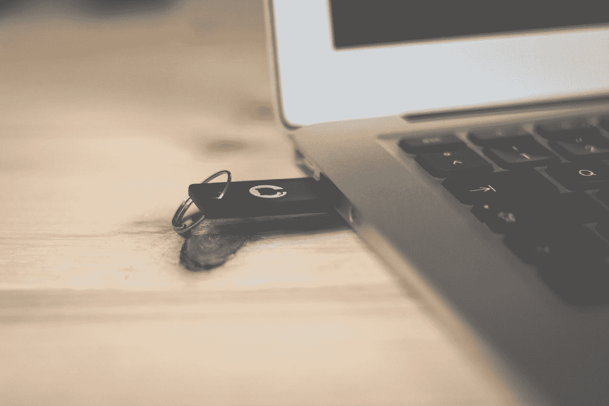
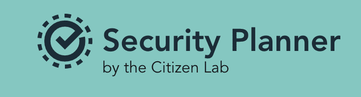
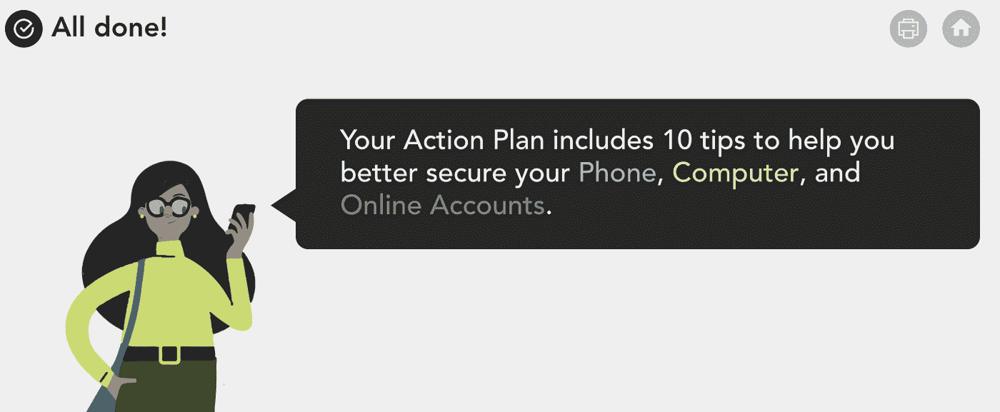
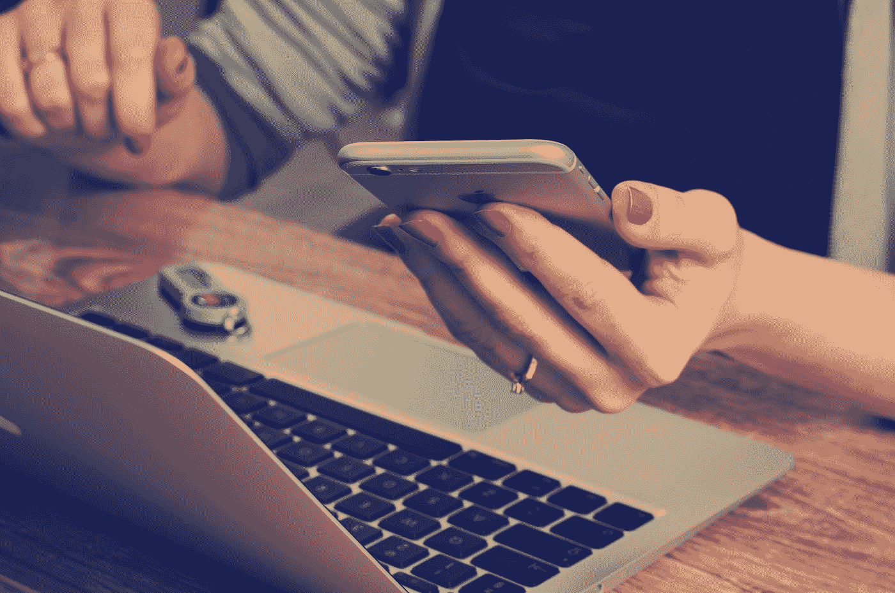

# 普通人的一切安全

> 原文：<https://infosecwriteups.com/all-things-security-for-regular-people-b49d3d6e62c9?source=collection_archive---------1----------------------->

*作者为* [*谭雅*](https://medium.com/@shehackspurple)*[*娜塔莉*](https://twitter.com/nuttaay) *，此前发表为* [数字安全解说](https://medium.com/lassondeschool/digital-security-explained-2272bd619781)*

****第 1 部分—您的数字身份**🔐💻**

**最近，人们越来越担心“被黑”或在互联网上上当受骗，他们应该担心；网上犯罪目前非常普遍，而且只会越来越严重。**

**从事信息安全工作加剧了我们的偏执。因此，我们想通过这个系列分享一些关于我们如何在晚上睡觉的技巧。**

****

**图片由 [Brina Blum](https://unsplash.com/@brina_blum?utm_source=medium&utm_medium=referral) 在 [Unsplash](https://unsplash.com?utm_source=medium&utm_medium=referral) 上拍摄**

**我们都知道有人的电脑中了病毒或恶意软件，或者在网上购物后信用卡号码被盗。有这么多人向信息安全专家寻求建议，我们决定为“普通人”写一篇安全建议，以确保不从事 IT 工作的聪明人知道如何保护自己免受网络欺诈和其他网络威胁。**

# **你的隐私很重要**

**让我们从保证你的隐私开始。您的在线状态泄露的信息比大多数人意识到的要多，这些信息可能会被用来欺骗您、利用您或损害您的声誉。下面的列表将帮助您限制网上关于您自己的信息量。**

**回顾一下你的在线状态:谷歌搜索你自己(只要确保你没有登录任何你的在线账户或最喜欢的网站)。出现了什么？这些信息是私人的吗？你意识到它在那里吗？也许网上有些关于你的信息，你不知道任何人(不仅仅是你的“朋友”)都可以看到，或者让你不舒服。如果您发现您想要删除的内容，您应该更改您的隐私设置或要求删除这些信息。**

*   **一些大型在线服务提供商有“安全检查”功能。他们完成得很快。我们**挑战你**在你使用的每一个社交网站上这样做。**
*   ***脸书:更新你的* [*隐私设置*](https://www.facebook.com/help/325807937506242/)**
*   ***谷歌:通过这个 p* [*隐私检查*](https://myaccount.google.com/privacycheckup) 控制别人对你的看法**
*   ***Google:通过此* [*安全检查*](https://myaccount.google.com/security-checkup) 检查登录的其他设备**
*   ***LinkedIn:* [*隐私设置*](https://www.linkedin.com/psettings/)**
*   ***Instagram:管理哪些应用可以访问你的账户***
*   ****推特:*[*https://twitter.com/settings/safety*](https://twitter.com/settings/safety)***

**公民实验室创造了这个惊人的，免费的安全规划，可以帮助您通过创建一个简单的行动计划来改善您的在线安全。**

****

**[https://securityplanner.org](https://securityplanner.org)**

****

**[https://securityplanner.org/](https://securityplanner.org/)**

# **安全提示💡**

****装置安全****

*   **在你的网络摄像头上贴一张纸，当你想用它的时候把它拿下来。已经有不少人在他们的机器上安装了**恶意软件**(一种计算机病毒)后被**监视的例子。更好的是:看看你是否能找到一个前后滑动的摄像头盖，这样你就不会在屏幕上看到粘粘的东西。****

****

**图片由[威廉·艾文](https://unsplash.com/@firmbee?utm_source=medium&utm_medium=referral)在 [Unsplash](https://unsplash.com?utm_source=medium&utm_medium=referral) 上拍摄**

****个人资料****

*   **永远不要把你的出生日期，家庭住址，社会保险号放到网上。**
*   **永远不要在社交媒体或电子邮件中上传你的驾照、出生证明、车牌、工作证或其他任何与你身份相关的个人信息的照片。这些信息可以用来冒充你，重置你的账户，或者让你的日子不好过。不要与你信任的人(你的雇主、配偶、律师等)分享这类敏感信息。).**

# ****像这样的内容还有更多，查看我的书，** [**爱丽丝和鲍勃学习应用安全**](https://aliceandboblearn.com/) **和我的在线培训学院，** [**我们黑紫色**](https://academy.wehackpurple.com/) **！****

## **我有一个邮件列表，请订阅，这是免费的！**