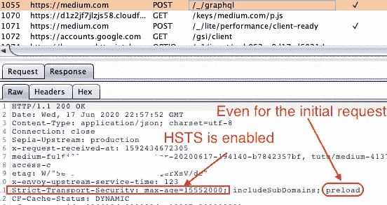
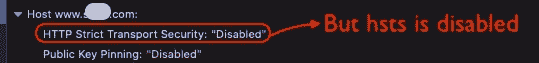
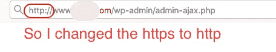
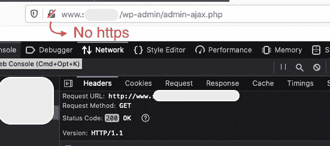
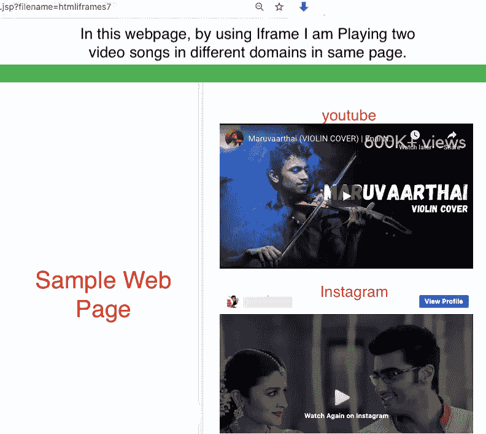
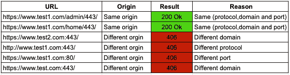
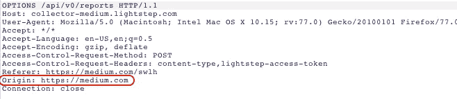
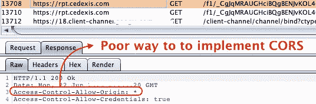
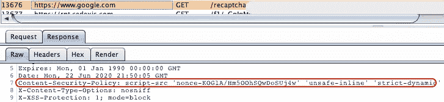

# 几乎所有关于初学者浏览器安全性的内容第 1 部分

> 原文：<https://infosecwriteups.com/almost-everything-about-browser-security-for-beginners-part-1-85e4dae5ca04?source=collection_archive---------0----------------------->

这篇文章是为想学习浏览器安全头和概念的初学者准备的。我们开始吧！😃

**必备知识:** HTML 基础知识和【HTTP 请求如何工作


Pc mac 拍摄的照片

# 1.Http 严格传输安全标头(HSTS)

HSTS 告诉浏览器，它应该始终通过 HTTPS 连接，即使是针对**的初始请求**。HSTS 很容易在网页上启用，但同时也很容易被忽略。如果攻击者试图将 HTTPS 更改为 HTTP，它会自动重定向到 https，**如果启用了 HSTS。**

***例如***



HSTS 已启用

## 如果没有启用 HSTS



如果我能够将 HTTPS 更改为 HTTP，并通过未加密的通道将其连接到网站的管理页面，那么攻击者就可以对网页进行各种类型的攻击。



# 2.x-框架-选项标题

要理解 X-Frame options 头，您需要了解 Iframe。Iframe 是[**HTML 标签**](https://www.w3schools.com/tags/tag_iframe.asp) 中的一种，它允许你在你的网页中显示不同的网页，如 Instagram 和 Youtube。



**试用 iframe 脚本示例！**

*！DOCTYPE html>
<html>
<头>
<样式>
H3 { text-align:center；字体大小:50px 颜色:红色；}
p { font-size:20px；颜色:绿色；字体粗细:粗体；}
</style>
</head>
<body style = " background-color:# f0f 8 ff ">
<H4>在这个网页中，通过使用 iframe 我正在播放两个不同域的视频歌曲</H4>
<**iframe**width 自动播放；加密媒体；陀螺仪；画中画" allow full screen style = " padding:20px；">****</iframe>***

***<iframe****width = " 555 " height = " 333 " src = "*[*https://www.instagram.com/p/BwZwaReBKod/embed*](https://www.instagram.com/p/BwZwaReBKod/embed)*" frame border = " 0 " allow = "加速度计；自动播放；加密媒体；陀螺仪；画中画" style = " padding:20px；">>****</iframe>***

*</正文>
< /html >*

当你在你的页面上使用不同的域名时，有可能发生[点击劫持攻击](https://portswigger.net/web-security/clickjacking)。通常，**点击劫持**是通过在用户看到的页面顶部显示一个 **iframe** 内的不可见页面或 **HTML 元素** t 来执行的。用户认为他们点击的是可见的页面，但实际上，他们点击的是一个不可见的元素，这个元素在附加页面上被调换了位置。

为了避免点击劫持攻击，我们需要标题标签中的 **X-Frame-Options**

## x 框架选项:指令

常见的**指令有:**

*   **deny:** 该指令阻止站点在 **<帧>** 中呈现，即站点不能嵌入其他站点。
*   **同源:**当框架与页面具有相同的原点时，该指令允许页面显示在框架中。

启用 **X-Frame-Options 报头**是好的，但是，减轻 iframe 攻击的更好方法是通过使用 **CSP frame-anchester**

***内容-安全-政策:框架-祖先'自我'***

# 3.同源政策

首先，**由来**是什么？Origin 被定义为三部分的组合:**协议、主机名和端口号**。


*[***同源策略***](https://developer.mozilla.org/en-US/docs/Web/Security/Same-origin_policy) *是一种关键的安全机制，限制从一个源加载的文档或脚本如何与另一个源的资源交互。它有助于隔离潜在的恶意文档，减少可能的攻击媒介。**

*现在，让我们考虑，在这个网页内的在[**https://www.test1.com/admin**](https://www.test1.com/admin)**托管的网页是加载不同网页的 **iframe** 。我们的源主机定义为[](https://www.test1.com)****。*******

*****在下表中,“URL”列描述了我们想要访问的完整 URL，以及它们是否因同源策略而可访问:*****

**********

*****HTTP 状态代码*****

*****默认情况下，**同源策略**在大多数浏览器中都是开启的。*****

**********

*****介质的权限策略*****

# *****4.罗斯与 T21 分享政策*****

*****拥有同源策略很酷，因为**同源策略**不仅可以阻止恶意网站读取另一个网站的数据，还可以阻止真正的使用，如获取**图像、API 调用、web 字体图标和 CDN** ，这些通常是从另一个域请求的。*****

*****这就是为什么我们需要 CORS！共享策略是一种安全特性，它允许来自一个源的网页访问另一个域的资源，同时最大限度地减少跨域请求共享带来的安全风险。*****

*******CORS** : **简单请求**和**飞行前** **请求**，*****

## *****简单的要求。*****

*****简单的请求不需要预先检查。CORS 使用 HTTP 方法，比如 GET、POST、HEAD 来处理简单的请求。*****

1.  *****当浏览器从另一个域请求资源时。假设`[https://www.**example**](https://www.example).com`发起 AJAX 请求`GET [https://api.example.com](https://api.example.com)`*****
2.  *****除了添加 Host 这样的头，浏览器还会自动为跨源请求添加`Origin`请求头:*****

```
*****GET /widgets/ HTTP/1.1
**Host: api.example.com
Origin: https://www.example.com**
Accept-Language: en-US,en;q=0.5
Accept-Encoding: gzip, deflate
Content-Type: application/json
Content-Length: 5443
Connection: close
Referer: [https://www.google.com](https://www.google.com)*****
```

*****3.服务器检查`Origin`请求报头。如果允许原始值，它将`Access-Control-Allow-Origin`设置为请求报头`Origin`中的值。*****

```
*****HTTP/1.1 200 OK  
**Access-Control-Allow-Origin: https://www.example.com ** 
Access-control-allow-credentials: true
Access-control-allow-headers: LightStep-Access-Token, Content-Type
Access-control-allow-origin: ******
```

*****4.当浏览器收到响应时，浏览器会检查`Access-Control-Allow-Origin`标题，看它是否与选项卡的来源匹配。否则，响应将被阻止。如果`Access-Control-Allow-Origin`与单原点完全匹配或包含 ***** 操作符，测试成功。*****

*******使用*操作符**有很高的安全风险，因为它**禁用了 CORS 的大多数安全规则。*******

**********

## *****飞行前请求*****

*****一个标准的**飞行前请求**将在原始请求之前发出，以验证他们是否有行动的许可。这就是为什么它被称为**飞行前请求。**它使用 HTTP `OPTIONS`方法。*****

*****与**选项请求**一起发送的还有另外两个请求头，这里是一个预检请求的例子:*****

```
*****Origin: http://example.com
Access-Control-Request-Method: *POST*
Access-Control-Request-Headers: *X-Custom-Header******
```

*****如果`api.example.com`不愿意接受动作，那么它阻塞，如果它愿意接受，那么它可以用下面的标题来响应:*****

```
*****Access-Control-Allow-Origin: https://example.com
Access-Control-Allow-Methods: *GET, POST, OPTIONS*
Access-Control-Allow-Headers: *X-Custom-Header*
Access-Control-Max-Age: *86400******
```

*****关于详细的解释，我建议阅读 https://developer.mozilla.org/en-US/docs/Web/HTTP/CORS 的一篇优秀文章*****

# *****5.内容安全政策*****

*******C**content**S**security**P**policy 由应用服务器根据浏览器的策略进行设置，如果网站从其他地方加载资源或脚本，浏览器会立即阻止它。*****

*****这个想法是，如果攻击者试图加载他的脚本，如果脚本不在网站策略上，浏览器会阻止它，将不会有攻击。这是一种白名单方法，您可以将脚本源列入白名单。*****

## *****如何设置 CSP，*****

*****由 **web 服务器**通过 **HTTP 头**设置 **CSP** ，供**浏览器**执行，内容-安全-策略:策略*****

******内容-安全-策略:default-src ' self ' * . trusted . com******

*   ********default-src:self ' * . trusted . com***这将指示 web 浏览器仅从页面的 **origin/trusted.com** 加载所有资源*****
*   ********字体-* src:** 决定应该加载什么字体*****
*   ********img-src:*** 决定应该加载什么图像*****
*   ********脚本-src* :** 决定应该加载什么脚本*****
*   ********style-src:****决定了应该加载什么样式/CSS******

************

******CSP 示例******

******CSP 是一个巨大的话题！😄因此，我强烈推荐在 Mozilla developer 中阅读更多关于 CSP 的内容。******

# ******6.特征策略******

******它允许网站启用、禁用和修改 web 功能，如摄像头、麦克风、扬声器、通知、Iframe 中的全屏、地理定位和浏览器中的某些 API 调用。******

******它类似于内容安全策略，但它不是将安全列入白名单，而是将**网页功能列入白名单。********

## ******如何使用功能策略******

******要使用特性策略，浏览器需要知道两件事:你正在为哪个特性创建策略(**指令)**，以及你希望如何处理那个特性( **allowlist** )。******

```
******Feature-Policy: <directive> <allowlist>******
```

********指令** *→* 摄像头、麦克风、扬声器、地理定位等。******

********允许列表→** *，自身，无，来源******

*   *********** →在嵌套浏览上下文中启用(iframes)。******
*   ********self** →在文档和 iframes 中可访问的相同来源。******
*   ********无** →禁用文档和任何嵌套 iframes 的功能。******
*   ********原产地→仅允许指定的原产地。********

********例如********

```
******Feature-Policy: Camera 'none'
Feature-Policy: Camera 'self' [https://test1.com](https://test1.com)******
```

******更多信息请访问 https://w3c.github.io/webappsec-feature-policy/******

*********第二部分***→[https://medium.com/@Kamesh.karmegam/初学者几乎所有关于浏览器安全的内容-part2-a16f8592ab49](https://medium.com/@Kamesh.Karmegam/almost-everything-about-browser-security-for-beginners-part2-a16f8592ab49)******