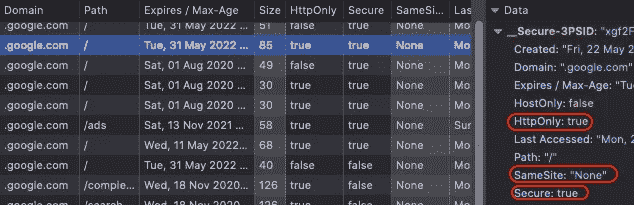
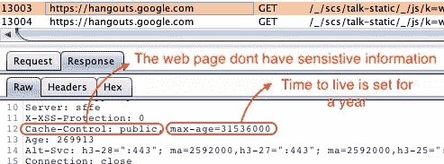
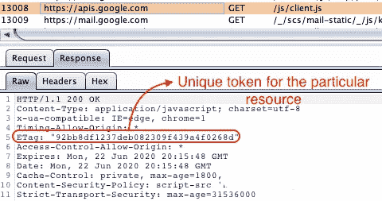
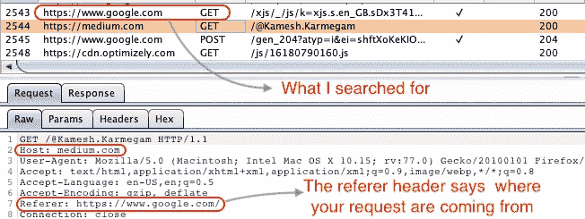
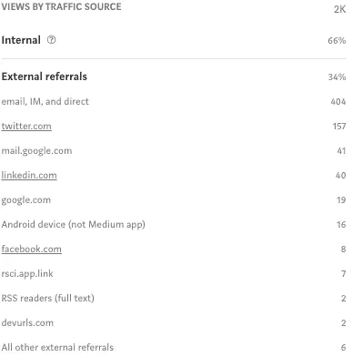
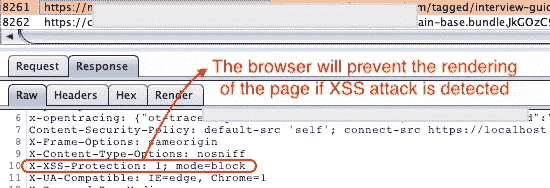
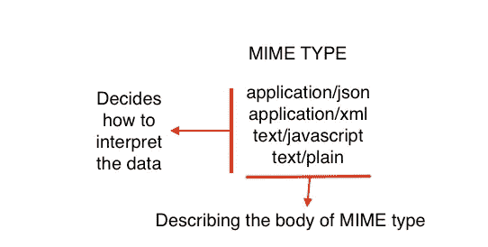
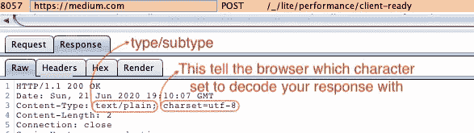

# 几乎所有关于初学者浏览器安全性的内容-第 2 部分

> 原文：<https://infosecwriteups.com/almost-everything-about-browser-security-for-beginners-part2-a16f8592ab49?source=collection_archive---------0----------------------->

# 7.Set-Cookie 标题

什么是饼干？为什么我们需要在**中设置 HTTP 头**？

例如，假设用户是某个网站的回头客，

**第一步** →用户提交**登录凭证** ( **用户名和密码**)

**步骤 2** →服务器**根据数据库**验证凭证，

**步骤 3** →服务器创建一个临时的**用户会话**并且发布一个 **cookie** ，其会话 ID 为**，**

**步骤 4** →用户发送带有每个请求的 cookie，(**因为 HTTP 是无状态的，**所以每个请求都被视为一个新请求)

**步骤 5** →服务器**根据**会话存储&授予的访问权限**对其进行验证**

**Step6** →当用户注销时，**服务器**破坏**会话并清除 cookie。**

先说 C **ookie 安全，**

## Cookie 安全性

要看属性。**属性**控制客户端如何管理 cookies。**属性类型** →安全标志、Httponly、相同站点。

**安全标志→真**然后It 只在加密通道发送 cookie。

**http only**→**true**则不会让客户端 javascript 访问 cookie。

**相同站点→** 相同站点 cookie 属性是对抗 **CSRF 攻击的有效安全措施。**它防止 cookies 被附加到跨来源请求中。

*   相同站点**“lax”**相同站点 cookies 仅在发出请求的站点与目标站点在 **lax 模式**下位于同一原点时发送，仅用于 POST 请求。
*   相同站点"**严格"**相同站点 cookies 仅在站点请求时发送。起源于与目标站点相同的起源(在 get 和 POST 的严格模式下)，则 cookies 不会与第三方网站发起的请求一起发送。
*   相同站点**“无”**表示 cookie 数据可以与第三方/外部站点共享



Cookie 属性

**如何设置 Cookie，**

```
Set-Cookie: <cookie-name>=<cookie-value> <Max-Age> <Domain>
```

在[developer.mozilla.org](https://developer.mozilla.org/en-US/docs/Web/HTTP/Headers/Set-Cookie)有更多的类型，并有详细的解释。

# 8.高速缓存控制标题

如你所知**缓存**是改善互联网用户体验的好方法，但我们需要使用某种缓存控制机制，因为每个网站都有不同的目的，所以我们不能对每个网站使用相同的缓存规则。**比如**，有些网站会获取用户的密码、SSN、私人数据等敏感信息，而有些网站不会。因此**缓存控制**提供了使浏览器缓存有用的灵活性！

cache-control:directive(**private，public，no-store，no-cache，max-age** )

**缓存控制:私有** →仅由客户端缓存。

**cache-control: public** →资源可以被任何缓存存储。

**缓存控制:无缓存→** 响应可能不会存储在任何缓存中。

**cache-control:no-store**→该指令用于包含极度敏感数据的资源，如银行详情、密码等。

**cache-control: max-age →** 这个指令告诉**生存时间。**



## ETag HTTP 标头

它包含请求时资源版本的唯一标记。每当源服务器中的资源被更新时，服务器将销毁先前的令牌并在响应中生成一个新的 **ETag** 令牌。



## 举个例子，

当用户返回到带有**无缓存**资源**、**的页面时，如果 **Etag** 与之前的不相同，那么该资源最近被更新过，客户端需要下载新版本提供给用户。这个过程保证用户总是收到最新版本的资源。

# 9.推荐人-策略标题

这个标题简单地告诉网络服务器你来自哪里，或者哪个网站推荐你访问这个页面。**例如**，在谷歌中，我搜索我的媒体简介，查看请求看起来如何。



这个 referer 头策略主要帮助 web 服务器跟踪来自不同来源的视图。**例如**



在使用**引用头策略**时，你需要控制它给跨域什么样的信息，以避免信息泄露。

最常见的**引用头指令**有:

*   **降级时无推荐者** —如果未指定策略，这是默认功能。它传递 HTTPS →HTTPS 的值，但不传递 HTTPS 的值。
*   **来源** —发送域名，但不发送完整路径。
*   **无推荐人** —不发送推荐人信息。
*   **Origin-when-cross-Origin**—当在同一个域中时发送完整路径，但当传递到另一个网站时只发送域名。
*   **同源** —如果是同一个域，则发送完整路径，但如果转到另一个网站，则删除该值。
*   **Strict-origin** —发送域名为 HTTPS → HTTPS，HTTP → HTTP，而不是 HTTPS→ HTTP。
*   **不安全 URL** —发送完整路径。

更多标题，请访问[https://www.w3.org/TR/referrer-policy/](https://www.w3.org/TR/referrer-policy/)

**注意:** *Web 服务器先前通过内容-安全-策略定义了引用策略，但现在这已被移动到一个单独的头(引用策略头)*

# 10.x-XSS-保护接头

正如 header name 所说，它的设计是为了让跨站点脚本(XSS)过滤器(T21)进入网络浏览器。默认情况下，X-XSS 保护标头通常是启用的，但是使用标头会强制启用。

`**X-XSS-Protection**`指令是 **0，1，1；mode=block，1；报道=URI**

```
**X-XSS-Protection: 0**; #(*It disables the XSS Filter*)
**X-XSS-Protection: 1**; #(*It* *enables the XSS Filter, if XSS attack is     detected,then browser will sanitize the page to mitigate the attack)* **X-XSS-Protection: 1; mode=block** ##(*It* *enables the XSS Filter. Rather than sanitize the page,the browser will prevent the rendering of the page if XSS attack is detected)* **X-XSS-Protection:** **1;report=http://test.com/report_URI** *#(It enables XSS filter and reported the violation if attack detected)*
```

## 例如



`**X-XSS-Protection: 1**`

关于 XSS 的更多细节，我为初学者写了一篇关于 XSS 的文章。请务必参考！😁

# 11.x-内容-类型-选项

当客户端向 Web 服务器发送一个初始的 **GET** 请求时，服务器用一堆头来响应，包括**content-type 头(**)，它表示从服务器期望什么样的数据以及如何解释这些数据。)

**MIME-type(多用途互联网邮件扩展)是**一种在客户端和服务器之间对文件类型进行分类的标准方式。客户机和服务器相互通信，来回传递 MIME 类型，解释如何解释它们发送的消息。

如果网站没有声明 **X-Content-Type-Options 头**，那么就有可能出现[**MIME-sniffing**](https://developer.mozilla.org/en-US/docs/Web/HTTP/Basics_of_HTTP/MIME_types#MIME_sniffing)，它将响应从声明的内容类型中去掉，以避免我们使用 **X-Content-Type-Options** 头。

一个 MIME 类型有两部分:**类型**和**子类型**。它们由***/***隔开



## 浏览器安全清单摘要-

**如果你是一名开发人员，你只需要反复核对清单，**

1.确保 HSTS 已启用。

2.确保 X-frame-options 已设置/CSP frame-anchester 已设置(*更好的方法*)。

3.请确保设置了 Sameorgin 策略。

4.确保只为受信任的域设置 CORS。

5.确保以安全的方式实施 CSP[**安全 CSP 设置指南**](https://www.uriports.com/blog/creating-a-content-security-policy-csp/)

6.确保设置了 X-XSS 保护头( ***不为 0* )。**

7.确保设置了 Cookie 安全标志，

*   安全标志和 Httponly 设置为**真**
*   相同站点设置为**宽松或严格**取决于 Webapp 的性质( ***但不设置为无)***

8.如果网站需要不断更新资源，请确保设置了 ETag 令牌。

9.确保设置了功能策略。

10.确保设置了 X-Content-Type-Options。

11.禁用应用程序不打算使用的 XML 特性(**防止 XXE** )

12.使用****[**安全头文件**](https://securityheaders.com/) 页面检查缺少哪些头文件！****

*******非常感谢阅读，希望有所帮助！请原谅我的任何错误！快乐学习大家:)*******