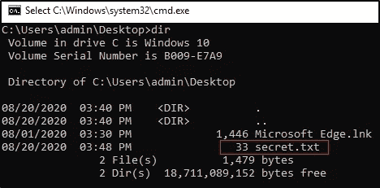
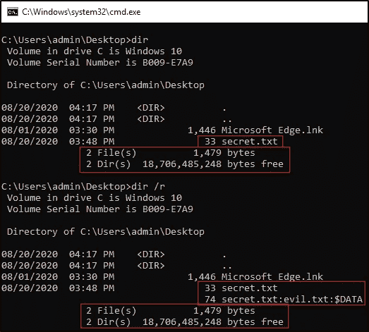
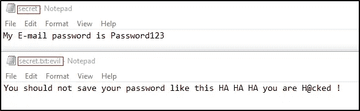
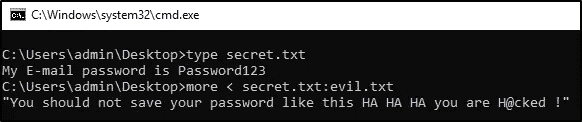
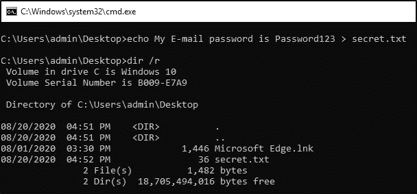
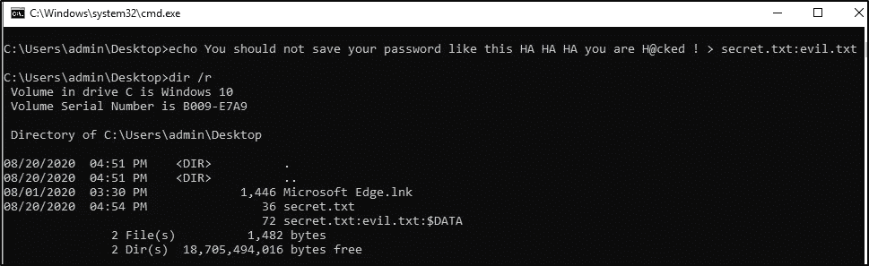
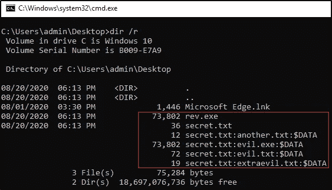
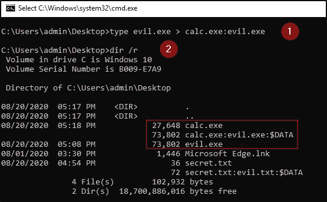
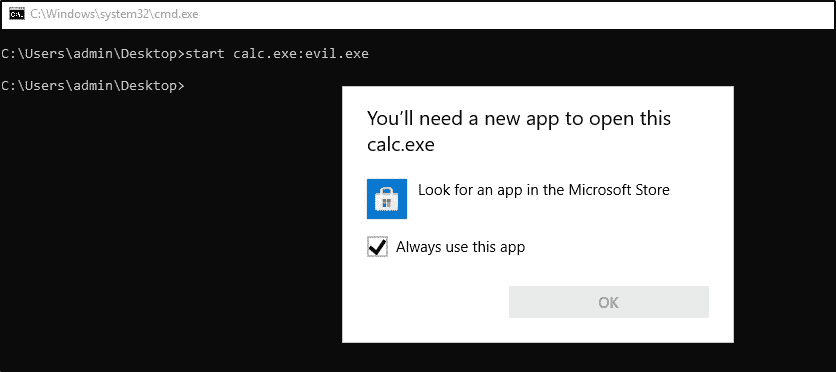
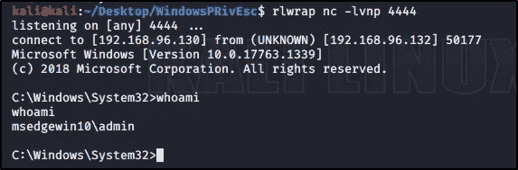

# 交替数据流(ADS)

> 原文：<https://infosecwriteups.com/alternate-data-streams-ads-54b144a831f1?source=collection_archive---------0----------------------->

## ADS 在 CTF 和 Pentesting 环境中的实际但基本的应用


## 那么什么是备用数据流(ADS)？

它是新技术文件系统(也称为 NT 文件系统(NTFS ))中增加的功能，以增加与 Macintosh 分层文件系统(HFS)的可比性，用外行人的话说，它使在 Mac(苹果)和 PC (Windows)上使用文件变得更容易。

## 它是如何工作的，我为什么要关心它？

通常，当您将内容保存到文件(例如. txt 文件)时，您将文件的内容(ascii 文本)存储在一个数据流中，windows 将该数据流识别为默认数据流，因此下次打开文件时，您将访问同一数据流来查看您的数据。

例如

如果我在 windows 系统上使用记事本创建一个. txt 文件，并将其保存到一个文件( *secret.txt* )中，那么每次打开它，我都会看到我的数据。


## 但是如果文件中有更多您不知道的数据呢？

这就是备用数据流发挥作用的地方。

我将使用 cmd.exe(命令提示符)来演示这些示例，以便人们更容易理解 CLI(命令行界面)，但使用 Power Shel***l****也可以获得相同的结果。*

**因此，当我使用命令提示符查看我的目录内容时，我可以看到我的 *secret.txt* 和 33 字节的文件大小。**

```
**dir**
```



**这看起来像一个普通的文件，但是如果我将 */r* 添加到我的命令中会怎么样？**

```
**dir /r** 
```


现在，我们可以在同一目录中看到另一个文件，其前缀与我们最初创建的 *secret.txt* 相同，但后缀为 evil.txt，因为 **$DATA** 告诉我们这是一个 **$DATA** 类型的流。

通过将/r 添加到我们的命令中，我们可以看到这两个文件在同一个目录中，但我们只能在桌面上看到 *secret.txt* ，我们还可以看到文件大小的差异，而我们的 *secret.txt* 文件仍然是 33 字节，我们的*secret . txt*是 74，是我们的 *secret.txt* 的两倍多。

**比较两个命令的输出。**

```
# First Command
**dir**# Second Command
**dir /r**
```



在这种情况下，我们可以通过两个命令更准确地看到信息，我们能够以更清晰的视角看到变化。

*   两个输出都说目录中只有两个文件，并且给出了相同的大小，这是因为 secret.txt 和 secret.txt:evil.txt 是相同的文件，而不是不同的文件，但是数据存储在不同的流中。
*   目录中使用的总空间和系统中可用的总空间仍然相同。

**让我们一起来看看两者的内容:**



当查看它们时，我们可以看到内容不同，我们还可以看到文件名的不同，这使我们想到我们可以轻松地将信息存储在备用数据流中以用于多种目的。数据流在 NTFS 文件系统中遵循一个基本的命名约定，即 ***文件名:流名:流类型*** 已经说过 *secret.txt* 在 NTFS 文件系统中的全名将是***secret . txt::$ DATA***

不在记事本中打开它们的另一种方法是。

```
# View secret.txt
type secret.txt# View Alternate Data Stream 
more < secret.txt:evil.txt
```



**现在我们知道了什么是备用数据流，您将如何创建一个呢？**

*   让我们先创建一个普通的 *secret.txt* 文件

```
# Creating a basic .txt file
echo <YOUR TEXT> > filename.txt
```



*   现在我们已经创建了一个没有任何备用数据流的 secret.txt 文件。

```
# Creating an Alternative Data Stream 
echo <YOUR DATA> > filename.txt:streamname.txt 
```



另一个好处是备用数据流允许一个以上的数据流与一个文件名相关联。



您不需要将您的备选数据流仅限于类型 **$DATA** ，因为还有其他类型的数据流可能更适合您的目的。

要了解更多信息，我建议访问参考资料部分的链接。

现在我们知道了如何查看和创建备用数据流，但这看起来并无大碍，您仍然想知道为什么要关心这个。

即使广告不是出于任何邪恶的目的而创建的，它也可以很容易地被用来在目标系统上运行恶意文件，如后门或 rootkit，从像您的计算器这样无害的东西。

**概念验证:**

让我们添加一个替代数据流到我们的计算器应用程序，但这次我们不会添加一个文本文件，而是一个可执行文件。



> 虽然*evil.exe*可以是您想要的任何东西，但在这个测试案例中，它是一个反向 shell，将连接回我的 Kali Linux 机器。如果你不熟悉反向外壳，你可以参考我的文章[反向&绑定给大家](https://medium.com/@Proclus/reverse-bind-shells-for-everyoned-e7507853bf4e)来了解更多。

*   在第一条命令中，我们将*evil.exe*的内容发送(重定向)到*calc.exe*的备用数据流，名为 *calc.exe:evil.exe。*
*   通过 **dir /r** 我们可以看到，我们成功地用恶意文件创建了一个替代数据流。

现在，我们可以将它作为任何可执行文件从我们的 CLI 运行，但如果我们这样做，我们会得到:



原因是:windows 已经在较新版本的 windows 中修补了这个漏洞，所以这种方法会失败，因为 windows 不知道如何处理它，但我们仍然有一种方法来解决它。

在我们运行这个之前，我们应该确保在 Kali 机器上设置一个监听器。

```
forfiles /P C:\Windows\System32 /m calc.exe /c "C:\Users\admin\Desktop\calc.exe:evil.exe"
```


这现在已经工作并执行我们的*evil.exe*数据流。



我们可以看到，我们在 Kali 机器上从这个 windows 盒子中捕获了一个反向 shell。

# 摘要

虽然备用数据流的主题在其他资源中有很好的介绍，但它可能特别隐蔽，因为一些分析师可能没有意识到这一点。大多数主要的防病毒公司都可以扫描它们，并且有许多工具可用于查看和操作数据流。仍然有许多方法可以恶意使用它们，同时通过将其与反病毒规避相结合而不被检测到，因为这种攻击面不仅限于。txt 或者。exe 文件，您可以用它来做什么只受您的想象力和创造力的限制。由于备用数据流不会出现在 Windows 资源管理器或 **dir** 命令的默认输出中，大多数用户都不知道它的存在，尽管仍有已知的恶意软件样本利用 ADS 来隐藏代码，但用于与之交互的命令多年来已经发生了变化。概念验证中显示了一个简单的示例。我建议你也试着用 Powershell 来复制这个方法，因为这样你会有更多的灵活性，而且广告有时会出现在 CTF 的电脑上，或者出现在像 [hackthebox](https://www.hackthebox.eu/) 这样的平台上。

## 资源

 [## 文件流(本地文件系统)- Win32 应用程序

### 流是一个字节序列。在 NTFS 文件系统中，流包含写入文件的数据，并且…

docs.microsoft.com](https://docs.microsoft.com/en-us/windows/win32/fileio/file-streams) [](https://docs.microsoft.com/en-us/previous-versions/windows/it-pro/windows-server-2003/cc781134%28v=ws.10%29) [## NTFS 的工作原理:本地文件系统

### 适用于:Windows Server 2003、Windows Server 2003 R2 版、Windows Server 2003 SP1 版、Windows Server 2003 SP2 版…

docs.microsoft.com](https://docs.microsoft.com/en-us/previous-versions/windows/it-pro/windows-server-2003/cc781134%28v=ws.10%29)