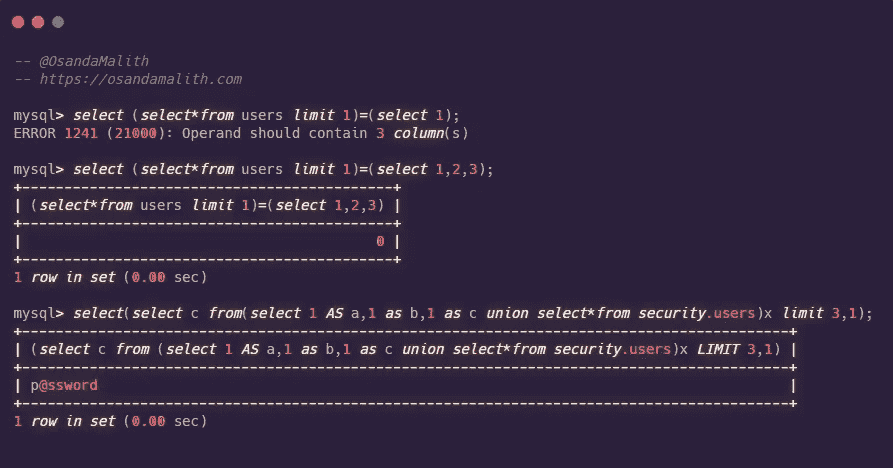

# 从 MySQL 和 MariaDB 中提取表和列的替代方法

> 原文：<https://infosecwriteups.com/alternatives-to-extract-tables-and-columns-from-mysql-and-mariadb-813171d3c8bc?source=collection_archive---------0----------------------->

我以前发表过一个关于当'*/或/i'* 被过滤时提取表名的[帖子](https://osandamalith.com/2017/02/03/alternative-for-information_schema-tables-in-mysql/)，这导致了单词 information_schema 的过滤。我自己对这个领域做了一些研究，发现了许多其他的表，在这些表中可以提取表名。这些是我找到的所有数据库和表，除了‘information _ schema . tables’之外，我们还可以从中提取表名。我在 5.7.29 MySQL 和 10.3.18 MariaDB 中测试过以下内容。总共有 39 个查询，正如我在之前的[帖子](https://osandamalith.com/2017/02/03/alternative-for-information_schema-tables-in-mysql/)中提到的，这些可以在一次查询中与 dump 结合。

# [计]系统复制命令（system 的简写）

这些视图是在 MySQL 5.7.9 中添加的。

```
mysql> **SELECT** object_name **FROM** `sys`.`x$innodb_buffer_stats_by_table` **WHERE** object_schema = **DATABASE**();
+-------------+
| object_name |
+-------------+
| emails      |
| flag        |
| referers    |
| uagents     |
| users       |
+-------------+
5 rows in **set** (0.04 sec)mysql> **SELECT** TABLE_NAME **FROM** `sys`.`x$schema_flattened_keys` **WHERE** TABLE_SCHEMA = **DATABASE**();
+------------+
| TABLE_NAME |
+------------+
| emails     |
| flag       |
| referers   |
| uagents    |
| users      |
+------------+
5 rows in **set** (0.01 sec)mysql> **SELECT** TABLE_NAME **FROM** `sys`.`x$ps_schema_table_statistics_io` **WHERE** TABLE_SCHEMA = **DATABASE**();
+------------+
| TABLE_NAME |
+------------+
| db         |
| emails     |
| flag       |
| referers   |
| uagents    |
| users      |
+------------+
6 rows in **set** (0.04 sec)mysql> **SELECT** TABLE_NAME **FROM** `sys`.`x$schema_index_statistics` **WHERE** TABLE_SCHEMA = **DATABASE**();
+------------+
| table_name |
+------------+
| users      |
| emails     |
| referers   |
| uagents    |
| flag       |
+------------+
5 rows in **set** (0.00 sec)mysql> **SELECT** TABLE_NAME **FROM** `sys`.`x$schema_table_statistics` **WHERE** TABLE_SCHEMA = **DATABASE**();
+------------+
| TABLE_NAME |
+------------+
| emails     |
| users      |
| flag       |
| referers   |
| uagents    |
+------------+
5 rows in **set** (0.03 sec)mysql> **SELECT** TABLE_NAME **FROM** `sys`.`x$schema_table_statistics_with_buffer` **WHERE** TABLE_SCHEMA = **DATABASE**();
+------------+
| TABLE_NAME |
+------------+
| referers   |
| uagents    |
| emails     |
| users      |
| flag       |
+------------+
5 rows in **set** (0.07 sec)mysql> **SELECT** object_name **FROM** `sys`.`innodb_buffer_stats_by_table` **WHERE** object_schema = **DATABASE**();
+-------------+
| object_name |
+-------------+
| emails      |
| flag        |
| referers    |
| uagents     |
| users       |
+-------------+
5 rows in **set** (0.05 sec)mysql> **SELECT** TABLE_NAME **FROM** `sys`.`schema_auto_increment_columns` **WHERE** TABLE_SCHEMA = **DATABASE**();
+------------+
| table_name |
+------------+
| referers   |
| flag       |
| emails     |
| users      |
| uagents    |
+------------+
5 rows in **set** (0.14 sec)mysql> **SELECT** TABLE_NAME **FROM** `sys`.`schema_index_statistics` **WHERE** TABLE_SCHEMA = **DATABASE**();
+------------+
| table_name |
+------------+
| users      |
| emails     |
| referers   |
| uagents    |
| flag       |
+------------+
5 rows in **set** (0.00 sec)mysql> **SELECT** TABLE_NAME **FROM** `sys`.`schema_table_statistics` **WHERE** TABLE_SCHEMA = **DATABASE**();
+------------+
| TABLE_NAME |
+------------+
| users      |
| emails     |
| referers   |
| uagents    |
| flag       |
+------------+
5 rows in **set** (0.04 sec)mysql> **SELECT** TABLE_NAME **FROM** `sys`.`schema_table_statistics_with_buffer` **WHERE** TABLE_SCHEMA = **DATABASE**();
+------------+
| TABLE_NAME |
+------------+
| users      |
| emails     |
| flag       |
| referers   |
| uagents    |
+------------+
5 rows in **set** (0.09 sec)
```

使用这些查询，您可以获得存储在本地磁盘上的表文件路径，同时我们可以提取表名。

```
mysql> **SELECT** **FILE** **FROM** `sys`.`io_global_by_file_by_bytes` **WHERE** **FILE** REGEXP **DATABASE**();
+---------------------------------+
| file                            |
+---------------------------------+
| @@datadir\security\emails.ibd   |
| @@datadir\security\flag.ibd     |
| @@datadir\security\referers.ibd |
| @@datadir\security\uagents.ibd  |
| @@datadir\security\users.ibd    |
| @@datadir\security\uagents.frm  |
| @@datadir\security\referers.frm |
| @@datadir\security\users.frm    |
| @@datadir\security\emails.frm   |
| @@datadir\security\flag.frm     |
| @@datadir\security\db.opt       |
+---------------------------------+
11 rows in **set** (0.22 sec)mysql> **SELECT** **FILE** **FROM** `sys`.`io_global_by_file_by_latency` **WHERE** **FILE** REGEXP **DATABASE**();
+---------------------------------+
| file                            |
+---------------------------------+
| @@datadir\security\flag.ibd     |
| @@datadir\security\uagents.ibd  |
| @@datadir\security\flag.frm     |
| @@datadir\security\emails.frm   |
| @@datadir\security\emails.ibd   |
| @@datadir\security\referers.ibd |
| @@datadir\security\referers.frm |
| @@datadir\security\users.frm    |
| @@datadir\security\users.ibd    |
| @@datadir\security\uagents.frm  |
| @@datadir\security\db.opt       |
+---------------------------------+mysql> **SELECT** **FILE** **FROM** `sys`.`x$io_global_by_file_by_bytes` **WHERE** **FILE** REGEXP **DATABASE**();
+-----------------------------------------------------------------------------+
| file                                                                        |
+-----------------------------------------------------------------------------+
| D:\MySQL\mysql-5.7.29-winx64\mysql-5.7.29-winx64\data\security\emails.ibd   |
| D:\MySQL\mysql-5.7.29-winx64\mysql-5.7.29-winx64\data\security\flag.ibd     |
| D:\MySQL\mysql-5.7.29-winx64\mysql-5.7.29-winx64\data\security\referers.ibd |
| D:\MySQL\mysql-5.7.29-winx64\mysql-5.7.29-winx64\data\security\uagents.ibd  |
| D:\MySQL\mysql-5.7.29-winx64\mysql-5.7.29-winx64\data\security\users.ibd    |
| D:\MySQL\mysql-5.7.29-winx64\mysql-5.7.29-winx64\data\security\uagents.frm  |
| D:\MySQL\mysql-5.7.29-winx64\mysql-5.7.29-winx64\data\security\referers.frm |
| D:\MySQL\mysql-5.7.29-winx64\mysql-5.7.29-winx64\data\security\users.frm    |
| D:\MySQL\mysql-5.7.29-winx64\mysql-5.7.29-winx64\data\security\emails.frm   |
| D:\MySQL\mysql-5.7.29-winx64\mysql-5.7.29-winx64\data\security\flag.frm     |
| D:\MySQL\mysql-5.7.29-winx64\mysql-5.7.29-winx64\data\security\db.opt       |
+-----------------------------------------------------------------------------+mysql> **SELECT** **FILE** **FROM** `sys`.`x$io_global_by_file_by_latency` **WHERE** **FILE** REGEXP **DATABASE**();
+-----------------------------------------------------------------------------+
| file                                                                        |
+-----------------------------------------------------------------------------+
| D:\MySQL\mysql-5.7.29-winx64\mysql-5.7.29-winx64\data\security\flag.ibd     |
| D:\MySQL\mysql-5.7.29-winx64\mysql-5.7.29-winx64\data\security\uagents.ibd  |
| D:\MySQL\mysql-5.7.29-winx64\mysql-5.7.29-winx64\data\security\flag.frm     |
| D:\MySQL\mysql-5.7.29-winx64\mysql-5.7.29-winx64\data\security\emails.frm   |
| D:\MySQL\mysql-5.7.29-winx64\mysql-5.7.29-winx64\data\security\emails.ibd   |
| D:\MySQL\mysql-5.7.29-winx64\mysql-5.7.29-winx64\data\security\referers.ibd |
| D:\MySQL\mysql-5.7.29-winx64\mysql-5.7.29-winx64\data\security\referers.frm |
| D:\MySQL\mysql-5.7.29-winx64\mysql-5.7.29-winx64\data\security\users.frm    |
| D:\MySQL\mysql-5.7.29-winx64\mysql-5.7.29-winx64\data\security\users.ibd    |
| D:\MySQL\mysql-5.7.29-winx64\mysql-5.7.29-winx64\data\security\uagents.frm  |
| D:\MySQL\mysql-5.7.29-winx64\mysql-5.7.29-winx64\data\security\db.opt       |
+-----------------------------------------------------------------------------+
11 rows in **set** (0.00 sec)
```

下表像日志一样存储以前使用的查询。你可以用正则表达式找到你需要的东西。

```
mysql> **SELECT** **QUERY** **FROM** sys.x$statement_analysis **WHERE** **QUERY** REGEXP **DATABASE**();
+-----------------------------------------------------------------------------------------------------------------------------------+
| query                                                                                                                             |
+-----------------------------------------------------------------------------------------------------------------------------------+
| **SHOW** **TABLE** **STATUS** **FROM** `security`                                                                                                 |
| **SHOW** **CREATE** **TABLE** `security` . `emails`                                                                                           |
| **SHOW** **CREATE** **TABLE** `security` . `users`                                                                                            |
| **SHOW** **CREATE** **TABLE** `security` . `referers`                                                                                         |
+-----------------------------------------------------------------------------------------------------------------------------------+mysql> **SELECT** **QUERY** **FROM** `sys`.`statement_analysis` **where** **QUERY** REGEXP **DATABASE**();
+-----------------------------------------------------------+
| query                                                     |
+-----------------------------------------------------------+
| **SHOW** **TABLE** **STATUS** **FROM** `security`                         |
| **SHOW** **CREATE** **TABLE** `security` . `emails`                   |
| **SHOW** **CREATE** **TABLE** `security` . `users`                    |
| **SHOW** **CREATE** **TABLE** `security` . `referers`                 |
| **SELECT** * **FROM** `security` . `users` **LIMIT** ?                |
| **SHOW** **CREATE** **TABLE** `security` . `uagents`                  |
| **SHOW** **CREATE** **PROCEDURE** `security` . `select_first_column`  |
| **SHOW** **CREATE** **TABLE** `security` . `users`                    |
| **SHOW** **OPEN** **TABLES** **FROM** `security` **WHERE** `in_use` != ?      |
| **SHOW** **TRIGGERS** **FROM** `security`                             |
| **USE** `security`                                            |
| **USE** `security`                                            |
+-----------------------------------------------------------+
12 **rows** **in** **set** (0.01 sec)
```

# 性能模式

```
mysql> **SELECT** object_name **FROM** `performance_schema`.`objects_summary_global_by_type` **WHERE** object_schema = **DATABASE**();
+---------------------+
| object_name         |
+---------------------+
| emails              |
| referers            |
| uagents             |
| users               |
| flag                |
| select_first_column |
+---------------------+
6 rows in **set** (0.00 sec)mysql> **SELECT** object_name **FROM** `performance_schema`.`table_handles` **WHERE** object_schema = **DATABASE**();
+-------------+
| object_name |
+-------------+
| emails      |
| referers    |
| uagents     |
| users       |
| users       |
| users       |
| users       |
| users       |
| users       |
| users       |
| emails      |
| flag        |
| referers    |
| uagents     |
| users       |
| emails      |
| flag        |
| referers    |
| uagents     |
| users       |
+-------------+
20 rows in **set** (0.00 sec)mysql> **SELECT** object_name **FROM** `performance_schema`.`table_io_waits_summary_by_index_usage` **WHERE** object_schema = **DATABASE**();
+-------------+
| object_name |
+-------------+
| emails      |
| referers    |
| uagents     |
| users       |
| users       |
| flag        |
+-------------+
6 rows in **set** (0.00 sec)mysql> **SELECT** object_name **FROM** `performance_schema`.`table_io_waits_summary_by_table` **WHERE** object_schema = **DATABASE**();
+-------------+
| object_name |
+-------------+
| emails      |
| referers    |
| uagents     |
| users       |
| flag        |
+-------------+
5 rows in **set** (0.00 sec)mysql> **SELECT** object_name **FROM** `performance_schema`.`table_lock_waits_summary_by_table` **WHERE** object_schema = **DATABASE**();
+-------------+
| object_name |
+-------------+
| emails      |
| referers    |
| uagents     |
| users       |
| flag        |
+-------------+
5 rows in **set** (0.00 sec)
```

如前所述，下面包含所有类型化 SQL 查询的日志。有时您可能会找到表名。为了简单起见，我使用正则表达式来匹配当前的数据库名称。

```
mysql> **SELECT** digest_text **FROM** `performance_schema`.`events_statements_summary_by_digest` **WHERE** digest_text REGEXP **DATABASE**();
+-----------------------------------------------------------------------------------------------------------------------------------+
| digest_text                                                                                                                       |
+-----------------------------------------------------------------------------------------------------------------------------------+
| **SHOW** **CREATE** **TABLE** `security` . `emails`                                                                                           |
| **SHOW** **CREATE** **TABLE** `security` . `referers`                                                                                         |
| **SHOW** **CREATE** **PROCEDURE** `security` . `select_first_column`                                                                          |
| **SHOW** **CREATE** **TABLE** `security` . `uagents`                                                                                          |
+-----------------------------------------------------------------------------------------------------------------------------------+
17 **rows** **in** **set** (0.00 sec)
```

就像之前我们获取本地表文件路径一样。

```
mysql> **SELECT** file_name **FROM** `performance_schema`.`file_instances` **WHERE** file_name REGEXP **DATABASE**();
+-----------------------------------------------------------------------------+
| file_name                                                                   |
+-----------------------------------------------------------------------------+
| D:\MySQL\mysql-5.7.29-winx64\mysql-5.7.29-winx64\data\security\emails.ibd   |
| D:\MySQL\mysql-5.7.29-winx64\mysql-5.7.29-winx64\data\security\flag.ibd     |
| D:\MySQL\mysql-5.7.29-winx64\mysql-5.7.29-winx64\data\security\referers.ibd |
| D:\MySQL\mysql-5.7.29-winx64\mysql-5.7.29-winx64\data\security\uagents.ibd  |
| D:\MySQL\mysql-5.7.29-winx64\mysql-5.7.29-winx64\data\security\users.ibd    |
| D:\MySQL\mysql-5.7.29-winx64\mysql-5.7.29-winx64\data\security\emails.frm   |
| D:\MySQL\mysql-5.7.29-winx64\mysql-5.7.29-winx64\data\security\referers.frm |
| D:\MySQL\mysql-5.7.29-winx64\mysql-5.7.29-winx64\data\security\db.opt       |
| D:\MySQL\mysql-5.7.29-winx64\mysql-5.7.29-winx64\data\security\uagents.frm  |
| D:\MySQL\mysql-5.7.29-winx64\mysql-5.7.29-winx64\data\security\users.frm    |
| D:\MySQL\mysql-5.7.29-winx64\mysql-5.7.29-winx64\data\security\flag.frm     |
+-----------------------------------------------------------------------------+
11 rows in **set** (0.00 sec)
```

# 关系型数据库

查看我之前关于这两个查询的[帖子](https://osandamalith.com/2017/02/03/alternative-for-information_schema-tables-in-mysql/)以及一次查询中的转储。

```
mysql> **SELECT** table_name **FROM** `mysql`.`innodb_table_stats` **WHERE** database_name = **DATABASE**();
+------------+
| table_name |
+------------+
| emails     |
| flag       |
| referers   |
| uagents    |
| users      |
+------------+
5 rows in **set** (0.00 sec)mysql> **SELECT** table_name **FROM** `mysql`.`innodb_index_stats` **WHERE** database_name = **DATABASE**();
+------------+
| table_name |
+------------+
| emails     |
| emails     |
| emails     |
| flag       |
| flag       |
| flag       |
| referers   |
| referers   |
| referers   |
| uagents    |
| uagents    |
| uagents    |
| users      |
| users      |
| users      |
+------------+
15 rows in **set** (0.00 sec)
```

# 信息模式

```
mysql> **SELECT** TABLE_NAME **FROM** `information_schema`.`KEY_COLUMN_USAGE` **WHERE** CONSTRAINT_SCHEMA = **DATABASE**();
+------------+
| TABLE_NAME |
+------------+
| emails     |
| flag       |
| referers   |
| uagents    |
| users      |
+------------+
5 rows in **set** (0.07 sec)mysql> **SELECT** TABLE_NAME **FROM** `information_schema`.`KEY_COLUMN_USAGE` **WHERE** table_schema = **DATABASE**();
+------------+
| TABLE_NAME |
+------------+
| emails     |
| flag       |
| referers   |
| uagents    |
| users      |
+------------+
5 rows in **set** (0.00 sec)
```

但是，在这种情况下，可以检索第一列值。

```
mysql> **SELECT** COLUMN_NAME **FROM** `information_schema`.`KEY_COLUMN_USAGE` **WHERE** table_schema = **DATABASE**();
+-------------+
| COLUMN_NAME |
+-------------+
| id          |
| id          |
| id          |
| id          |
| id          |
+-------------+
5 rows in **set** (0.00 sec)mysql> **SELECT** TABLE_NAME **FROM** `information_schema`.`PARTITIONS` **WHERE** TABLE_SCHEMA = **DATABASE**();
+------------+
| TABLE_NAME |
+------------+
| emails     |
| flag       |
| referers   |
| uagents    |
| users      |
+------------+
5 rows in **set** (0.01 sec)
```

在该表中，您还可以使用列“column_name”来获取所有表的第一列。

```
mysql> **SELECT** TABLE_NAME **FROM** `information_schema`.`STATISTICS` **WHERE** TABLE_SCHEMA = **DATABASE**();
+------------+
| TABLE_NAME |
+------------+
| emails     |
| flag       |
| referers   |
| uagents    |
| users      |
+------------+
5 rows in **set** (0.00 sec)mysql> **SELECT** TABLE_NAME **FROM** `information_schema`.`TABLE_CONSTRAINTS` **WHERE** TABLE_SCHEMA = **DATABASE**();
+------------+
| TABLE_NAME |
+------------+
| emails     |
| flag       |
| referers   |
| uagents    |
| users      |
+------------+
5 rows in **set** (0.00 sec)mysql> **SELECT** file_name **FROM** `information_schema`.`FILES` **where** file_name regexp **database**();
+-------------------------+
| file_name               |
+-------------------------+
| .\security\emails.ibd   |
| .\security\flag.ibd     |
| .\security\referers.ibd |
| .\security\uagents.ibd  |
| .\security\users.ibd    |
+-------------------------+
5 rows in **set** (0.00 sec)
```

从 MySQL 5.6 开始，InnoDB 存在于 Information_Schema 中。

```
mysql> **SELECT** TABLE_NAME **FROM** `information_schema`.`INNODB_BUFFER_PAGE` **WHERE** TABLE_NAME REGEXP  **DATABASE**();
+-----------------------+
| TABLE_NAME            |
+-----------------------+
| `security`.`emails`   |
| `security`.`referers` |
| `security`.`uagents`  |
| `security`.`users`    |
| `security`.`flag`     |
+-----------------------+mysql> **SELECT** TABLE_NAME **FROM** `information_schema`.`INNODB_BUFFER_PAGE_LRU` **WHERE** TABLE_NAME REGEXP **DATABASE**();
+-----------------------+
| TABLE_NAME            |
+-----------------------+
| `security`.`emails`   |
| `security`.`referers` |
| `security`.`uagents`  |
| `security`.`users`    |
| `security`.`flag`     |
+-----------------------+
5 rows in **set** (0.06 sec)mysql> **SELECT** **path** **FROM**  `information_schema`.`INNODB_SYS_DATAFILES` **WHERE** **path** REGEXP **DATABASE**();
+-------------------------+
| path                    |
+-------------------------+
| .\security\users.ibd    |
| .\security\emails.ibd   |
| .\security\uagents.ibd  |
| .\security\referers.ibd |
| .\security\flag.ibd     |
+-------------------------+
5 rows in **set** (0.00 sec)mysql> **SELECT** **NAME** **FROM** `information_schema`.`INNODB_SYS_TABLESPACES` **WHERE** **NAME** REGEXP **DATABASE**();
+-------------------+
| NAME              |
+-------------------+
| security/users    |
| security/emails   |
| security/uagents  |
| security/referers |
| security/flag     |
+-------------------+
5 rows in **set** (0.04 sec)mysql> **SELECT** **NAME** **FROM** `information_schema`.`INNODB_SYS_TABLESTATS` **WHERE** **NAME** REGEXP **DATABASE**();
+-------------------+
| NAME              |
+-------------------+
| security/emails   |
| security/flag     |
| security/referers |
| security/uagents  |
| security/users    |
+-------------------+
5 rows in **set** (0.00 sec)
```

# 列名

大多数时候人们问我是否有提取列名的方法？您实际上不需要知道列名。

如果显示了错误，您可以使用下面的第一个查询直接获得列数，该查询等于 1，返回给我们错误。要确定布尔盲注入场景中的列数，您可以使用这个技巧，它将返回 0(因为值不相等)。之后，使用下面的第三个查询提取数据



我希望这些能在你下一次考试中派上用场:)

*关注* [*Infosec 报道*](https://medium.com/bugbountywriteup) *获取更多此类精彩报道。*

[](https://medium.com/bugbountywriteup) [## 信息安全报道

### 收集了世界上最好的黑客的文章，主题从 bug 奖金和 CTF 到 vulnhub…

medium.com](https://medium.com/bugbountywriteup)