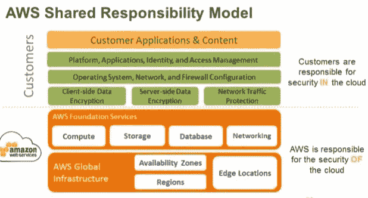

# 亚马逊网络服务 IAM 基础，你需要的唯一指南！

> 原文：<https://infosecwriteups.com/amazon-web-services-iam-basics-the-only-guide-you-need-ad2697b6a38e?source=collection_archive---------2----------------------->

所以 Covid 锁定 2.0！第一次锁定时，我花了很多时间研究云技术，因为当时我主要在这一领域进行咨询。选择的供应商是 AWS，经过几周的阅读和学习，我获得了最后的证书——AWS 安全专家。

这篇文章将集中在关键和最基本的概念上。本主题介绍安全性、身份和访问管理概念。

什么是 IAM？

> 为了管理对这些服务的访问权限，AWS 创建了 IAM。IAM 是一项**全球**服务，这意味着它覆盖一个账户内的所有地区。

AWS 身份和访问管理(IAM)使您能够安全地管理对 AWS 服务和资源的**访问**。使用 IAM，**您可以创建和管理 AWS *用户*和*组*，并使用*权限*来允许和拒绝他们对 AWS 资源的访问。**

IAM 是 AWS 帐户**的一项功能，无需额外付费**。您只需为您的用户使用其他 AWS 服务付费。

当提到基于云的提供商的安全性时，明智的做法可能是确保您知道谁负责云容器的哪些方面，您作为客户，以及云提供商将负责什么。这里有一个图表来解释这一点。

尽管 AWS 负责调配和维护底层云基础设施，但您仍然需要执行一些安全配置任务，以确保您的云环境遵循最佳安全实践。长话短说 AWS 从底层到虚拟机管理程序，它们保护运行所有产品和服务的硬件、软件、设施和网络。当客户负责他们选择的服务的安全配置时，通常是 EC2 和 S3 桶配置。

# 对 IAM 策略构成的基本但更深入的了解

**用户**

IAM 中的用户是 AWS 帐户的用户，并且是使用 AWS 帐户的组织的用户。

IAM 中的用户可以是开发人员、人力资源或使用 AWS 帐户的任何组织成员。

用户可以通过 *AWS 管理控制台访问*或*编程访问*。

用户可以在首次登录控制台后根据更改其密码

*   组织的云管理员授予的权限。

用户使用用户名和密码登录 AWS 管理控制台。

用户使用访问密钥 id 和秘密访问密钥通过编程访问 AWS 资源 API。

可以将策略附加到用户，以限制用户在 AWS 帐户中的操作。

用户可以添加到组中，也可以是 AWS 帐户的独立用户。

**组**

*   组织中的组可以是用户的集合，如 HR 团队、开发团队、DevOps 团队或数据分析师团队等。

AWS 帐户中的组与组织中的组相同。

AWS 帐户中的组是在 AWS 帐户中执行相同操作的 IAM 用户的集合。

例如:组织中的人力资源团队正在使用 S3 存储桶来存储简历。因此，IAM 用户是在 AWS IAM 中创建的，并被添加到一个名为 HR 的组中，该组通过使用策略只能访问 S3。

可以将策略附加到组中，以限制组中所有成员对 AWS 服务的访问。

例如:开发者 IAM 组的所有成员都可以启动虚拟机。

**角色**

*   IAM 角色是您可以在拥有特定权限的帐户中创建的 IAM 身份。IAM 角色类似于 IAM 用户，因为它是一个 AWS 身份，权限策略决定该身份在 AWS 中可以做什么和不可以做什么。

然而，一个角色并不仅仅与一个人相关联，而是旨在被任何需要它的人所接受。

总的来说，任何 AWS 资源或个人都可以使用一个角色来执行与 AWS 资源相关的操作。它为人员或 AWS 资源提供临时凭证，由 AWS 内部每隔几分钟刷新一次。

为角色附加一个策略，以定义角色可以对承担该角色的 AWS 资源执行的操作。

例如:EC2 实例可以承担访问 S3 的角色，下载 web 内容以服务用户。

**政策**

策略是一种实体，当附加到身份或资源时，它定义它们的权限。策略作为 JSON 文档存储在 AWS 中，并作为 IAM 中基于身份的策略附加到主体。

*   您可以将基于身份的策略附加到主体(或身份)，如 IAM 组、用户或角色。基于身份的策略包括 AWS 托管策略、客户托管策略和内联策略。

导入–您可以在您的帐户中导入受管策略，然后编辑该策略以根据您的特定要求进行自定义。受管策略可以是 AWS 受管策略，也可以是您之前创建的客户受管策略。

可视化编辑器–您可以在可视化编辑器中从头开始构建新策略。如果您使用可视化编辑器，您不必理解 JSON 语法。

*   JSON–在 JSON 选项卡中，您可以使用 JSON 语法创建策略。您可以键入一个新的 JSON 策略文档或粘贴一个示例策略。

**政策类型**

AWS 策略可分为 3 类，AWS 管理/客户管理/内联策略。请记住，这些政策旨在限制对 AWS 资源的访问。

AWS 受管策略 IAM 中有许多 AWS 受管策略，它们主要用于限制对 AWS 资源的访问。唯一的缺点是，对于 AWS 帐户上的所有定制操作，没有 AWS 管理的策略。有客户管理的政策。这些策略可以跨用户、组和角色应用。

客户管理的策略—管理员可以创建自己的客户管理策略，其中包含特定的操作和条件。它可以使用可视化编辑器或 JSON 模板创建。例如:只允许将内容写入特定 AWS S3 存储桶中的特定文件夹。这些策略可以跨用户、组和角色应用。

内联策略—内联策略是嵌入在主体实体(用户、组或角色)中的策略。内联策略仅适用于该特定用户、组或角色。

# AWS 身份访问管理的功能

*   对 AWS 资源的细粒度访问控制
*   针对高特权用户的多因素身份认证
*   使用 Web 身份提供者管理移动应用程序的访问控制
*   与您的公司目录集成
*   管理和控制密码策略
*   创建用户、组、角色
*   将自定义策略附加到用户、组和角色
*   启用和禁用 AWS 帐户中用于启动资源的区域

**细粒度访问控制**

*   IAM 使您的用户能够控制对 AWS 服务 API 和特定资源的访问。IAM 还允许您添加特定的
    条件，例如一天中的时间，以控制用户如何使用 AWS、他们的原始 IP 地址、他们是否正在使用 SSL，或者他们是否已经使用多因素身份验证设备进行了身份验证。
*   管理 AWS 帐户的管理员将能够创建用户和组，并附加自定义策略或 AWS 管理的策略，以限制用户在 AWS 管理控制台中或通过 AWS 服务 API 执行的操作。
*   策略是具有特定元素的 JSON 文档。

**多因素认证**

AWS MFA 是无需额外费用即可获得的黄金标准安全功能，可增强用户名和密码凭据。MFA 要求用户通过提供有效的 MFA 代码来证明实际拥有硬件 MFA 令牌或支持 MFA 的移动设备。

*   使用适用于 android 的 play store 或适用于 IOS 设备的 app store 中的以下移动应用程序在您的手机上安装以下应用程序，以授权对您的 AWS 帐户进行二级安全访问。(不要丢失您的设备！！)
*   android/iOS 设备的谷歌认证器。
*   windows 设备的验证器。

# AWS 最佳实践

这里有一个快速的提示和关于我们刚刚谈到的事情的最佳安全实践的概述。

用户—创建单个用户。
组——管理组的权限。权限—授予最低权限。
审核—打开 AWS CloudTrail。
密码—配置强密码策略。MFA —为特权用户启用 MFA。
角色——为 Amazon EC2 实例使用 IAM 角色。共享—使用 IAM 角色共享访问权限。
轮换—定期轮换安全凭证。

条件—通过条件进一步限制特权访问。Root-减少或删除 root 的使用。

我认为这将结束这篇文章，因为我想把重点放在 AWS IAM 的基本标准，但基础做得正确！如果你喜欢我的这个解释，请给我一个掌声/赞，我会在以后关注更多的 AWS 文章。

感谢你阅读汤姆