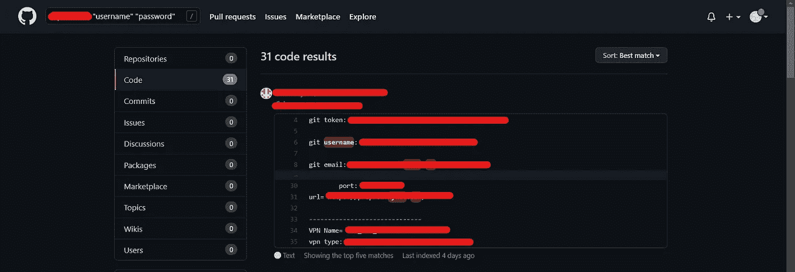
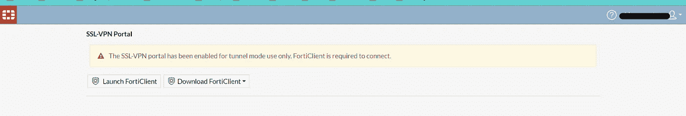

# 一次有效的 5 分钟侦察可以进入名人堂

> 原文：<https://infosecwriteups.com/an-effective-5-min-recon-leads-to-a-hall-of-fame-ae7f20e5cf1a?source=collection_archive---------0----------------------->

***嗨那儿，***

**T5 这里是 Renganathan，我是一名职业黑客&一名安全研究员。**

***我因报告了 LinkedIn、United Nations、BYJU's、Nike、Lenovo、Upstox 的 web 应用程序中的安全漏洞而得到了他们的认可。***

所以我在将近两个月之后回到了昆虫奖金。IRCTC bug 后我有考试。

让我们称之为 target.com，他们提供了一个基于临界状态的名人堂。

我从一个庄丹呆子开始。我有一个 shodan.io 的高级账户，他们去年向用户免费提供了一天:P

> ssl:目标“200 ok”

我找到了一些 FortiClient VPN 登录页面

所以没有浪费任何时间，我去了 GitHub 并使用了下面的呆子

> 目标“用户名”密码

很快在结果之上，我发现了一个包含以下数据的回购^_^

然后我在谷歌上搜索了回购所有者的名字，得知他是一名在 Target.com 工作的软件开发人员

我用那些 FortiClient 凭证登录的

是的，剩下的就是历史了，:D

我向他们报告了这个问题，这个问题很快得到了解决，并被列入了他们的名人堂。

***感谢阅读:)
注意安全。***

[***https://www.instagram.com/renganathanofficial***](https://www.instagram.com/renganathanofficial)

[***https://twitter.com/IamRenganathan***](https://twitter.com/IamRenganathan)