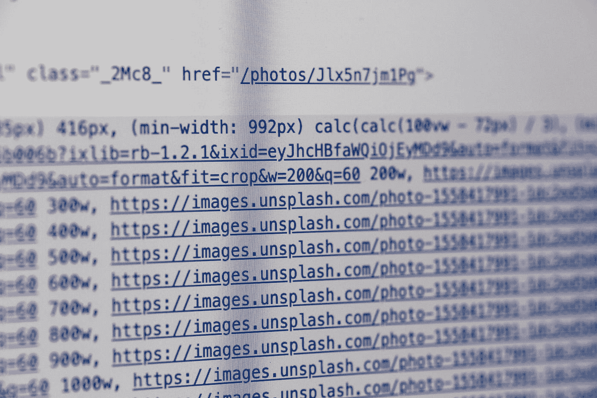
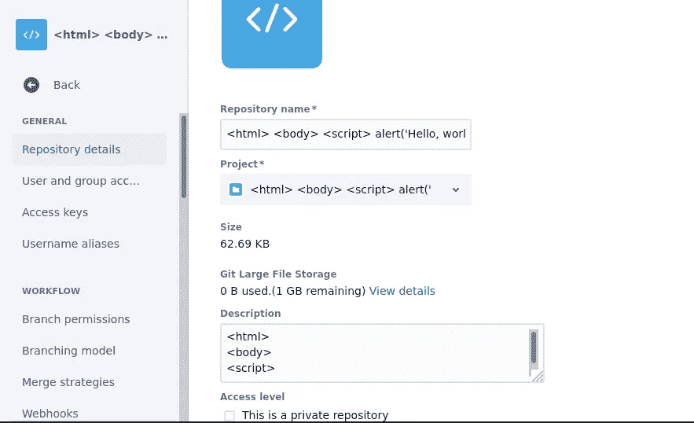
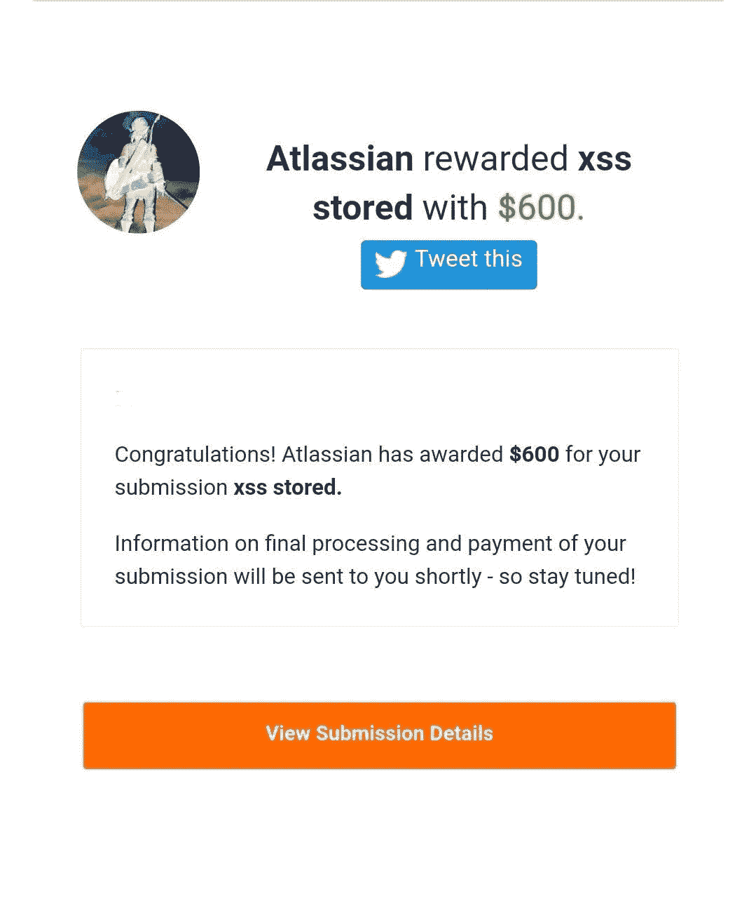
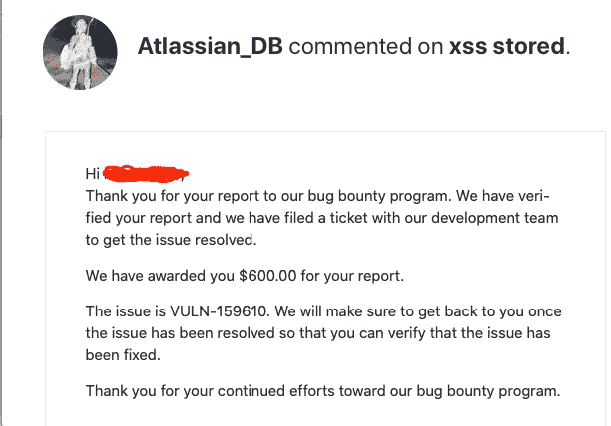

# 价值 600 美元的 HTML 注入

> 原文：<https://infosecwriteups.com/an-html-injection-worth-600-dollars-8dce0aa46b17?source=collection_archive---------0----------------------->

## 当不放手，争取你的权利，报复..



马库斯·斯皮斯克在 [Unsplash](https://unsplash.com?utm_source=medium&utm_medium=referral) 上的照片

# 食死徒

如果你是哈利波特迷，就像我女朋友一样，你已经知道这些人是谁了。你们中的一些人可能知道他们最常见的名字——triagers。

> *Triager*
> 
> *是对安全事件的评估，以确定是否存在安全事件、其优先级以及是否需要上报。因为它关系到潜在的* ***恶意软件*** *事件* ***分类的目的*** *可能会有所不同*

在做了一段时间的 Bug Bounty 后，你会很快学会在回答 triagers 的问题时要小心。在大多数情况下，找到一个 bug 并不是最难的部分，而是让它被接受。当然，这完全取决于漏洞本身的类型，但是如果你的发现符合“我不认为这是一个真正的错误”的条件，相信我，你会得到它。

《Bug Bounty》中这种令人沮丧的成分总是掌握在同一批人手中，这是一群非常挑剔的三人组。如果你没有给他们正确的“谈话”,你的报告将会也可能会以“不适用”结束。这些面试者不在乎问公司他们是否认为你的发现有价值。

# 公司，弱点，三人组

Atlassian Corporation Plc 是一家澳大利亚软件公司，为软件开发人员和项目经理开发产品。全球数百万用户每天依靠 Atlassian 产品来改进软件开发、项目管理、协作和代码质量。

在视察他们的一个基地时——bitbucket.com。我发现一个 **Html 注入**导致**存储** **XSS** 。这是一个又快又容易的发现。

```
<html>
<body>
<script>
alert('Hello, world!');
</script>
</body>
</html>
```

他们的网站看起来很像 github.com 或者 gitlab.com。



保存一个存储库并使用 description 字段，我发布了有效负载，每当页面被重新加载时都会触发一个弹出窗口。在报告错误 1 小时后，我的报告以不适用的形式关闭。

triager 告诉我，我只能这样做，只是因为我是仓库的所有者，还有其他一些疯狂的借口。我试着和这个人讲道理。但是不管你什么时候告诉他们他们错了，他们都不想听，即使他们知道。尤其是这个人( **Trim_Bugcrowd** )，长期滥用职权。谈到报告，他喜欢和研究人员玩游戏。事实上，两周前，他们开始对此人的行为进行内部调查，一旦我得到更多的细节，我会让你们知道。

# 奖励

不想继续浪费宝贵的时间，我直接联系了**亚特兰蒂斯**，告诉他们请看看我的报告。因为处理报告的人不是一个通情达理的人。令我惊讶的是，他们回复了，告诉我他们正在调查。



来自亚特兰大的负责网站安全的家伙明白这个问题，并且知道这是个严重的问题。他不仅付给我那份报告的钱，还付给我另外两份报告的钱。因为在看到 triager“错误”后，他打开了我所有其他关闭的报告。

# 禁令

Bug Bounty 的众多规则之一是，在你的报告结束后，永远不要直接联系公司。这一行动可以让你的帐户被终止或得到一个随机的一段时间的禁令。长话短说，我被禁赛两周，虽然我的报告是有效的。犯了“错误”的法官甚至没有对我的报告结果说抱歉。

# 最后的想法

因为这不是这个人第一次这样对我，我只是厌倦了，并把这件事掌握在手中。永远不要让别人利用自己的地位和权力来辱骂你。许多人会惊讶地得知，我有多少次是在直接联系这些公司后达成和解的。这 6 份报告中的最后一份在 7 个月左右后才得到“解决”,这仅仅是因为我从未放弃它。