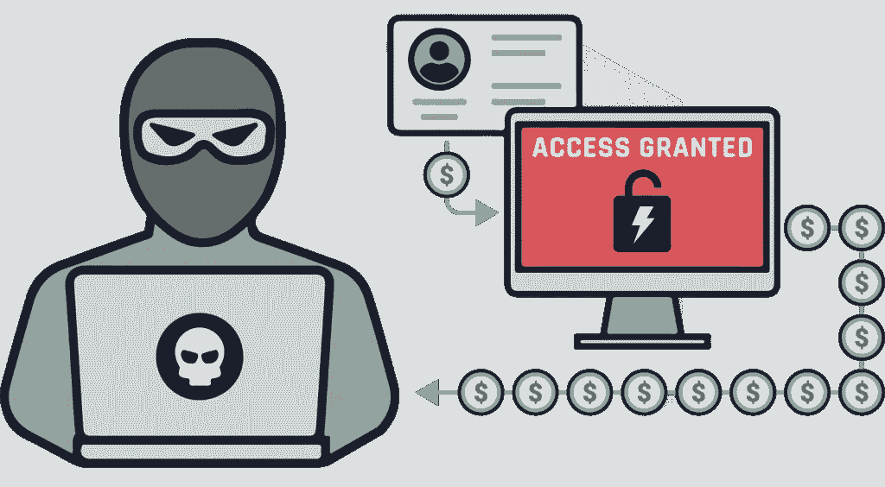
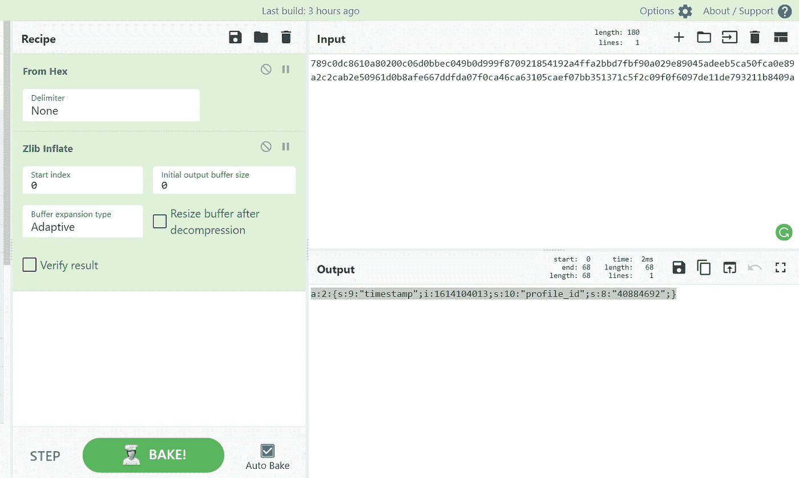
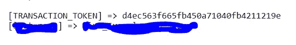

# 一个有趣的账户接管！！

> 原文：<https://infosecwriteups.com/an-interesting-account-takeover-3a33f42d609d?source=collection_archive---------2----------------------->

## IDOR 和弱加密导致帐户被完全接管。

你好，我的黑客伙伴们。我是 Mayank Pandey，一个臭虫猎人，一个有抱负的红队队员。这是我第一次写任何错误，所以如果我犯了任何错误，然后忽略它。

现在直接进入有趣的部分。最近，我在媒体上读到许多帐户接管，他们通常使用“X-Forwarded-Host”标题来窃取令牌。所以我想为什么不试一试，换一种方式。我有几个未决的私人邀请，所以我接受了一个并开始寻找帐户接管，最终找到了宝石。

这个错误存在于“密码重置”功能中，该功能允许完全接管帐户，而无需用户进行任何交互。它是 IDOR、一点密码学和大量目录模糊化的结合。

我们给公司打个电话:“example.com”。首先，看看普通的密码重置是如何工作的。

1:用户转到“example . com/PHP/log in _ or _ password _ forgotten ”,通过输入他们的个人资料 ID 和姓名请求重置密码。

2:验证他们的配置文件 ID 和名称，并生成一个*状态*参数。

> STATE = ejxdkn 1 owzamhd 8 ldza 1 xfft 9 gpmde 2 gdmktuixm 4 paililjjhbo 747 dfjrxlfhzyp 9 zgphpbduaryixzqn 8 wd evhz 1% 2 bo V8 utxeimshftxatwcjfwyeoeepgkppxttzfiojgssg % 2 fqrmgvgxbc 8 H4 zdyq 8 hhnfmsnza lo 3 ckekwftuurh % 2 b 7 snxt 0 ylsd DP 9 arxo 1 e 6y 96h rar 4 uevy

3:此后，一个密码重置链接被发送到用户注册的电子邮件，如下所示

> 【https://example.com/php/login_or_password_forgotten? k = 789 c 0 DC 8610 a 80200 c 06d 0 bbec 049 BC 9d 26 f 870921834192 a4 FFA 2 bbd 7 fbf 90 a 029 e 810 c 9 adeea 98 a 5753287 a 844 e 16555 b 1016150 BF AFC 3 cf BAF 94 eff 2450 e 494 a 2 e 640 f 67 ebc 89137 aade 927d 25 a 020 ab

4:现在，用户可以通过单击链接后转到仪表板来更改他们的密码。

# 有趣的部分

“*？k"* 参数对我来说有点可疑，所以我迅速复制并粘贴到 [CyberChef](https://gchq.github.io/CyberChef/) 上，看看它是否是一个加密的字符串。令我惊讶的是，这是一个加密+压缩的字符串

它首先被 **Zlib-deflated** ，然后使用 **Hex 将被压缩的字符串加密回去。**由此可见一斑

> "*789 c 0 DC 8610 a 80200 c 06d 0 bbec 049 BC 9d 26 f 870921834192 a4 FFA 2 bbd 7 fbf 90 a 029 e 810 c 9 ade ea 98 a 5753287 a 844 e 16555 b 1016150 BF AFC 3 cf BAF 94 eff 2450 e 494 a2 e 640 f 67 ebc 89137 aade 927d 25 a 020*

解密回

> *“a:2:{ s:9:“时间戳”；我:1614104013；s:10:" profile _ id "；s:8:“40884692”；}* ”

解密后的字符串由两个重要变量“profile_id”和“timestamp”组成。我很高兴看到这个，以为我找到了宝石。我立即伪造了我的第二个帐户的令牌，用它来更改密码。

> 伪造令牌—789 c 0 DC 8510 a 85201005d 0 bdcc 0 AC 6 f 25 da 6 EB 62427806034992 Fe 457 bb 7 df 93 b 9 f0e 9 DC 28 c 36 be 923d 726 c 919107 EC 0 aa 40 ea 0 C4 a69 f 775 f 85976 ffcb 2746891 a 610693 f 44 ebe 171387

但是我完全错了。该链接无效。

没有什么来的这么容易…对吗？

# 转折

如果你仔细观察，你会发现原始令牌和伪造令牌的长度不同

原始令牌和伪造令牌相差 32 个字符。这是一个巨大的问题，因为服务器不接受任何垃圾值来代替这 32 个字符。两个令牌都被解密为相同的值

> " *a:2:{s:9:"时间戳"；我:1614104013；s:10:" profile _ id "；s:8:“40884692”；}".*

这让我非常沮丧😫 😫。我开始搜索更多关于 Zlib 压缩的内容。我去了 Reddit，发布了我的问题，令人惊讶的是，我的收件箱被无数令人惊讶的博客帖子和如何处理 Zlib 的想法淹没了。

在网上阅读了 2 个小时后，我发现 Zlib 包含一个 **ADLER32 校验和**如果你在膨胀后使用 Adler-32_Checksum()函数，你会得到 **BC89137A，**注意，这个校验和存在于原始令牌中。在 Zlib 中，该校验和之后的所有内容都不是压缩流的一部分，因此将被忽略，这就是为什么即使长度不同，两个令牌也会给出相同的结果。

所以现在的挑战是找到 32 位的字符串。因为所有与令牌相关的工作都发生在客户端，所以我非常确定能在 JS 文件中找到一些东西。

在 JS 文件中查看了几个小时后，我发现了一个端点**“/PHP/user”。**我决定强行打开目录，最终找到了端点“[**https://example.com**](https://example.com)**/PHP/user/example/”，**这个端点有一个名为“Transction _ Token”的字符串，这确实是我要找的最后一个部分。

# 将碎片拼在一起

现在是把所有东西放在一起并加以利用的时候了。

这种攻击需要精确，因为每次页面刷新时,“Transaction _Token”都会发生变化。所以我做了一个 python 脚本来自动化整个过程。

我为我的第二个帐户生成了令牌，并用它来更改密码，并且**成功了！！！！**

# 重要提示

*   如果有令牌，就有可能被破解。
*   手动读取 JS 文件一次，因为这些文件包含关于 Web 应用程序工作的非常重要的信息
*   尝试在 Reddit 上询问技术细节，这肯定会让你大吃一惊，而且人们在回复你之前不会看到你的粉丝数😅 😉。

> 相信你的直觉，永远多走一步😇

非常感谢你的阅读。喜欢就分享

可以在推特上找我: [**mayank_pandey01**](https://twitter.com/mayank_pandey01)