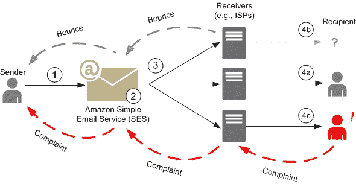

# 意想不到的收获——电子邮件退回问题

> 原文：<https://infosecwriteups.com/an-unexpected-bounty-email-bounce-issues-b9f24a35eb68?source=collection_archive---------0----------------------->

大家好！这是我写的关于一个你以前从未听说过的 bug 的文章。

与此同时，我发现我正在测试的应用程序中有一个功能，可以向家庭成员发送使用该应用程序的邀请。我想到通过输入一些无效的电子邮件来利用这个功能！

好的，我成功地发送邮件到无效邮件 xD，听起来很疯狂吧？

塞巴斯蒂安·赫尔曼在 [Unsplash](https://unsplash.com?utm_source=medium&utm_medium=referral) 上的照片

后来，我查看了不同公司是如何处理退回邮件的。最大的云市场(亚马逊网络服务)的电子邮件服务 AWS SES 的硬退率为 10%(**硬退**是指**电子邮件**由于某些永久原因无法发送。也许**电子邮件的**是假地址，也许**电子邮件的**域不是真正的域，或者也许**电子邮件**收件人的服务器不接受**电子邮件**或者仅仅是一封输入错误的电子邮件)，这意味着在总共 1000 封电子邮件中，如果其中 100 封是假的或无效的，导致所有这些邮件被退回， **AWS SES** 将阻止您的服务。

似乎不错？我检查了 AWS SES(简单电子邮件服务)与跳出率相关的政策，这一切是如何工作的。以下是 AWS SES 在邮件被退回时的工作方式。

AWS SES 拍摄的照片

简而言之，完整的过程是，我可以邀请尽可能多的家庭成员使用 Web 应用程序，但即使我输入了无效的电子邮件，邀请也会被发送。

报告了这个问题，因为它是一个 bug，团队花了一些时间来了解发生了什么，但在一周内，这个 bug 被分类并获得了奖金$$$

感谢阅读！

狩猎愉快:)