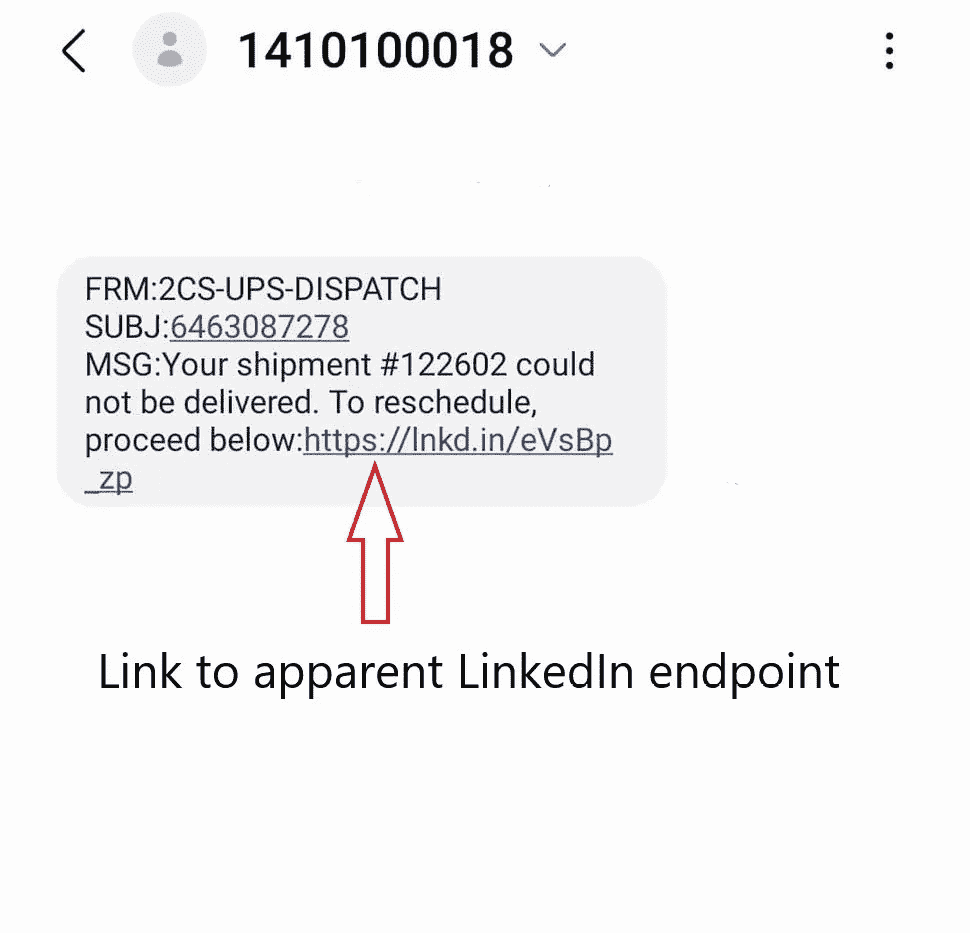
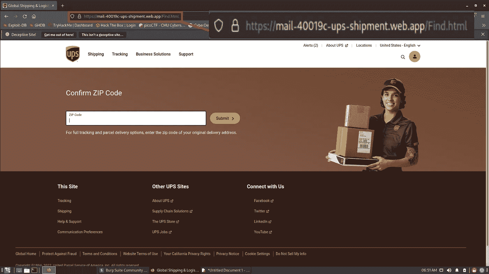
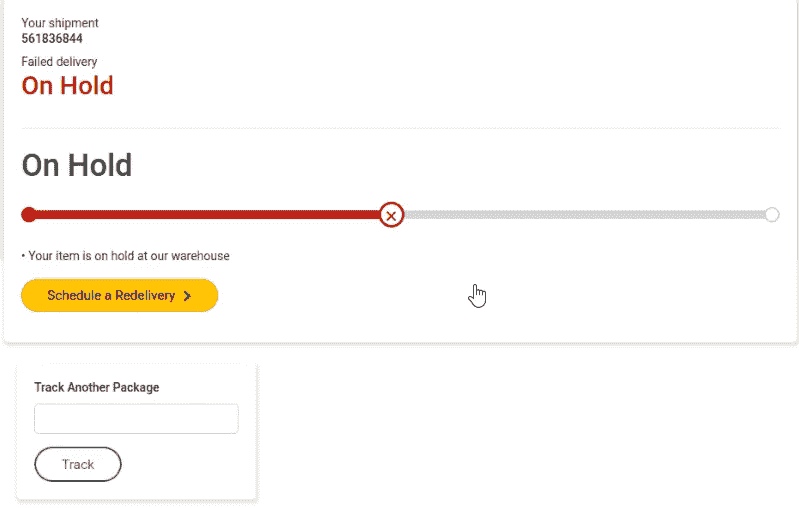
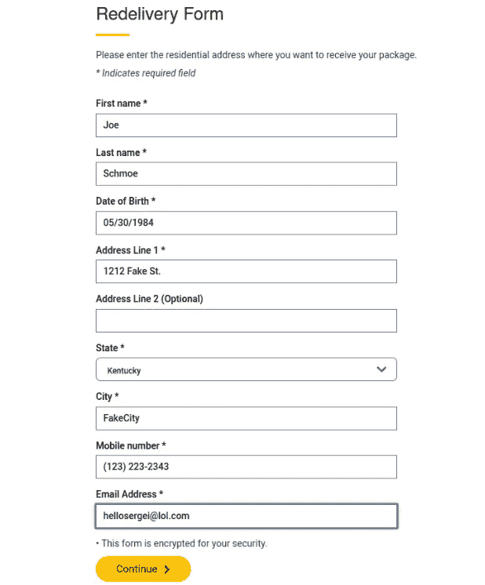
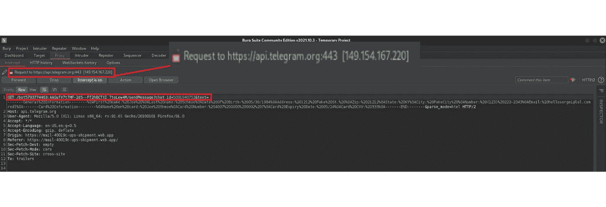
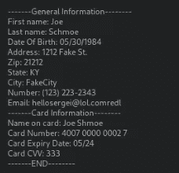

# 对一篇短信的分析

> 原文：<https://infosecwriteups.com/analysis-of-a-smishing-text-2898a49e673d?source=collection_archive---------0----------------------->

# **简介**

这篇博文将会和我在这里发表的大部分内容有很大的不同，但是我想这可能会引起一些人的兴趣。简而言之，我最近收到了一条短信钓鱼信息，我仔细研究了一下，看看能发现什么。《牛津词典》将欺诈定义为“发送声称来自知名公司的短信，以诱使个人透露密码或信用卡号等个人信息的欺诈行为。”在我分析这个微笑尝试的过程中，我学到了一些有趣的东西，并从中获得了一些乐趣。这篇博文将介绍我在分析中采取的步骤，并解释一路上的发现。尽情享受吧！

# 分析

图一。发送包含 LinkedIn 内容链接的邮件。

所以这一切都是从一个陌生号码的短信开始的。快速浏览了一下，有几件事立刻引起了我的怀疑。1)陌生号码。我见过合法消息来自看起来像这样的奇怪号码的情况，但根据我的经验，来自像这样的号码的大多数未经请求的消息都是恶意的。2)该消息引用了来自 UPS 的包裹，该包裹无法投递，需要安排重新投递，但该链接显然来自 LinkedIn。3)与包裹递送相关的网络钓鱼和欺诈企图极为常见。在今天的时代，几乎每个人在任何一天都会收到一两个包裹。听说其中一个包裹需要安排重新投递，这引入了一种相关性和紧迫性，因为大多数人可能希望他们的包裹尽快被投递。这三件事让我 100%的相信这是一次微笑的尝试，但是止步于此又有什么乐趣呢？

我启动了 Kali Linux VM 并启动了 burpsuite，这样我就可以拦截、查看和修改恶意站点的 HTTP 请求。然后，我导航到短信中的链接，并立即被重定向到这个虚假的 UPS 页面，询问我的邮政编码。

图二。注意奇怪的网址。

在这里，我在 Virustotal 和 IPvoid 上查找了该网站的 IP 地址，这两个工具都显示该 IP 地址与网络钓鱼和垃圾邮件有关联，这种情况已经持续了大约 8 个月。[1]与这个假冒的 UPS 网站相关联的 IP 是一个[快速内容交付网络](https://www.fastly.com/products/cdn) (CDN)的一部分。使用 CDN 来掩盖真实来源是网络钓鱼和欺诈活动中常用的 TTP。这也使得屏蔽与活动相关的网站变得更加困难，因为屏蔽整个 CDN IP 也会屏蔽作为该 CDN 一部分的合法网站。因此，现在必须阻止该域名，但现在这种技术的问题是，对于攻击者来说，将恶意内容转移到新的域名相当容易。这就是网络犯罪和网络安全的猫捉老鼠游戏。

在输入一个假的邮政编码后，我被带到另一个页面，显示我虚构的包裹“暂停”，我可以选择安排重新递送。

图 3。指示包裹“搁置”的页面，并给受害者安排重新递送的选项。

当我点击按钮安排重新投递时，我被带到一个页面，在那里我可以输入姓名、出生日期、街道地址、城市、州、电话号码和电子邮件地址等信息。

图 4。安排“再交付”的表格

输入所有这些信息后，我被带到一个页面，在那里我可以输入信用卡信息来支付重新交付的费用。我输入了一些假的信息，并截获了里面有假卡信息的 HTTP GET 请求。这个 HTTP GET 请求将我在前面的表单中输入的所有信息发送到 Telegram secure messaging platform API，然后该 API 将这些信息发送到特定的 Telegram 组，网络犯罪分子正在那里等待受害者信息的流入。

图 5。受害者信息被发送到攻击者控制的电报组

图 6。格式化的受害者信息。这是电报组中的网络罪犯看到的信息

# **结论**

我对此很感兴趣，我希望你喜欢阅读这篇文章，甚至可能学到一些东西。就像大多数人一样，我偶尔会收到类似的网络钓鱼/垃圾邮件，但通常等我能够分析它们时，相关的基础设施已经被拆除了。对我来说幸运的是，这不是这一个的情况，但是我希望没有很多人被这个骗局所欺骗。如果你喜欢这篇文章，请再次光临！一个关注和分享将是超级赞赏，也欢迎反馈。

# 参考

[1][https://www . virus total . com/GUI/IP-address/199 . 36 . 158 . 100/community](https://www.virustotal.com/gui/ip-address/199.36.158.100/community)

## 来自 Infosec 的报道:Infosec 每天都有很多内容，很难跟上。[加入我们的每周简讯](https://weekly.infosecwriteups.com/)以 5 篇文章、4 条线索、3 个视频、2 个 GitHub Repos 和工具以及 1 个工作提醒的形式免费获取所有最新的 Infosec 趋势！