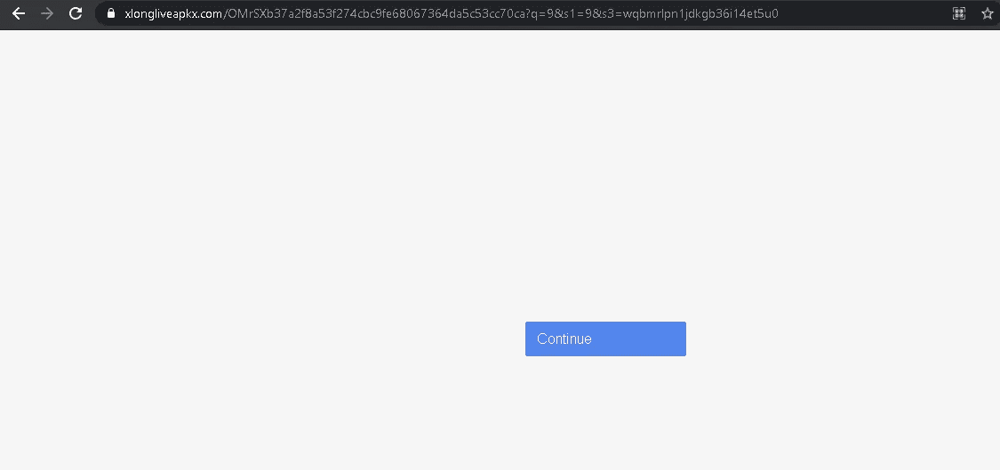
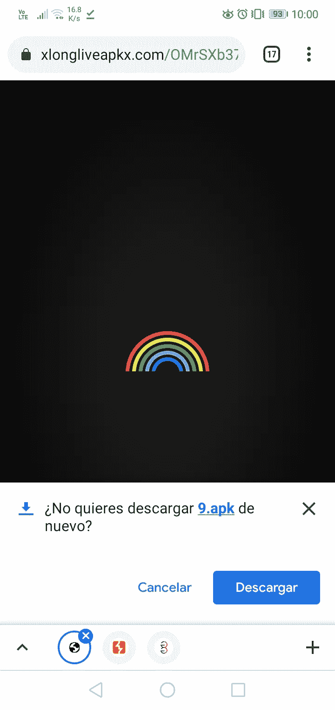
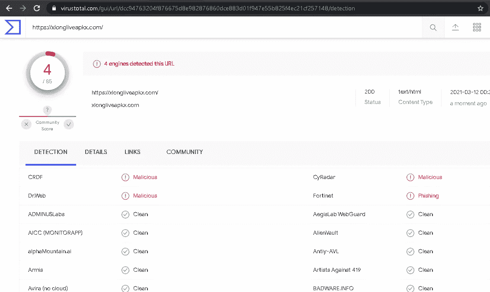
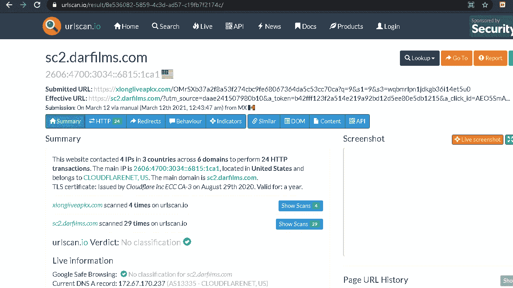
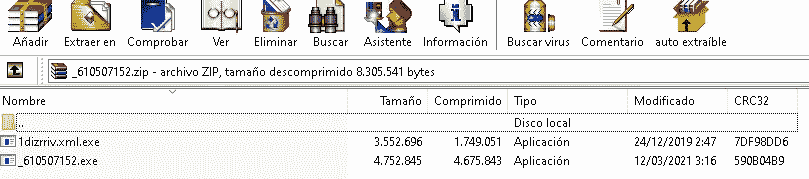
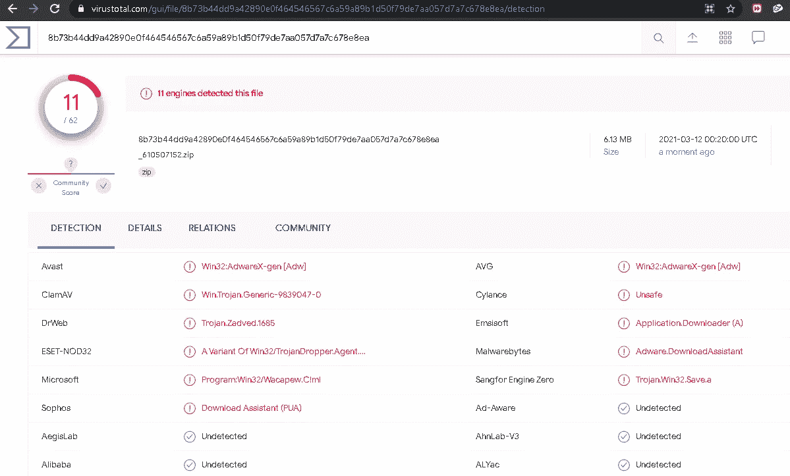
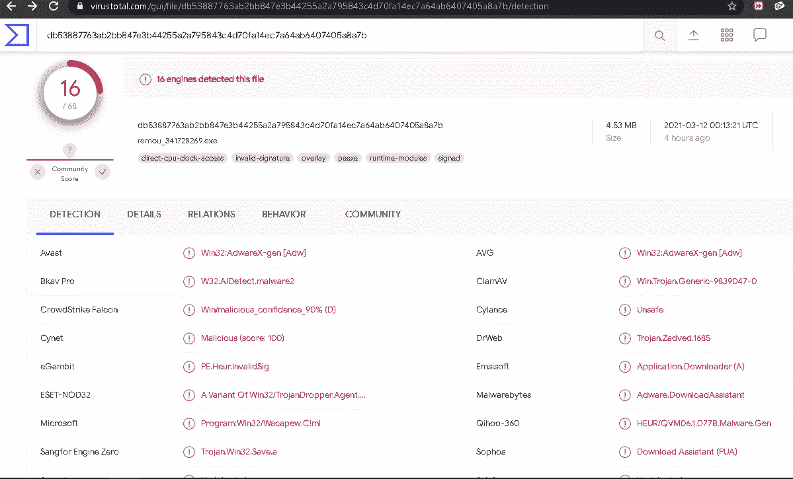
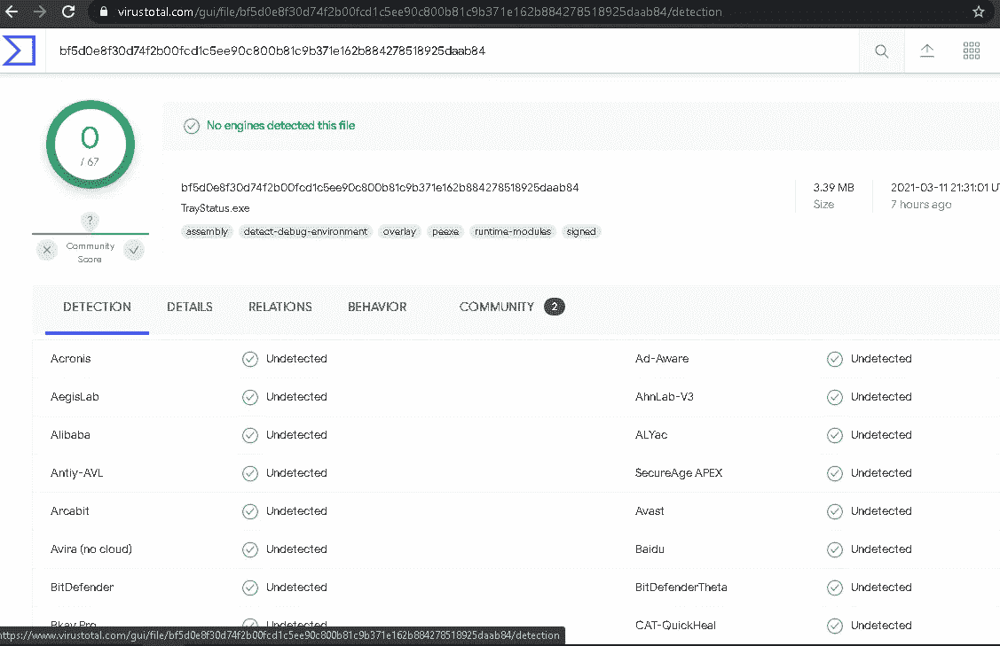
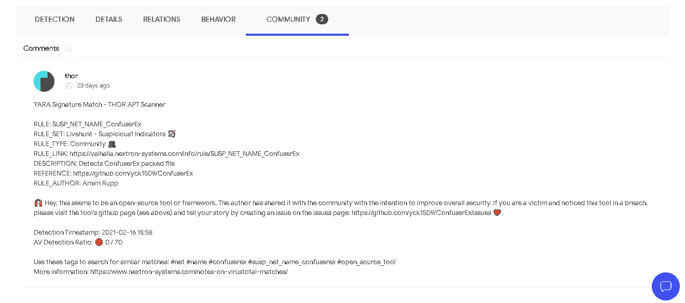
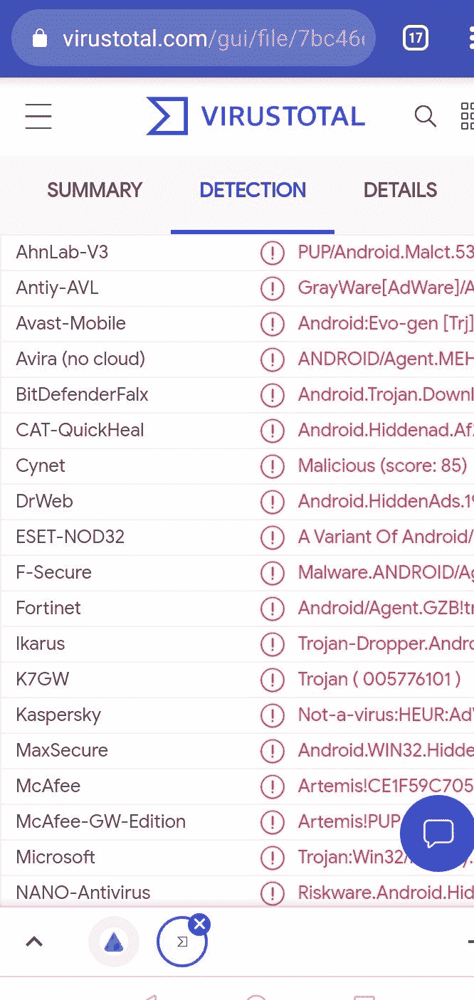

# 分析恶意网站

> 原文：<https://infosecwriteups.com/analyzing-a-malicious-site-9fb8730be51b?source=collection_archive---------1----------------------->

如今，知道如何从官方网站中识别恶意网站是至关重要的，由于欺诈网站背后的艰苦工作，这变得越来越困难。

在本文中，我们将分析一些专门为移动设备和个人电脑传播恶意软件的恶意网站。

## 什么是恶意网站？

> 恶意链接是一个看似可靠的“链接”，当点击它时，会重定向到一个模仿合法官方网站的虚假网站。一旦用户认为他们正在浏览一个可信的网站，他们就可以输入个人数据，如电子邮件、密码甚至银行信息。
> 
> 恶意链接经常出现在电子邮件中，要求用户点击“链接”。通过这种方法，在许多情况下，他们不是要求用户提供个人数据，而是让受害者在他们的设备上安装某种类型的“恶意软件”。
> 
> [https://www . BBVA . com/es/que-son-los-enlaces-maliciosos-y-como-protegerse-ante-esta-amenaza/](https://www.bbva.com/es/que-son-los-enlaces-maliciosos-y-como-protegerse-ante-esta-amenaza/)

我们要分析的第一个站点是:

[https://xlongliveapkx . com/OMR XB 37 a2 F8 a 53 f 274 CBC 9 Fe 68067364 da 5 c 53 cc 70 ca？q = 9&S1 = 9&S3 = wqbmrlpn 1 JDK GB 36 I 14 et 5 u 0](https://xlongliveapkx.com/OMrSXb37a2f8a53f274cbc9fe68067364da5c53cc70ca?q=9&s1=9&s3=wqbmrlpn1jdkgb36i14et5u0)

当通过 PC 进入时，我们会发现以下内容:

当使用手机进入时，在本例中是 android，我们会发现以下内容:

为了开始分析，我将首先推荐两个我对此类案例经常使用的网站:

病毒总数

 [## 病毒总数

### 病毒总数

VirusTotalwww.virustotal.com](https://www.virustotal.com/) 

UrlScan

 [## urlscan.io

### urlscan.io 用于可疑和恶意 URL 的网站扫描器

urlscan.io](https://urlscan.io/) 

有了推荐的网站，我们可以分析网站，看看是否已经有它们的记录，找出是否发现任何与它们相关的恶意活动，我们还可以扫描文件，看看它们是否是一种恶意软件。

之前我已经搜索过这个页面，所以已经有记录了:

 [## 病毒总数

### 病毒总数

VirusTotalwww.virustotal.com](https://www.virustotal.com/gui/url/dcc94763204f876675d8e982876860dce883d01f947e55b825f4ec21cf257148/detection) 

从结果中可以看出，有 3 个结果将其标记为可疑，1 个结果直接将其检测为网络钓鱼。

UrlScan 的结果:

 [## sc2.darfilms.com—urlscan . io

### 提交的 URL: https://…

urlscan.io](https://urlscan.io/result/8e536082-5859-4c3d-ad57-c19fb7f2174c/) 

在 urlscan 结果中，我们意识到我们被重定向到另一个恶意网站。

从一台电脑(在这种情况下，我使用的是 windows 10)进入该网站后，它会自动下载一个. zip 文件，我已经在 virustotal 中保存了该文件，结果如下:

 [## 病毒总数

### 病毒总数

VirusTotalwww.virustotal.com](https://www.virustotal.com/gui/file/8b73b44dd9a42890e0f464546567c6a59a89b1d50f79de7aa057d7a7c678e8ea/detection) 

在那里面。zip，我们找到两个文件，它们也已经在 virustotal 数据库中:

 [## 病毒总数

### 病毒总数

VirusTotalwww.virustotal.com](https://www.virustotal.com/gui/file/db53887763ab2bb847e3b44255a2a795843c4d70fa14ec7a64ab6407405a8a7b/details) 

第一个名为“_610507152.exe”的文件被检测为恶意软件 16 次。

第二个似乎没有以任何方式被检测到，它似乎是一个“可靠”的文件…..但是，如果我们意识到这一点并进一步分析，我们可以看到在社区部分有一些注释:

通常与信号相比:

> YARA 签名赛—雷神 APT 扫描仪
> 
> RULE:SUSP _ NET _ NAME _ ConfuserEx
> RULE _ SET:live hunt—可疑 1 指标🏹
> 规则类型:社区👥
> RULE _ LINK:[https://Valhalla . nextron-systems . com/info/RULE/SUSP _ NET _ NAME _ ConfuserEx](https://valhalla.nextron-systems.com/info/rule/SUSP_NET_NAME_ConfuserEx)描述:检测 ConfuserEx 打包文件
> 参考:[https://github.com/yck1509/ConfuserEx](https://github.com/yck1509/ConfuserEx)
> RULE _ 作者:阿尼姆·鲁普
> 
> 🙌哎，这好像是一个开源的工具或者框架。作者将其与社区共享，旨在提高整体安全性。如果你是一个受害者，并注意到这个工具有漏洞，请访问该工具的 github 页面(见上)，并通过在问题页面上创建一个问题来讲述你的故事:[https://github.com/yck1509/ConfuserEx/issues](https://github.com/yck1509/ConfuserEx/issues)💖。
> 
> 检测时间戳:2021–02–16 18:58
> AV 检测率:🔴 0 / 70
> 
> 使用这些标签搜索相似的匹配:# net # name # confuserex # susp _ net _ name _ confuserex # open _ source _ tool
> 更多信息:[https://www . nextron-systems . com/notes-on-virus total-matches/](https://www.nextron-systems.com/notes-on-virustotal-matches/)
> 
> [**雷神**](https://www.virustotal.com/gui/user/thor/comments)

显然，这个用户认出了这个文件，并给出了这个程序是一个框架的一部分的通知。

另一方面，当作为 android 用户进入时。下载 apk 文件，被认定为安卓恶意软件。

## 现在，我们如何确保我们的 android 上没有恶意软件？

*   不管你用的是什么应用，你总是会看到广告。
*   你安装一个应用程序，然后图标立即消失。
*   你的电池消耗得比平时快得多。
*   你在手机上看到你不认识的应用。

这些都是令人担忧的迹象，意味着你需要进一步调查。

对我来说，一切都取决于这一刻。现在轮到你了..

## 你见过这种类型的网页吗？