# 分析一次雷姆科斯鼠感染

> 原文：<https://infosecwriteups.com/analyzing-a-remcos-rat-infection-5c9b6bfd7139?source=collection_archive---------3----------------------->

信用:breakingsecurity.net

欢迎光临！今天我将写一些我最近做的恶意软件分析。我在 Brad Duncan 的网站上看到了一个帖子([https://www . malware-traffic-analysis . net/2022/01/04/index . html](https://www.malware-traffic-analysis.net/2022/01/04/index.html))，其中提供了一些关于 Remcos RAT(远程访问木马)感染的信息，该感染源自一个启用了恶意宏的 excel 文档。Remcos 最初旨在作为 IT 人员控制/管理计算机的合法工具，但由于其预先打包的性质，它已被威胁行为者广泛滥用。

我决定自己挖进去做一些分析，纯粹是为了自己的学习和体会。

# 妥协的指标(国际奥委会的)

*   HTTP GET 请求—64.188.19.241:80—atcn.jpg
*   HTTP GET 请求—104.223.119.167:80—calient.jpg
*   HTTP GET 请求—13.107.42.13:80—misc . VBS
*   TLS 加密流量—79.134.225.79:10174—shiestynerd.dvrlists.com
*   sha 256:b1df 072 EBA 923 c 472 e 461200 b 35823 FDE 7 f 8 e 640 bfb 468 ff 5 AC 707369 a2 fa 35 e
*   sha 256:95 c 0 a 9 e 6463 a2 EB 1 bbfe 3198 CD 4b 6 CD 74927 a 209 ca 4 ab 17501 c2f 444494 f 4499
*   sha 256:df6b 921 e5b 1379747 C4 ab 66 ad 27 cc 729 f 387 bb 2c 7 C1 c 247 F3 c 7 BC 5c 9 e 3293 EC 3
*   sha 256:a 9 E4 bb 0982 f 850d 37 DCF 3079 d6f 631d 4d 8d 52d 79 f 552711 f 88410 ff 3a e9 DBD 1 a

# 技术分析

## **电子邮件&恶意 Excel 电子表格**

首先，我们要看一个 eml 文件(电子邮件)。这个文件将为我们提供大量的信息进行分析，包括附加的内容、电子邮件标题等。我们可以看到附件中有一个名为“付款汇款通知单 000000202213.xlsb”的文件。Content-Type 字段指示附件是启用宏的 Microsoft Excel 工作表，Content-Transfer-Encoding 字段指示数据是 base64 编码的。

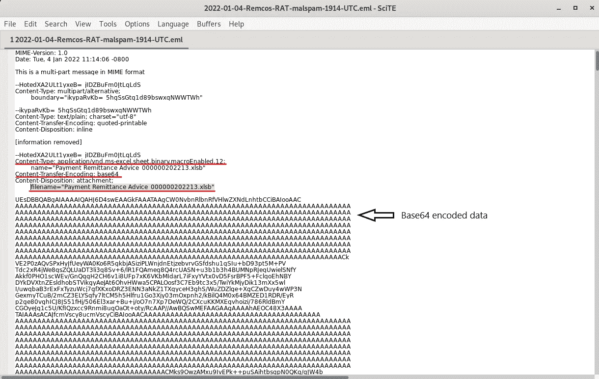

然后，我们可以将这些 base64 编码的数据复制到 cyberchef 中，并对其进行解码。这样做会显示更多的信息，比如文件头开头的“PK ”,表示一个 ZIP 存档文件。像 word 文档、powerpoints 和 excel 电子表格这样的 Microsoft office 文件实际上是由 ZIP 存档中的多个文件组成的。这和 Content_Types.xml 字符串一起表明这肯定是一个 excel 电子表格，就像电子邮件标题告诉我们的那样。

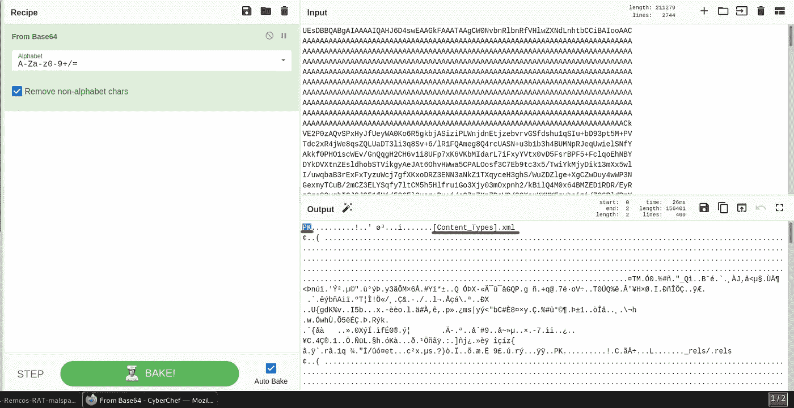

Base64 解码的附件数据。

同样使用 cyberchef，我们可以通过点击输出区域右上方的软盘图标来下载 excel 电子表格的副本。现在让我们获取电子表格的哈希值并提交给 virustotal。

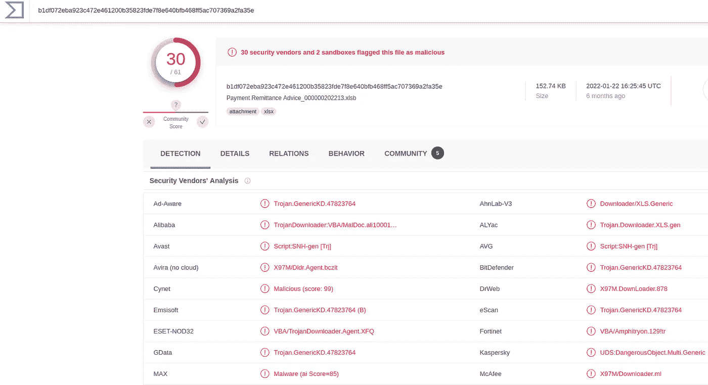

“付款汇款通知 _ 000000202213 . xlsb”excel 电子表格的虚拟总结果。

很明显，这是一个恶意文件，virustotal 上的 30 个供应商都这样认为。在这一点上，我们应该看到我们可以了解到电子表格中嵌入的宏的哪些信息，因为宏是实际包含恶意功能的组件。使用 OLEtools，我们可以很容易地了解这个宏是如何执行其恶意函数的。

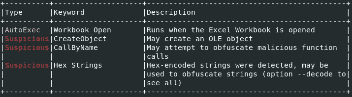

excel 电子表格中嵌入的恶意宏的 olevba 输出。

olevba 工具为我们提供了一些有用的信息，表明宏正在使用 AutoExec 函数在打开 excel 电子表格时自动运行。它还告诉我们，威胁参与者试图混淆宏的功能。

## **第一阶段**

我们还可以将这个 excel 电子表格提交到一个类似孵化分诊(【https://tria.ge/】T2)的沙盒中，以了解它的更多行为。

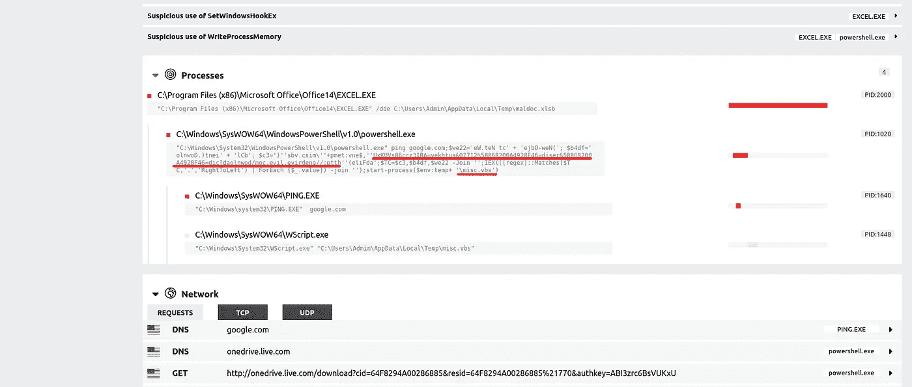

恶意 excel 电子表格的阴影筛选结果。

孵化分类的结果表明，excel 进程正在生成 powershell.exe 进程和 ping.exe 进程，这两个进程都不应该从 excel 中生成。威胁者正在使用 powershell 脚本 ping google.com，以确保受害者机器有互联网连接。如果受害者确实有连接，那么脚本将下载并执行第一阶段有效负载，一个名为“misc.vbs”的文件。请注意，下载 misc.vbs 文件的命令使用反转文本进行了轻微的混淆，然后在脚本运行时取消反转。这是一种通过自动化工具来逃避静态检测的尝试，但是当被优秀的分析师观察时，它每次都会失败。

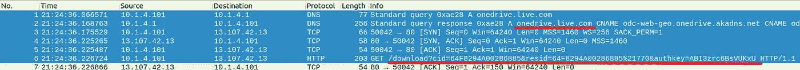

从 onedrive 下载“misc.vbs”的 HTTP GET 请求。

从上图中我们可以看到，受害者正在从 powershell 脚本中看到的 onedrive.live.com URL 下载 misc.vbs 文件。查看 misc.vbs 文件，我们可以看到它非常混乱，但是，我们可以从中提取一些信息。在文件的底部有一个带有十六进制编码参数的执行函数，该函数参数解码为第二阶段有效载荷的地址。

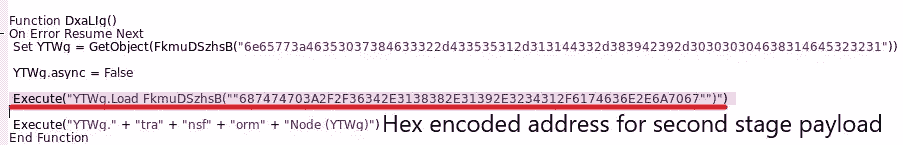

misc.vbs 中第二阶段有效负载的十六进制编码地址

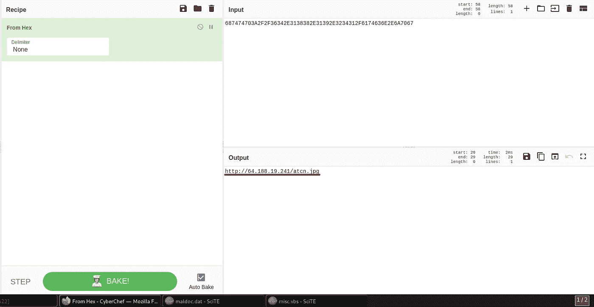

第二级有效载荷的解码地址。

此第一阶段有效负载还通过将第二阶段写入 Windows 注册表，在安装第二阶段之前为其建立持久性。

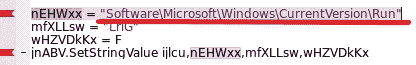

第二阶段是写入注册表以建立持久性

现在，即使受害者机器重新启动，威胁参与者仍将保持存在。

## **第二阶段**

此时，受害者已经伸手要求第二级有效载荷。请注意，下面的数据表示为 JScript 代码。然后，该 JScript 使用提供的十六进制编码的参数运行 powershell。

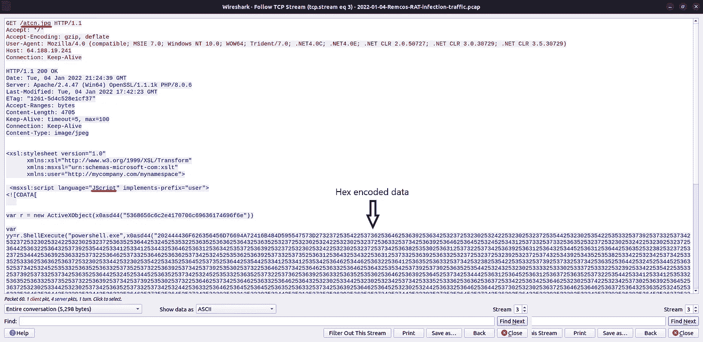

十六进制编码的 JScript 代码被伪装成 jpg 文件数据。

我们可以获取这些数据，用 cyberchef 对其进行解码，以了解其功能。

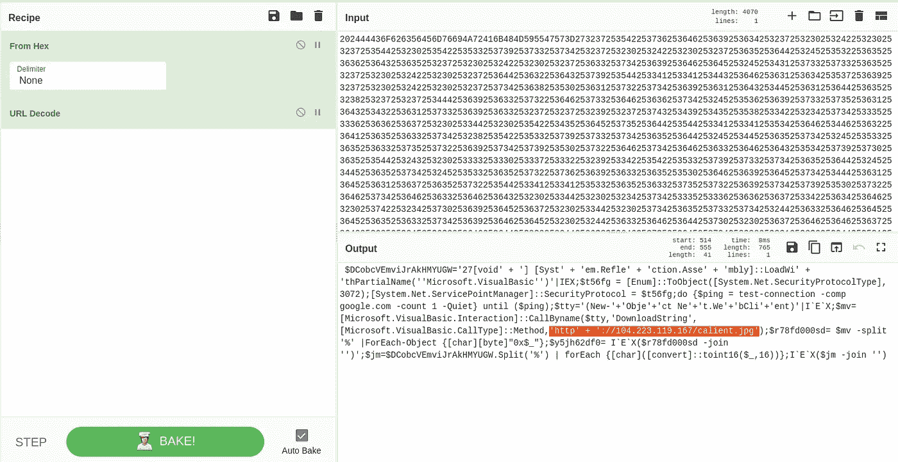

JScript 代码的十六进制解码。

如上图所示，powershell 脚本再次联系 104.223.119.167，这次是为了下载一个名为“calient.jpg”的文件。这个 calient.jpg 文件实际上是一个 javascript 文件，其中包含一个 DLL。这在一篇来自研讯([https://研讯. net/blog/2022/01/24/analysis-rem cos-RAT-dropper](https://inquest.net/blog/2022/01/24/analysis-remcos-rat-dropper))的文章中有描述，简而言之，这个 DLL 就是最终的 Remcos RAT 有效载荷。

## **命令&控制【C2】**

在安装了最终的 Remcos RAT 有效负载后，在受害机器和 IP 地址为 79.134.225.79 的域名“shiestynerd.dvrlists.com”之间可以观察到清晰的 C2 流量模式。

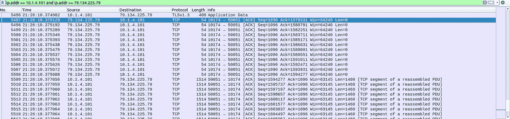

安装 Remcos RAT 后的 C2 交通。

该域名和 IP 地址被 virustotal 上的 11 家供应商识别为恶意域名。

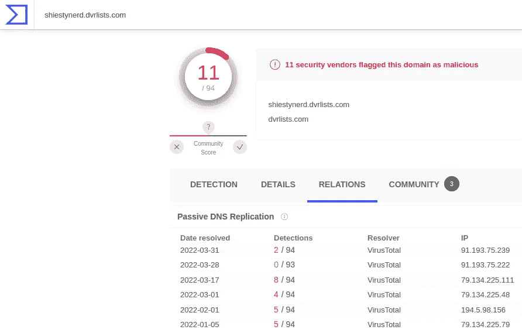

C2 域的病毒总数结果。

# 结论

谢谢你花时间阅读我的博文！我希望你喜欢它，并从中获得一些价值。如果你有，请关注我并分享这篇文章。此外，特别感谢来自研讯的 Dmitry Melikov，他的精彩文章详细介绍了一个非常相似的分析。早点回来！

*来自 Infosec 的报道:Infosec 上每天都有很多事情发生，很难跟上。* [***加入我们的每周简讯***](https://weekly.infosecwriteups.com/) *以 5 篇文章、4 个线程、3 个视频、2 个 Github Repos 和工具以及 1 个工作提醒的形式免费获取所有最新的 Infosec 趋势！*