# 用 Frida 分析 Android 加密过程

> 原文：<https://infosecwriteups.com/analyzing-android-encryption-processes-with-frida-a3ab2622fce9?source=collection_archive---------4----------------------->

移动应用程序通常使用 HTTP 协议与服务器通信。移动应用对会话、用户信息、特定于要执行的动作的参数进行加密，并通过 HTTP 协议传输到服务器，以便在代理软件干扰的情况下不被检测到。服务器解密加密的数据并继续处理。

本文是“Frida ile Android ifre leme i̇şlemlerini i̇nceleme”的英文翻译，用 Frida 分析 RSA 和 AES 加密。

# RSA 加密

为了更好地理解加密过程在 Android 应用程序中是如何执行的，将对**OWASP**[MSTG 黑客游乐场](https://github.com/OWASP/MSTG-Hacking-Playground) 应用程序进行分析。

在移动仿真器或设备上安装应用程序的 APK 文件后，应用程序会打开如下屏幕:

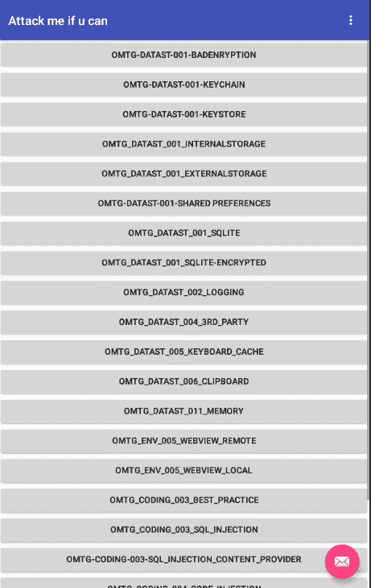

OWASP MSTG-黑客-游乐场

对于加密操作，需要登录到 **OMTG-DATAST-001-KEYSTORE** 模块。
登录模块后，打开以下页面:

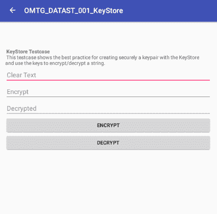

OWASP MSTG-黑客-游乐场 OMTG-DATAST-001-密钥库

当在 android 设备上分析该模块时，确定在“明文”字段中输入的值被再次加密和解密。

当使用“jadx-gui”工具分析 APK 文件时，执行“encrypt”加密过程的函数( **sg.vp.owasp_mobile。OMTG_Android。检测到 OMTG_DATAST_001_KeyStore** )。

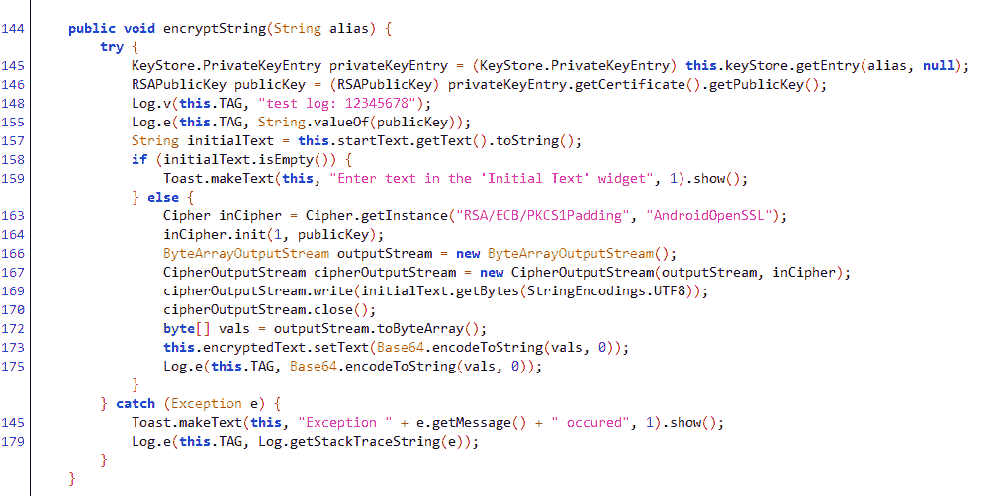

**sg.vp.owasp_mobile。OMTG_Android。OMTG_DATAST_001_KeyStore**

要逐行检查代码:

> 145–146:使用密钥库，可以获得 RSA 加密所需的“公钥”值。
> 157:从输入字段读取要加密的数据。
> 163:使用所需的参数创建了“密码”对象。
> 164:调用“Cipher”对象的“init”函数，执行加密操作。
> 166–173:获得的加密数据用 base64 编码并打印在屏幕和日志上。

执行加密的实际代码块位于第 163 和 164 行。

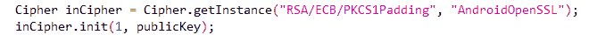

零

通过检查代码行顶部的行，可以获得从哪里导入“Cipher”对象。

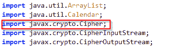

javax.crypto .密码

“Cipher”对象的源代码可从[http://Hg . open JDK . Java . net/jdk8u/JDK/file/tip/src/share/classes/javax/crypto/Cipher . Java](http://hg.openjdk.java.net/jdk8u/jdk8u/jdk/file/tip/src/share/classes/javax/crypto/Cipher.java)获得。

使用 Frida，可以通过挂钩“init”函数来分析加密过程。要挂钩“init”函数，首先必须确定函数的参数。当检查以上 URL 中的源代码时，已经确定“init”函数因不同的值而“过载”。该应用程序在其第一个参数中采用类型为“int”的键值，在其第二个参数中采用类型为“RSAPublicKey”的键值。

当分析重载函数时，可以用调用“init”函数的代码的参数来确定运行的函数。

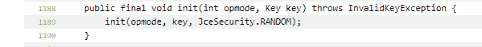

javax.crypto.Cipher.init

必要的参数确定后，就可以用 frida 来挂接函数了。

当运行 frida 代码时，应用程序和 Frida 界面的输出如下图所示。

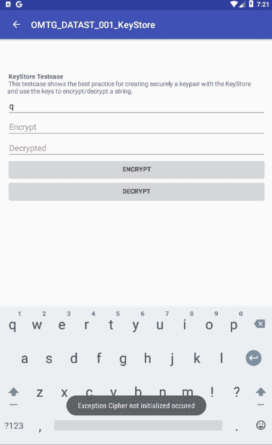

OWASP MSTG-黑客-游乐场 OMTG-DATAST-001-密钥库

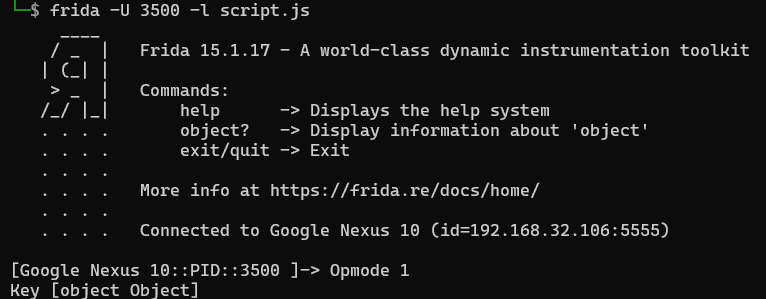

弗里达接口

“init”函数已成功挂钩，但应用程序抛出了一个错误，因为在挂钩时没有执行该函数要执行的操作。为了防止这种情况，可以编写下面的 frida 代码。

上面的代码将再次调用 init 函数并运行操作。通过这种方式，它的功能被连接起来，操作可以在不干扰流程的情况下继续进行。

在这个步骤之后，可以调用“javax.crypto.Cipher”对象的所有函数，并且可以检索必要的信息。例如，调用“getOpmodeString”函数的 frida 代码:

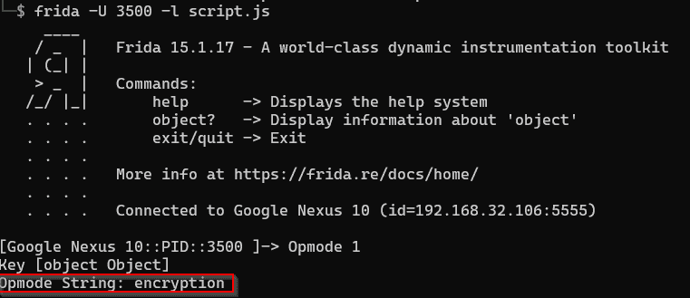

弗里达接口

加密算法也可以通过使用相应 Java(“javax . crypto . cipher”)对象的“getAlgorithm”函数来获得。

要获得“Key”值，应该分析“java.security.Key”类的源代码:

“Key”值可以通过使用[https://Hg . open JDK . Java . net/jdk8u/jdk8u/JDK/file/7 fcf 35286d 52/src/share/classes/Java/security/Key . Java](https://hg.openjdk.java.net/jdk8u/jdk8u/jdk/file/7fcf35286d52/src/share/classes/java/security/Key.java)对象的“getEncoded”方法获得。用于获取“关键”值的弗里达代码:

下面给出了上述 frida 代码的输出。

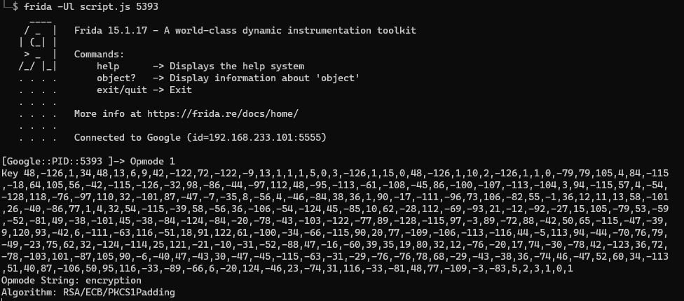

弗里达接口

当检查“java.security.Key”对象时，可以理解相关函数返回一个字节数组:

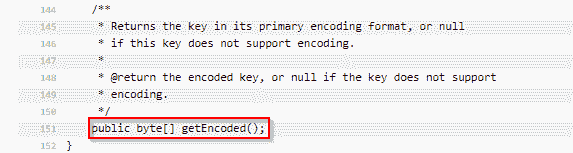

javax.crypto .密码

为了使字节数组更容易理解，可以使用 java 语言的“java.util.Base64”对象的函数:

弗里达接口

# AES 加密

“AES/CBC”加密算法通常用于在移动应用中加密服务器和客户端之间的数据。在 https://github.com/Serhatcck/android_aes_encryption[T3 分析 android 应用程序将有助于理解相关算法是如何工作的。](https://github.com/Serhatcck/android_aes_encryption)

当应用程序安装在 android 设备上时，它会打开一个简单的界面。

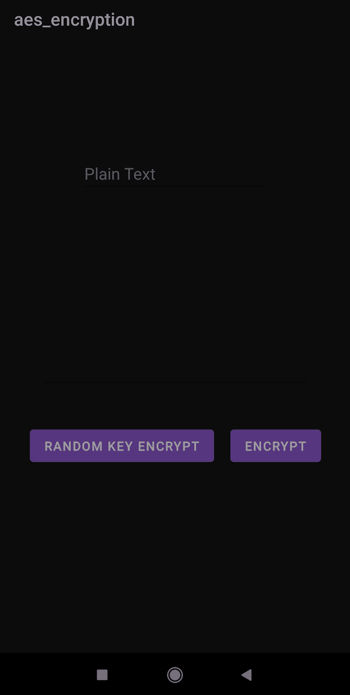

serhatcck/Android _ AES _ encryption

当使用应用程序上的按钮执行加密过程时，会出现两种不同的情况。当点击“随机密钥加密”按钮时，每次交易都会显示不同的值。当点击“加密”按钮时，加密的数据是相同的。

当分析应用程序的源代码时，已经确定匹配“随机密钥加密”按钮的函数在每次操作中产生不同的“IV 秘密”和“秘密密钥”值。

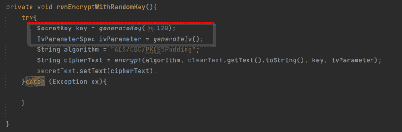

serhatcck/Android _ AES _ encryption

现已确定，与“加密”按钮匹配的函数只产生一次“IV 秘密”和“秘密密钥”值。

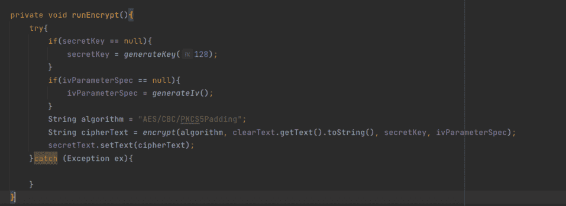

serhatcck/Android _ AES _ encryption

当检查应用程序的源代码时，已经确定执行加密过程的函数是“加密”函数:

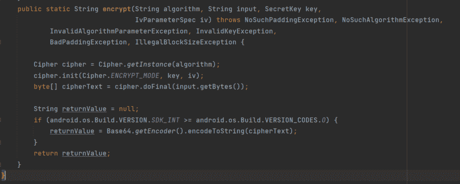

serhatcck/Android _ AES _ encryption

如上图所示，该应用程序使用了“javax.crypto.Cipher”对象的三变量 init 函数。

以下代码块可用于将相关函数与 frida 挂钩。

挂钩函数后，我们可以用下面的 frida 代码获得关于函数的信息:

当上面的代码块运行时，它将输出如下内容:

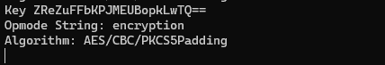

弗里达接口

可以成功获取“密钥”值，但无法获取“Iv 密钥”值。“javax . crypto . spec . ivparameterspec”对象也必须被挂钩，以便获得“Iv Key”值。当分析应用程序中的源代码时，已经确定创建“Iv Key”值的函数是采用单字节数组作为参数的函数:

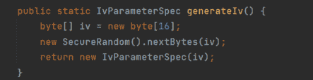

serhatcck/Android _ AES _ encryption

用于挂钩上述函数的 frida 代码如下所示:

Frida 代码的输出如下。

弗里达接口

重要的一点是，虽然“Iv Key”值总是在按下“RANDOM KEY ENCRYPT”按钮时输出，但只有在第一次按下“ENCRYPT”按钮时才会给出。由于“加密”按钮所连接的功能每次都不会创建新的“Iv 键”值，因此“$init”功能不会被触发，并且“Iv 键”值不会显示在输出中。

通过使用获得的“秘密密钥”和“Iv 密钥”值，发送的密文可以被解码或者任何期望的文本可以被加密。

可以更改相关的 frida 代码，以提供更详细的信息:

相关 Frida 代码的输出如下图所示:

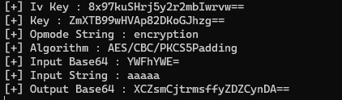

弗里达接口

你可以在 https://codeshare.frida.re/@Serhatcck/java-crypto-viewer/的[得到一个更加定制化的弗里达代码版本。](https://codeshare.frida.re/@Serhatcck/java-crypto-viewer/)