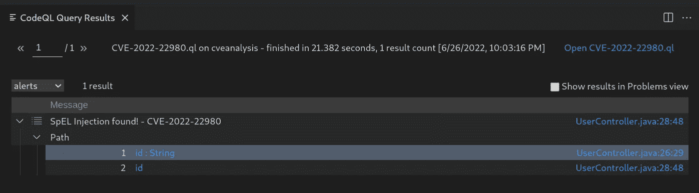
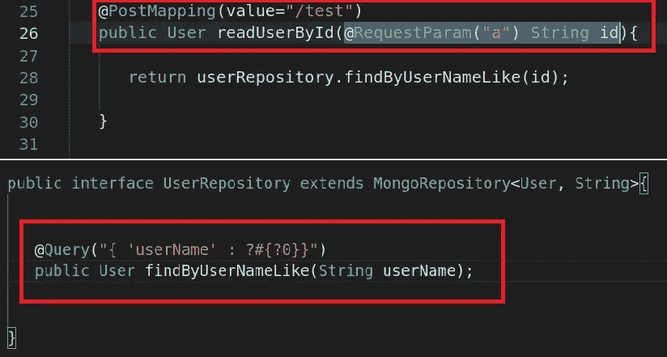
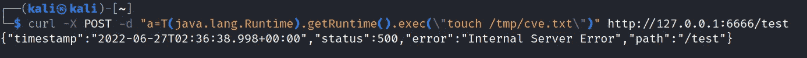
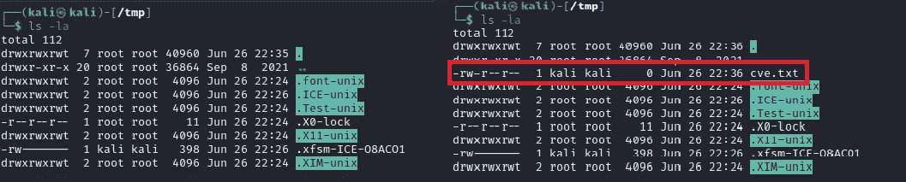

# 分析 CVE-2022–22980，用 CodeQL 发现源代码审查过程中真正可利用的途径

> 原文：<https://infosecwriteups.com/analyzing-cve-2022-22980-to-discover-a-real-exploitable-path-in-the-source-code-review-process-with-145d97717656?source=collection_archive---------0----------------------->


# 介绍

在这篇文章中，我将带你开始一段旅程，开始分析 CVE-2022–22980，并提取该漏洞的模式，以查询代码库来发现真正的利用途径。

虽然许多漏洞扫描工具在检测应用程序中易受攻击的组件方面功能强大，但其中一些工具无法证明漏洞是否可被威胁利用。

作为这项任务的强大盟友，有 [CodeQL](https://codeql.github.com/) 。这是一个来自 GitHub 的语义代码分析引擎开源软件，可以像查询数据一样查询你的代码库。因此，它是一个至关重要的工具，允许我们在整个源代码中搜索漏洞的模式。

在创建过程中，可以细化查询，直到只发现可利用的路径，这将在本文中演示。

# CVE 分析-2022–22980

在阅读一些安全漏洞公告时，CVE-2022–22980 引起了我的注意。它讨论了 Spring Data MongoDB 中表达式语言注入的一个修复，该修复可能导致远程代码执行。

因此，回顾 VMWare 发布的[公告，我们发现了一些可能导致易受攻击情形的要点。](https://tanzu.vmware.com/security/cve-2022-22980)

> **用@Query 或@Aggregation 注释存储库查询方法**
> 
> **带注释的查询或聚合值/管道包含在表达式**中使用参数占位符语法的 SpEL 部分
> 
> **用户提供的输入未被应用程序清理**

满足这些条件并在 3.4.0、3.3.0 到 3.3.4 以及更早的不受支持的版本中使用 Spring 数据 MongoDB，应用程序很容易出现漏洞。因此，下一步将把这些条件转换成一种模式，并构建一个 CodeQL 查询来搜索整个代码库。

# 构建 CodeQL 查询

构建该查询的第一步是确定应用程序使用哪些用户输入。所以`RemoteFlowSources`是这个任务的一个好点。它是由 CodeQL 定义的类，映射远程用户输入的数据流源。

因此，在这个查询的第一部分，我们需要进行导入，并定义源等于远程流源。

```
/**
 * [@kind](http://twitter.com/kind) path-problem
 */
import java
import semmle.code.java.dataflow.FlowSources
import semmle.code.java.dataflow.DataFlow
import DataFlow::PathGraphclass MyConf extends DataFlow::Configuration {
  MyConf() { this = "MyConf" }

  override predicate isSource(DataFlow::Node source) {
    exists(RemoteFlowSource remote | source.asParameter() = remote.asParameter())
  }
```

一旦定义了哪些是源，就该构建查询的接收部分了。在这一部分，必须满足可开发的条件。因此，定义了三个变量来进行这一阶段。一个用于分配了注释的方法，另一个用于注释的名称，最后一个用于查找对分配了注释的方法的访问。

定义变量后，有必要执行条件操作来找到正确的接收器。首先，比较方法注释是否等于我们定义的注释，然后比较注释是否等于查询或聚合，然后通过正则表达式在注释中搜索包含`?[0-9]`的值，最后定义对方法的访问必须等于我们定义的方法，并且该访问的参数必须等于我们的接收器。

```
override predicate isSink(DataFlow::Node sink) {
    exists(Method c, Annotation ann, MethodAccess ma | ann = c.getAnAnnotation() and (ann.toString() = "Query" or ann.toString() = "Aggregation") and ann.getAValue().toString().regexpMatch(".*\\?[0-9].*")
and ma.getMethod() = c and ma.getAnArgument()
 = sink.asExpr())
  }
```

在查询结束时，连接我们构造的查询的所有点的部分被定义。最终的查询如下所示:

```
/**
 * [@kind](http://twitter.com/kind) path-problem
 */
import java
import semmle.code.java.dataflow.FlowSources
import semmle.code.java.dataflow.DataFlow
import DataFlow::PathGraphclass MyConf extends DataFlow::Configuration {
  MyConf() { this = "MyConf" }

  override predicate isSource(DataFlow::Node source) {
    exists(RemoteFlowSource remote | source.asParameter() = remote.asParameter())
  }override predicate isSink(DataFlow::Node sink) {
    exists(Method c, Annotation ann, MethodAccess ma | ann = c.getAnAnnotation() and (ann.toString() = "Query" or ann.toString() = "Aggregation") and ann.getAValue().toString().regexpMatch(".*\\?[0-9].*")
and ma.getMethod() = c and ma.getAnArgument()
 = sink.asExpr())
  }
}from MyConf conf, DataFlow::PathNode source, DataFlow::PathNode sink
where conf.hasFlowPath(source, sink)
select sink, source, sink, "SpEL Injection found! - CVE-2022-22980"
```

# 在 CodeQL 中执行查询

在这个阶段，我们使用了为这个安全问题设计的[易受攻击的公共应用程序](https://github.com/li8u99/Spring-Data-Mongodb-Demo)，它将作为我们的代码库。因此，CodeQL 数据库是从已定义的代码库创建的。

```
codeql database create cveanalysis --language=java
```

一旦创建了数据库，就可以将它导入到 VSCode 的 CodeQL 扩展中来运行我们的查询了。


数据库导入和查询完成后的 VSCode

在选择了最近上传的数据库之后，就该转到 Java 选项卡中 CodeQL 的 VSCode 工作区，并使用我们的查询编辑默认模板了。最终可以在代码库中运行我们的查询。



查询执行的结果

可能的观点是，此代码库中存在可利用漏洞的真实路径。有一种可能的观点认为，在这个代码库中存在一个真正的漏洞利用途径。结果给出了源、漏和中间步骤(如果有的话)。在这种情况下，在源和接收器之间有一个简单的路径。



源和汇

# 验证可利用的路径

如前面步骤中所述，此漏洞在其/test 端点中接收一个参数，并将其传递给易受攻击的函数。如前面步骤中所述，该漏洞在其 ***/test*** 端点上接收一个 **POST** 参数，并将其传递给易受攻击的函数。所以通过运行下面的命令，漏洞就实现了:



带有恶意负载的 cURL 命令

这样，我们就可以确定该文件是在临时目录中创建的，并且实现了远程代码执行。



代码执行前后

# 结论

一旦某个漏洞影响了风险管理流程，确定该漏洞在您环境中是否可被利用也很重要。

CodeQL 是一个强大的工具，可以帮助检测源代码中真正可利用的路径，无论是漏洞扫描器的警报还是寻找新漏洞的安全研究。

我希望这篇文章可以帮助任何人寻找关于 CodeQL 和安全代码审查的资源。