# 用软件无线电分析无线电信号

> 原文：<https://infosecwriteups.com/analyzing-radio-signals-with-software-defined-radio-77b349142c8b?source=collection_archive---------0----------------------->

在这篇文章中，我将分享如何着手分析空中传输的无线电信号。如果您试图找出您可能拥有的设备的弱点，这将非常有用。作为概念验证(PoC)的一部分，我购买了一个门铃，它由一个发射器和一个接收器组成，以 433 MHz 的频率进行通信。我将详细说明使用软件手段执行重放攻击和分析解调信号的思维过程。

视频 1:使用 SDR 重放攻击

## 所需工具

要完成此演示，您需要以下工具:

*   软件定义的无线电外围设备(例如 HackRF、USRP 等)。)
*   GNU 无线电软件
*   Audacity 软件
*   通用无线电黑客(URH)软件
*   以 433 MHz 传输的设备(例如门铃)

## 什么是无线电波？

引用自 [livescience](https://www.livescience.com/50399-radio-waves.html) 网站，无线电波是一种电磁辐射，因其在通信技术中的应用而广为人知，如电视、手机和收音机。这些设备接收无线电波，并将其转换为扬声器中的机械振动，从而产生声波。无线电波的频率范围从不到 3 千赫到 300 千赫。

## 软件定义无线电是如何出现的？

软件定义无线电(SDR)是一种无线电通信系统，其中传统上以硬件实现的组件改为通过软件实现。它有助于模拟下变频和解调的转换，并将其作为数字信号进行处理，以供进一步分析——这对无线电黑客攻击非常重要！

市场上有几种 SDR 外设，价格从 10 美元到数千美元不等。这些设备的功能因其支持的频率范围和多通道并发运行的能力而异。因此，在根据您的需求购买这些 SDR 外设之前，检查它们的功能是非常重要的。

## 开始—确定目标设备使用的频率

执行无线电窃听的第一步是识别设备使用的频率。如上所述，无线电波的范围可以从 3kHz 到 300GHz，因此，手动观察整个频率范围是不可行的。

对于这个概念验证，我从一个在线电子商务网站购买了一个门铃发射器和接收器。从卖方的描述中可以看出，该设备正在以 433 MHz 进行通信。或者，如果一种产品在美国销售，所有制造商都需要向联邦通信委员会(FCC)申报该设备的基本细节，例如它使用的频率。只需识别设备标签上的 FCC 标识符，并在 FCC [网站](https://fccid.io/)上进行搜索。

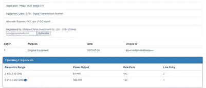

图 1:飞利浦 Hue Bridge 上的搜索结果示例

我开始通过尝试收听 433MHz 频率来验证卖家的描述是否属实。为此，启动 GNU-Radio Companion。第一步是确保将采样速率(左上角-> samp_rate)修改得足够高，以捕捉更高的输出频率。其次，添加一个源块和必要的 QT GUI 接收器，用于可视化。在我的例子中，我添加了一个 UHD: USRP 源，因为我使用的是 USRP B200。如果您使用的是 HackRF，请使用 osmocom 源代码。

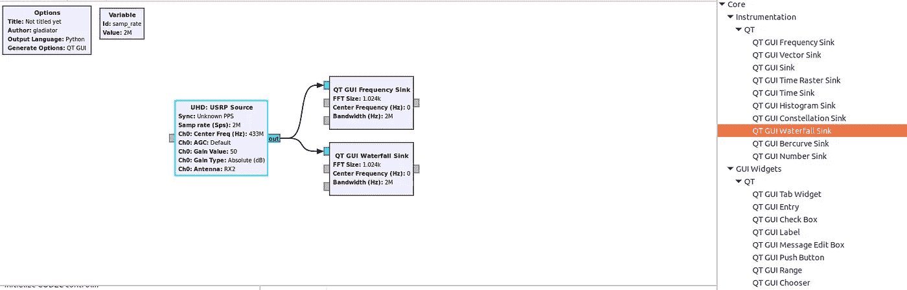

图 2:监听 433 MHz 频率的流程图


图 3:在 USRP 源上将中心频率设置为 433 MHz

将流程图保存在您的文件系统中，并尝试执行流程。

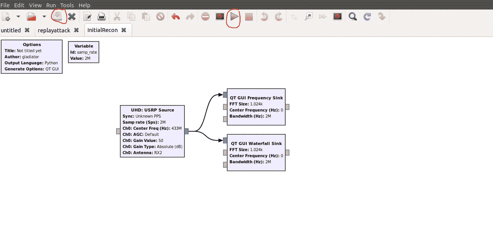

图 4:保存并执行流程图

如果流程图中没有错误，您应该能够执行和观察可视化图表。当我按下门铃按钮时，频率表会显示一个峰值，瀑布图上会有红色强度标记。这基本上证明了我们正在正确的频率范围上侦听，并且我们可以确定该设备正在 433.921 MHz 频率上通信。

视频 2:流程执行时按门铃发射器

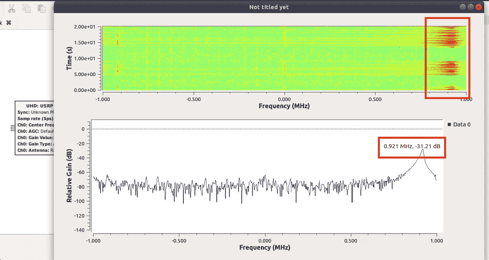

图 5:瀑布图上的红色强度标记和按下门铃时的峰值频率

## 检查设备是否容易受到重放攻击

重放攻击是一种事件，攻击者可以捕获空中的无线电波并重放无线电波，以触发与之前执行的相同的操作。例如，想象一下，如果您按下汽车钥匙链上的解锁按钮，如果攻击者能够嗅探到无线电波通信，这可能会允许攻击者打开您的车门。

在大多数情况下，市场上的这种简单或其他智能设备可能没有任何控制来防止重放攻击。为了验证这个假设，让我们用下面的流程和设置在 GNU-Radio Companion 中创建新的流程。

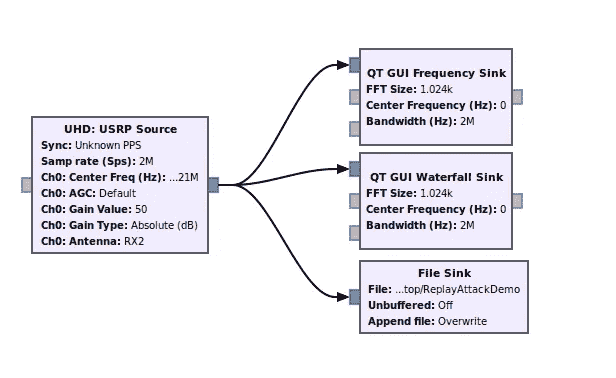

图 6:监听 433.921 MHz 频率并将无线电波保存到文件(文件接收器)的流程图

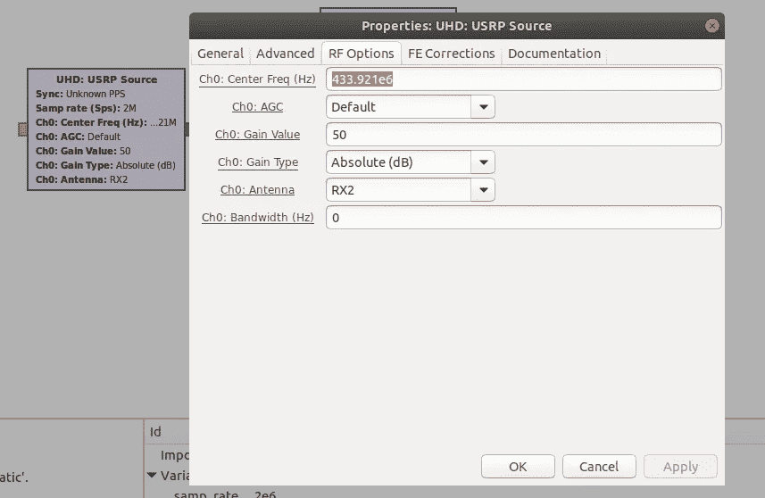

图 7:修改 USRP 源以监听识别的频率。

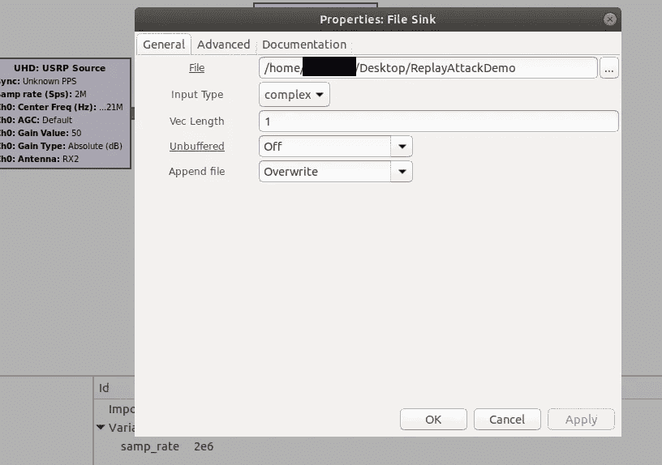

图 8:修改“文件”属性以指示保存的无线电波的位置

在 GNU radio 中保存并执行流程图。触发几次门铃后，关闭窗口，无线电波的输出将保存在文件接收器指示的位置。

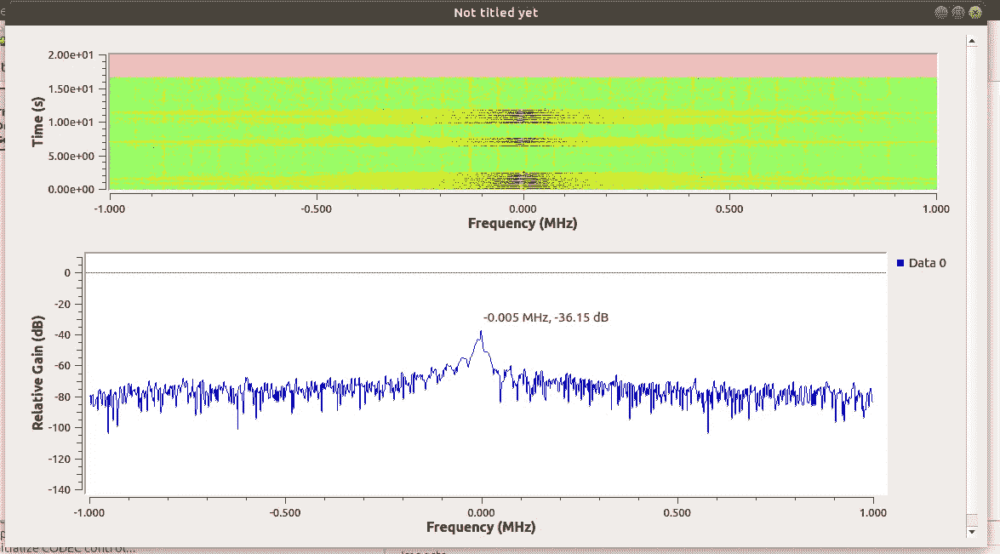

图 9:按下门铃时的图表输出

现在，是时候重播无线电波了。使用如图 10 所示的块创建一个新的流程图。如果你正在使用 USRP 块，重要的是要注意“增益值”对这种攻击的成功至关重要。调谐 USRP(即改变其频率)时，可能还需要调整增益级。由于物理条件的限制，在不同的频率下并不总是(或不可能)获得相同的输出功率。这意味着重新调谐时，输出功率可能会有所不同。在我的设置中，我使用的增益值为 50。

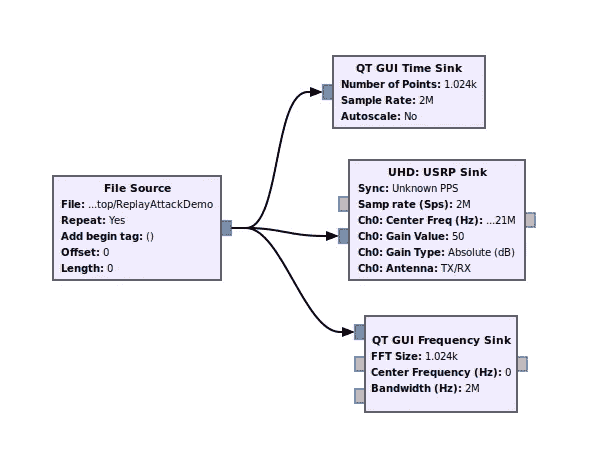

图 10:重放攻击的流程图

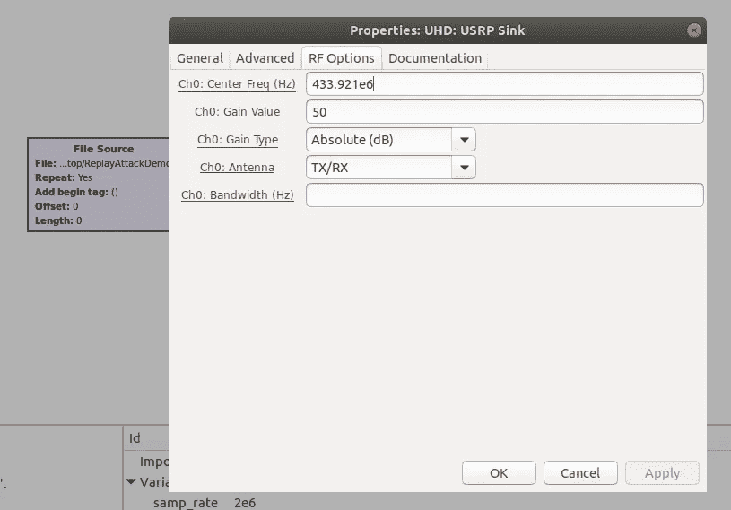

图 11:在 USRP 接收器中设置中心频率和增益值

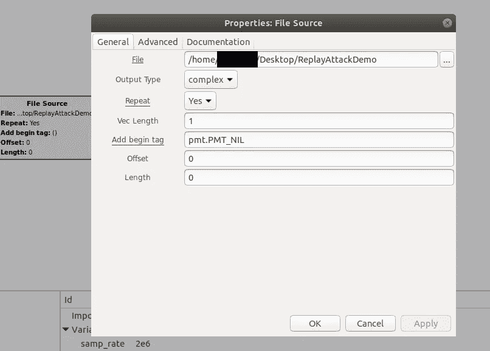

图 12:如前所述设置无线电波文件位置

保存并执行流程图。重放攻击有效！

## 清理无线电波以便进一步分析

在本节中，没有必要使用 Audacity 来清除无线电波。你可以直接使用 URH 得到同样的结果。然而，我认为分享 radio analyst 常用的通用工具会很好。

```
Fire up Audacity -> Import –> Raw Data -> Radio Wave File
```

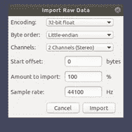

图 13:导入原始数据设置

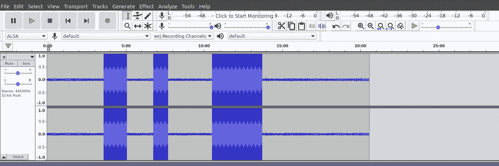

图 14:从 GNU-Radio 捕获的无线电波

在 audacity 上加载文件后，我们可以通过高亮显示并按下“Del”键来删除直线(下面红色方框中)表示的区间。

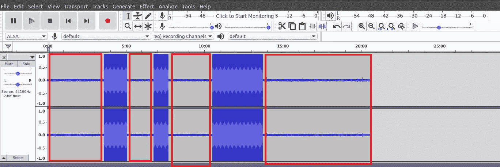

图 15:删除上面红框表示的间隔

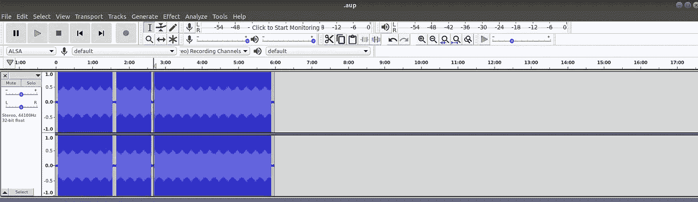

图 16:删除间隔的结果输出

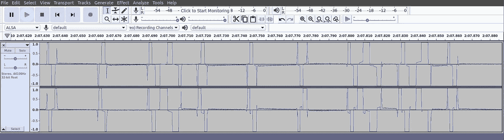

图 17:放大以查看变速器的模拟读数

通过选择导出多个选项来导出新的无线电波文件。通过将文件头选择为“Raw(无文件头)”，确保没有音频文件头添加到该文件中


图 18:导出无线电波并指示原始格式

## 分析无线电波

通用无线电黑客是一个非常好的工具来执行无线电波有效载荷的分析。此外，它允许直接捕获无线电波，预处理信号，解码有效载荷，甚至修改有效载荷以便直接传输。该工具对于在您了解设备通信技术后尝试模糊化非常有用。

让我们试着更好地理解门铃的工作原理。打开清理过的无线电文件后，放大到第一个波形的开头。URH 的好处是你可以通过选择无线电波来创造新的信号。如果你试图区分每一个 wave 命令在目标设备上做什么(想象一下，如果你有解锁按钮，锁定按钮等),这是特别有用的。).

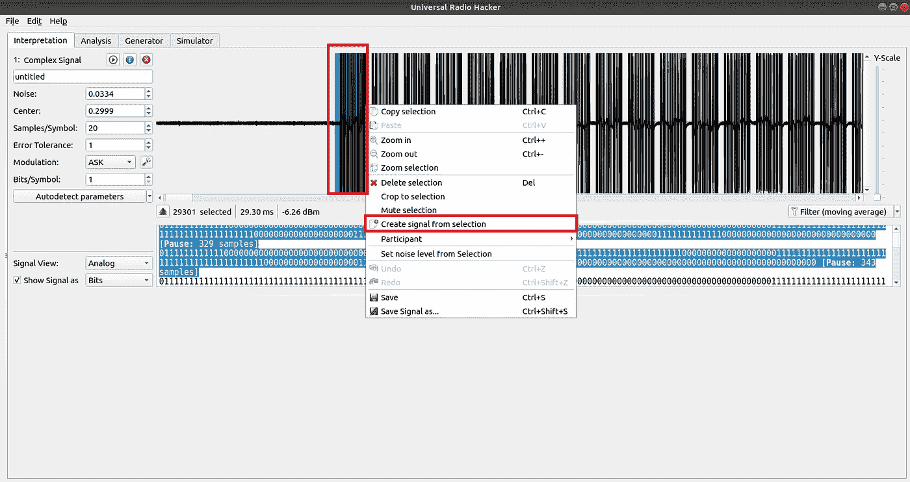

图 19:从无线电波的第一个波形创建一个信号

URH 会在一个单独的视图中自动创建一个新信号，我们可以分析、播放或保存该信号。由于我无法让 URH 识别我的设备，我保存了这个新信号，并在之前的重放攻击中将文件源设置为指向这个新信号。

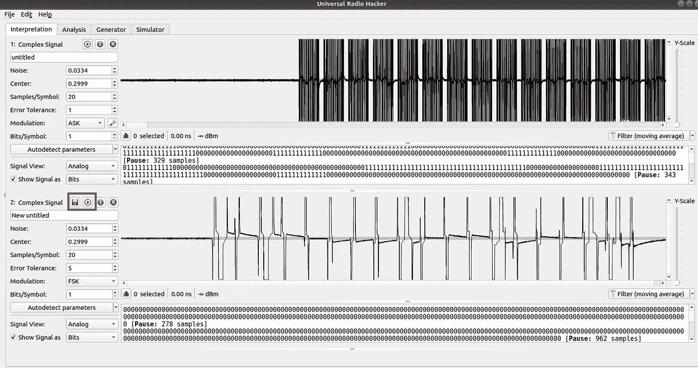

图 20:保存或尝试播放来自 URH 的新信号

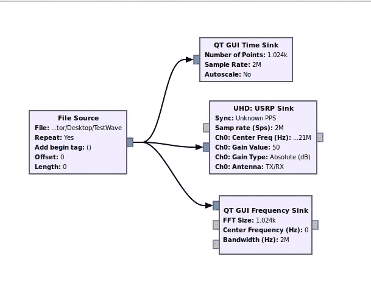

图 21:将文件源替换为新保存的信号

保存并执行流程图。您会注意到门铃响得更频繁了，因为两者之间的间隔更短了，而且文件也更小了(只有一个命令)。总之，我从这个提取的信号中学到的是，每当门铃被按下时，多个相同的信号被发送到接收器，这可能是为了对抗干扰。

URH 很酷的一点是有一个“分析”功能，分析师可以查看、修改和分析捕捉到的无线电波数据。在大多数情况下，无线电波通信通常是编码的，URH 允许分析师定义解码方法，以便进一步分析。它还允许分析员将完成分析的无线电波命令标记为“参与者”,并允许程序找到其他类似的模式，将它们标记并归属于一个独特的颜色代码。

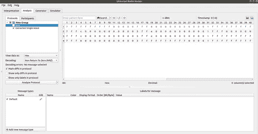

图 22:URH 的“分析”视图

## 分解信号

要对信号进行逆向工程，了解信号包含的内容至关重要。它通常由传输中的数据、编码方法、成帧(前同步码)和调制组成。有了这方面的知识，并通过使用 URH 分解有效载荷，您就可以充分测试设备的漏洞。

## 结论

SDR 是分析空中传输的无线电波的一种很好的方法。然而，SDR 不是一种万能的方法，也不是对所有射频进行分析的最佳工具。例如，Wi-Fi 和 BLE 在 2.4GHz 频率上传输的技术噪音太大，因此需要使用频道跳跃来消除干扰的影响。此外，市场提供了现成的工具来分析 Wi-Fi 和 ble 技术。因此，在这种情况下使用特别提款权是不可行的。一般来说，最好使用 SDR 来分析专有信号或设计工具较少的信号。