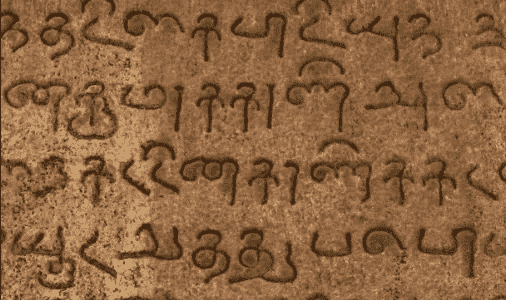

# 古代净化

> 原文：<https://infosecwriteups.com/ancient-purifying-3a7845d38d9c?source=collection_archive---------0----------------------->

*注:以下文章发表于 2015 年 12 月 30 日 https://FogMarks.com*

**

*我发现的第一个 XSS 中有一个是你能想象的最简单的。有数百万，是的，数百万的网站净化用户的输入，但是净化是错误的。*

***为什么？因为他们是不可知论者。并且因为他们**没有根据最新的黑/白帽社区发现**更新他们的净化算法。***

# *净化基础*

*基本上，用户输入应该**永远不要**输出为 HTML 代码。按照规则，服务器不应该接受 HTML 标记，但是当您决定接受它们时，您需要正确地清理。为什么？因为你写的正则表达式中的一个小错误会导致用户植入存储的或反射的 XSS，这会危及你的用户。还有你。*

*这种说法的一个例子是我的一份正在进行的报告。
Tagged.com/Hi5.com 容易受到非常简单的存储 XSS 攻击，使用非常简单的有效载荷，当然我不会透露，直到他们修复这个问题(漏洞提交正在等待他们的回应，因为 2015 年(！)).
精密平台的规则是**亲**(保持超级简单)。已知的 XSSes 可能不会工作，因为一个训练有素的安全团队一直在监控这些系统，并且消毒算法经常更新。*

## *第三方净化器并不总是答案*

*正如你已经知道的，我不相信**你的**安全应该由第三方软件来保护。如果你是一个足以存储敏感用户数据(任何类型)的“大男孩”，你也应该足够负责任地保护这些数据的安全。根据简单的“不接受 HTML/SCRIPT 标签”规则和最近的社区发现，使用您自己的净化机制。*

## *测试你的机制，开源它*

*完美并不总是有代价的(抱歉斯特拉)。一个完善的输入净化器机制，只有在社区的帮助下，才会成为这样的一个。因此，当你认为它足够重要时，允许圣灵降临者挑战你的机制。@soaj1664ashar 用他的输入净化器版本做了这样的事情。强烈建议你看看他关于它的帖子(谷歌一下)。*

# *结论*

*最后，我想给大家留下这句名言，它基本上总结了我们讨论的所有内容:*

> *“安全不是产品，而是过程”——布鲁斯·施奈尔。*

*新年快乐！*