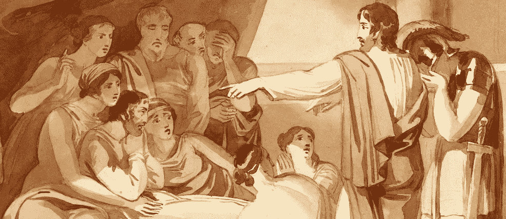

# 国王倒下了

> 原文：<https://infosecwriteups.com/and-the-king-goes-down-d28f23749f80?source=collection_archive---------1----------------------->

*注:以下文章发表于 2016 年 7 月 24 日关于*[*【https://FogMarks.com】*](https://fogmarks.com/2016/07/24/and-the-king-goes-down/) *PoC 视频在本案例研究的底部。*

国王阿哈齐亚在从一个上井口掉下来后生病躺在床上(来源:维基媒体)

今天的案例研究将讨论拥有令牌管理机制的重要性。
每个支持用户认证的 web 应用程序通常会使用一个令牌来验证用户发起的“关键”操作。

例如，脸书会自动在用户提供的任何链接的末尾添加一个标记，有时甚至会添加到脸书境内的页面。这种机制被称为[‘Linkshim’](https://www.facebook.com/10150492832835766/)，这也是你很少听说脸书开放重定向、CSRFs 或点击劫持漏洞的主要原因。脸书的方法非常简单——如果一个链接被添加到一个页面上——在它的末尾添加一个令牌参数。当然，令牌应该只允许同一个登录用户访问 URL，并且有一个令牌验证算法来限制令牌被使用的次数和被谁使用。

## 但是当令牌以错误的方式被管理时会发生什么呢？

BugCrowd 允许为每个在其平台上运行 bug bounty 程序的公司创建团队。想法是创建一个团队，以便分类和处理不同类型的漏洞。当用户创建团队时，她自动成为团队的所有者:她拥有“最高”角色，控制整个团队的操作和选项，如更改团队名称、查看“重要/机密”文档、更改团队中其他用户的角色、邀请新人加入团队等等。

团队支持以下角色:所有者、管理员和其他一些次要的非重要角色。只有团队的所有者和管理员能够邀请新用户加入团队。邀请只能发送给不在团队中并且没有帐户的人。当收件人打开邮件时，他将被重定向到公司的注册页面(在 BugCrowd 上)，然后将被添加到团队中，其角色由所有者或管理员设置。

当我第一次查看团队选项时，我注意到在所有者或管理员通过电子邮件邀请其他人加入团队后，他可以重新发送邀请，以防被邀请的用户错过或意外删除它。重发选项是每个邀请旁边的一个链接。单击该链接创建了一个对某个“邀请管理器”页面的 POST 请求，**并只向其传递了一个邀请 ID POST 参数，**，该参数是最初生成的(当此人第一次被邀请时)**。邀请 ID 随后用于识别团队中的用户。**

那个请求看起来像这样:

> POST[https://tracker . bug crowd . com/organizations/TEAM _ ID/settings/TEAM/TEAM _ MEMBER _ ID/resend](https://tracker.bugcrowd.com/organizations/TEAM_ID/settings/team/TEAM_MEMBER_ID/resend)HTTP/1.1
> ……
> …
> ..
> 。
> _ method = post&authenticity _ TOKEN =<TOKEN>

这就是我开始思考的地方:他们为什么要传递一个邀请 ID？传一下被邀请人的邮箱就可以了。他们为什么不把邀请 ID 和会员 ID 分开？最重要的是，当我在重发请求中使用所有者的 id 时，传递的*authentity _ token*POST 参数的值是多少？

## 嗯，没什么

*authentity _ token*仅用于确保发起请求的用户(从团队仪表板页面)是实际向其他团队成员发送 *resend* 请求的用户。*authentity _ token*可能还确保发起者是所有者或管理员。

重要的是过去的邀请 id 没有被删除。除此之外，他们**仍然是** **可接近的。*****authentity _ token*不够“智能”，无法确定正在对哪个对象(即邀请/成员 ID)执行操作。
通过将传递的邀请 ID 参数更改为所有者的“第一个”邀请 ID，可以向他重新发送邀请。**

**起初，我笑着说“哦，好吧，除了给主人发一点垃圾邮件之外，它还能造成多少损失呢？”。但我错了。非常不对。**

## **情节扭曲**

**当系统检测到向所有者发送了邀请时(尽管一开始并没有邀请)，**将所有者从其角色**中移除。但是更进一步——还记得我说过发送邀请会根据收件人的电子邮件地址向其发送注册页面吗？该系统还删除了所有者的账户——他的私人信息，最重要的是——他的证书。这就造成了车主整个账号被封。经典的 DoS。**

## **那么，我们如何防止不必要的行为发生呢？这很简单。或者很辛苦。**

**首先，让我们为每个动作附加一个真实性令牌。必须为每个特定用户专门和单独地生成真实性令牌。**

**第二，像牛奶和奶酪一样——让我们为每个代币附加一个截止日期。
**2 分钟**到期时间足够公平，允许用户使用我们的令牌，即使对于互联网连接超慢的用户也是如此。**

**最后，让我们将真实性标记与它们应该保护的对象联系起来。为登录的用户请求传递真实性令牌是没有意义的，除非真实性令牌验证了某些东西。否则，有足够的解决方案来使用 cookies 进行会话验证。**

> **看在上帝的份上，请从可访问令牌机制或数据库中删除用过的令牌。如果没有，至少让它们过期，并确保过期日期有效。**

## ****总之，****

**这个安全问题本来可以通过遵循三个简单的原则来防止—
1)将访问令牌附加到用户正在执行的每个动作**和对象**上，只要用户在生成时能够访问该对象。
2)为每个令牌设置一个合理的抽取时间。2m 就可以了。
3)最重要的是，正确管理令牌并删除用过的令牌。**

**干杯。**