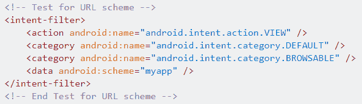
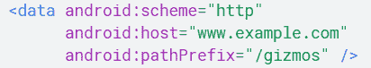
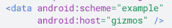
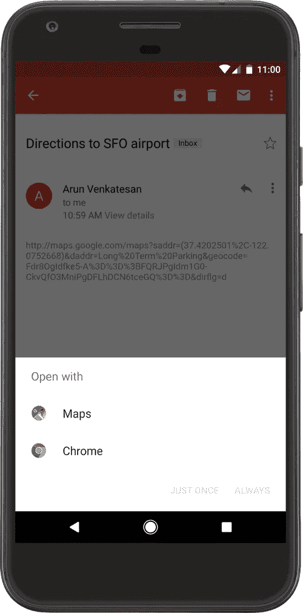

# Android 应用安全性和测试

> 原文：<https://infosecwriteups.com/android-app-security-testing-156a052ce7e8?source=collection_archive---------0----------------------->

#android #findBugs


在这里，我将讨论关于应用程序的静态分析，以及一些你应该研究的问题。

您还将了解如何设置像 mobsf、Frida 和 objection 这样的工具来绕过 SSL 锁定。

所以，让我们从一些

**基本术语:**

*   Android 应用程序采用的是 APK 文件格式。APK 基本上是一个压缩文件。(您可以将文件扩展名重命名为。zip 并使用 unzip 打开并查看其内容。)
*   APK 目录(此处仅列出少数)

-> META-INF/:证书住在这里！

-> classes . DEX:DEX 文件格式的应用程序的 Dalvik 字节码。这是应用程序默认运行的 Java(或 Kotlin)代码。

--> lib/:默认情况下，应用程序的本地库位于此处！在 lib/目录下，有特定于 cpu 的目录。

`-> armeabi`:仅针对所有基于 ARM 的处理器的编译代码

`-> armeabi-v7a`:仅针对所有基于 ARMv7 及更高版本处理器的编译代码

`-> x86`:针对 X86 编译的代码

`-> mips`:仅针对 MIPS 处理器的编译代码

-> assets/:应用程序可能需要的任何其他文件。

*   此处可能包含其他本地库或 DEX 文件。特别是当恶意软件作者试图通过不将额外的代码(本机或 Dalvik)包含在默认位置来“隐藏”额外的代码时，这种情况就会发生。

-> res/:包含未编译到 resources.arsc 中的资源的目录

-> resources.arsc:包含预编译资源的文件，例如二进制 XML。

**Activity-** 一个 *activity* 是与用户交互的入口点。它代表具有用户界面(UI)的单个屏幕。活动为用户提供了与应用程序交互的界面，即查看屏幕上的内容并执行操作。

大多数人认为**启动器活动**是 Android 应用程序的入口点。启动器活动是当用户单击应用程序的图标时启动的活动。您可以通过查看应用程序的清单来确定启动器的活动。启动器活动将列出以下**主**和**启动器意图**。

```
<activity android:name=”.LauncherActivity”>
 <intent-filter>
 <action android:name=”android.intent.action.MAIN” />
 <category android:name=”android.intent.category.LAUNCHER” />
 </intent-filter>
</activity>
```

**服务**—*服务*是一个通用的入口点，用于出于各种原因保持应用程序在后台运行。服务在后台执行操作，即后台同步、处理通知、播放音乐。服务没有用户界面。

可以导出服务，这允许设备上的其他进程启动该服务。默认情况下，不会导出服务，但可以在清单中进行配置:

```
<service android:name=".sampleExportedService" android:exported="true"/>
```

**广播接收器-***广播接收器*是一个组件，它使系统能够在常规用户流之外向应用程序交付事件，允许应用程序响应系统范围内的广播通知。这方面的一个例子是应用程序显示某些事件的通知，如警报、提醒、应用程序通知等。

**内容提供商-** 一个*内容提供商*根据请求从一个应用程序向其他应用程序提供数据。内容提供商可以以不同的格式存储数据，如文件、SQLite 数据库，甚至可以通过网络获取数据。如果内容提供商允许，外部应用程序可以查询或修改数据。

它与数据库非常相似，有四种方法。

*   插入()
*   更新()
*   删除()
*   查询()

**导出的** —表示服务是否可以被其他应用程序访问的属性

```
<service android:name=”.sampleExportedService” android:exported=”true”/>
```

**Intent-**Intent 是异步消息，在运行时将各个组件相互绑定。Intents 允许与其他 android 组件进行交互。从上述组件中，可以使用*意图激活活动、服务和广播接收器。*

## 意图过滤器

意图过滤器指定活动、服务或广播接收器可以响应的意图类型。

*   意图过滤器声明组件的能力。它指定了一个活动或服务可以做什么，以及接收机可以处理什么类型的广播。
*   它允许相应的组件接收声明类型的意图。
*   IntentFilters 通常通过 AndroidManifest.xml 文件定义。
*   对于 BroadcastReceiver，也可以在编码中定义它们。IntentFilters 由其类别、操作和数据过滤器定义。它还可以包含额外的元数据。
*   如果任何组件是公共的，则可以从安装在同一设备上的另一个应用程序访问它。
*   在 Android 中，当 exported 设置为 true 时，活动/服务/内容提供者/广播接收者是**公共的**，但是如果**清单为其指定了意图过滤器**，则组件也是公共的。
*   然而，开发人员可以通过将清单文件中每个组件的**“exported”属性设置为 false** 来**显式地使组件私有**(不考虑任何意图过滤器)。开发人员还可以设置“permission”属性来要求访问每个组件的特定权限，从而限制对组件的访问。
*   使用`android:permission`属性应用于清单中的`[<activity>](https://developer.android.com/guide/topics/manifest/activity-element)`标签或其他标签的权限限制了谁可以启动那个`[Activity](https://developer.android.com/reference/android/app/Activity)`。在`[Context.startActivity()](https://developer.android.com/reference/android/content/Context#startActivity(android.content.Intent))`和`[Activity.startActivityForResult()](https://developer.android.com/reference/android/app/Activity#startActivityForResult(android.content.Intent,%20int))`期间检查许可。如果呼叫者没有所需的许可，那么`[SecurityException](https://developer.android.com/reference/java/lang/SecurityException)`被从呼叫中抛出。

## URL 方案—

一个应用程序可以在一个活动中声明一个 **URL 模式**，这样每当 Android 设备试图**使用该模式**访问一个地址时，应用程序活动将被调用:



本例中的方案在`myapp://`

如果在`intent-filter`里面你发现了这样的东西:



然后，它期待类似`[http://www.example.com/gizmos](http://www.example.com/gizmos)`的东西

如果您发现类似这样的情况:



这意味着它期待一个以`example://gizmos`开头的 URL，在这种情况下，你可以尝试滥用这个功能，用下面的有效载荷创建一个 web。它将尝试导航到任意页面并尝试执行 JS:

```
<a href="example://gizmos/https://google.com">click here</a><a href="example://gizmos/javascript://%250dalert(1)">click here</a>
```

# 我们如何开始每一个呢？

*   可以通过向 *startActivity()* 方法传递一个*意图*来启动活动。
*   您可以通过将一个`[Intent](https://developer.android.com/reference/android/content/Intent)`传递给`[startService()](https://developer.android.com/reference/android/content/Context#startService(android.content.Intent))`或`[startForegroundService()](https://developer.android.com/reference/android/content/Context#startForegroundService(android.content.Intent))`，从一个活动或其他应用程序组件中启动一个服务。Android 系统调用服务的`[onStartCommand()](https://developer.android.com/reference/android/app/Service#onStartCommand(android.content.Intent,%20int,%20int))`方法并传递给它`[Intent](https://developer.android.com/reference/android/content/Intent)`，它指定启动哪个服务。
*   当调用`startService` API 启动服务时，服务中的`onStart`方法被执行
*   您可以通过将 *Intent* 传递给诸如 *sendBroadcast()、sendOrderedBroadcast()之类的方法来启动广播。*
*   一个应用程序可以通过两种方式注册一个广播接收器:在应用程序的清单中使用 intents 或者在应用程序的代码中使用`registerReceiver()` API 调用动态注册。

当发送接收器注册的特定广播时，执行 BroadcastReceiver 类中的`onReceive method`。

*   您可以通过在 *ContentResolver()* 上调用 *query()* 来执行对内容提供商的查询。

[](https://medium.com/@nallamuthu/android-broadcast-exploit-34954205b5fb) [## Android 广播漏洞

### 如何在 Android 应用程序中利用导出的广播接收器？

medium.com](https://medium.com/@nallamuthu/android-broadcast-exploit-34954205b5fb) [](https://resources.infosecinstitute.com/android-hacking-security-part-3-exploiting-broadcast-receivers/#gref) [## Android 黑客和安全，第 3 部分:利用广播接收器

### 在前两篇文章中，我们讨论了与活动组件、内容提供者泄漏和…

resources.infosecinstitute.com](https://resources.infosecinstitute.com/android-hacking-security-part-3-exploiting-broadcast-receivers/#gref) [](https://manifestsecurity.com/android-application-security/) [## 安卓应用安全系列

### 欢迎来到 Android 应用安全系列。这个系列包含了一些关于不同类型的…

manifestsecurity.com](https://manifestsecurity.com/android-application-security/) 

# AndroidManifest.xml

每个应用程序必须在其根目录中有一个 **AndroidManifest.xml(与此处给出的名称完全相同)**文件。清单向 Android 系统提供了关于应用程序的基本信息，这些信息是系统在运行任何应用程序代码之前必须拥有的。

您可以使用 apktool 或 mobsf 获得这个文件

命令:apktool d sample-app.apk

**与安全相关的标签**

1.  **<Android:sharedUserId>**
    将与其他应用程序共享的 Linux 用户 id 的名称。默认情况下，Android 会为每个应用程序分配一个唯一的用户 id。但是，如果两个或更多应用程序的此属性设置为相同的值，它们将共享相同的 ID，前提是它们也由相同的证书签名。
    具有相同用户 ID 的应用程序可以访问彼此的数据，如果需要，还可以在相同的进程中运行。

**2。<用途-权限>**

请求应用程序必须被授予权限才能正常运行。权限是在应用程序安装时由用户授予的，而不是在它运行时授予的。
语法:

```
<uses-permission android:[name](http://developer.android.com/guide/topics/manifest/uses-permission-element.html#nm)="*string*" />
```

**android:name**
权限名称，如“android.permission.CAMERA”或“Android . permission . read _ CONTACTS”

**3。android:可调试的**
应用程序是否可以调试，即使是在用户模式下的设备上运行——如果可以，则为“真”，否则为“假”。默认值为“假”

```
*<application**android:debuggable=”false”**</application>*
```

**4。<权限>**
声明一个安全权限，可用于限制对该应用程序或其他应用程序的特定组件或功能的访问。您可以使用它来为您的应用程序定义您自己的权限。
**语法**

```
<permission android:description=”string resource”
 android:icon=”drawable resource”
 android:label=”string resource”
 android:name=”string”
 android:permissionGroup=”string”
 android:protectionLevel=[“normal” | “dangerous” | 
 “signature” | “signatureOrSystem”] />
```

**Android:protection level**
描述了权限中隐含的潜在风险，并指出系统在决定是否将权限授予请求权限的应用程序时应遵循的程序。

Android 应用程序必须请求权限才能访问敏感的用户数据(如联系人和短信)，以及某些系统功能(如摄像头和互联网)。根据功能的不同，系统可能会自动授予权限，也可能会提示用户批准请求。

该值可以设置为下列字符串之一:
**【正常】:-** 默认值。一种低风险权限，允许请求应用程序访问独立的应用程序级功能，对其他应用程序、系统或使用的风险最小
**【危险】:**——一种高风险权限，允许请求应用程序访问私人用户数据或控制可能对用户产生负面影响的设备。因为这种类型的权限会带来潜在的风险，所以系统可能不会自动将它授予请求应用程序。例如，应用程序请求的任何危险权限可能会显示给用户，并要求在进行
“**签名”之前进行确认:-** 只有在请求应用程序使用与声明该权限的应用程序相同的证书签名时，系统才会授予该权限。如果证书匹配，系统会自动授予权限，而不通知用户或要求用户明确批准

**同一个公司的两个应用应该用签名权限**
**“signatureOrSystem”:-**系统只授予 Android 系统映像中的应用的权限，或者使用与声明权限的应用相同的证书签名的应用。请避免使用此选项，因为无论应用程序安装在哪里，签名保护级别都应该足以满足大多数需求和工作。“signatureOrSystem”权限用于某些特殊情况，其中多个供应商将应用程序构建到系统映像中，并且需要显式共享特定功能，因为它们是一起构建的。

**安卓沙盒**

一旦安装在设备上，每个 Android 应用程序都存在于自己的安全沙箱中:—Android 操作系统是一个多用户 Linux 系统，其中每个应用程序都是一个不同的用户。

*   默认情况下，系统会为每个应用程序分配一个唯一的 Linux 用户 ID(该 ID 仅供系统使用，应用程序无法识别)。系统为应用程序中的所有文件设置权限，以便只有分配给该应用程序的用户 ID 才能访问它们。
*   每个进程都有自己的虚拟机，所以一个应用程序的代码独立于其他应用程序运行。
*   默认情况下，每个应用都在自己的 Linux 进程中运行。

**准备连接&设置基本工具**

*   **安装工具:**

1.  安装 [JAVA JDK](https://www.oracle.com/java/technologies/javase/javase-jdk8-downloads.html) ，需要 jarsigner，确保 jarsigner 的路径在 path 变量中。
2.  安装 apk tool(【https://ibotpeaches.github.io/Apktool/install/】T2):apk tool 用于拆解和修补 android 应用。它将给出 smali 代码以及可读 AndroidManifest.xml 文件。
3.  你需要安装 [Android SDK](https://developer.android.com/studio) 来安装类似于 *adb* 的工具，或者如果你不需要完整的 Android Studio，你可以下载基本的 Android 命令行工具。确保将安装路径放在$PATH 中，这样您就可以从任何地方访问这些工具。
4.  安装 jd-gui(从[到这里](http://java-decompiler.github.io/)，这个工具会帮助你看到 java 源代码。
5.  安装 dex2jar(从[到这里](https://sourceforge.net/projects/dex2jar/))，这将帮助您将 classes.dex 文件转换为 jar 文件，然后可以在 jd-gui 中打开。您可以将 apk 作为输入传递给此工具，或者将 classes.dex 文件作为输入。
6.  安装弗里达和异议(更多信息将在后面描述)

```
pip3 install frida-tools
pip3 install objectionor for updating these tools:pip3 install frida-tools --upgrade
pip3 install objection --upgrade
```

**注意:确保所有工具都在您的$PATH 中**

*   从 android Studio 运行您的仿真器( [**genymotion**](https://www.genymotion.com/download/) )或 Android 仿真器，或者使用 usb 连接您的设备。
*   首先，你需要将你的 Android 设备连接到你想要代理的电脑上。
*   接下来，您需要使用 adb reverse 设置一个反向端口，从您的手机转发到您的电脑。
*   这将把你手机上任何试图连接到 localhost:8123 的东西转发到连接的计算机上。

`root@kali:~$ adb reverse tcp:8123 tcp:8123`

*   使用反向正向设置，您将需要设置 Android 代理设置。
*   为此，请转到您的网络连接，编辑连接，并显示高级选项。

 [## 通过移动评估 Burp 代理 Android 应用| doyler.net

### 我不得不多次通过 Burp 代理 Android 应用程序，我想分享一下这有多简单…

www.doyler.net](https://www.doyler.net/security-not-included/proxy-android-apps-through-burp) 

[https://blog . Jamie . holdings/2018/09/05/bypass-certificate-pinning-on-Android](https://blog.jamie.holdings/2018/09/05/bypass-certificate-pinning-on-android/)

运行以下命令，检查您是否能看到该设备:

#亚行设备

**拉 APP 做静态分析**

`adb shell pm list packages`

*   浏览软件包名称列表，并尝试找到有问题的应用程序和包名称之间的匹配项。
*   这通常很容易，但请注意，包名可以与应用程序名完全无关。如果您无法从软件包名称列表中识别该应用程序，请尝试使用浏览器在 Google Play 中查找该应用程序。Google Play 中应用程序的 URL 包含包名。
*   获取所需包的 APK 文件的完整路径名。

`adb shell pm path com.example.someapp`

输出如下所示:package:/data/app/com . example . some app-2 . apk

`adb pull /data/app/com.example.someapp-2.apk`

*   您可以使用-f 选项将上述两个命令合并为一个命令(显示关联的文件，只需在此之后拉动文件):
    ` ADB shell pm list packages-f | grep some app
    ->package:/data/app/com . example . some app-2/base . apk = com . example . some app '
*   顺便说一下，快速找到相关包的一个有用技巧是启动应用程序，并使用以下命令找到显示的活动:

`adb shell dumpsys activity top | grep ACTIVITY`

`-> ACTIVITY com.example.someapp/.app.HomeActivity 2dbf6e2 pid=18453`

*   一旦你通过上述方式或[直接下载](https://apkcombo.com/en-in/)获得应用程序，你就可以使用 [MobSF](https://github.com/MobSF/Mobile-Security-Framework-MobSF) 开始应用程序的静态分析

```
# docker pull opensecurity/mobile-security-framework-mobsf 
# docker run -it -p 8000:8000 opensecurity/mobile-security-framework-mobsf:latest
```

# 静态分析

*   一旦 Mobsf 启动并运行，您可以进入 *localhost:8000* 并在其中放下/打开您的 apk，它会解压缩 apk，为您获取 Java 源代码并在静态分析后给您报告。
*   您甚至可以保存来自 MobSF UI 本身的 java 源代码，然后进行 grep 处理或手工分析

**在反编译的 APK 中，你窥探到了哪些特定的字符串/键/敏感信息？**

1.  我搜索 deeplink 端点通常是“customhost://”,所以搜索“://”经常会返回有趣的东西。也云 API 密钥，并利用 awscli 的关键。
    "grep -RP '(？<！[A-Za-z0–9/+=])[A-Za-z0–9/+=]{ 40 }(？！[A-Za-z0–9/+=])' * '。
2.  也有一些特定的方法会导致不安全的实现，如 shouldOverrideUrlLoading、shouldInterceptRequest、onDownloadStart、FirebaseDatabase.getInstance()和 setJavaScriptEnabled(true)。
3.  最后为导出的组件解析 AndroidManifest.xml。exported="true "
4.  查找敏感数据(如机密、S3 桶 URL、apikey、不记名令牌、auth 令牌、第三方服务的硬编码凭据、密码、用户、用户名、git、db、数据库、api 密钥、令牌、auth、http 和其他协议。)在目录(res →value)下的 AndroidManifest.xml 或 strings.xml 中。
5.  特别注意**firebase URL**并检查它是否配置错误

*   复制 url 并追加/。json 并在浏览器中打开它。如果响应不是“拒绝许可”,那么它可能是一个有效的 bug。想要进一步了解，请阅读这个[博客](https://blog.securitybreached.org/2020/02/04/exploiting-insecure-firebase-database-bugbounty/)。
*   MobSF 还提取所有的字符串并显示在用户界面上，这样你也可以在用户界面上搜索相同的字符串。

**导出的活动**:检查清单中的导出活动，因为这可能很危险。

*   导出活动时，您可以从外部应用程序调用其屏幕。
*   因此，如果带有**敏感信息**的活动被**导出**，您可以**绕过**认证**机制**来访问它。
*   检查导出的 activity 类的源代码，查看 activity 是否接受用户提供的意图数据。你可以从清单文件中得到类名，在**Android:name**= "**class name here**下提到

您可以从 adb 启动导出的活动:

*   包名是 com.sample.test
*   导出的 ActivityName 是 com.sample.test.MainActivity

```
adb shell am start -n <package_name>/<activity_name>
adb shell am start -n com.sample.test/com.sample.test.MainActivity
```

**内容提供者**:如果一个导出的提供者被暴露，你可以访问/修改感兴趣的信息。

**暴露的服务**:根据服务在内部做什么，漏洞可能会被利用。

*   如果一个应用程序正在导出一些服务，你应该**检查**代码**以了解它在做什么**

**广播接收器:**广播接收器将等待一种类型的消息。取决于接收者如何处理消息，它可能是易受攻击的。

**URL scheme** :读取管理模式的活动代码，寻找管理用户输入的漏洞。

*   您可以使用 **adb** 打开一个已声明的**方案**:

```
adb shell am start -a android.intent.action.VIEW -d "scheme://hostname/path?param=value" [your.package.name]
```

*   或者一个**浏览器:**

```
<a href=”scheme://hostname/path?param=value”>Click me</a><! — fallback in your url you could try the intent url →<a href=”intent://hostname#Intent;scheme=scheme;package=your.package.name;S.browser_fallback_url=http%3A%2F%2Fwww.example.com;end">with alternative</a>
```

## 其他有趣的功能

*   **代码执行** : `Runtime.exec(), ProcessBuilder(), native code:system()`
*   **发送短信** : `sendTextMessage, sendMultipartTestMessage`
*   **本机函数**声明为`native` : `public native, System.loadLibrary, System.load`
*   执行一些操作并检查**日志目录**是否有任何敏感信息泄漏。

## SQLite 数据库:

大多数应用程序使用**内部 SQLite 数据库**来保存信息。在分析过程中，查看**创建的**数据库**，保存的**表**和**列**的名称以及所有**数据**，因为您可以找到**敏感信息**(这可能是一个漏洞)。数据库应该像`/data/data/com.sample.app/databases`一样位于`/data/data/sample_package/databases`**

如果数据库保存了机密信息并且被加密了，但是你可以在应用程序中找到密码，这仍然是一个漏洞。

使用`.tables`枚举表，使用`.schema <table_name>`枚举表的列

弗里达

*   我们需要一个程序来动态分析正在运行的应用程序，我推荐的是 Frida。
*   因此，如果尚未安装 Frida，让我们安装它:

`pip install frida-tools`

**将 frida-server 安装到设备上。**

*   从下载最新的 [frida-server](https://github.com/frida/frida/releases) ，并根据您的设备选择正确的架构。
    -我用 Pixel 3，架构是 arm64 但是 avd/emulator 会有 x86 arch，所以下载 x86 版本的 frida-server。
*   您可以检查 CPU 类型

```
# adb shell getprop ro.product.cpu.abi
arm64-v8a 
```

**下载合适的 frida 服务器**

```
wget [https://github.com/frida/frida/releases/download/11.0.3/frida-server-11.0.3-android-arm64.xz](https://github.com/frida/frida/releases/download/11.0.3/frida-server-11.0.3-android-arm64.xz`) (For ARM64) (as I use device)
```

*   提取存档文件

```
unxz frida-server-11.0.3-android-arm64.xz
```

*   重命名为 frida-server

```
mv frida-server-11.0.3-android-arm64 frida-server
```

*   现在我们需要将 frida 服务器转移到设备上。
*   为此，我们需要利用亚行

```
adb push frida-server /data/local/tmp
```

*   更改文件的权限，以便我们可以执行它

```
adb shell chmod 755 /data/local/tmp/frida-server
```

*   现在我们可以运行 frida-server 了

```
adb shell “/data/local/tmp/frida-server &”
```

*   通过列出设备上安装的程序来验证 frida-server 是否工作

```
frida-ps -Uai
```

*   当设备通过 USB 连接时，或者在本例中是 android 虚拟设备时，使用-U 参数。
*   在主机系统上

```
frida-ps -Uai | findstr tata        (searching for tatacliq app)
```

**非根设备**

*   这个方法会修改一个 apk，用 frida-gadget 打补丁。这意味着 Objection 将尝试在主活动中添加对 frida-gadget 库的新调用，并将 frida-gadget 注入 apk 中的 lib 文件夹。
*   异议并不总是能成功修补 apk，所以不要相信它每次都能成功。

**带异议修补 apk**

*   我们需要指定我们希望用 frida-gadget 为哪个架构修补 apk。
*   众所周知，android 可以运行 x86(例如:模拟器)或 arm64(类似移动设备)
*   您可以使用-a 选项来指定正确的拱门
*   如果您指定-a arm，您将看到由 objection 支持的体系结构，然后您可以通过正确的 arch。
*   如上所述，我的 arch 是 arm64-v8a，因此我的命令是:

```
objection patchapk -s app.name.apk -a arm64-v8a
```

*   当修补完成时，文件将在文件名中有异议
*   如果修补成功，将修补的 apk 安装到设备上

```
adb install app.name.objection.apk
```

或者将 apk 推送到设备并手动安装

```
adb push com.app.name.objection.apk /sdcard/Download
```

**运行修改后的 app**

*   一旦你运行你刚才安装的异议注入应用程序，你会看到一个黑屏，这是因为应用程序注入了 frida 小工具，并等待 frida 客户端连接到它。
*   注入流程，开始探索 app。
*   使用异议:

```
objection --gadget “com.app.name” explore -q
```

或者使用 frida:

```
frida-ps -Uai
```

然后

```
frida -U -n <name_of_the_gadget>
```

**打补丁失败，根设备**

*   如果异议未能修补 apk，如果您有根设备，您仍然可以使用异议。
*   这是因为使用了 frida-server 而不是 frida-gadget。
*   所以在你的设备上启动 frida-server

```
adb shell “/data/local/tmp/frida-server &”
```

*   然后你可以从应用名称开始反对

```
objection --gadget “com.app.name” explore -q
```

**禁用 sslpinning**

*   一些应用程序使用 sslpinning 来防止网络连接被监听，但这可以通过反对来绕过。
*   如上运行 objection，并在 objection 终端中运行以下命令来禁用 sslpinning:

```
android sslpinning disable
```

您也可以尝试使用 frida 禁用 **ssl 固定**:

*   创建一个. js 文件来绕过 ssl-pinning

```
Java.perform(function() {
var array_list = Java.use(“java.util.ArrayList”);
var ApiClient = Java.use(‘com.android.org.conscrypt.TrustManagerImpl’);
ApiClient.checkTrustedRecursive.implementation = function(a1, a2, a3, a4, a5, a6) {
console.log(‘Bypassing SSL Pinning’);
var k = array_list.$new();return k;
}
}, 0);
```

*   如上所述，通过在 android 设备上运行 frida 服务器来获取包名，然后在您的 linux/windows 主机上运行“ **frida-ps -U** ”。
*   运行以下命令以绕过应用上的 SSL 锁定:

```
frida -U -f <com.package_name> -l bypass-ssl.js — no-pause
```

— — — — — — — — — — — — — — — — — — — — — — — — — -

**静态/动态分析**

看看可以执行系统命令的 API 调用，例如:

```
Runtime.exec()
ProcessBuilder()
system()
```

## 网络视图

*   用于显示网页
*   你只需要`android.permission.INTERNET`
*   寻找`setJavaScriptEnabled(true);`
*   默认情况下，JavaScript 在 WebView 中是禁用的

# 拉 APK 的脚本(摘自 b3nac RedTeamVillage 视频)

`autoapk.sh`:

```
#!/bin/bashif [[ -z $1 ]]; then
    echo "Usage: $0 <Name of APK>"
fiAPK_PATH="$(adb shell pm path $1)"
echo "${APK_PATH#*:}"
APK_PATH=${APK_PATH#*:}
adb pull $APK_PATH# Make sure we successfully pulled down an APK before renaming it
if [[ -f base.apk ]]; then
    mv base.apk $1.apk
fi# Open in JADX-GUI if you specify
if [[ "$2" == "--jadx" ]] || [[ "$2" == "-j" ]]; then
    $(which jadx-gui) $1.apk
fi
```

别名:

```
alias autoapk="bash $HOME/.android_sec_tools/autoapk.sh"
```

示例用法(这将下拉`chromium`的 apk，然后用`jadx-gui`打开它:

```
autoapk org.chromium.chrome --jadx
```

**安卓深度链接**

一个[深度链接](https://developer.android.com/training/app-links/deep-linking)是一个意图过滤器，允许用户直接在你的 Android 应用中输入一个特定的活动。点击其中一个链接可能会打开一个消歧对话框，允许用户选择多个应用程序(包括你的)中的一个来处理给定的 URL。例如，图 1 显示了用户点击地图链接后的消歧对话框，询问是在 Maps 还是 Chrome 中打开链接。



**深层链接是用 in 意图过滤器声明的。**

以下 XML 片段显示了如何在清单中为深度链接指定意图筛选器。URIs `“example://gizmos”`和`“http://www.example.com/gizmos”`都决心参加这个活动。

```
<activity
    android:name="com.example.android.GizmosActivity"
    android:label="@string/title_gizmos" >
    <intent-filter android:label="@string/filter_view_http_gizmos">
        <action android:name="android.intent.action.VIEW" />
        <category android:name="android.intent.category.DEFAULT" />
        <category android:name="android.intent.category.BROWSABLE" />
        <!-- Accepts URIs that begin with "http://www.example.com/gizmos” -->
        **<data android:scheme="http"
              android:host="www.example.com"
              android:pathPrefix="/gizmos" />**
        <!-- note that the leading "/" is required for pathPrefix-->
    </intent-filter>
    <intent-filter android:label="@string/filter_view_example_gizmos">
        <action android:name="android.intent.action.VIEW" />
        <category android:name="android.intent.category.DEFAULT" />
        <category android:name="android.intent.category.BROWSABLE" />
        <!-- Accepts URIs that begin with "example://gizmos” -->
        <**data android:scheme="example"
              android:host="gizmos" />**
    </intent-filter>
</activity>
```

*   在“AndroidManifest.xml”中搜索 **android:exported="true"** 活动
*   在 JADx-GUI 中打开此活动→搜索" **SetJavascriptEnable** "
*   现在检查活动中的任何意图。
*   对设备具有 root 权限(即# terminal)的用户可以调用任何活动，只需向所需的活动发送一个意向。例如:

```
$ adb shell am start -n <package_name>/<activity_name>
```

*   但是作为非 root 用户，不能调用任何非导出的 app 组件。您可以使用上面的命令来利用导出的活动/服务/提供者/接收者

# 测试导出的活动

```
adb shell am start -n <package>/<activity> -e <parameter> "data_to_send"
```

`-n`:提供包名和关联活动
`-e`:发送您的数据(和后续数据本身)的参数

示例:

```
adb shell am start -n b3nac.injuredandroid/b3nac.injuredandroid.FlagTwelveExportedActivity -e totally_secure "https://google.com"
```

# 创建 Java 概念证明

```
package target.package.poc;// Resolve these via Android Studio
import ...public class MainActivity extends AppCompatActivity {
    @Override
    protected void onCreate(Bundle savedInstanceState) {
        super.onCreate(savedInstanceState);
        setContentView(R.layout.activity_main);

        Intent intent = new Intent();
        intent.setClassName("package.to.target", "package.to.target.TargetActivity");
        intent.putExtra("parameter", "data_to_send_ie<svg onload=prompt(1)>");
        startActivity(intent);
    }
}
```

# 测试你的深层链接

您可以使用带有活动管理器(am)工具的 [Android 调试桥](https://developer.android.com/tools/help/adb)来测试您为深度链接指定的意图过滤器 URIs 是否解析到正确的应用活动。您可以针对设备或模拟器运行 adb 命令。

用 adb 测试意图过滤器 URI 的一般语法是:

```
$ adb shell am start
        -W -a android.intent.action.VIEW
        -d <URI> <PACKAGE>
```

`am` -活动管理器

例如，下面的命令尝试查看与指定 URI 关联的目标应用程序活动。

```
$ adb shell am start
        -W -a android.intent.action.VIEW
        -d "example://gizmos" com.example.android
```

*   我们怎么知道应该叫什么？

为此，我们应该查看清单，并寻找活动声明，那些被定义为导出的或具有意图的声明甚至可以在非根设备上调用。

*   在 Android Manifest 中搜索“ **://** ”，这将有助于找到自定义的深度链接。

```
adb shell am start -n bounty.pay/.PartOneActivity -a android.intent.action.VIEW -d “one://part?start=PartTwoActivity”
```

**安卓多查询参数深度链接**

```
adb shell am start -W -a android.intent.action.VIEW -d "myCustomScheme://myHost?key=category_parent_id\&value=93\&title=test" com.myApp.android
```

(注意，当使用多个查询参数时，我们需要在前面加一个“”

**例如:**

片段#1

**代码:**→**" intent . putextra(" EXTRA _ URL "，str)；"**

*   在 android 中“putExtra(String name，str)”用于将扩展数据添加到意图中。它有两个参数，第一个指定了额外数据的名称，第二个参数是数据本身。

片段#2

**代码:**→**loadUrl(getintentent()。getstring EXTRA(" EXTRA _ URL ")；"**

*   在这种情况下，getIntent()返回启动该活动的意图。如果你用一些数据开始一项活动。让我们把它变得非常简单和简短， **"intent.putExtra("EXTRA_URL "，str)；"**的意思是，你可以把“EXTRA_URL”看成一个变量&**getStringExtra(" EXTRA_URL "))**这里用来从“EXTRA _ URL”变量中获取数据或值。

**概念验证重现 OpenRedirect:**

```
am start -W -n app.company/.ui.events.web.WebViewActivity -a ACTION_OPEN_WEB -e EXTRA_URL [https://evil.com](https://evil.com)
```

**重现 Javascript 注入:**

```
am start -n app.company/.ui.events.web.WebViewActivity -a ACTION_OPEN_WEB -e EXTRA_URL "javascript://google.com%0A alert(lol);"
```

**复制本地文件窃取:**该 bug 可以:

→在应用沙箱中显示令牌、授权、配置等

→在应用沙盒中显示用户数据

→如果允许，访问“/sdcard”数据

```
am start -n app.company/.ui.events.web.WebViewActivity -a ACTION_OPEN_WEB -e EXTRA_URL 'file:///sdcard/personal.txt'
```

工具:[https://github.com/mzfr/slicer](https://github.com/mzfr/slicer)

参考资料:

 [## 移动应用渗透测试平台

### APK 文件和信息收集获取 APK 文件和收集信息直接从客户端获取应用程序…

mobexler.com](https://mobexler.com/checklist.htm)  [## 太棒了-亚洲开发银行

### Android 调试桥(ADB)是包含在 Android SDK 包中的一个工具包，它不仅是一个强大的工具…

mazhuang.org](https://mazhuang.org/awesome-adb/README.en.html) [](https://github.com/nahamsec/Resources-for-Beginner-Bug-Bounty-Hunters/blob/master/assets/mobile.md) [## naham sec/初学者资源-Bug-赏金猎人

### 因为有相当多的人要求手机黑客入门指南，我们特别给了它一个章节…

github.com](https://github.com/nahamsec/Resources-for-Beginner-Bug-Bounty-Hunters/blob/master/assets/mobile.md) [](https://github.com/randorisec/MobileHackingCheatSheet) [## randorisec/MobileHackingCheatSheet

### 移动黑客备忘单试图总结一些关于工具和命令的有趣的基本信息…

github.com](https://github.com/randorisec/MobileHackingCheatSheet) [](https://www.hackerone.com/blog/androidhackingmonth-intro-to-android-hacking) [## # Android Hacking month:Android 黑客入门，作者@0xteknogeek

### 当我第一次开始移动黑客时，感觉很像狂野的西部。公共资源很少，博客…

www.hackerone.com](https://www.hackerone.com/blog/androidhackingmonth-intro-to-android-hacking) [](https://www.hackerone.com/blog/AndroidHackingMonth-qa-with-bagipro) [## #AndroidHackingMonth 与 Android 黑客 bagipro 的问答

### 移动黑客已经成为 bug 赏金猎人工具带中必不可少的一部分，没有人比他更了解这个领域…

www.hackerone.com](https://www.hackerone.com/blog/AndroidHackingMonth-qa-with-bagipro) [](https://github.com/maverickNerd/Android-Reports-and-Resources) [## 特立独行的书呆子/Android-报告和资源

### 一大串 Android Hackerone 披露的报告和其他资源。-特立独行的书呆子/Android-报告和资源

github.com](https://github.com/maverickNerd/Android-Reports-and-Resources) 

**指纹旁路:**

[](https://noobsec.org/project/2019-12-22-bypass-fingerprint-lock-in-just-1-second/) [## 只需 1 秒绕过指纹锁！

### 如果点击诱饵可以吸引更多的人，那么我可以告诉你不要被媒体干扰，但是网络可以……

noobsec.org](https://noobsec.org/project/2019-12-22-bypass-fingerprint-lock-in-just-1-second/) [](https://hackerone.com/reports/637194) [## HackerOne 上披露的 Shopify:绕过生物识别安全...

### 摘要 Shopify Android 应用程序有一个使用指纹登录应用程序的选项。但是如果应用程序是打开的并且…

hackerone.com](https://hackerone.com/reports/637194)