# 安卓 CTF——克格勃信使

> 原文：<https://infosecwriteups.com/android-ctf-kgb-messenger-d9069f4cedf8?source=collection_archive---------0----------------------->

这是一篇关于开源 CTF 实践挑战的文章。这个 CTF 的目的是学习如何对 Android 应用程序进行逆向工程。你可以在这里找到 CTF 的链接。

## 使用的工具

*   [Apktool](https://ibotpeaches.github.io/Apktool/)
*   [jd-gui](https://github.com/java-decompiler/jd-gui/releases/)
*   [优步 Apk 签名人](https://github.com/patrickfav/uber-apk-signer)
*   [dex2jar](https://github.com/pxb1988/dex2jar/)

## **安装应用程序**

确保在启用调试模式的情况下连接 android 手机，然后安装应用程序。

`adb install kgb-messenger.apk`

## 使用 Apktool 解码

使用 Apktool 解码 APK，并将其输出到`kgb-smali`文件夹。

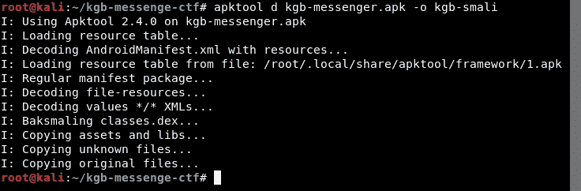

## 正在转换 apk。使用 dex2jar 的 jar 格式

我们转换成 jar，因为这样我们就可以使用 JD-GUI 来查看 Java 代码。

使用 **JD-GUI** ，我们打开由 dex2jar 创建的`kgb-jar.jar`(之前的命令)。

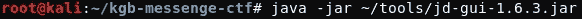

**注意**:我下载了 JD-GUI 并创建了一个名为 tools 的目录，然后将它移动到这个目录中

## **现在启动应用**

一旦我们启动应用程序，我们得到这个错误。

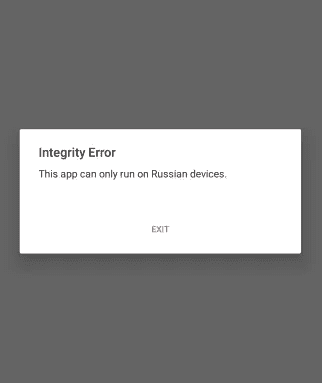

要查看导致该错误的原因，我们需要先查看哪个活动正在启动。所以我们打开`AndroidManifest.xml`，它可以在`kgb-smali` (apk tool 创建的文件)中找到

使用 vim 编辑器，我们打开`AndroidManifest.xml`

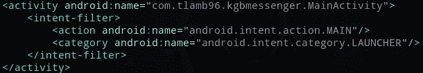

AndroidManifest.xml 的部分代码片段

`MainActivity`是最先发起的活动。所以用 JD-GUI 查看`MainActivity.class`

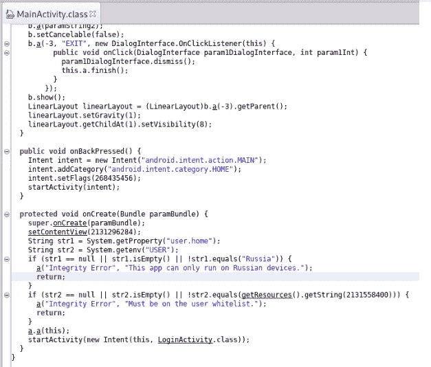

我们可以看到，创建活动时，检查了两个字符串值。首先检查`str1`是否等于*俄罗斯。*同理，`str2` 如果等于`getResources().getString(*2131558400*)`则检查。数字是存储在`[strings.xml](https://developer.android.com/guide/topics/resources/string-resource)`文件中的字符串值的数字表示。

因为我们在 Apktool 创建的 smali 文件夹中也有`.smali` 文件，所以我们打开`MainActivity.smali`并找到这一行`getResources().getString(2131558400)`

在此之前，我们需要用十六进制格式表示`2131558400`,以便我们更容易找到 smali 代码中的值。

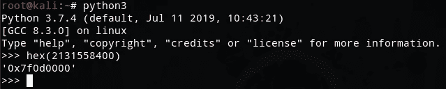

所以我们使用 Vim 编辑器打开`MainActivity.smali`文件。

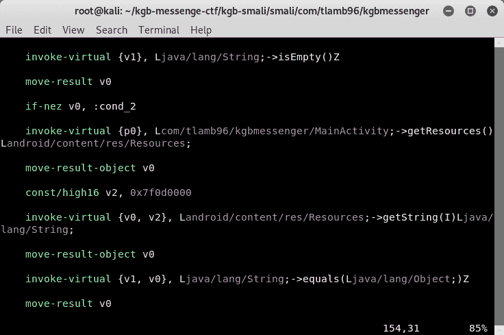

现在，我们尝试定位 id 为`0x7f0d0000`并与`str2`进行比较的字符串资源。

我们转到 **res/values** 目录，搜索`0x7f0d0000` 出现的位置

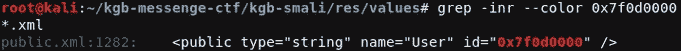

我们看到名字是**【用户】**，类型是**【字符串】**。因此，我们搜索 **"User"** ，在 strings.xml 文件中，name="User "的值使用 Base64 编码。我们对它进行编码。

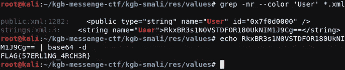

# 捕获第二面旗帜

*要捕获第二个标志，我们需要进入下一个活动，即* `*LoginActivity*` *。*

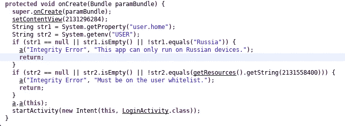

MainActivity 的 onCreate 方法

为了到达`LoginActivity`，我们需要找到一种方法来通过这两个 if 条件，或者我们可以只移除它们。

让我们打开`MainActivity.class`的`.smali`版本，删除负责两个 if 条件的代码。

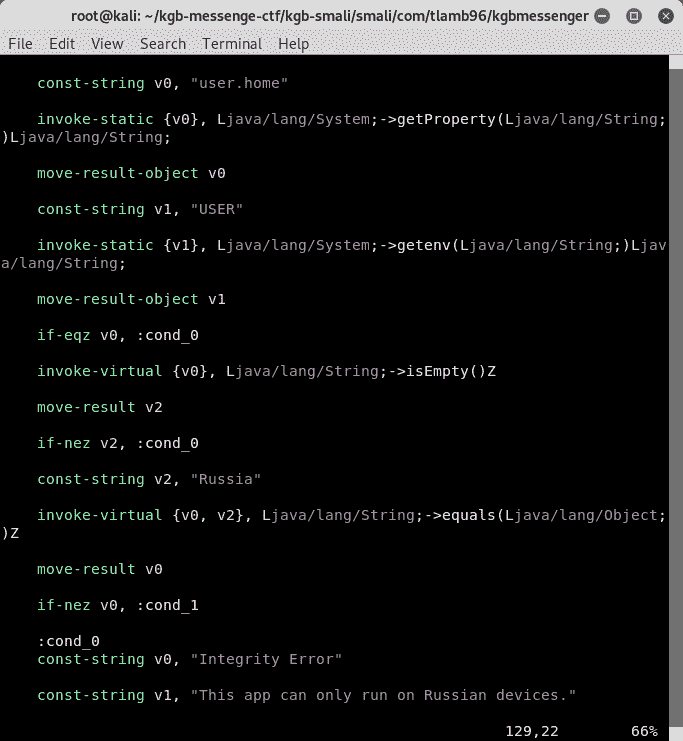

第一条件的小版本

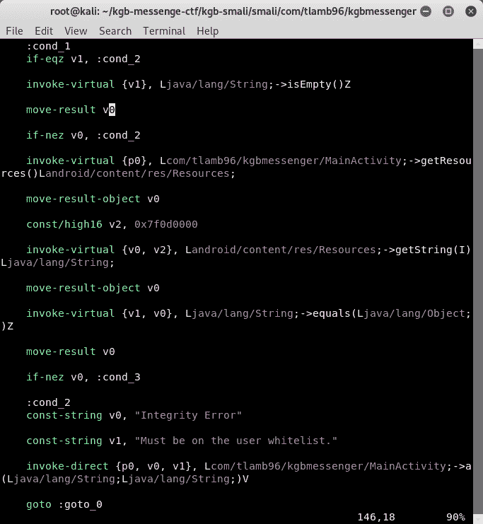

第二条件的小版本

## 摆脱这两种情况

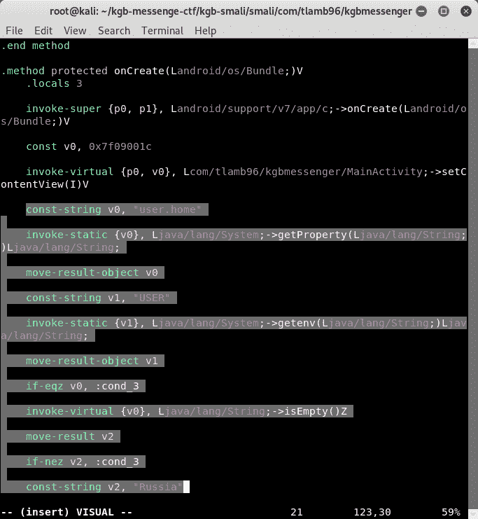

选择要删除的代码

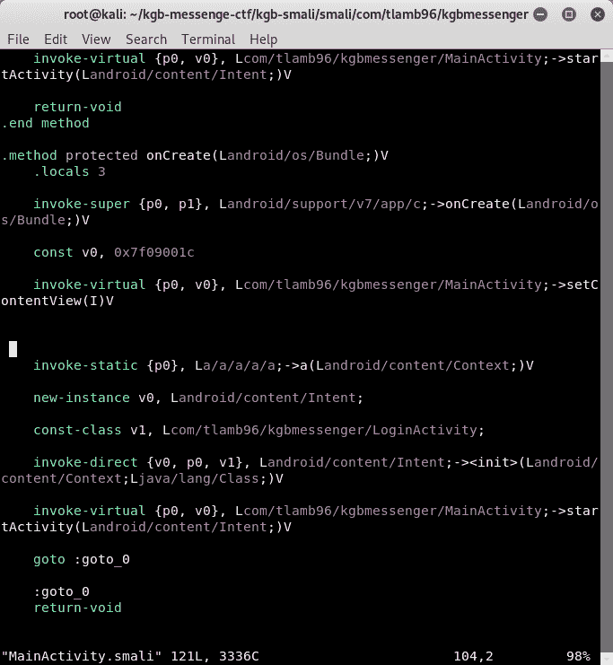

移除后

*注意:确保在删除代码后看起来像这样，并以* `*goto :go_to_0*`结束

## 构建 apk

做出更改后，我们需要构建 apk。所以我们使用 Apktool 构建 apk。

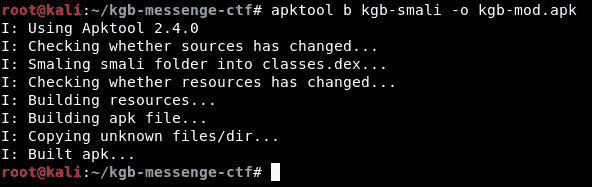

## 签署 apk

我们不能直接安装 apk。我们需要先在[和](http://www.androiddocs.com/tools/publishing/app-signing.html)上签字。然而，由于我们不是这个应用程序的原始开发者，我们将为此目的优步 Apk 签名。

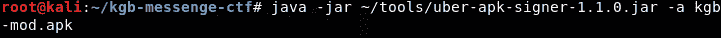

**注意:**我下载了优步 Apk Signer 并创建了一个名为 tools 的目录，然后将它移动到这个目录中

## 安装和运行修改后的 apk

现在当我们启动时，我们直接被带到`LoginActivity`。

现在我们必须找出用户名和密码是什么。让我们再次看看源代码，但是这次是使用`JD-GUI`的 LoginActivity

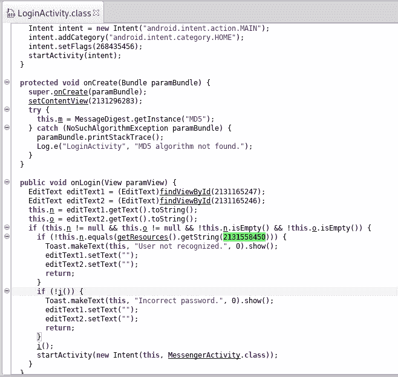

在`onLogin`方法中，我们有两个被转换成字符串的编辑文本。`EditText1`转换为字符串`n`，`EditText2`转换为字符串`o`。现在我们不知道哪个编辑文本对应于用户名和密码。

## 查找用户名

我们来看第一个嵌套的 if 条件，字符串`n`正在与 id 为`2131158450`的资源进行比较。所以我们再次将其转换为十六进制代码，并检查是否可以找到相应的字符串名称。

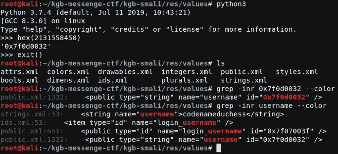

通过使用十六进制代码`2131158450`找到的 id，找到**用户名**值

所以用户名是 **codenameduchess** 。

## 查找密码

让我们尝试使用与用户名相同的方法来查找密码。

我们再次检查代码，可以看到函数`j`应该返回`false`。

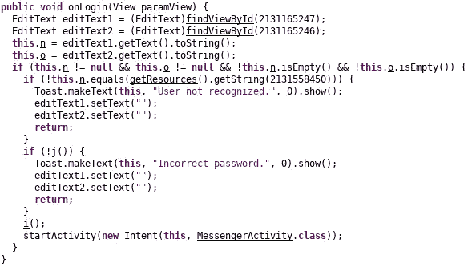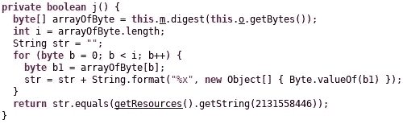

这里，使用 MD5 对字符串`o`进行哈希运算，然后与字符串资源 id `2131558446`进行比较。

我们试图从 strings.xml 中找到 hash 的值，并使用`findmyhash`找到它的原始值。

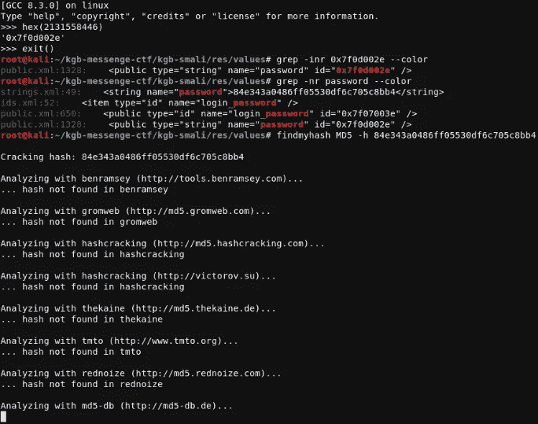

我们在`strings.xml`中获得散列值，但是当我们试图使用`findmyhash`来寻找散列的原始值时，我们没有获得任何结果。这个问题确实说了我们必须使用社会工程来获取密码。所以我们试着在谷歌上搜索**代号公爵夫人**。

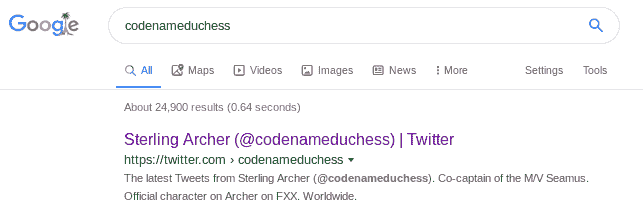

codenameduchess 的谷歌搜索结果

账户名**‘Sterling Archer’**也与第一个标志相符。所以我们来看看它的推特账户。

代号女公爵(斯特林·阿彻)的推特页面

看起来像是电视剧里的人物。我们现在尝试谷歌搜索`codename duchess password`。

代号公爵夫人密码的谷歌搜索结果

我们打开 PDF，并在其中搜索密码。

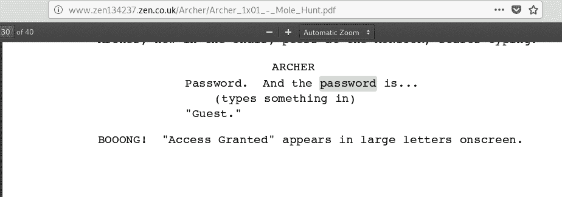

据此，密码为**客人**。于是我们输入密码为' **guest** '(全小写)。

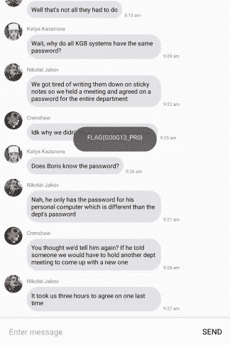

和..我们进去了。标志为 **G00G13_PR0** 。

## 检查哈希的值

只是为了好玩，让我们看看为什么我们找不到哈希。因此，当我们计算 guest 虚拟机的 MD5 哈希时，我们得到

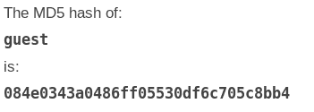

所以我们找不到结果的原因是我们的散列不完整(开始时没有零)。

# 捕捉第三面旗帜

*登录后，我们被带到 MessageActivity。在那里我们会找到第三面旗帜。*

所以我们用`JD-GUI`打开`MessageActivity`，我们来看看源代码。

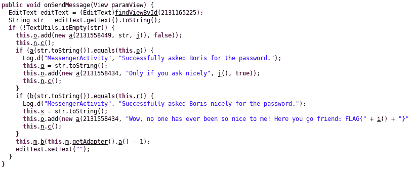

来自 MessageActivity 的函数 onSendMessage

每当我们发送消息时，`onSendMessage`函数被调用，使用 EditText 输入的文本被转换成字符串`str`。

现在，如果我们仔细观察，字符串 **str** 被传递给一个名为 **a** 的函数，在该函数上调用 equals 函数来检查它是否等于 **p** 。

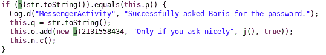

**p** 的值为:

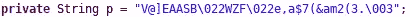

现在，让我们来看看功能`a`

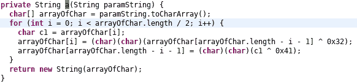

函数`a` 返回字符串。在此函数中，作为参数传递的字符串值通过以下方式获得:

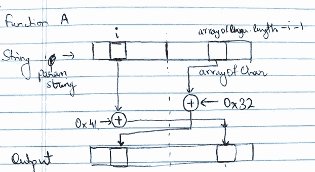

函数 a 的可视化表示

因此， **p** 的值等于传递给此函数 **a** 的参数字符串。因此，我们可以通过反向执行这些步骤来逆向工程出 **p** 的原始值。正如我们知道的`(A XOR B) XOR B = A`，我们可以用它来寻找字符串的原始值:

再次进行异或运算的函数的可视化表示

我们使用 Python 重新创建了上面的算法:

当我们运行这个文件时，我们得到

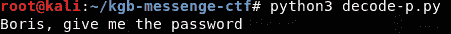

所以我们输入这个字符串作为应用程序的 EditText 的输入:

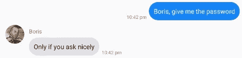

类似地，来自 EditText 的输入通过函数`b`传递，并检查它是否等于字符串`r`。

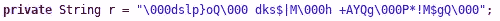

字符串 r 的值

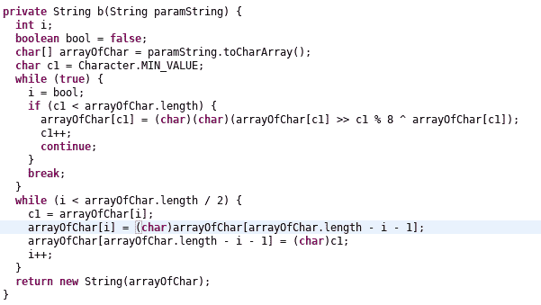

函数 b，其返回值与字符串 r 进行比较

在将 smali 代码转换为 java 类时，似乎出现了一些问题。代码可以重构，以便更好地理解。

只是函数 b 的可读版本

在这里，逆向工程是不可能的，所以我们试图强行进入。我们检查循环 iterable `i`和 alphabet 的值，我们得到输出`r`。

解码-r.py

运行这个文件后，我们得到了输出。

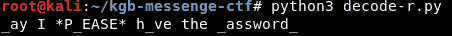

每第 8 个位置的值是' _ '，因为我们有 i%8 == 0。不管是什么字母，函数的输出都是 0，所以很难用蛮力找到答案。

所以消息可以是**我可以*请*有密码**吗？

让我们把这个消息

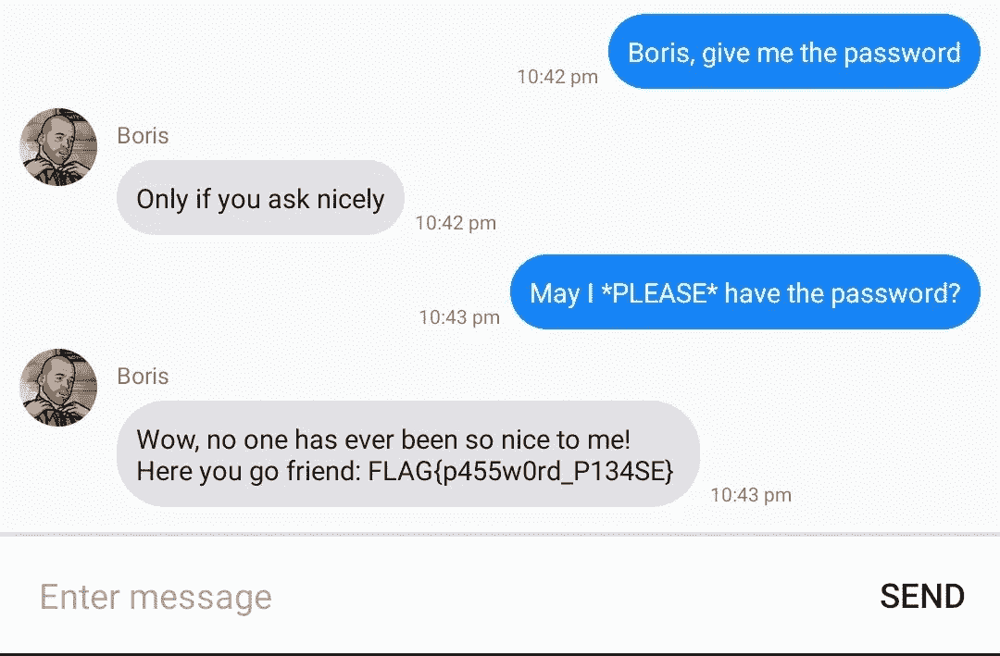

捕获第三面旗帜。

## 为什么不直接打这个消息而打之前的消息？

要理解这一点，我们需要看看旗帜是如何计算的。函数`i`负责计算标志。让我们看看如何

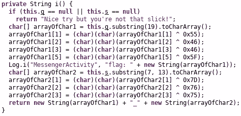

第一个条件检查字符串`q`和`s`是否不为空。也就是说，它们必须被初始化并设置为某个特定的值。我们不能像以前一样删除这个 if 条件，因为我们需要`q`和`s`的值来计算标志。

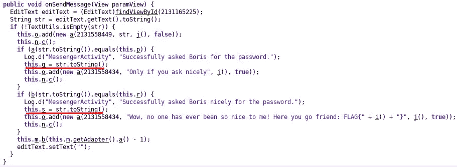

在函数 onSendMessage 中

只有在成功发送两个问题后，才会设置`q`和`s`的值。所以两个消息都要发。

这就是我对这个 CTF 的解决方案。这是我第一次参加 CTF，在这次挑战中我学到了很多。希望你也学到了一些东西。

感谢阅读我的文章！干杯！🍺

在 [Twitter](https://twitter.com/fake_batman_) 、 [Github](https://github.com/harshitm98) 上关注我，或者在 [LinkedIn](https://linkedin.com/in/harshitm98) 上联系我。

*关注* [*Infosec 报道*](https://medium.com/bugbountywriteup) *获取更多此类精彩报道。*

 [## 信息安全报道

### 收集了世界上最好的黑客的文章，主题从 bug 奖金和 CTF 到 vulnhub…

medium.com](https://medium.com/bugbountywriteup)