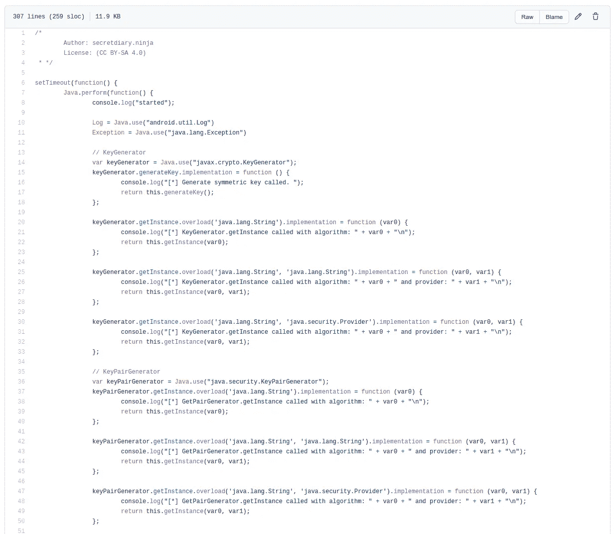
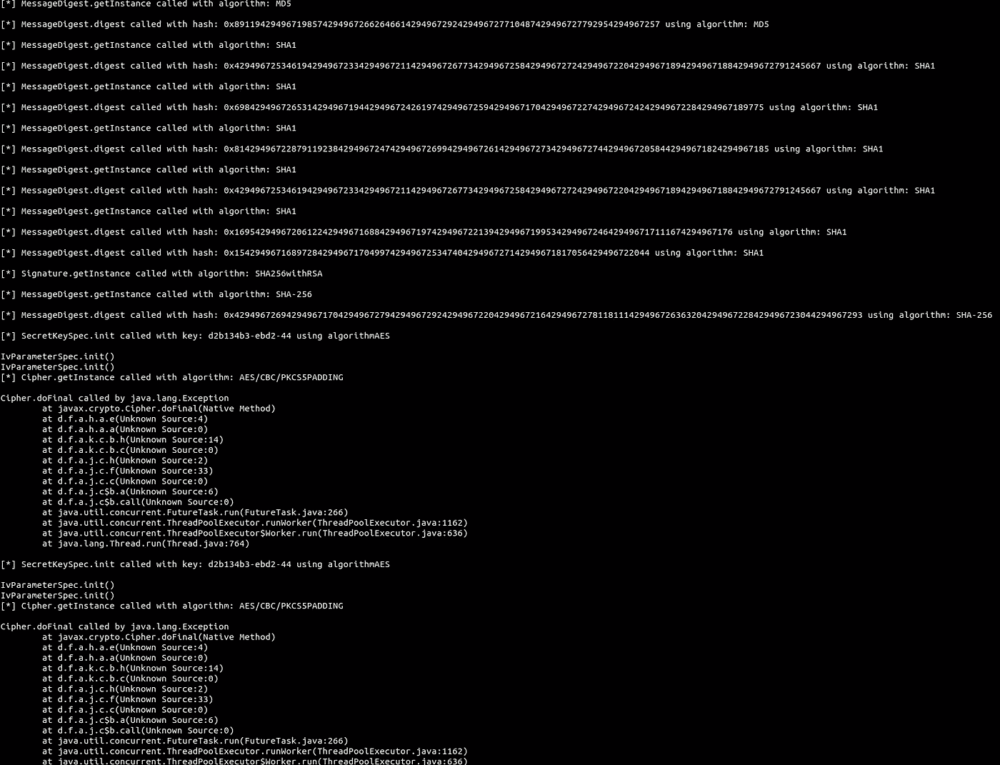
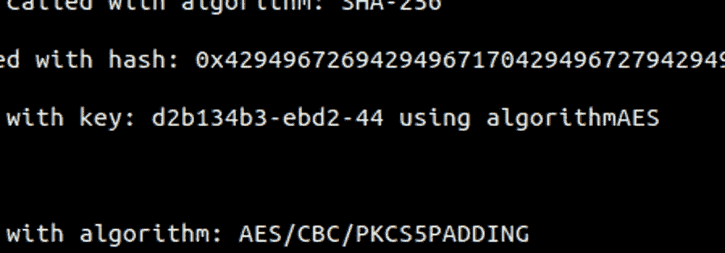

# Android 动态分析——使用 FrinJa 通用脚本

> 原文：<https://infosecwriteups.com/android-dynamic-analysis-using-frinja-generic-scripts-3717809a385b?source=collection_archive---------1----------------------->

乔纳森·肯珀在 [Unsplash](https://unsplash.com?utm_source=medium&utm_medium=referral) 上拍摄的照片

TL；DR Android 应用程序通用动态分析(快速和肮脏)的渗透测试使用 FrinJa。

FrinJa 是一个 Frida 套件，适用于忍者、渗透测试人员或安全研究人员，他们没有时间浪费在结果上，虽然他们可能很快就会有结果。

很多时候，研究人员希望在检查应用程序时得到一些结果。应用程序产生一些数据，这些数据由用户的动作触发。这样的数据是有价值的，无论何时这些数据都是 HTTPS 交通或加密方法的论据。

例如，如果一个人在登录时看到 Random()被实例化，这意味着在令牌生成过程中有可疑的事情**可能**正在发生。因此，当进行身份验证管理检查时，您可以更仔细地查看。

FrinJa 脚本位于我的 github 中:[https://github.com/ninjadiary/Secret_Diary_of_FrinJa](https://github.com/ninjadiary/Secret_Diary_of_FrinJa)

Its 分为以下几类:

*   密码系统
*   用户界面
*   平台互动
*   网络
*   数据/存储

这是密码学的一部分。

这是 cryptography.js 模块上挂钩的样子:

cryptography.js

当应用程序打开时，AES 密钥会显示多次

然而，在很多情况下，由于 Android APIs 的差异，脚本必须手动编辑。这些脚本已经在 Android 版本 6 和 Android 8 上进行了测试。

使用 FrinJa 可以对各种模块进行快速测试，以便对各种类别(如加密、存储、锁定和网络流量)进行初步评估。