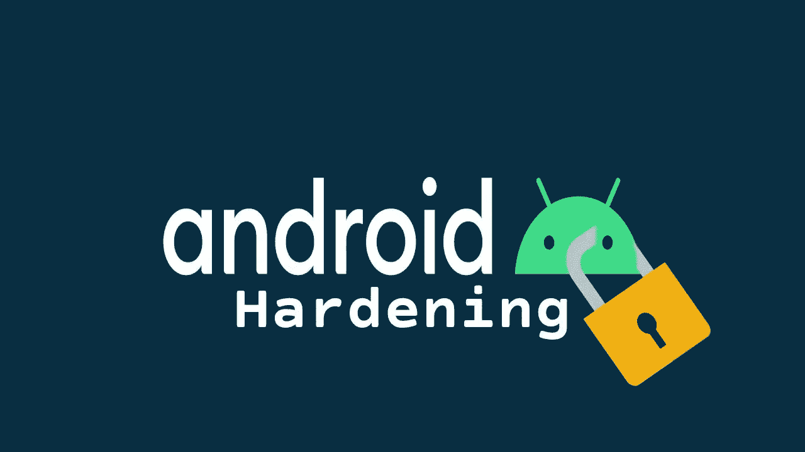
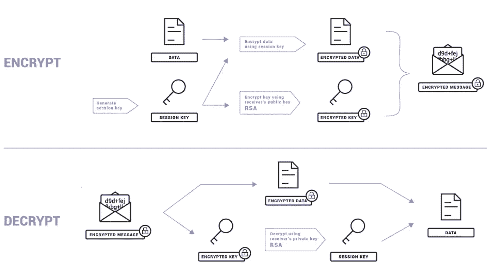
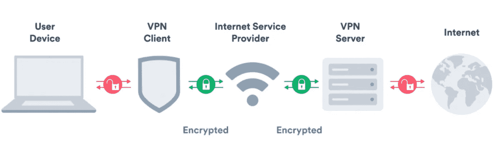

# Android 强化指南

> 原文：<https://infosecwriteups.com/android-hardening-guide-2439a77f7e83?source=collection_archive---------3----------------------->

在本帖中，我们将介绍如何利用领先的行业安全最佳实践来强化您的 Android 设备，如 CIS 基准、全球公认的加密标准和隐私改善应用程序。这是任何拥有 Android 设备的人都应该阅读的一本书，所以不再多说，让我们在您的安全性方面引起轰动。

# 目录

[1。为什么要加固您的 Android 设备？](#b931)
[2。基准&基线](#e32b)t5】∘[2.1。独联体基准](#7f43)
∘ [2.2。美国国防部 STIG](#434e)
[3。通信](#2cc1)
∘ [3.1。消息传递](#4e1d)
∘ [3.2。电子邮件](#02a8)
[4。VPN](#e660)
[5。其他应用&保护](#b8cb)
[6。清单](#1216)
[参考文献](#ce85)

# 1.为什么要加固您的 Android 设备？

2022 年初，Proofpoint (2022)的研究人员检测到，欧洲的移动恶意软件交付尝试激增了 500%。众所周知，黑客们注意到了移动设备在不断扩大的远程工作世界中日益增长的价值，并采取了行动。尽管知道攻击不断增加，但据报道，超过 80%的 Android 设备容易受到至少 1/25 的漏洞的攻击。这不是一个小数字，其结果可能会对您或您组织的敏感数据造成灾难性的影响。

因此，当处理和配置您的 Android 设备时，采取所有必要的预防措施以确保它们是安全的并且不会成为另一个统计数据是至关重要的。本页面旨在为读者提供所有必要的基本安全参考和最佳实践，以确保您的设备是安全的。

# 2.基准和基线

## 2.1.CIS 基准

CIS，也称为互联网安全中心，开发并提供文档，如用户和企业消费的 CIS 基准。如果您不熟悉什么是 CIS 基准，它们是全球数千家企业使用的文档，定义了用于强化包括 Android 操作系统(OS)在内的各种系统的规范性基准安全标准。Android OS CIS 基准建议包括如下控制:确保您的设备保持最新；确认您的设备配置了适当的屏幕锁定；避免不可信的网络；等等。

因此，建议下载 CIS Android OS 性能指标评测指南并将其应用到您的 Android 设备上。您可以在下面的链接中找到 CIS Android 性能指标评测。[https://www.cisecurity.org/benchmark/google_android](https://www.cisecurity.org/benchmark/google_android)

但是，在应用安全控制时，一定要考虑您的个人或业务环境，包括潜在的权衡，这一点很重要。您可能会发现，并非 CIS 基准中的所有建议都能像我们一样满足您的需求。例如，我们 Deep Dive Security 相信更加以隐私为中心的观点，因此选择不遵循建议 1.19 (L1)确保“改进有害应用程序检测”设置为“启用”(手动)，这将向 Google 发送使用数据。同样，CIS 建议禁用设备上的定位功能，同时明确指出，如果被跟踪，损失可能是无法定位丢失的设备。用户和安全人员在选择遵循某个建议之前，应该充分理解其中的利弊。咨询适当的文档或人员以获得决策方面的帮助。

## 2.2.美国国防部 STIG

与 CIS 基准一样，美国国防部(DoD)也有安全技术实施指南，也称为 STIGs。STIGs 实际上与 CIS 基准一样，但有一个重要的警告。STIGs 仅包含为美国国防部基线选择的政策和安全控制。考虑到 CIS 基准和美国国防部 STIG 都是系统安全基准，您可能会问，您使用哪一个？在某些情况下，监管要求会为你做出决定。通常情况下，这是一个最适合你或你的公司的决定。当然，如果你不想拘泥于一个标准，你可以两个都用，然后根据自己的需求定制。例如，撰写本文时的 CIS 基准建议 1.2 (L1)确保“屏幕锁定”设置为“启用”(手动)，但没有规定最小密码长度或类型，而美国国防部 STIG 建议最小设备密码长度为 6+数字(复杂)字符。这可能是一个重要的区别，取决于您的威胁模型，因为一些国家的法律允许执法机构在使用生物识别技术保护时强制用户解锁其设备，而在使用密码保护时不允许此类操作。用户可以也应该审查他们的威胁模型，并相应地实施控制。

因此，建议在适当的时候，也下载并应用美国国防部的 Android STIG 到您的 Android 设备上。你可以在下面的链接找到美国国防部的安卓 STIG。[https://public.cyber.mil/stigs/downloads/?_dl_facet_stigs=mobility](https://public.cyber.mil/stigs/downloads/?_dl_facet_stigs=mobility)

# 3.通信

除了安全基线配置之外，我们 Deep Dive Security 认为 Android 加固还应该包括一些核心用户功能。以下指南旨在建立在基线基准之上，以提高用户通信安全性。

## 3.1.信息发送

不可否认，Android 设备最重要的核心功能之一是消息功能。然而，如此多的消息应用仍然依赖于不安全的短消息服务/多媒体消息服务(SMS/MMS)技术，该技术通过开放网络以明文形式发送用户的消息；输入信号协议。signal 协议是一种实现端到端(E2E)加密以提高通信安全性的消息协议，自其诞生以来，现已被世界上一些最大的公司(如谷歌和微软)所采用。signal 协议更进一步，还提供参与者一致性、目的地验证、前向保密、未来保密、因果关系保持、消息不可链接性、消息否认、参与否认和异步。

由于上述特性和功能，signal 协议已经成为消息安全的事实上的标准，因此是提高用户的 Android 消息和语音呼叫的安全性的推荐补充。用户可以通过 Play Store 的[信号应用](https://play.google.com/store/apps/details?id=org.thoughtcrime.securesms)利用信号协议。

## 3.2.电子邮件

在全球范围内，电子邮件每天积累超过 3330 亿封(Statista，2022)。显然，电子邮件是 Android 设备的主要用途，需要适当的关注以确保它们的安全。因此，电子邮件的安全与您的消息传递能力同等重要，应该遵循相同的 E2E 加密模型。这一页将重点放在终端用户和他们相关的 Android 电子邮件客户端。因此，某些技术超出了本页面的范围，如发件人策略框架(SPF)、域名密钥识别邮件(DKIM)和基于域的邮件身份验证、报告和一致性(DMARC)，这些技术可以帮助组织防止电子邮件欺骗和网络钓鱼。关于这些技术的更多信息，请参考 NIST (2019a)，*可信邮件*。

关于电子邮件客户端，他们通常通过简单邮件传输协议(SMTP)进行连接，并通过邮局协议第 3 版(POP3)或互联网消息访问协议(IMAP)进行接收。在所有情况下，都应该使用最新版本的传输层安全性(TLS)来保护这些内容。TLS 将有助于在数据传输过程中保护元数据、电子邮件标题和登录详细信息。除了 TLS 之外，还应该使用安全/多用途互联网邮件扩展(S/MIME)或 Pretty Good Privacy (OpenPGP)对电子邮件正文进行加密，以保护静态和传输中的内容。对于某些人来说，推荐使用带有由已知 CA 签名的证书的 S/MIME；用户应该检查他们的威胁模型，以确定哪种方法最适合他们自己的要求。

**图一。**

*使用 PGP 的邮件加密和解密流程*

注意。使用 PGP 的电子邮件加密和解密程序。来自*什么是 PGP 加密，它是如何工作的？* by 质子 2019 年 8 月 8 日。([https://proton.me/blog/what-is-pgp-encryption](https://proton.me/blog/what-is-pgp-encryption))。

幸运的是，Android 上绝大多数知名的电子邮件客户端/公司都为你处理了加密的负担。例如，总部设在瑞士的 Proton (n.d .)公司以其隐私而闻名，该公司称，Proton Mail 用户之间发送的电子邮件总是进行 E2E 加密，对于非 Proton 邮件收件人，可以通过他们的密码保护电子邮件或 PGP 进行 E2E 加密。同样，这些电子邮件被声称存储在质子的服务器上使用他们的零访问加密，因此不能被质子自己阅读。如果有兴趣，个人可以通过 Play Store 的[质子邮件应用](https://play.google.com/store/apps/details?id=ch.protonmail.android)利用质子邮件。如果选择使用不同的电子邮件提供商/客户端，用户应确认符合必要的加密标准。

# 4.虚拟专用网络

如果您在这个页面上，您可能听说过虚拟专用网络(VPN ),并且可能在许多其他最佳实践或安全指导网站上看到过它。虽然您可能已经在使用 VPN 来帮助您观看不同国家版本的网飞的最新热门节目，但 VPN 实际上也提供了一些重要的安全好处。如果您倾向于使用公共 Wi-Fi 服务，或者生活在一个以审查为主的国家，在那里您需要对您的互联网服务提供商(ISP)隐藏您的活动，VPN 的安全优势就特别有用。

那么它是如何工作的呢？VPN 的工作原理是在你和互联网之间建立一个加密的通信隧道。这意味着你的 ISP，或者可能是任何其他窥探者，将不再能够看到你的流量内容，因为你已经把你的信任从没有加密你的流量的 ISP 转移到加密你的流量的 VPN 提供商。正如您可能已经猜到的，这种方法有一些缺点。例如，由于您现在将您的信任从您的 ISP 转移到 VPN 提供商，您必须进行尽职调查，确认 VPN 提供商满足您的安全要求。如果你更注重隐私，你可以寻找一个接受现金或 Monero 加密货币的 VPN，提供无登录策略，并驻留在特定国家之外。这将取决于您或您的组织的特定威胁模型，应该仔细检查。就我个人而言，我推荐 NordVPN，因为他们的总部在 14 个眼睛监视国家之外的 Panema，他们是第三方审计，他们宣传无记录政策，他们提供现金或加密货币支付。

**图二。**

*NordVPN 推广*

注意。如果通过上述链接购买，Deep Dive Security 可能会获得代销商佣金。

从更积极的方面来看，如果我们从公共 Wi-Fi 和中间人(MITM)场景来看使用 VPN，VPN 可以通过加密传输中的数据来保护您的数据免受 MITM 攻击，从而防止明文数据被拦截。这里需要注意的是，在数据继续到达目的地之前，解密发生在 VPN 服务器上。因此，用户继续确保他们访问的网站使用最新版本的 TLS 至关重要。

VPN 的基本数据流如下(VPNOverview，2022):

1.  您计算机上的 VPN 软件对您的数据流量进行加密，并通过安全连接将其发送到 VPN 服务器。数据也通过你的互联网服务提供商，但由于加密，他们不能再窥探。
2.  VPN 服务器会解密来自您计算机的加密数据。
3.  VPN 服务器会将你的数据发送到互联网上，并收到回复，这是给你，用户的。
4.  然后流量被 VPN 服务器再次加密并发送给你。
5.  你设备上的 VPN 软件将解密数据，这样你就可以真正理解和使用它。

请参见下面的图 2，它直观地展示了加密在 VPN 数据流中的位置。

**图三。**

*VPN 架构*

注意。VPN 技术说明。从*什么是 VPN？Surfshark，n . d .([https://surfshark.com/learn/what-is-vpn](https://surfshark.com/learn/what-is-vpn))的虚拟专用网络 101* 。

# 5.其他应用和保护

至此，我们已经讨论了基准安全、消息和电子邮件标准，以及基于网络的保护，如 VPN。为了更进一步，我们现在来看一种深度防御方法，假设设备已经遭到破坏。你能做些什么来保护你的数据和应用免受已经绕过你的主 Android 锁屏的恶意攻击者的攻击？

对于三星设备用户来说，答案很简单，由 Knox 保护的三星安全文件夹。三星安全文件夹利用三星 Knox Workspace 双重角色容器技术来“分离、隔离、加密和保护数据”(三星，2016)。Samsung Secure Folder 允许用户将文件(包括图像)存储在一个单独的、受密码保护的位置。同样，三星 Secure Folder 为用户提供了导入和密码保护特定应用程序的功能，使其远离日常应用程序。一个示例用例可能是用户使用一个保持登录会话的应用程序。对于这个例子，我们说它是社交媒体应用程序 SnapChat。因此，主 Android 锁屏的泄露或者用户只是忘记他们的设备已解锁并去了洗手间，都可能导致用户 SnapChat 帐户的泄露。这可能导致假冒攻击、数据丢失或进一步的危害。然而，如果用户通过使用三星安全文件夹和密码保护他们的 SnapChat 应用程序来遵循深度防御方法，恶意行为者将需要绕过第二层安全来实现任何目标。用户可以通过 Play Store 上的[安全文件夹应用程序](https://play.google.com/store/apps/details?id=com.samsung.knox.securefolder)使用三星的安全文件夹。

虽然 Samsung Secure Folder 是为您的 Android 设备添加深度防御方法的一种方式，但 Play Store 中有几个应用程序声称可以提供相同的功能。重要的是，如果选择走这条路，审查应用程序的声明和文件，以确认它们是安全的使用。

# 6.清单

用一个快速清单来总结，用户/组织应该确认他们已经完成了以下内容。

*   1.评估、定制(如果需要)，并应用 Android CIS 基准
*   2.评估，必要时定制，并应用美国国防部的安卓 STIG
*   3.下载、配置和使用支持信号协议的信息应用程序
*   4.为电子邮件正文加密配置和使用 PGP 或 S/MIME
*   5.确认 SMTP、POP3 和 IMAP 正在使用 TLS
*   6.评估、购买、启用和配置 VPN
*   7.通过利用应用程序锁和/或安全文件存储，应用深度防御方法

# 参考

互联网安全中心。(2022 年 4 月 4 日)。 *CIS 谷歌安卓基准*。【https://www.cisecurity.org/benchmark/google_android】T4。

谷歌。(2022 年 2 月)。*消息端到端加密概述*。https://www.gstatic.com/messages/papers/messages_e2ee.pdf[。](https://www.gstatic.com/messages/papers/messages_e2ee.pdf)

NIST。(2007 年 2 月)。*电子邮件安全指南*。[https://nvl pubs . NIST . gov/NIST pubs/Legacy/SP/NIST special publication 800-45 ver 2 . pdf](https://nvlpubs.nist.gov/nistpubs/Legacy/SP/nistspecialpublication800-45ver2.pdf)。

NIST。(2019a 年 2 月)。*值得信赖的邮件*。[https://nvlpubs.nist.gov/nistpubs/SpecialPublications/NIST.SP.800-177r1.pdf](https://nvlpubs.nist.gov/nistpubs/SpecialPublications/NIST.SP.800-177r1.pdf)。

NIST。(2019 年 8 月)。*传输层安全(TLS)实施的选择、配置和使用指南*。[https://nvlpubs.nist.gov/nistpubs/SpecialPublications/NIST.SP.800-52r2.pdf](https://nvlpubs.nist.gov/nistpubs/SpecialPublications/NIST.SP.800-52r2.pdf)。

证明点。(2022 年 3 月 9 日)。*移动恶意软件在欧洲激增:看看最大的威胁*。[https://www . proof point . com/us/blog/email-and-cloud-threats/mobile-malware-surging-Europe-look-maximum-threats](https://www.proofpoint.com/us/blog/email-and-cloud-threats/mobile-malware-surging-europe-look-biggest-threats)。

质子。(未注明)。*质子邮件加密解释*。[https://proton.me/support/proton-mail-encryption-explained](https://proton.me/support/proton-mail-encryption-explained)。

质子。(2019 年 8 月 8 日)。*什么是 PGP 加密，它是如何工作的？*。[https://proton.me/blog/what-is-pgp-encryption](https://proton.me/blog/what-is-pgp-encryption)。

三星。(2016 年 8 月)。*白皮书:三星 Knox 平台概述*。[https://KP-cdn . samsungnox . com/df 4184593021 d7b 8 fabbdfeff 5c 318 ba . pdf](https://kp-cdn.samsungknox.com/df4184593021d7b8fabfdfeff5c318ba.pdf)。

信号。(未注明)。*技术信息*。[https://signal.org/docs/](https://signal.org/docs/)。

Statista。(2022 年 7 月 26 日)。【2017 年至 2025 年全球每天收发的邮件数量。[https://www . statista . com/statistics/456500/daily-number-of-e-mail-world wide/](https://www.statista.com/statistics/456500/daily-number-of-e-mails-worldwide/)。

冲浪鲨鱼。(未注明)。*什么是 VPN？虚拟专用网络 101* 。[https://surfshark.com/learn/what-is-vpn](https://surfshark.com/learn/what-is-vpn)。

美国国防部。(未注明)。 *STIGs 文档库*。[https://public.cyber.mil/stigs/downloads/?_dl_facet_stigs=mobility](https://public.cyber.mil/stigs/downloads/?_dl_facet_stigs=mobility) 。

VPNOverview。(2022 年 5 月 19 日)。 *VPN 解释:它是如何工作的？你为什么要用它？*。https://vpnoverview.com/vpn-information/what-is-a-vpn/。

准备好让您的网络安全技能更上一层楼了吗？请关注我，了解最新的行业标准最佳实践和指导。

## 来自 Infosec 的报道:Infosec 每天都有很多内容，很难跟上。[加入我们的每周简讯](https://weekly.infosecwriteups.com/)以 5 篇文章、4 个线程、3 个视频、2 个 GitHub Repos 和工具以及 1 个工作提醒的形式免费获取所有最新的 Infosec 趋势！