# Android 安全银行 2 演练:第 1 部分

> 原文：<https://infosecwriteups.com/android-insecurebankv2-walkthrough-part-1-9e0788ba5552?source=collection_archive---------0----------------------->

在本文中，我将看看 GitHub 用户 *dineshshetty* 创建的 *InsecureBankv2* Android 应用程序。根据创建者的说法，这个易受攻击的 Android 应用程序是为了让开发人员和安全爱好者通过测试一个有目的的易受攻击的 Android 应用程序来了解更多关于 Android 不安全性的信息。我在下面的参考资料中留下了应用程序 GitHub 库的链接，它提供了应用程序中当前存在的所有漏洞的列表。


# 放弃

出于学习更多关于 Android 移动应用程序安全性的兴趣，我写了这篇文章。这篇文章显然会包含关于*安全银行 v2* Android 应用程序中存在的漏洞的剧透。我鼓励读者尽可能多地利用漏洞，如果您遇到困难或希望看到利用不安全的潜在不同方法，请稍后再来阅读本文。没有任何进一步的延误，让我们开始设置😃！

# 设置

该应用程序的创建者在他们的 GitHub 上提供了关于如何设置应用程序及其后端服务器的详细指南(**参见参考资料**)。对于本文，我使用一个 *Kali Linux* 虚拟机作为我的主机设备，使用 Genymotion 创建的一个 *Samsung Galaxy S8* 仿真器作为我的测试设备。我还配置了两个虚拟机来使用 **NAT** 和**主机专用**网络适配器。我的 Android 模拟器的规格可以在下图中看到。

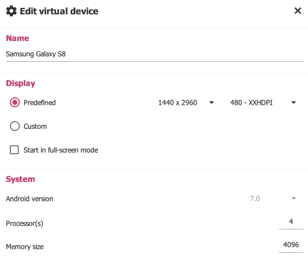

为了设置 **AndroLab** 服务器，我首先将应用程序的 GitHub 库克隆到我的 Kali 机器上，然后使用 **pip** 安装必要的需求。

```
pip install -r requirements.txt
```

一旦安装了所有的需求，我就在默认端口 8888 上运行 HTTP 服务器。

```
python app.py
```

接下来，我使用 **Android 调试桥** (ADB)连接到我的仿真器，并安装了 *InsecureBankv2* APK 文件。

> 注意:**Android Debug Bridge(ADB)**是一款多功能命令行工具，可让您与设备进行通信。adb 命令有助于各种设备操作，如安装和调试应用程序，它提供了对 Unix shell 的访问，您可以使用该 shell 在设备上运行各种命令。

```
adb connect "your-host-only-ip-address"
adb install InsecureBankv2.apk
```

成功安装后，应用程序图标会出现在我的模拟器上


安装完成后，最后一步是打开应用程序，将应用程序指向运行 AndroLab 服务器的 IP 地址和端口。在我的例子中，这是我的 Kali 机器的唯一的网络适配器和端口的 IP 地址。

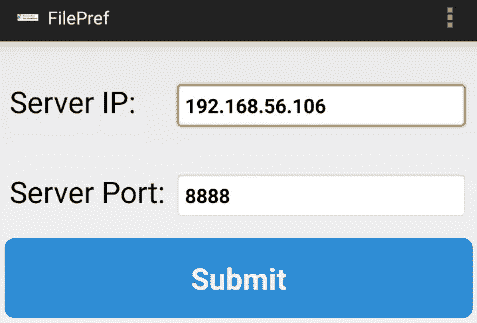

单击提交后，将成功配置网络首选项设置。为了查看应用程序是否连接到服务器，我可以尝试使用一组不正确和正确的凭据登录。当我尝试登录时，会生成以下输出，显示该应用程序能够与 AndroLab 服务器通信。

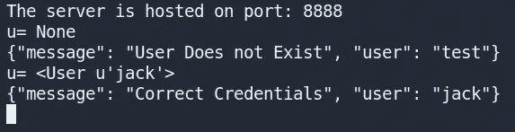

为了结束我的设置，我使用了**移动安全框架** ( *MobSF* )工具来反编译 *InsecureBankv2.apk* 文件。这使得反编译 APK、读取清单文件、识别源代码和清单文件中的问题、提取应用程序的证书等过程自动化。让我不必手动完成这项工作。

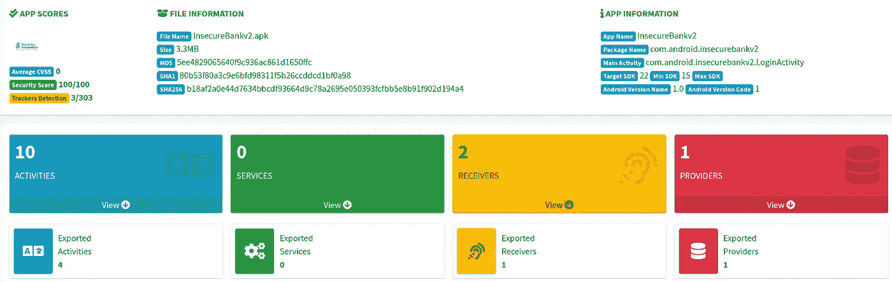

我的设置到此结束，现在我可以继续测试应用程序中的漏洞了。

# 登录漏洞

当用户启动应用程序时，该应用程序为用户提供一个登录名。


此登录会发现许多不同的安全问题，下面的小节将对此进行概述。

## 登录旁路

利用 *MobSF* 收集的信息，我决定从查看 **AndroidManifest.xml** 文件开始。浏览这个文件的内容，我注意到有四个活动被导出。

> 注意:一个 **Android 活动**是 **Android** 应用程序用户界面的一个屏幕。在这种情况下，Android 活动非常类似于桌面应用程序中的 windows。一个 Android 应用程序可能包含一个或多个活动，即一个或多个屏幕。

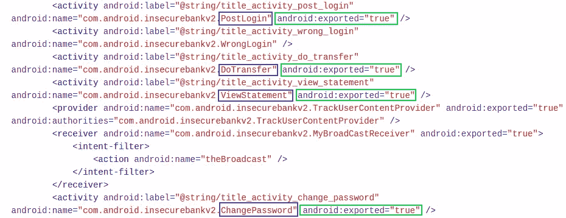

我假设活动名称“ *PostLogin* ”表示我登录(“post”)后显示的活动。使用 ADB，我可以调用这个导出的活动。

```
adb shell am start -n com.android.insecurebankv2/com.android.insecurebankv2.PostLogin
```

这让我想到了一个只有在成功登录后才可用的新活动，演示了可以完全绕过登录。

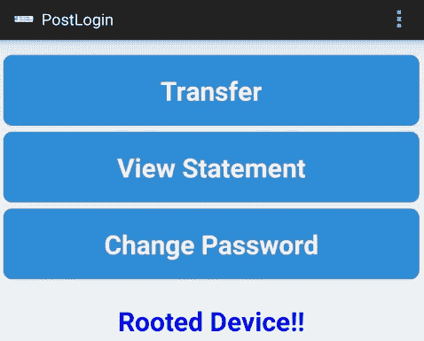

## 为管理员隐藏创建用户按钮

我决定查看一下“ *LoginActivity* ”源代码，看看是否还有其他可利用的漏洞。

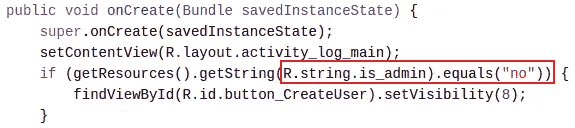

我发现登录活动有一个隐藏的按钮。执行检查以确定名为“ *is_admin* ”的资源字符串是否被设置为“ *no* ”。如果这是真的，那么使用“ *setVisibility(8)* ”方法将按钮设置为不可见，而不占用任何布局空间。我可以通过修补应用程序并将该值从“*否*”更改为“*是*”(**参见参考文献**)。我使用 **apktool** 来反编译 APK，这将创建一个新文件夹，其中包含所有反编译的资源文件。

```
apktool d InsecureBankv2.apk
```

由于这是一个字符串资源，我需要修改的值应该位于 **strings.xml** 文件中的“ */res/values/* ”目录下。我打开这个文件，将“*是 _ 管理*”值从“*否*”更改为“*是*”，然后保存更改。

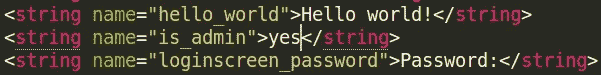

我再次使用 **apktool** 用现在修改过的 **strings.xml** 文件重新构建应用程序。

```
apktool b -f -d InsecureBankv2/
```

移动应用程序不允许您在没有签名的情况下在模拟器/手机上安装重建的 APK。为此，我需要使用下面的命令创建一个**密钥库**。在创建密钥库时，必须指定一个**密码**，稍后会用到它。创建密钥库时显示的其他字段可以简单地留空。

```
keytool -genkey -v -keystore ctf.keystore -alias ctfKeystore -keyalg RSA -keysize 2048 -validity 10000
```

创建了密钥库之后，我现在可以使用一个名为 **jarsigner** 的工具对 APK 进行签名了。当提示输入密码时，我提供了之前创建密钥库时使用的密码。

```
jarsigner -verbose -sigalg SHA1withRSA -digestalg SHA1 -keystore ctf.keystore InsecureBankv2/dist/InsecureBankv2.apk ctfKeystore
```

接下来，我验证 APK 已经使用 **jarsigner** 签名了。

```
jarsigner -verify -verbose -certs InsecureBankv2.apk
```

最后，使用名为 **zipalign** 的工具对准 apk，以实现最佳装载。

```
zipalign -v 4 InsecureBankv2.apk InsecureBankv2-aligned.apk
```

在使用 ADB 安装我的新 APK 之前，我从我的模拟器中卸载了应用程序的未更改版本，其中“ *is_admin* ”字符串资源设置为“ *yes* ”。

```
adb install InsecureBankv2-aligned.apk
```

成功安装后，我打开应用程序，一个名为“*创建用户*的新按钮出现了。


然而，查看" *createUser()* "方法的源代码可以看出，该按钮实际上并不允许我们创建用户，因此这就得出该漏洞的结论。

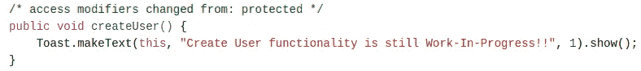

## 开发者登录

我决定仔细看看当选择登录按钮时启动的“ *LoginActivity* ”的“ *performLogin()* ”方法。

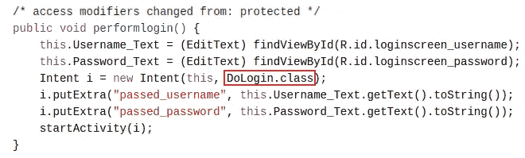

该方法创建一个新的 intent，该 intent 启动“ *DoLogin* ”活动，并将用户输入的凭证作为参数传递给该活动。查看这个活动的源代码，发现了一个有趣的方法，叫做“ *postData()* ”。

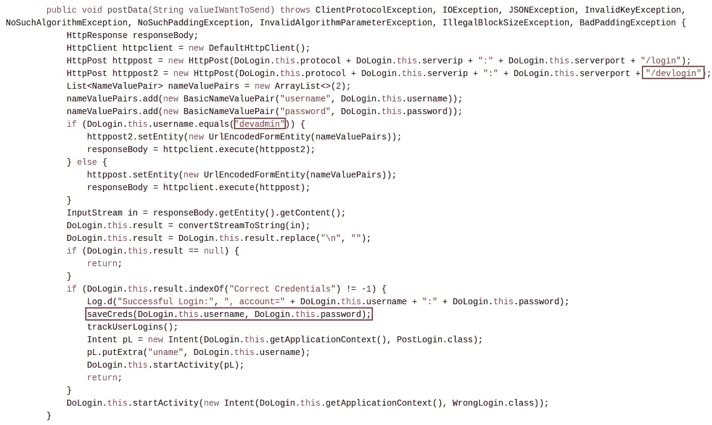

这个方法用于向服务器发送登录凭证，但是我发现如果提供了用户名“ *devadmin* ”，那么凭证将被发送到另一个名为“ */devlogin* ”的端点。我发现，如果我输入用户名“ *devadmin* ”，然后提供任何密码，我都可以成功登录。

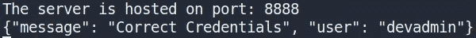

有趣的是，当用户登录时，使用“ *saveCreds()* ”方法保存凭证。这个方法的代码可以在下面看到。

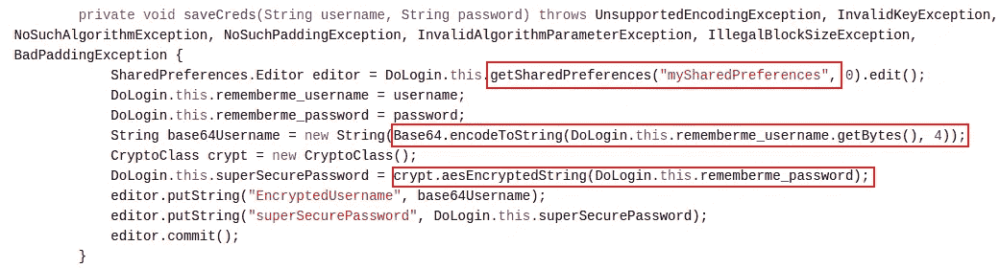

这个方法创建一个名为“ *mySharedPreferences* 的新文件，如果它还不存在的话。然后，该方法使用 **base64 编码**用户名，并使用 **AES 加密**加密密码，然后将它们存储在共享首选项文件中。每当用户使用其凭据成功登录时，该文件都会被覆盖。稍后知道这一点很重要…(伏笔)😏。

## 凭证的不安全存储

登录活动使用户能够自动填充凭证，以避免他们每次登录时都必须输入用户名和密码。查看" *LoginActivity* "源代码，我可以看到一个名为" *fillData()* "的方法执行这个函数。

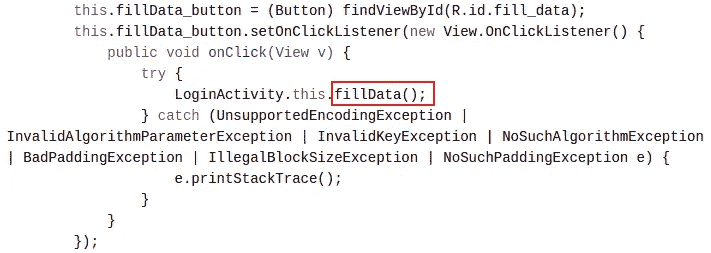

这个方法的代码可以在下面看到。

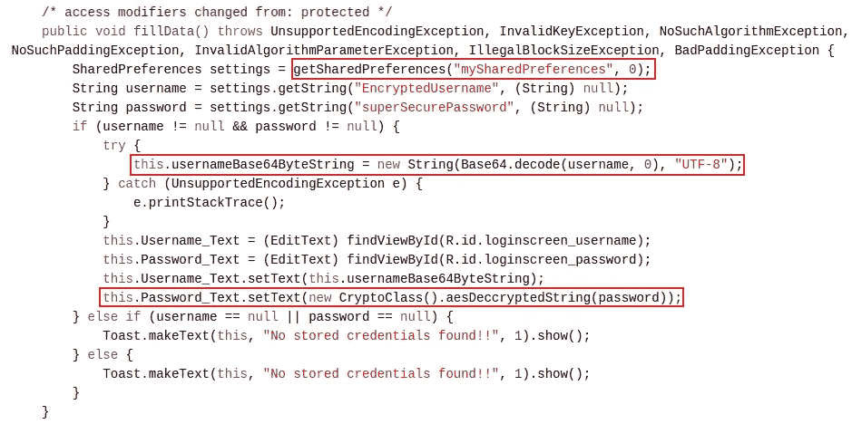

“ *fillData()* ”方法正在打开一个名为“ *mySharedPreferences* ”的文件，我之前在检查“DoLogin”活动源代码时看到这个文件是由“ *saveCreds()* ”方法创建的。在用于填充登录输入字段之前，用户名和密码分别被解码和解密。我可以使用 **ADB** 来识别“ *mySharedPreferences* ”文件存储在 *Insecurebankv2* 应用程序的私有目录中的什么位置

> 注意:除非您至少成功登录一次，否则不会创建该文件。

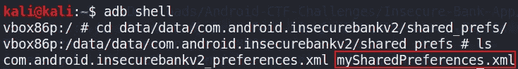

使用 **ADB** ，我可以将文件拉到我的本地机器上进行进一步检查。

```
adb pull /data/data/com.android.insecurebankv2/shared_prefs/mySharedPreferences.xml
```

查看文件，我可以看到用户名和密码是 base64 编码的。

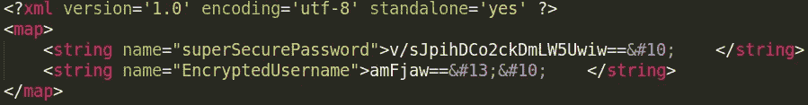

通过查看之前的源代码，我知道用户名只进行了 base64 编码。使用一个在线工具，如 **CyberChef** ，我可以破解用户名。

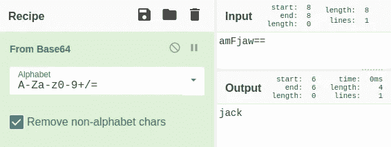

阅读前面的源代码，我还可以看到密码是用一个名为“ *CryptoClass* ”的类中的一个名为“*aesecuredtstring()*的方法加密的。查看这个类的源代码，我看到开发人员使用 AES 加密和**密码块链接(CBC)** 模式，但是使用了**静态初始化向量**和**硬编码加密密钥**。

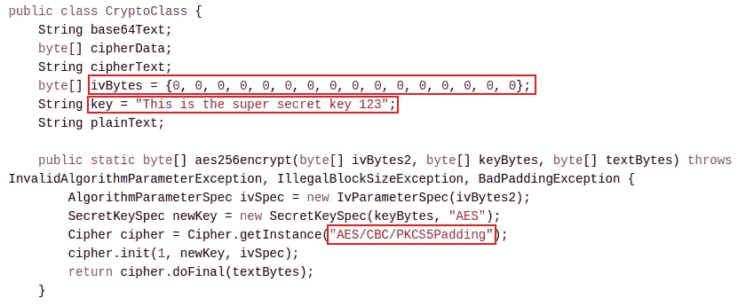

出于学习目的，我决定演示几种不同的方法来检索密码😃。

第一种方法是简单地使用一个在线工具，如 **CyberChef** 并插入所需的信息(即加密密钥、iv、密文)来解密密码。对于这种方法，我解码了 base64 密码，并将其编码为**十六进制**，然后将其输入到**网络黑客**工具中。这样就成功解密了存储在“mySharedPreferences”文件中的密码(即 Jack@123$)，如下图所示。

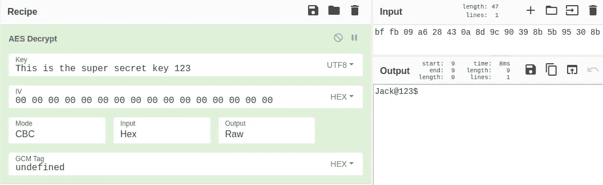

另一种方法是创建一个简单的 python 脚本，并使用如下所示的" *pycryptodome* "包来解密密码。

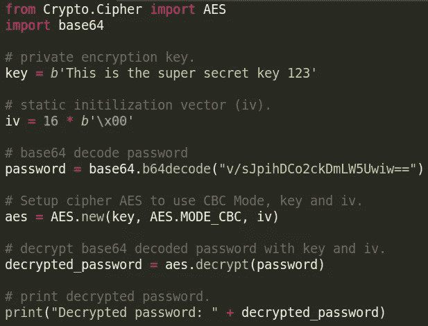

我的最后一个方法演示了如何使用一个名为 **Frida** 的工具，使用应用程序自己的方法之一来解密密码。我找到了一个指南，它提供了一个有用的例子(**见参考文献**)，告诉我如何用自己的参数挂钩和调用一个函数。这可以用来挂接“ *CryptoClass* ”中一个名为“ *aesDeccryptedString()* ”的函数，该函数取一个字符串参数，然后用我自己的参数(即加密的密码)调用它，然后解密。JavaScript 代码(挂钩)如下所示:

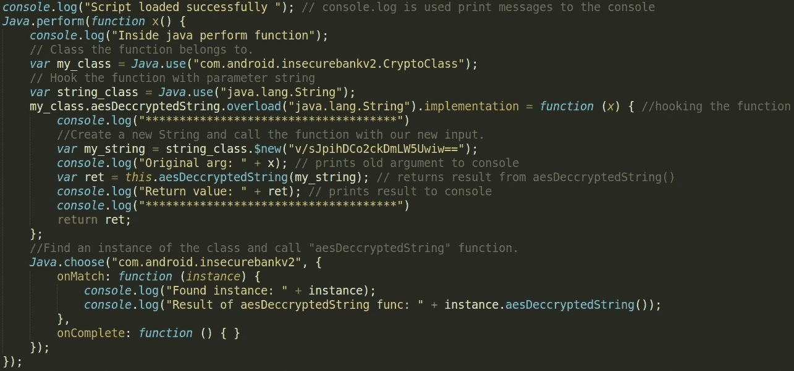

下面提供了用于加载这个钩子的 python 脚本。

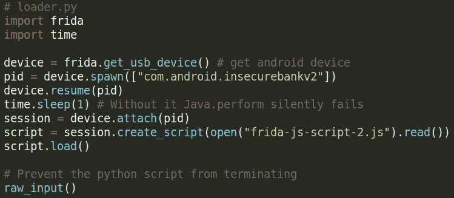

我确保 **Frida 服务器**正在我的模拟器上运行，然后执行我的 python 脚本来注入 JavaScript 代码。一旦我的脚本成功加载，我需要单击“*自动填充凭证*”按钮，这将导致“ *aesDeccryptedString()* ”方法被调用，它的参数将被我的新参数(即加密的密码)覆盖。这成功地解密了密码。

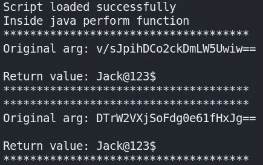

在我的输出中，我首先尝试自动填充用户“ *jack* ”的凭证，作为概念证明，我们已经知道了他的密码。然后，我尝试自动填充用户" *dinesh* "的凭证，但正如上面的输出所示，我的 frida 脚本用用户" *jack* "的加密密码覆盖了他的加密密码，并对其进行了解密。

# 结束语

我的“insecurebank v2”Android 应用程序演练的第 1 部分到此结束。在第 2 部分中，我将会看到更多可以在应用程序中发现的漏洞，并试图展示它们是如何被利用的。感谢您阅读到最后，我们将在第 2 部分再见😄！

# 参考

*   [https://github.com/dineshshetty/Android-InsecureBankv2](https://github.com/dineshshetty/Android-InsecureBankv2)
*   (**设置指南**)[https://github . com/dineshshetty/Android-insecurebank v2/blob/master/Usage % 20g uide . pdf](https://github.com/dineshshetty/Android-InsecureBankv2/blob/master/Usage%20Guide.pdf)
*   (**打补丁 APK**)[https://medium . com/@ sandeepcirusanagunla/decompile-and-recompile-an-Android-apk-using-apk tool-3d 84c 2055 a82](https://medium.com/@sandeepcirusanagunla/decompile-and-recompile-an-android-apk-using-apktool-3d84c2055a82)
*   (**弗里达代码链接**)[https://book . hack tricks . XYZ/mobile-apps-pentest/Android-app-pentest/Frida-tutorial/Frida-tutorial-2](https://book.hacktricks.xyz/mobile-apps-pentesting/android-app-pentesting/frida-tutorial/frida-tutorial-2)