# Android 安全银行 2 演练:第 2 部分

> 原文：<https://infosecwriteups.com/android-insecurebankv2-walkthrough-part-2-429b4ab4a60f?source=collection_archive---------1----------------------->

在本文中，我将继续介绍由 GitHub 用户 *dineshshetty* 创建的*安全银行 v2* Android 应用程序。查看**第 1 部分**，了解如何设置应用程序以及我已经演示过的一些应用程序的不安全性。我在下面的参考资料中留下了应用程序 GitHub 库的链接。


# 放弃

正如我在第 1 部分中提到的，我写这篇文章是出于学习更多关于 Android 移动应用程序安全性的兴趣。这篇文章显然会包含关于*安全银行 v2* Android 应用程序中存在的漏洞的剧透。我鼓励读者尽可能多地利用漏洞，如果您遇到困难或希望看到利用不安全的潜在不同方法，请稍后再来阅读本文。我们开始吧😄！

# 易受攻击的 Android 应用程序组件

继续我在**第 1 部分**中的 *InsecureBankv2* 应用的演练，我决定使用一个名为 **Drozer** 的工具来识别应用的 Android 组件的任何漏洞。我可以使用 Drozer 来列举应用程序的攻击面，并使用下面的命令找到任何漏洞。

```
run app.package.attacksurface com.android.insecurebankv2
```

运行上面的命令后，会提供以下输出。

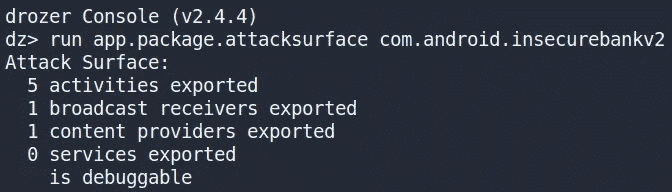

查看输出，我可以看到应用程序已经**导出了** **五个活动**、**一个广播接收器**和**一个内容提供者**。如果组件是在应用程序清单文件中导出的，那么设备上的任何应用程序只要拥有适当的权限，就可以访问这些组件。应用程序还将清单属性**debuggeable**设置为 true，使应用程序能够被调试。这为分析应用程序中易受攻击的组件提供了一个有用的起点。

> 注意:值得一提的是，所有这些信息也可以手动在应用程序的 AndroidManifest.xml 文件中找到。

## 导出的活动

Drozer 根据上述结果确定了五项输出活动。我已经在第 1 部分中提到了应用程序的登录功能是如何由于导出的活动而被绕过的。要找到关于这些活动的更多信息，可以使用 Drozer 列出应用程序的所有导出活动。

```
run app.activity.info -a com.android.insecurebankv2
```

下面的输出显示了应用程序导出的所有活动的列表。

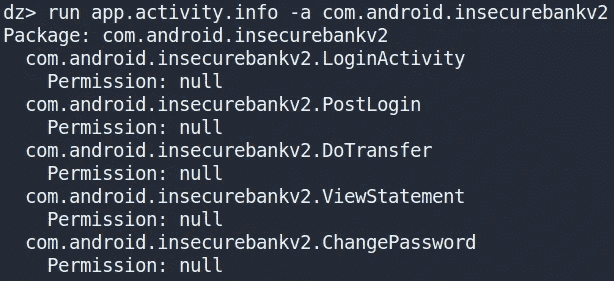

输出显示了活动的名称以及启动它所需的权限。这些活动的权限都是 **null** ，这意味着任何应用程序都可以启动它们。使用第 1 部分中看到的 ADB 或 Drozer，我可以启动这些活动并绕过登录活动。

```
run app.activity.start --component com.android.insecurebankv2 com.android.insecurebankv2.PostLogin
```

上面的 Drozer 命令可以用来启动“ *PostLogin* 活动。


## 导出的广播接收器

应用程序已导出一个广播接收器。

> **注意:**广播接收器被设计用于监听系统范围内的广播事件(如网络活动、应用程序更新等)。)然后如果广播消息与广播接收机内的当前参数匹配，则触发某个事件。

使用 Drozer，我可以通过下面的命令找到关于这个接收器的更多信息。

```
run app.broadcast.info -a com.android.insecurebankv2 -i 
```

将返回以下信息。

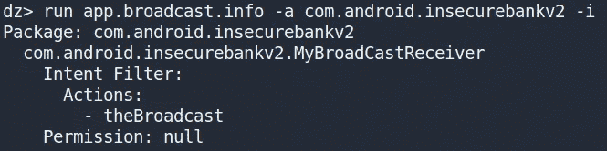

我看到接收者的名字叫做" *MyBroadCastReceiver* "并且已经用 **null** 权限导出。已经为该组件设置了一个**意图过滤器**，带有接收者订阅的广播动作(即“ *theBroadcast* ”)。在我可以通过查看源代码来利用它之前，确定这个广播接收器做什么是很重要的。文件“*MyBroadcastReciever.java*”包含接收广播时将执行的源代码。

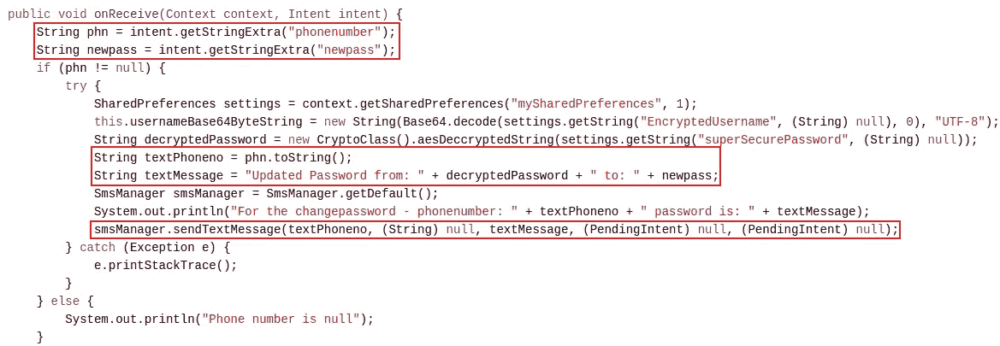

在源代码中，我可以看到用于触发广播接收器的 intent 有两个参数(即“*phone number*”&“*new pass*”)被检索。然后" *mySharedPreferences* "文件中的凭证被检索和解码/解密，然后组合成一个字符串，该字符串将使用" *smsManager* "类作为**文本消息**发送。利用目前收集到的信息，我可以用 Drozer 触发广播接收器。下面的命令使用了" *theBroadcast* "动作，并传递了两个字符串参数，这两个参数是触发接收器和执行接收器代码所必需的。

```
run app.broadcast.send --action theBroadcast --extra string phonenumber 123456789 --extra string newpass supersecurepass
```

我现在可以在我的模拟器上看到应用程序已经发送了一条 SMS 消息，其中包含用户的旧密码和我指定的新密码。

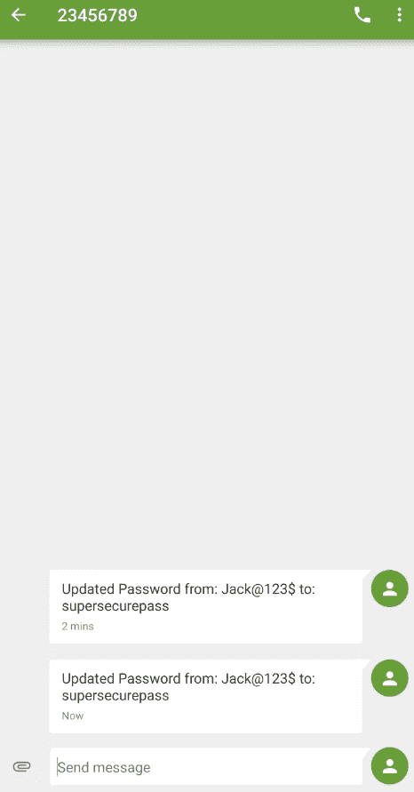

这演示了任何应用程序(包括恶意应用程序)如何能够向该广播接收器发送意图，从而使其不受任何限制地被触发。

## 导出的内容提供商

应用程序已导出内容提供者。

> **注意:**内容提供商用于与其他应用程序共享应用程序数据，这些数据通常存储在数据库或文件中。

我可以使用下面的命令使用 Drozer 来了解这个导出的内容提供者的更多信息。

```
run app.provider.info -a com.android.insecurebankv2
```

下图显示了返回的关于内容提供商的信息。

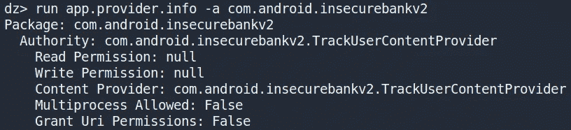

读写权限被设置为 **null** ，这意味着没有什么可以阻止我通过内容提供者查询数据存储。为了查询这个内容提供者，我可以使用 Drozer 来识别 URI 的的任何可访问的**内容。**

> 注意:内容提供商 URI 的 begin 是“ ***content://*** ”，可以用来重构一个路径，该路径可以从内容提供商那里检索数据。

```
run scanner.provider.finduris -a com.android.insecurebankv2
```

发现了一个可访问的内容提供商 URI，如下图所示。

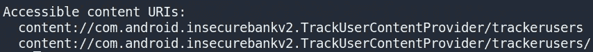

使用 Drozer，我可以使用下面的命令标识的**内容 URI** 来查询这个内容提供者。

```
run app.provider.query content://com.android.insecurebankv2.TrackUserContentProvider/trackusers
```

这将从 SQLite 数据库返回一个用户名和用户 ID 表，该数据库跟踪内容提供者名称所暗示的用户登录。

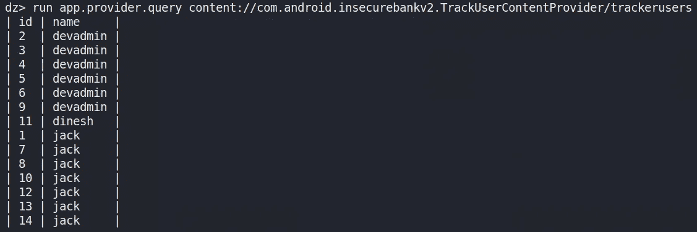

# Android 清单文件安全性

除了声明应用程序的组件(即活动、服务、广播接收器和内容提供者)之外，清单文件还用于定义属性以启用某些功能并声明应用程序所需的权限。如果开发人员启用或误用了某些属性，他们的应用程序就容易受到攻击。

## 调试模式已启用

Drozer 发现该应用程序是可调试的。这是由于开发人员在清单文件中将**Android:debuggeable**属性设置为 **true** 。

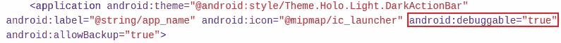

如果某个应用程序被标记为可调试，那么攻击者就可以通过获取该应用程序的权限来访问该应用程序的数据。例如，我可以在我的模拟器上启动一个 shell，然后切换到非 root 用户。然后我可以使用 **run-as** 来查看这个包的目录的内容，在这里我通常没有权限。

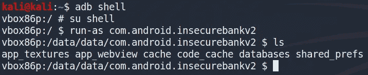

我甚至可以使用 run-as 来检索通常安全存储在应用程序数据目录中的文件。

```
adb exec-out run-as com.android.insecurebankv2 cat databases/mydb > mydb-copy
```

另一种方法是使用名为 **jdp** (Java 调试器)的工具来调试应用程序并发现有趣的信息。第一步是使用 **jdwp** 来识别应用程序运行在哪个端口上。在目标应用程序关闭时运行以下命令，然后在应用程序处于活动状态时再次运行该命令。注意已经出现的新端口号。

> 注意:应用程序端口很可能与本文中看到的不同。

```
adb jdwp
```

然后，我可以在应用程序端口和我的工作站之间创建一个与 ADB 的通信通道。

```
adb forward tcp:7777 jdwp:2906
```

使用 **jdb** ，我将调试器附加到目标应用程序。

```
jdb -attach localhost:7777
```

当附加调试器时，应该显示以下输出。

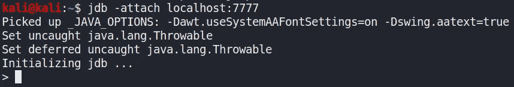

我可以通过使用“*类*”和“*方法*”命令来查看应用程序中有哪些类和方法。我还可以使用 **jdb** 在某些方法上设置一个**断点**，并通过使用“*stop in”*命令来控制 app 的执行。例如，我可以看到“ *LoginActivity* ”类中有哪些方法。

```
> methods com.android.InsecureBankv2.LoginActivity
```

这提供了一长串方法。我决定使用“ *creatUser()* ”方法来演示如何更改局部变量的值。

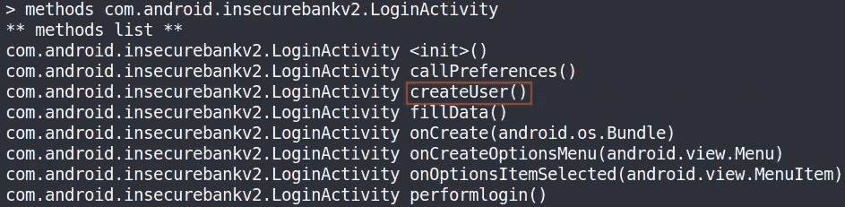

我在这个方法上设置了一个**断点**，然后单击 create user 按钮。

> 注意:如果你没有看到一个创建用户按钮，那么看看这个文章系列的第 1 部分如何修补 APK。

```
> stop in com.android.InsecureBankv2.LoginActivity.createUser()
```

这会导致命中断点。我可以使用“ *step* 命令来执行下一行代码，并使用“ *locals* 命令来查看代码执行中某一点的任何局部变量，如下图所示。


我可以使用“ *set* 更改显示的文本信息，然后使用“ *run* 继续执行代码。

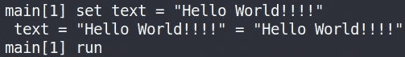

这将打印我的新邮件，而不是原来的。


## 应用程序备份已启用

应用程序在清单文件中将 **android:allowBackup** 属性设置为 **true** 。

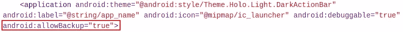

这使得攻击者能够通过 ADB 备份应用程序数据，即使该设备不是根设备。我可以使用 **adb backup** 命令来创建“*com . htbridge . insecurebank v2*”包的备份。根据您使用的 Android 操作系统版本，系统可能会提示您输入密码，稍后您将需要输入密码来解压缩备份文件。

```
adb backup com.android.insecurebankv2
```

这将创建一个必须解压缩的“ *backup.ab* ”文件。我可以通过使用 **abe.jar** 文件将备份文件转换成 tar 文件来完成这个任务。我还提供了创建备份文件时使用的密码(即密码)，如下所示。

```
java -jar abe.jar unpack backup.ab application-data.tar password
```

然后，我可以解压缩" *application-data.tar"* 文件，并查看备份文件的内容。

```
tar xvf application-data.tar
```

通过查看备份的内容，我可以看到诸如“ *mySharedPreferences* ”和“ *mydb* ”之类的文件，它们包含关于用户的敏感信息。

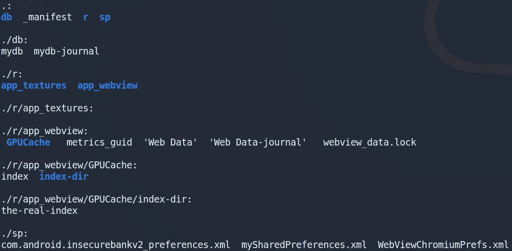

# 不安全日志记录

在本文之前展示的一些源代码片段中，您可能已经注意到应用程序在执行大量任务时会产生**日志消息**。例如，每当用户尝试登录时,“DoLogin”活动都会生成一条调试日志消息。

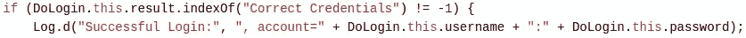

这些日志可以使用**日志目录**进行转储。下面的命令将显示应用程序运行时的所有日志消息。

```
adb logcat | grep "$(adb shell ps | grep com.android.insecurebankv2  | awk '{print $2}')"
```

如果我试图在 **logcat** 运行时登录，我会看到一条日志消息，显示我用来成功登录的用户名和密码。

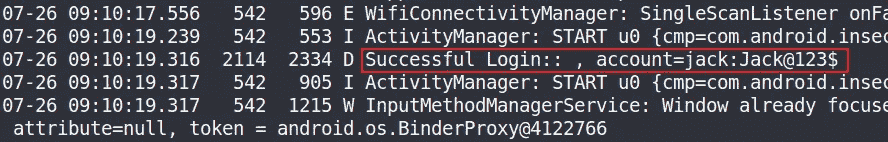

# 意图嗅探和注入

应用程序容易受到意图嗅探和意图注入的攻击。

> 注意:意图是一个消息传递对象，您可以使用它来请求另一个应用程序组件的操作。

应用程序在更改用户密码时使用隐含的意图。该消息被广播到设备上的每个应用程序，并且包含敏感数据。

> 注意:有两种类型的意图，隐含的和明确的。一个**明确的意图**是你用来启动一个特定的应用组件，比如你的应用中的一个特定的活动或服务。一个**隐含意图**指定一个动作，该动作可以调用设备上能够执行该动作的任何应用。

我可以使用 **Drozer** 执行**意图嗅探**，并查看意图的敏感内容。以下命令用于注册一个广播接收器，该接收器可以根据**动作**嗅探特定意图。通过前面对清单文件的分析，我知道了接收者意图过滤器所使用的动作(即“ *theBroadcast* ”)组件

```
run app.broadcast.sniff --action "theBroadcast"
```

当我试图更改密码时，Drozer 会收到我的意图，我可以查看敏感数据。

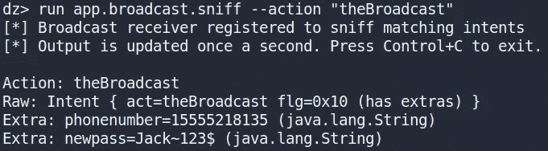

**意图注入攻击**通过将意图注入应用程序组件来执行应用程序工作流通常不允许的任务。我在前面演示了如何通过注入包含我自己的数据的组件来利用一个易受攻击的广播接收器。

```
run app.broadcast.send --action theBroadcast --extra string phonenumber 123456789 --extra string newpass supersecurepass
```

# 结束语

这就结束了我的 Android 应用程序的第 2 部分。在**第 3 部分**中，我将会看到更多可以在应用程序中发现的漏洞，并演示它们是如何被利用的。感谢您阅读到最后，我们将在第 3 部分再见😄！

# 参考

*   [https://github.com/dineshshetty/Android-InsecureBankv2](https://github.com/dineshshetty/Android-InsecureBankv2)
*   [https://book . hack tricks . XYZ/mobile-apps-pentest/Android-app-pentest/drozer-tutorial](https://book.hacktricks.xyz/mobile-apps-pentesting/android-app-pentesting/drozer-tutorial)
*   [https://wiki . sei . CMU . edu/confluence/display/Android/drd 03-j .+Do+not+broadcast+sensitive+information+using+an+implicit+intent](https://wiki.sei.cmu.edu/confluence/display/android/DRD03-J.+Do+not+broadcast+sensitive+information+using+an+implicit+intent)