# 安卓安全银行 2 演练:第 3 部分

> 原文：<https://infosecwriteups.com/android-insecurebankv2-walkthrough-part-3-2b3e5843fe91?source=collection_archive---------2----------------------->

在本文中，我将继续演练由 GitHub 用户*dineshetty*创建的*instrumentbank v2*Android 应用程序。查看**第 1 部分** & **第 2 部分**了解如何设置应用程序，以及我已经展示的应用程序的一些不安全性。我在下面的参考资料中留下了一个应用程序 GitHub 存储库的链接。


# 放弃

正如我在**第 1 部分** & **2** 中所说的，我写这篇文章是出于对了解安卓移动应用安全的兴趣。这篇文章显然会包含对*昆虫银行 2* Android 应用程序中存在的漏洞的剧透。我鼓励读者尽可能多地利用漏洞，如果您陷入困境或希望看到利用不安全的潜在不同方法，请稍后回来阅读本文。我们开始吧😄！

# 根检测旁路

每次我成功登录，新的活动都会包含一条消息，说明该设备是**根**(即“根设备！!").

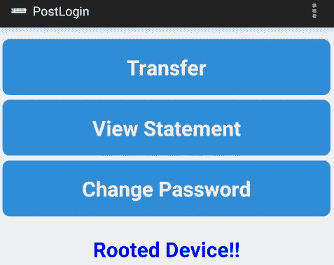

查看“*登录后*”活动的源代码，我可以看到一个名为“ *showRootStatus()* ”的方法，它根据设备是否有根来返回消息。

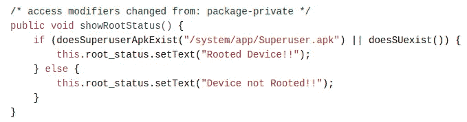

查看上面的源代码，有两个称为“T20”的方法和“T22”的方法用于确定设备是否已被安装。这两种方法的源代码见下文。

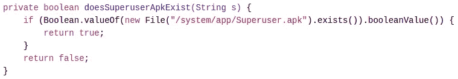

为了绕过根检测，我可以使用下面的脚本使用 **Frida** 来挂接两个布尔方法，并使它们返回 **false** 。

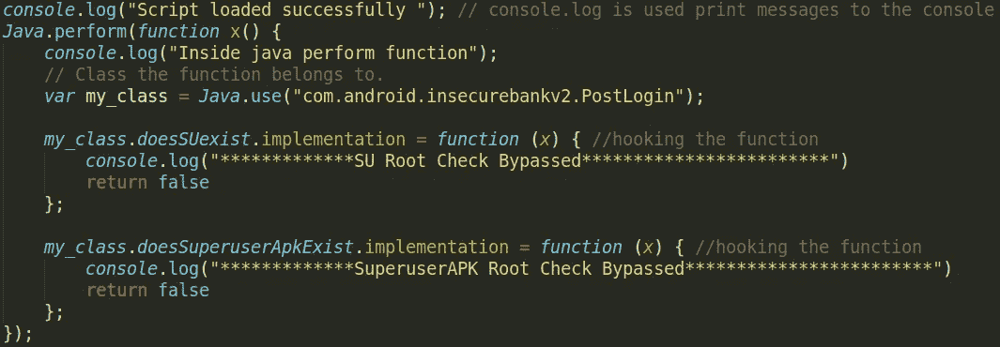

下面提供了用于加载这个钩子的 python 脚本。

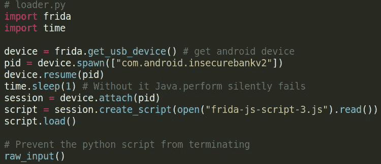

我确保 **Frida 服务器**在我的仿真器上运行，然后执行我的 python 脚本来注入 JavaScript 代码。一旦我的脚本加载成功，我需要成功登录。登录后，我的脚本将两个布尔方法的返回值都更改为 false。


这将导致应用程序在登录后显示消息“设备未扎根”。

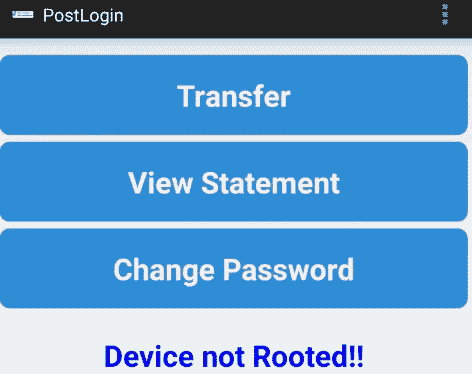

# 不安全的网络视图实施和外部存储

该应用程序允许用户在将资金从一个账户转移到另一个账户后查看结算单。

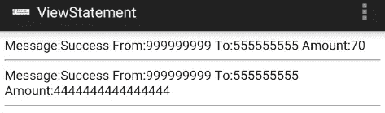

*view States*活动的源代码见下图。

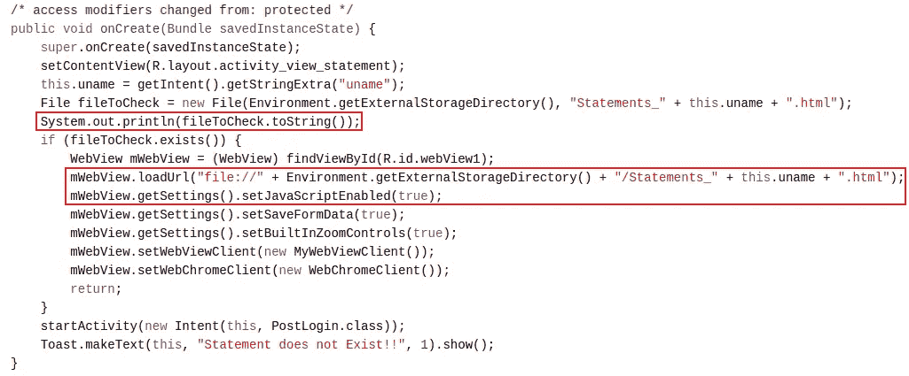

我可以看到该活动正在使用 WebView 加载一个存储在**外部存储器**中的 **html 文件**，其名称以“*Statements _ T5”开头。我还可以看到，开发人员在 webview 中已经**启用了 JavaScript** 并带有“*set JavaScript enabled(true)；*"法。由于代码“ *System.out.print* ”将文件位置打印到标准输出，所以我可以使用 **logcat** 来识别文件的名称及其存储位置。*

```
adb logcat | grep "$(adb shell ps | grep com.android.insecurebankv2  | awk '{print $2}')"
```

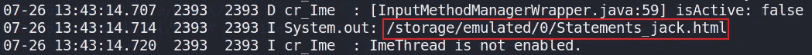

从日志输出中，我可以看到文件的存储位置。

```
/storage/emulated/0/Statements_jack.html
```

因为文件是从外部存储器加载的，所以每个人都可以读写该文件。我可以用一个包含一些 JavaScript 的新文件替换这个文件。该 JavaScript 将在加载 HTML 页面时执行。

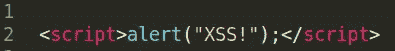

我可以使用 **ADB** 将新的同名文件(即“*Statements _ jack . html”*)推送到仿真器设备上。

```
adb push Statements_jack.html /storage/emulated/0/
```

然后，我可以点击“查看报表”按钮。WebView 将加载新的“ *Statements_jack.html* ”文件并执行我的 JavaScript。

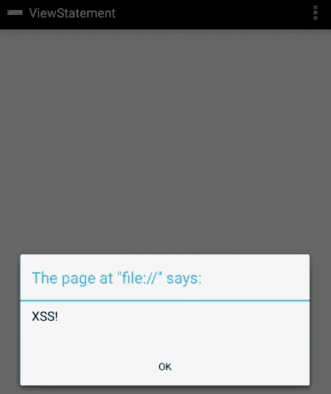

# 安卓粘贴板漏洞

Android 提供了剪贴板框架来复制和粘贴不同类型的数据。通过调用 *getSystemService()* 方法实例化**剪贴板管理器**的对象，可以查看该剪贴板的内容。为了证明这一点，我可以打开转账活动并将**账号**复制到剪贴板上。

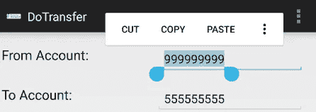

接下来，我需要申请的账号。我可以使用 **ps** 命令和 **grep** 进行此操作。

```
adb shell ps | grep "insecure"
```

然后我可以使用下面的命令查看**剪贴板内容**。

```
adb shell su u0_a12 service call clipboard 2 s16 com.android.insecurebankv2
```

> 注意:**服务调用剪贴板**命令通过调用 getSystemService()方法来实例化剪贴板管理器的对象。**获取剪贴板文本、设置剪贴板文本、**和**具有剪贴板文本**和**的服务代码分别为 1、2 和 3。**参数“s16”将 UTF-16 字符串 STR 写入发送包。

输入该命令后，我可以看到复制到剪贴板的**账号**。

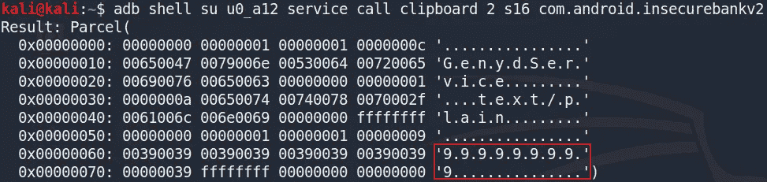

# 利用安卓键盘缓存

Android 有一个字典，用户输入的单词可以保存在字典里，以备将来自动更正。任何没有特殊权限的应用程序都可以使用该用户词典。用户可以将用户名等潜在的敏感信息添加到字典中。本词典可通过 **ADB** 检索，如下所示。

```
adb pull /data/data/com.android.providers.userdictionary/user_dict.db
```

我可以使用“sqlitebrowser”打开这个数据库，查看字典中存储的任何单词。如下图所示，用户已经将他们的用户名保存到字典中。

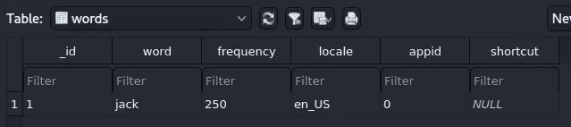

# 不安全的 HTTP 连接

应用程序通过使用 HTTP 协议与服务器建立不安全的连接。

> 注意:HTTP 协议不使用加密。如果你登录你的银行或在支付页面输入信用卡信息，网址必须是 HTTPS。否则，您的敏感数据将面临风险。

我可以使用诸如 **BurpSuite** 之类的工具来拦截、检查和修改双向通过的原始流量。为此，我可以通过创建一个代理监听器来配置 BurpSuite 监听我的**主机专用**网络适配器上的特定端口。这可以从下图中看出。

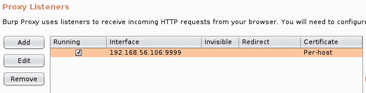

然后我可以在我的 WiFi 设置中的模拟器上创建一个**手动代理**。我只使用我的**主机的 IP 地址**网络适配器和我在创建监听器时指定的**端口**(即 9999)。

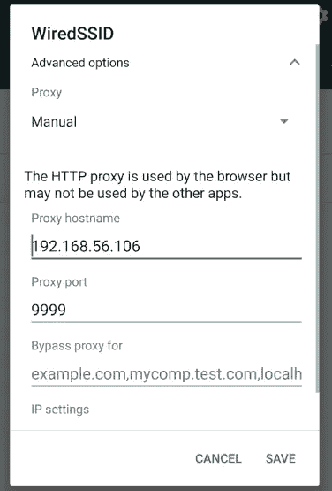

我现在可以用 BurpSuite 查看来自应用程序的 HTTP 流量。当我尝试登录时，所使用的凭证可以在明文中看到。

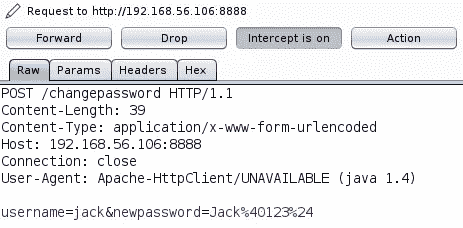

> 注意:可以通过 Burp 查看 HTTPS 流量，但 burp CA 证书需要安装在目标设备上。

# 参数操作

使用 **BurpSuite** ，当应用程序将参数发送到 python 服务器时，我可以操作这些参数。我可以在用户试图更改密码时演示这一点，如下图所示。

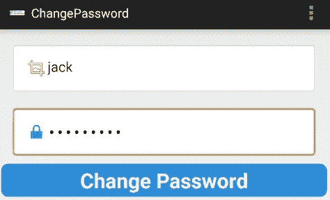

我可以使用 Burpsuite 拦截 HTTP 数据包，并在用户提交新密码时检查其内容。


我现在可以操作参数，将值改为其他值。例如，我可以将用户名从“jack”更改为“dinesh”，从而更改不同用户的密码。

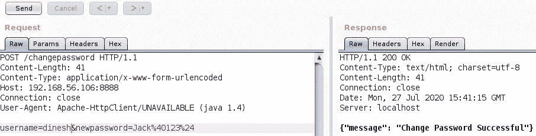

一旦我更改了用户名值，我就可以允许发送 HTTP 数据包，并观察更改是否成功。

# 用户枚举

该应用程序对用户枚举较为脆弱，可通过使用 **BurpSuite** 来利用该漏洞。如前所述，我可以使用 Burpsuite 拦截用户更改密码和查看数据包内容的 HTTP 请求。如前所述，有两个参数，包括用户名和新密码。我可以右键单击 BurpSuite，并将解释后的数据包发送给入侵者。

> 注意**Burp intrusor**是一个针对 web 应用程序的自动化定制攻击工具。它非常强大且可配置，可用于执行大量任务，从简单的暴力猜测 web 目录到主动利用复杂的盲 SQL 注入漏洞。

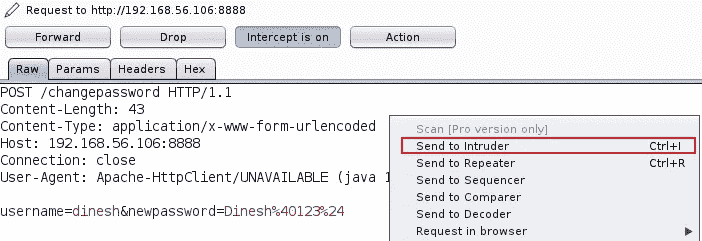

一旦发送给入侵者，我需要标记我的**有效载荷**将被使用的**位置**。我清除最初标记的所有位置，然后突出显示用户名值，并将其添加为我的有效载荷的位置。攻击类型设置为狙击。**狙击手**攻击类型使用一套有效载荷。它依次瞄准每个有效载荷位置，并将每个有效载荷依次放入该位置。


在我开始攻击之前，我需要设置我的有效载荷。对于我的有效载荷，我可以使用一个简单的列表**并添加一些常用的用户名到列表中，如下图所示。**

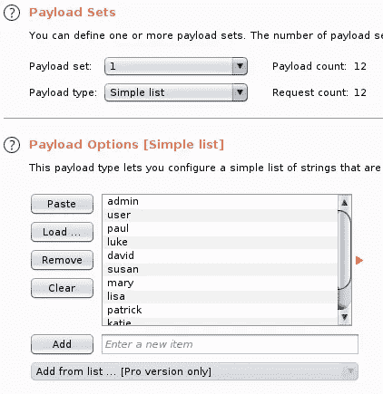

最后，我可以通过点击 BurpSuite 中位置选项卡上的**开始攻击按钮**来开始我的攻击。攻击将开始，通过查看响应，有可能枚举存在的用户名。例如，用户名 admin 不存在，当试图更改该用户的密码时会引发错误。

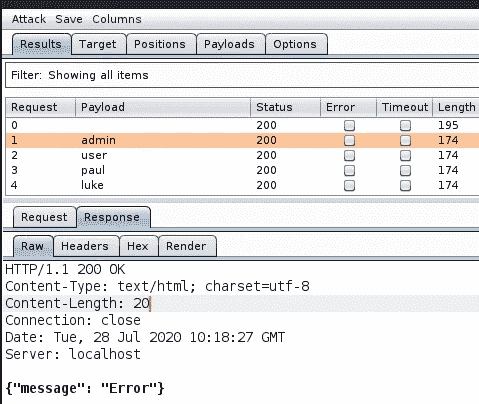

但是，用户名“jack”确实存在，所以当我试图更改密码时，得到了成功的响应。

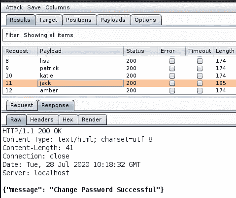

> 注意:消息长度等其他指标也可以作为枚举用户的指标。

# 结束语

这就结束了我的 Android 应用程序的第 3 部分。在这一系列文章中，我试图展示 Android 移动应用程序中存在的不同漏洞。如果您还没有这样做，请随时查看第 1 部分 & **第 2 部分**。感谢阅读，下次再见😄！

# 参考

*   [https://github.com/dineshshetty/Android-InsecureBankv2](https://github.com/dineshshetty/Android-InsecureBankv2)
*   [https://mobile-security . git book . io/mobile-security-testing-guide/Android-testing-guide/0x05h-testing-platform-interaction](https://mobile-security.gitbook.io/mobile-security-testing-guide/android-testing-guide/0x05h-testing-platform-interaction)
*   [https://ports wigger . net/burp/documentation/desktop/tools/intrusor/positions](https://portswigger.net/burp/documentation/desktop/tools/intruder/positions)