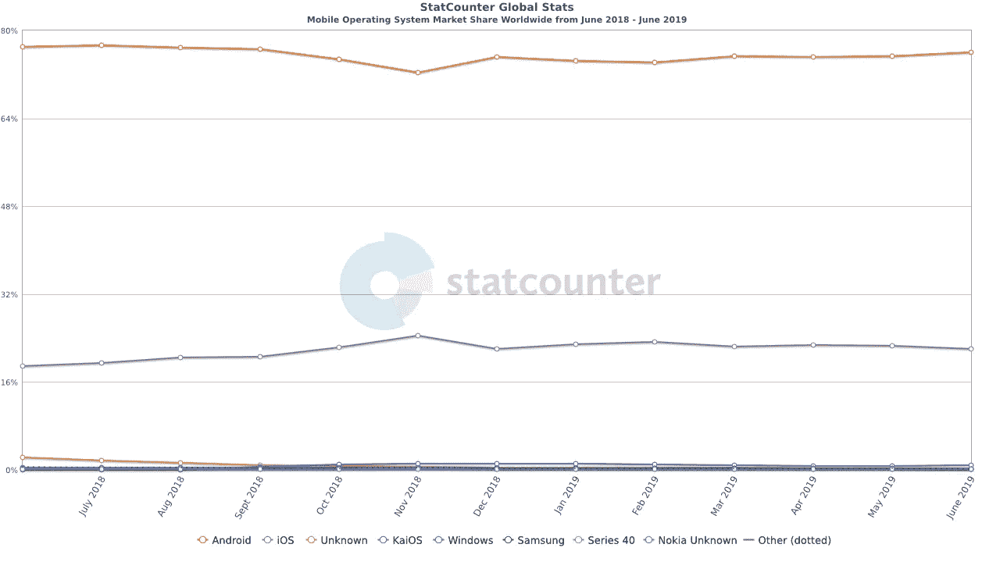
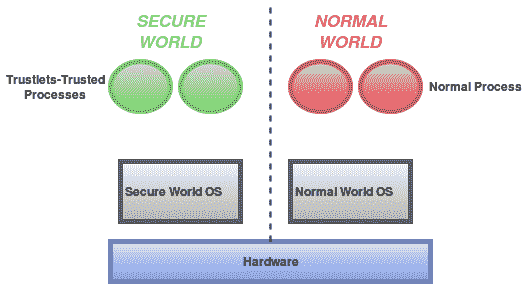

# Android 密钥证明

> 原文：<https://infosecwriteups.com/android-key-attestation-581da703ac16?source=collection_archive---------0----------------------->

## 您仍然不确定用户设备的安全性吗？

## 安全工程师和建筑师的朋友！



Android 领先的市场份额

A ndroid 以[超过 75%](http://gs.statcounter.com/os-market-share/mobile/worldwide) 的市场份额引领着当前的移动时代。如今，移动应用不仅用于休闲目的，还用于有大量敏感数据流的关键业务操作。

不过，Android 支持沙盒的美好概念，在正常情况下，沙盒不允许一个应用程序访问任何其他应用程序的数据。仍然建议处理敏感数据的应用程序应该考虑安全处理敏感数据的边缘情况。

[API 18 级发布的 Android Keystore](https://developer.android.com/training/articles/keystore) 成为安全架构师和开发者的朋友。密钥库仍在增长，并且自发布以来增长显著。不花太多时间，让我们讨论一下添加到 Android 安全皇冠上的另一个宝石，名为 ***Android 密钥认证*** 。

[**密钥证明**](https://developer.android.com/training/articles/security-key-attestation) 是允许开发者分析由 Android 密钥库管理的加密材料的安全性的特性。例如，从应用服务器，我们可以启动密钥证明过程，以检查用户使用的设备是否能够安全地存储加密材料，从而做出数据驱动的决策。

从 Android 8.0 开始，密钥证明成为强制性的。对于所有需要获得谷歌应用套件设备认证(CTS)的新设备，此类设备使用由[谷歌硬件认证根证书](https://developer.android.com/training/articles/security-key-attestation#root_certificate)签名的认证密钥，并可在密钥认证过程中进行验证。

在我们深入探讨密钥证明过程之前，让我们简要地讨论一些广泛使用的术语。

# 驯服术语

为了更好地理解密钥证明的概念，让我们来理解与密钥证明相关的一些关键概念。

## **可信执行环境**

[TEE](https://en.wikipedia.org/wiki/Trusted_execution_environment) (可信执行环境)是主处理器的一个安全区域，用于处理关键数据。它确保敏感数据在一个隔离和可信的环境中存储、处理和保护。

[ARM](https://en.wikipedia.org/wiki/ARM_architecture) (高级 [RISC](https://en.wikipedia.org/wiki/Reduced_instruction_set_computer) (精简指令集计算机)通过 [*ARM Trustzone*](https://www.arm.com/products/security-on-arm/trustzone) 实现了三通的概念。这项技术提供了硬件特性来创建一个与正常执行环境相分离的安全环境。



[*ARM 信任区*](http://www.cs.kun.nl/~erikpoll/publications/AndroidSecureStorage.pdf)

如上所示，两个世界中的硬件是分离的，即安全世界和普通世界。创建了包括虚拟处理器和虚拟资源的两个隔离的虚拟环境，使得在正常世界中运行的进程不能直接访问安全资源。

## 钥匙大师

[Keymaster TA](https://source.android.com/security/keystore#glossary) (可信应用)是一款在基于 ARM 的设备上运行于 TrustZone 等安全环境中的软件。密钥管理员可以访问通过密钥库管理的原始加密材料，并执行所有密钥库操作。

## 保险箱

StrongBox 是硬件支持的密钥库的更严格的实现，因为 Keymaster HAL(硬件抽象层)是作为硬件安全模块(HSM)实现的。该模块包含其自己的 CPU、安全存储器、真随机数发生器等。它是在 Android Pie 中引入的，支持 Android 9 及以上版本的设备可以有 TrustZone 实现，StrongBox 实现或者两者都有。

# 密钥证明过程

在密钥证明过程中，我们可以指定密钥对的别名，作为回报，我们可以获得一个证书链，该证书链稍后用于验证密钥对的属性。以下 API 可用于检索证书链:

```
public final [Certificate[]](https://developer.android.com/reference/java/security/cert/Certificate.html) getCertificateChain ([String](https://developer.android.com/reference/java/lang/String.html) alias)
```

在证明过程中，如果满足以下条件，则意味着底层设备支持硬件级密钥证明，并且密钥材料由硬件支持的密钥库管理:

1.  证书链中的根证书是 Google 硬件证明根证书。
2.  Keymaster 的安全级别为*可信环境*或*保险箱*。

或者，如果第一个条件失败，即证明链具有任何其他根证书，则 Google 不对硬件的安全性做出任何声明。

# 关键证明实施指南

密钥证明过程可以直接在应用程序中实现，但出于安全原因，建议在服务器端实现，这将在后一节中解释。

以下是安全实现密钥证明的高级指导原则:

1.  服务器应通过使用 CSPRNG(加密安全随机数生成器)安全地创建一个随机数来启动密钥证明过程，并将该随机数作为质询发送给客户端。
2.  客户端应该使用从服务器收到的挑战调用`setAttestationChallenge()` API，然后应该使用`KeyStore.getCertificateChain()`方法检索证明证书链。
3.  应该将证明响应发送到服务器进行验证，并且应该执行以下检查来验证密钥证明响应:

*   验证证书链，直到根，并执行证书健全性检查，如有效性、完整性和可信度。
*   检查根证书是否用 Google 认证根密钥签名，这使得认证过程可信。
*   提取证明证书扩展数据，该数据出现在证书链的第一个元素中，并执行以下检查:

```
a. Verify that the attestation challenge is having the same value which was generated at the server while initiating the attestation processb. Verify the signature in the key attestation response.c. Now check the security level of the Keymaster to determine if the device has a secure key storage mechanism. The security level will be one of *Software*, *TrustedEnvironment* or *StrongBox*.d. Additionally, you can check the attestation security level which will be one of *Software*, *TrustedEnvironment* or *StrongBox* to check how the attestation certificate was generated.e. Also, some other checks pertaining to keys can be made such as purpose, access time, authentication requirement, etc. to verify the key attributes.
```

# 解码证明响应

为了更好地理解密钥证明过程，让我们了解一下证明响应。典型的 Android 密钥库证明响应如下所示:

证明响应

证明响应 JSON 中的关键字具有以下含义:

*   `fmt`:证明声明格式标识
*   `authData`:表示认证的认证者数据
*   `alg`:用于计算证明响应签名的算法
*   `sig`:认证响应签名
*   `x5c`:证明证书链

## 签名生成和验证

通过连接`authData`和`clientDataHash`(由服务器发送的挑战)并使用`alg`签名算法通过凭证私钥进行签名来生成`sig`，并且通过使用第一证书中的公钥在服务器端对其进行验证。

这意味着挑战在密钥证明实现的安全性中起着重要的作用。在实现密钥证明时，强烈建议应在服务器端执行验证，所使用的质询应在服务器端使用加密安全的随机数生成器生成，并且应在证明时进行验证。

Android 密钥认证的示例代码片段可在 [GoogleSamples](https://github.com/googlesamples/android-key-attestation/tree/master/server) repo 上获得。

# 参考

*   [WebAuthn/FIDO2](https://medium.com/@herrjemand/webauthn-fido2-verifying-android-keystore-attestation-4a8835b33e9d) :验证 Android 密钥库证明
*   [FIDO 联盟白皮书](https://fidoalliance.org/wp-content/uploads/Hardware-backed_Keystore_White_Paper_June2018.pdf)
*   [FIDO 联盟技术说明](https://fidoalliance.org/fido-technotes-the-truth-about-attestation/)
*   [安卓密钥认证](https://developer.android.com/training/articles/security-key-attestation)
*   [W3C Android 密钥认证](https://www.w3.org/TR/webauthn/#android-key-attestation)
*   [Mozilla:证明和断言](https://developer.mozilla.org/en-US/docs/Web/API/Web_Authentication_API/Attestation_and_Assertion)
*   [保护安卓应用的灰色问题](https://dl.packetstormsecurity.net/papers/general/The_Grey_Matter_of_Securing_Android_Applications_v1.0.pdf)