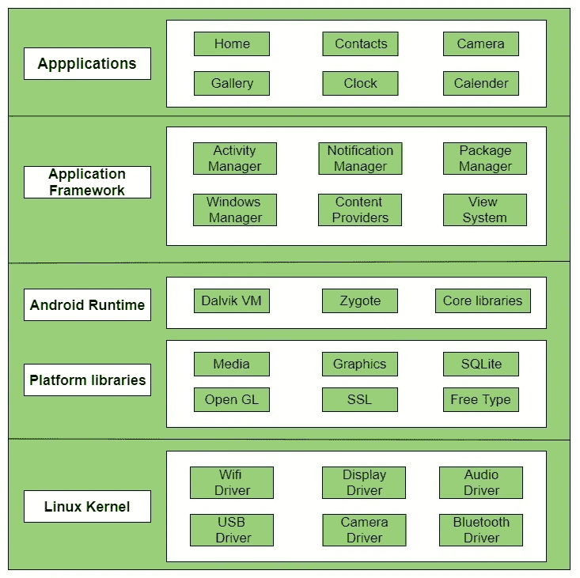
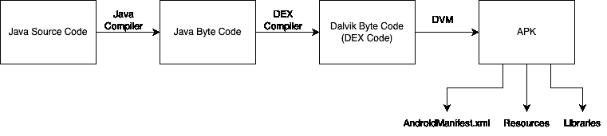

# Android Pentesting 101 —第 1 部分

> 原文：<https://infosecwriteups.com/android-pentesting-101-part-1-8e31b8cd8b2b?source=collection_archive---------1----------------------->

欢迎来到这个新的 Android Pentesting 系列。这个系列是关于你如何使用各种方法入侵 Android 并找到其中的漏洞。在这个系列中，我们的目标是实现所有你能找到的漏洞以及方法。在第一部分中，我们的目标是涵盖 android pentesting 是如何完成的以及执行它所需的所有工具的基本描述。所以，准备好并装载你的武器吧！！！

简单来说，移动应用程序通常有三种类型:

1.  本地应用程序:这些是为特定操作系统(OS)或平台开发的移动应用程序。他们通常需要一个模拟器，基于网络的攻击(如 XSS)是不可能的。
2.  基于网络的应用程序:这些是基于浏览器的应用程序，通常使用[WebView](https://developer.android.com/reference/android/webkit/WebView)(Android 中的一个系统组件)在 Android 操作系统上显示网页。他们不需要模拟器，基于网络的攻击(如 XSS)是可能的。
3.  混合应用程序:顾名思义，它们是上述两种应用程序的组合，通常需要一个仿真器来进行测试。这些是你在现实世界中会发现的应用。

现在，在我们了解 android pentesting 之前，了解一下 **Android 架构**是如何工作的非常重要。我将给出每个组件的简短描述，但如果你想深入了解，你可以从[这里](https://www.geeksforgeeks.org/android-architecture/)了解。

1.  应用程序:体系结构的最顶层，安装了所有第三方应用程序。例子包括 Camera，WhatsApp，Google 等。
2.  应用程序框架:这是为 Android 应用程序的创建提供各种类的层。例如活动经理、内容提供商等。
3.  Android 运行时:最重要的一层由 Dalvik VM 组成。Dalvik 虚拟机(DVM)类似于 JVM，支持应用程序运行，并提供各种平台库，如 SSL、SQLite、Media 等。
4.  Linux 内核:这是 android 架构的核心，提供诸如安全性、内存管理、进程管理等特性。

现在让我们快速先睹为快各种 [**安卓组件**](https://www.tutorialspoint.com/android/android_application_components.htm) 。

1.  Activity:这些是 java 类，它们有一些预定义的函数，在不同的应用程序状态下被触发。总共有四种应用程序状态:活动、暂停、停止和销毁。可以调用的不同方法有 onCreate()、onStart()、onResume()、onPause()、onStop()、onDestroy()。想象一个场景，当敏感数据正在传输，onPause()方法出现，n 秒后 onResume()方法被调用，应用程序将如何处理敏感数据？这可能是一个很好的检查案例。
2.  服务:这些操作发生在后台，没有用户界面。服务至关重要，应该经常检查，因为攻击者通常会在这里植入恶意软件。一个示例场景是计算器应用程序请求呼叫日志许可。
3.  意图:它们被绑定到应用程序中的不同组件，用于在不同的应用程序中执行不同种类的动作和调用活动。意图过滤器用于保护活动。
4.  内容提供者:作为中间层从各种来源访问数据。
5.  广播接收器:这些接收器接收来自各种事件的广播消息，这些事件可能来自一个或多个应用程序。例如，当一个应用程序收到 SMS 时，它会向所有其他应用程序发送广播消息。

现在来说说 **Android 文件系统。**以下是文件层次结构中的文件夹:

1.  /boot:由 Android 内核和 ramdisk 组成的可引导文件
2.  /system:整个 Android 操作系统都存储在这个文件夹中。它还包含预安装的系统应用程序，这些应用程序存储在/system/app 中
3.  /recovery:此文件夹是为备份而设计的，并被视为备用启动选项。
4.  /cache:此文件夹存储经常访问的应用程序数据和组件
5.  /misc:包含杂项系统设置
6.  /sdcard:此文件夹是可供用户存储文件和数据的空间。
7.  /data:这个特定的文件夹包含所有用户数据。

*   /data/data:由用户安装的所有应用程序数据组成
*   /data/app:由用户安装的应用程序的所有 apk 组成
*   /data/system:由 gesture.key、password.key 等文件组成
*   /data/local/tmp:可写临时

某些重要的文件和文件夹通常是在创建应用程序时创建的。在我们的 android 测试中，查看这些文件和文件夹至关重要。不同的重要文件和文件夹如下:

1.  AndroidManifest.xml:具有应用程序的结构和元数据。通常，所有权限、API 密钥等。存储在这个特定的文件中。
2.  Java:这个特定的文件夹包含 Java 源代码文件。
3.  可绘制:所有图片、视频、gif 等。存储在这个特殊的文件夹里。
4.  布局:布局定义了用户界面的视觉结构，比如 Android 应用程序的 UI。
5.  mipmap:通常包含不同图标的图像资源文件夹。
6.  colors . XML:Android 应用程序的颜色资源文件。
7.  Android 应用程序的字符串资源文件。
8.  Android 应用程序的样式资源文件。
9.  build.gradle:这个特殊的文件用于添加各种依赖项。该文件还包含 SDKVersion 号和其他重要的详细信息。

现在让我们来谈谈 Android 架构的最后一个话题，Android 数据存储模型。Android 以 5 种方式存储数据:

1.  共享偏好:在设备上以键值对的形式存储私有数据。
2.  内部存储:在设备的内存中存储私人数据。
3.  外部存储:在共享的外部存储上存储公共数据。
4.  SQLite 数据库:存储在私有数据库中的结构化数据。
5.  网络连接:用你的网络服务器在网上存储数据。

我们都知道，一旦创建了 Android 应用程序，就会生成一个. apk 文件。有没有想过这到底是什么？apk 文件？？apk 文件只不过是源代码的 zip 文件，其中包含所有的资源、dex 代码、资产、清单文件等等。下图显示了如何将 Java 源代码转换为 APK 文件。

完美！既然我们已经了解了整个 android 架构，那么让我们来了解一下实际的测试方法是如何工作的！！有两种类型的分析通常在执行 Android pentesting 时进行。

1.  静态分析:这意味着查看 APK 的源代码，并通过检查 APK 找出漏洞。这有点类似于源代码审查。我们通常会留意不同的意图函数、源和接收器、危险的权限、硬编码的 API 密钥等。这就是我们深入研究 Android 架构细节的原因。(我知道这有点漫长和无聊，但也很有必要:P)

2.动态分析:动态分析就是处理请求和响应。但是这里有一个陷阱，就像普通的网页测试一样，在 Android(以及 iOS)中，请求和响应并不被直接捕获。我们首先需要绕过根检测，然后绕过 SSL 锁定。我们将在接下来的文章中了解更多。

现在是时候拿起你的武器了；)以下是执行静态和动态分析所需的所有工具的精选列表。

1.  Android 设备:显然，您需要一个 Android 设备来执行测试。它可以是一个真正的 android 设备，也可以是一个模拟器。如果是真正的安卓设备，要确保安卓设备是 rooted 的。使用名为 [Magisk](https://magiskmanager.com/) 的工具可以很容易地进行生根。对于仿真器，你可以使用 [Genymotion](https://www.genymotion.com/) 。有时模拟器确实滞后，拥有一个真正的 android 设备会更有好处。
2.  [Android 调试桥(ADB)](https://dl.google.com/android/repository/platform-tools-latest-windows.zip) :用于与设备通信，并在设备上执行调试操作。
3.  [Dex2jar](https://github.com/pxb1988/dex2jar) : Dex2jar 是一个很棒的工具，可以帮助你将 Dex 代码转换成 jar 格式，这样阅读源代码就更容易了。
4.  [JD-GUI](http://java-decompiler.github.io/) : JD-GUI 是一个可以让你直接查看一个 APK 文件的 java 源代码的工具。
5.  [MobSF](https://mobsf.github.io/docs/#/installation) : MobSF 是一个多合一的安全工具，可以帮助你执行自动静态分析，让你的工作简单很多。
6.  drozer :用于 Android 安全的 Metasploit 框架(MSF ),允许您找到漏洞并利用它们。
7.  Frida :一个将会帮助绕过很多东西的工具；)
8.  [异议](https://github.com/sensepost/objection):又一个会帮我们绕过很多东西的工具；)
9.  [apksigner](https://github.com/fornwall/apksigner) :用于对修改后的 apk 进行签名。
10.  [打嗝组曲](https://portswigger.net/burp):哦！别忘了上帝！！

这是第一部分的所有人！我们希望你喜欢这篇文章！我们将很快返回另一部分，在那里我们将向您展示在执行 Android Pentesting 时的静态分析方法。

狩猎愉快！

**作者:**

瓦伊巴夫·拉哈尼:[https://www.linkedin.com/in/vaibhav-lakhani](https://www.linkedin.com/in/vaibhav-lakhani)

[迪尔·帕尔马](https://www.linkedin.com/in/dhir-parmar-925b171a4):[https://www.linkedin.com/in/dhir-parmar-925b171a4](https://www.linkedin.com/in/dhir-parmar-925b171a4)

## 来自 Infosec 的报道:Infosec 每天都有很多内容，很难跟上。[加入我们的每周简讯](https://weekly.infosecwriteups.com/)以 5 篇文章、4 条线索、3 个视频、2 个 GitHub Repos 和工具以及 1 个工作提醒的形式免费获取所有最新的 Infosec 趋势！