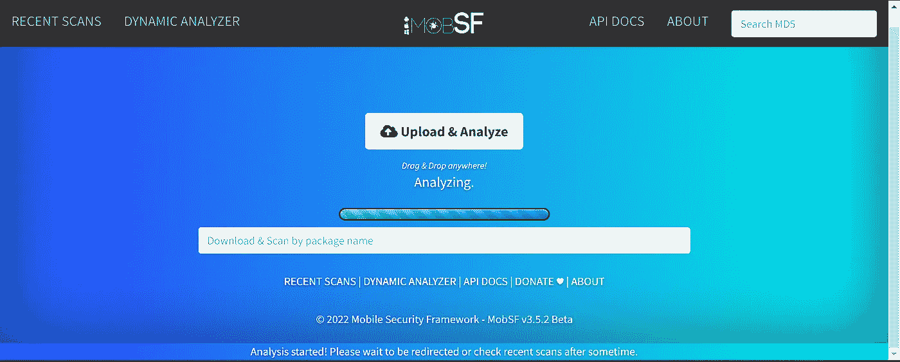
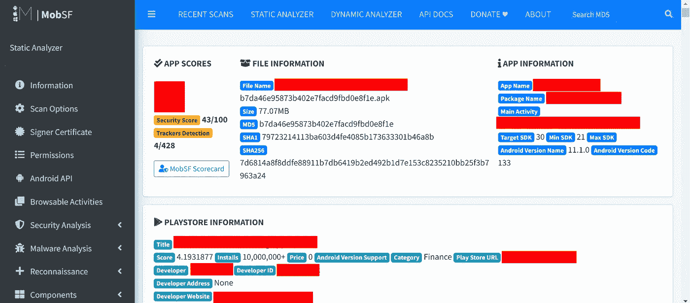
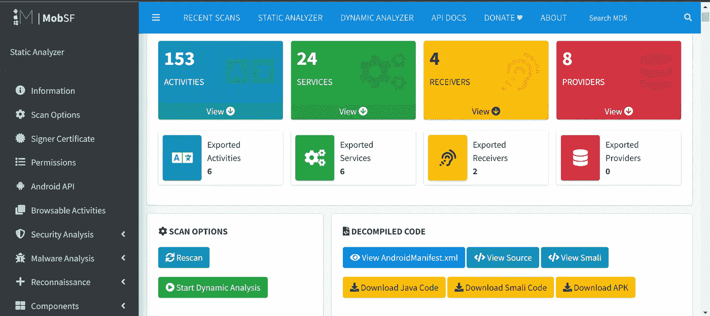
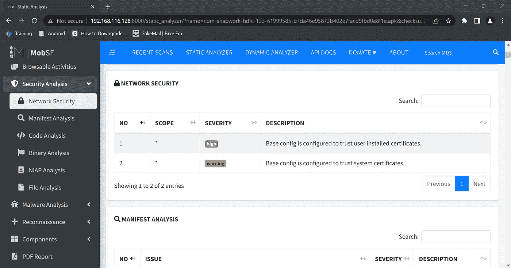
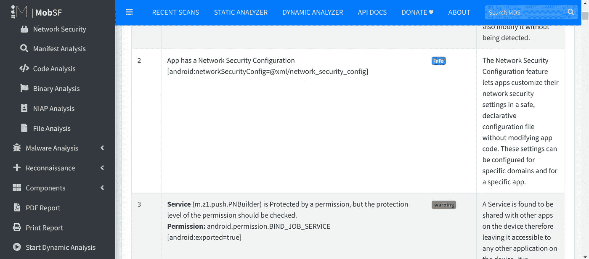
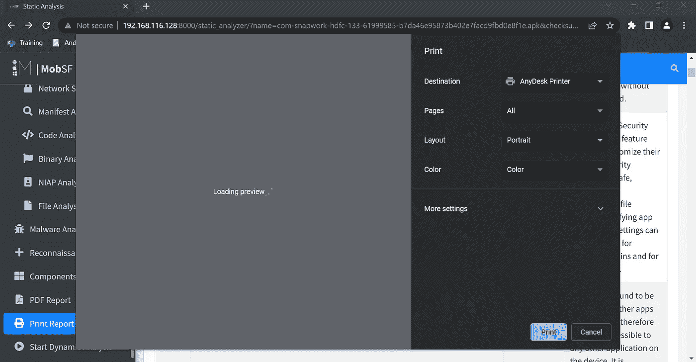
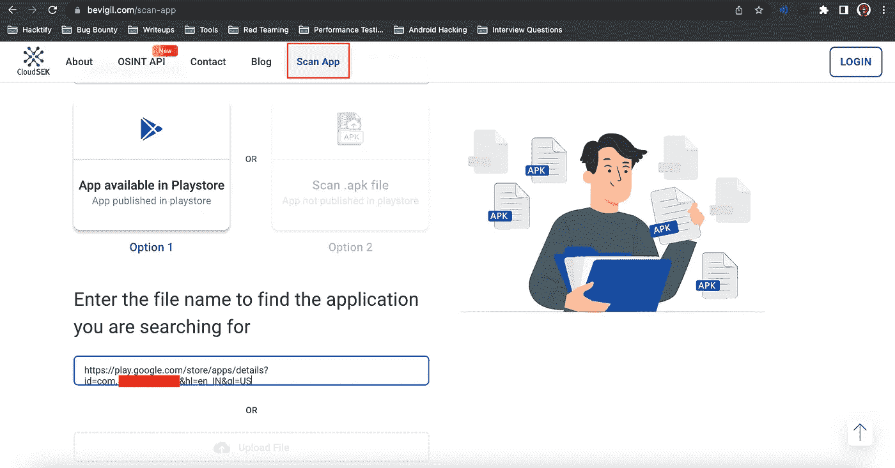
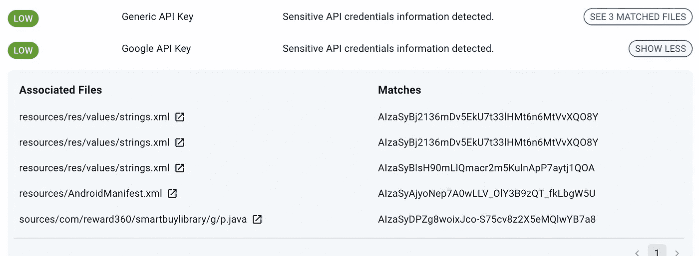
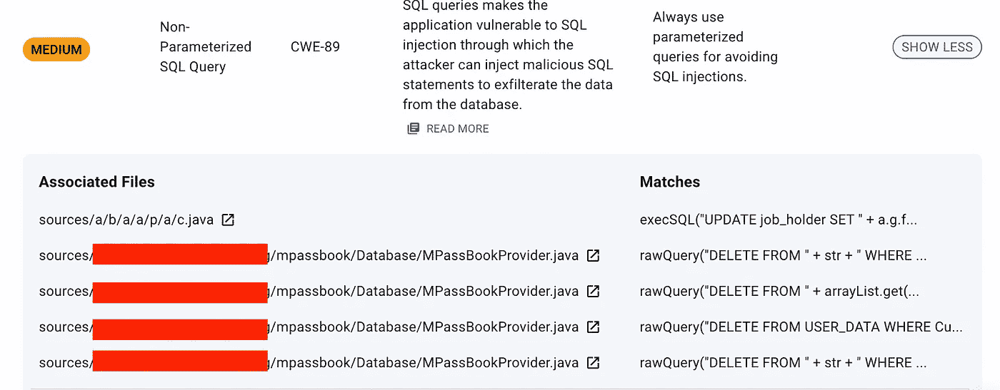

# 安卓测试 101 —第二部分

> 原文：<https://infosecwriteups.com/android-pentesting-101-part-2-419facdf11c1?source=collection_archive---------0----------------------->

W 欢迎来到 Android 测试的第二部分。这个系列是关于你如何使用各种方法入侵 Android 并找到其中的漏洞。如果您还没有阅读第 1 部分，我强烈建议您在跳到本节之前先阅读一下。你可以在[这里](/android-pentesting-101-part-1-8e31b8cd8b2b)找到。

在第二部分，我们的目标是涵盖 Android Pentesting 的静态分析，以及各种工具。所以让我们开始吧！！

因此，Android Pentesting 中的静态分析就是检查源代码并找到漏洞，你如何做到这一点呢？？第一步是拿到 APK 的档案。嗯，很简单，先找个安卓应用，把 APK 文件下载到手机上。

一旦你下载了 APK，使用 [APK 提取器](https://play.google.com/store/apps/details?id=com.ext.ui&hl=en_IN&gl=US)提取 APK 文件，然后将它发送到你的电脑进行进一步分析。同时，你也可以使用亚行拉它。以下是相同的命令:

1.  使用`adb shell pm list packages -f | grep app_name`抓取包名
2.  使用上面获得的包名获取路径`adb shell pm path com.package_name.`
3.  使用`adb pull /data/app/com.package_name..apk`拉动 apk

或者，你也可以使用 [PlaystoreDownloader](https://github.com/ClaudiuGeorgiu/PlaystoreDownloader) 下载 APK 文件。下一步是逆向工程代码。在第 1 部分中，我们已经看到了 Java 源代码是如何转换成 APK 文件的，我们只需颠倒整个过程，就可以得到可读的文件。要执行此操作:

1.  使用 [WinRar](https://www.win-rar.com/start.html?&L=0) 或类似工具提取 APK 文件。(如果不可提取，首先将 apk 文件转换为 ZIP，即 MyApp.zip)
2.  提取之后，我们得到 AndroidManifest.xml 文件和某些 DEX 代码。我们必须逆转这些德克斯代码。这可以使用命令`d2j-dex2jar -f classes.dex`轻松完成
3.  JD-GUI 工具现在可以解释 jar 文件，我们可以清楚地看到 APK 文件的源代码。

太好了，现在是进行所有人工分析的时候了。在一般情况下，静态分析会检查以下内容

1.  检查应用程序是否可调试
2.  检查任何导出的活动是否为真(如果是，使用 drozer 利用它)
3.  请检查 AndroidManifest.xml 文件中自定义权限的印刷错误。类似的测试案例可以在[这里](https://hackerone.com/reports/440749)找到
4.  检查硬编码的 API 键、注释、秘密等。类似的测试案例可以在[这里](https://hackerone.com/reports/351555)找到。
5.  检查导出的广播行为。

手动测试有时会很无聊，因此为了加快这个过程，我们有两个漂亮的工具可以帮你:

1.  [MobSF](https://github.com/MobSF/Mobile-Security-Framework-MobSF) :这是一款自动化的恶意软件分析工具，可以帮助你加快静态分析的速度。可以轻松[下载](https://mobsf.github.io/docs/#/installation)。让我们快速浏览一下。

第一步是使用如上所述的各种方法下载 APK，然后将 APK 上传到 MobSF。

在下面的截图中，您将能够看到所有的应用程序细节。

下一个屏幕显示了所有活动、服务、接收者、提供者等。您甚至可以查看 AndroidManifest.xml 文件以及源代码和 Smali 代码。

你可以查看所有的安全分析，恶意软件分析，代码分析，文件分析等。一个接一个。同样的截图可以在下面看到。

您甚至可以打印静态分析的 PDF 报告。

2.BeVigil:由 CloudSek 开发的全球首个也是唯一一个针对移动应用的安全搜索引擎。就我个人而言，我更喜欢这个工具，因为它使用起来非常简单，而且你可以提供一个到 PlayStore URL 的直接链接。

在这里，您可以查看安全分数、所有检测到的问题及其描述。让我们随便举个例子:

1.  如果您可以看到此特定应用程序接受所有 SSL 证书，这意味着在动态分析中，我们不必绕过 SSL 锁定，因此我们可以尝试报告此漏洞。
2.  经过进一步分析，我们发现一些 Google API 密钥也被泄露了。

3.我们还可以看到，还编写了非参数化的查询，这使得攻击者能够执行 SQL 注入

等等所有的静态文件都可以被分析。

这是第二部分的所有人！我们希望你喜欢这篇文章！我们将很快返回另一部分，在那里我们将向您展示在执行 Android Pentesting 时的动态分析方法。

狩猎愉快！

**作者:**

[瓦伊巴夫·拉哈尼](https://www.linkedin.com/in/vaibhav-lakhani):[https://www.linkedin.com/in/vaibhav-lakhani](https://www.linkedin.com/in/vaibhav-lakhani)

迪尔·帕尔马:【https://www.linkedin.com/in/dhir-parmar-925b171a4】T2

## 来自 Infosec 的报道:Infosec 每天都有很多内容，很难跟上。[加入我们的每周时事通讯](https://weekly.infosecwriteups.com/)以 5 篇文章、4 个线程、3 个视频、2 个 GitHub Repos 和工具以及 1 个工作提醒的形式免费获取所有最新的 Infosec 趋势！