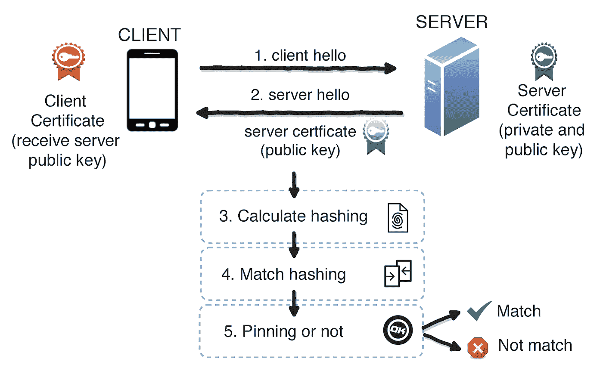
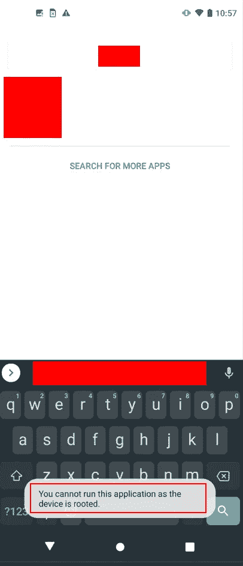
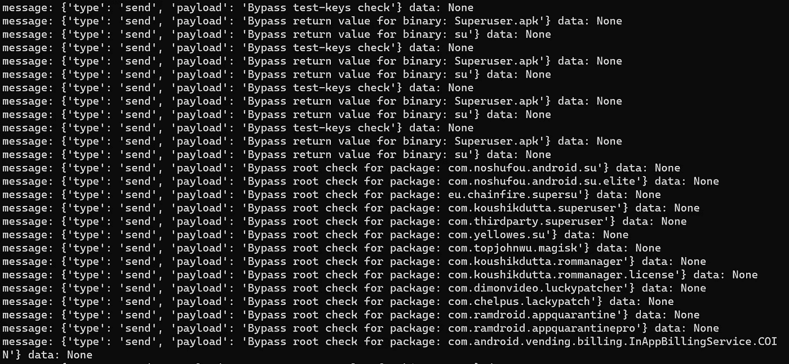
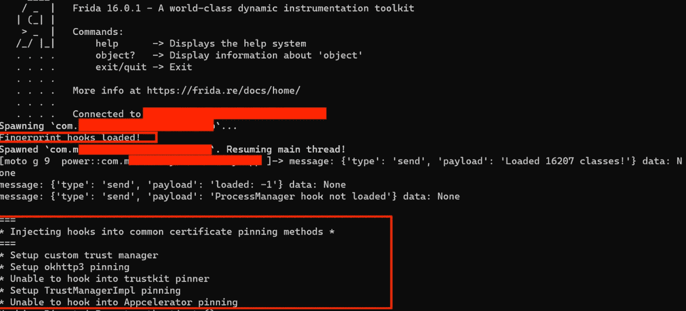
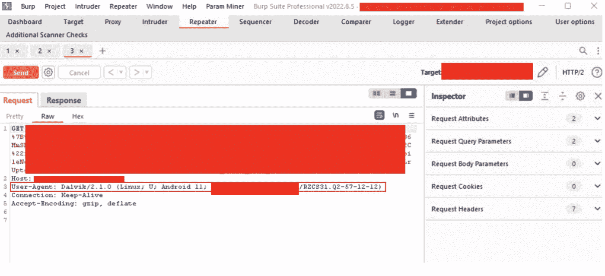
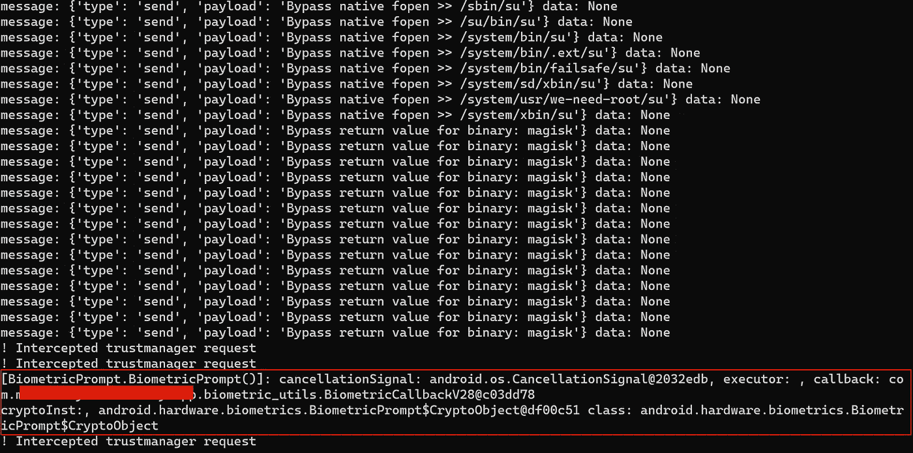
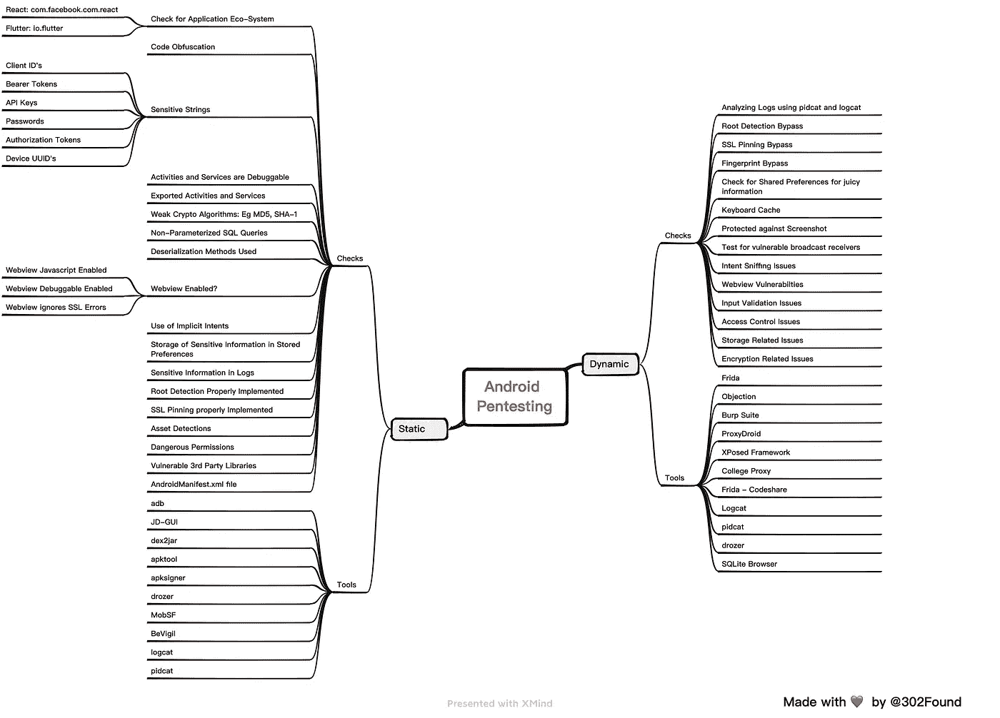

# 安卓测试 101 —第三部分

> 原文：<https://infosecwriteups.com/android-pentesting-101-part-3-2bf846b05594?source=collection_archive---------0----------------------->

欢迎来到 Android Pentesting 的第 3 部分。这个系列是关于你如何使用各种方法入侵 Android 并找到其中的漏洞。如果您还没有阅读第 1 部分和第 2 部分，我强烈建议您在跳到这一部分之前阅读它们。你可以在[这里](https://medium.com/@302found)找到它。

在第三部分，也是最后一部分，我们的目标是涵盖 Android Pentesting 的动态分析，以及各种工具。你准备好了吗？？


因此，Android Pentesting 中的动态分析就是处理应用程序发送给 web 服务器的请求和响应。但是问题就在这里！在捕获请求之前要做两件事:

1.  根检测旁路
2.  SSL 锁定旁路

让我们单独谈谈他们。

**Root 检测旁路:**Root 是允许 Android 移动操作系统的用户获得对各种 Android 子系统的特权控制(称为 Root 访问)的过程。不应该允许应用程序在根设备上运行。因此，我们使用 [Frida](https://github.com/frida) 和 [Objection](https://github.com/sensepost/objection) 尝试各种根检测旁路。

**SSL Pinning Bypass:**SSL Pinning 是大多数应用程序所有者实施的一种技术，这样移动应用程序发送的任何请求都不会被拦截。SSL 固定被认为是应用程序安全机制中的第一步，也是最重要的一步。但由于手段不当，SSL pin 通常可以被绕过。同样 [Frida](https://github.com/frida) 和[异议](https://github.com/sensepost/objection)是在这方面帮助我们的最佳工具。



那么如何从动态分析开始呢？好吧，第一步是需要一个根深蒂固的安卓手机。你可以使用 [Magisk](https://www.xda-developers.com/how-to-install-magisk/) (最好也是最准确的方法)或其他方法在找到[任何 Android 手机。或者，您可以使用 Genymotion，它有时不能提供准确的结果](https://www.rootingsteps.com/root-moto-g9-power/)

好的，让我们从一个活动目标开始，我们称这个应用程序为<redacted>。好的，那么<redacted>已经实现了根检测，可以在下面的截图中看到。</redacted></redacted>



现在要绕过，这很简单:

1.  下载并安装弗里达&反对使用[冰雹弗里达](/hail-frida-the-universal-ssl-pinning-bypass-for-android-e9e1d733d29)。
2.  试着按照这篇[文章](https://support.portswigger.net/customer/portal/articles/1841101-configuring-an-android-device-to-work-with-burp)连接打嗝套件和你的手机
3.  使用 ADB shell/data/local/tmp/Frida-Server &启动 Frida 服务器
4.  打开应用程序，并让应用程序在后台运行。
5.  使用:frida-ps -Ua 查找应用程序包名称
6.  现在你需要找到合适的剧本。这次我们将运行 Root Bypass 脚本，可以在[这里](https://codeshare.frida.re/@dzonerzy/fridantiroot/)找到。如果这个弗里达脚本不起作用，你可以在网上找到更多。其他 Frida 脚本可以在这里找到。
7.  最后一步是使用 Frida 通过以下命令挂钩脚本:

```
frida -U -f com.package.android -l D:\frida\fridascript-root.js --no-paus
```



或者，您可以使用异议来绕过根检测。这可以使用以下命令快速完成:

1.  反对-g "com.package.android "探索
2.  android root 禁用
3.  android root 模拟

完美！现在我们已经绕过了根检测，我们可以继续前进了。在我们能够捕获绕过 SSL 固定的请求之前，还有一个步骤。

好了，为了绕过 SSL 锁定，我们将再次使用 Frida 和 SSL 锁定绕过脚本，可以在这里找到。啊哦！但是这里有一个问题，你不能同时运行两个 Frida 脚本。但是没问题！只需在 Root Detection Bypass 脚本下添加 SSL Pinning Bypass 脚本，然后重新运行 Frida，看看有什么神奇之处。



该死。下面是我们如何捕获所有请求的方法！或者，您可以使用异议来绕过 SSL 固定。这可以使用以下命令快速完成:

1.  反对-g "com.package.android "探索
2.  android sslpinning 禁用
3.  android sslpinning 模拟

哦，等等！应用程序也使用指纹来验证用户。让我们试着绕过它。指纹旁路的脚本可以在[这里](https://github.com/WithSecureLabs/android-keystore-audit/blob/master/frida-scripts/fingerprint-bypass.js)找到。所以只需在根检测和 SSL 锁定脚本下面添加指纹旁路脚本。



太好了！所以我们也能绕过指纹！那么接下来呢，nothing 捕获所有的请求，并像测试 Web 应用程序一样尝试处理它们。

我们已经收集并添加了所有我们认为对[有用的 Frida 脚本。请随意使用它们。此外，我们还创建了一个思维导图，您可以在下面找到它。](https://github.com/302Found1/Awesmoe-Frida-Scripts)



这就是这篇文章的全部内容！我们希望你喜欢整个系列！我们将再次推出这样的系列，这一次将是 iOS Pentesting，我们将向您展示执行 iOS Pentesting 时的动态分析方法。

狩猎愉快！

**作者:**

瓦伊巴夫·拉哈尼:[https://www.linkedin.com/in/vaibhav-lakhani](https://www.linkedin.com/in/vaibhav-lakhani)

[迪尔·帕尔马](https://www.linkedin.com/in/dhir-parmar-925b171a4):[https://www.linkedin.com/in/dhir-parmar-925b171a4](https://www.linkedin.com/in/dhir-parmar-925b171a4)

## 来自 Infosec 的报道:Infosec 每天都有很多内容，很难跟上。[加入我们的每周简讯](https://weekly.infosecwriteups.com/)以 5 篇文章、4 个线程、3 个视频、2 个 GitHub Repos 和工具以及 1 个工作提醒的形式免费获取所有最新的 Infosec 趋势！