# 安卓测试实验室

> 原文：<https://infosecwriteups.com/android-pentesting-lab-4a6fe1a1d2e0?source=collection_archive---------0----------------------->

## 初学者循序渐进指南！


# 介绍

作为一个圣灵降临者，在不同的领域发展新的技能是非常重要的，因为你可能会从一种方法中错过一些重要的东西。Android pentesting 就是其中之一，但它需要一个专用的环境，我将解释如何设置一个简单的环境。所以让我们开始吧！

**目录:**

*   设置 android 模拟器(Genymotion)
*   在设备上配置 Burp Suite CA 证书
*   Frida 绕过 SSL 固定
*   字节码查看器(用于静态分析)

> 在安装模拟器之前，我建议安装任何基于 Linux 的发行版或 [Santoku](https://santoku-linux.com/) ，这是专门为移动测试设计的。安装 Santoku 超出了本文的范围，但是您可以按照本 指南中的 [**进行安装。**](https://santoku-linux.com/howto/installing-santoku/installing-santoku-in-a-virtual-machine/)

# 1.基因运动

当开始学习时，android 模拟器是获得各种具有不同 API 级别的设备的经验的好方法，而不需要花费太多，免费版本的 Genymotion 提供了很好的用户体验和易于配置的特性。

> 注:VirtualBox 被 genymotion 用作核心，虚拟化 Android 操作系统。因此，请在您的系统中安装 VirtualBox 以便继续:[链接](https://www.virtualbox.org/wiki/Downloads)

Genymotion 需要用户注册才能使用它的仪表板，首先你需要创建一个帐户:[链接](https://www.genymotion.com/account/create/)

完成注册过程后，从[这里](https://www.genymotion.com/download/)下载其安装程序，并将其安装在您的主机上。

```
# Make it executable
$- **chmod +x genymotion-<version>-linux_x64.bin**# Specify your path, here i am installing in user's home directory
$- **./genymotion-<version>-linux_x64.bin -d ~/**
```

一旦 Genymotion 安装完毕，您就可以使用注册过程中指定的凭据登录，并使用其仪表板，如图 1 所示。

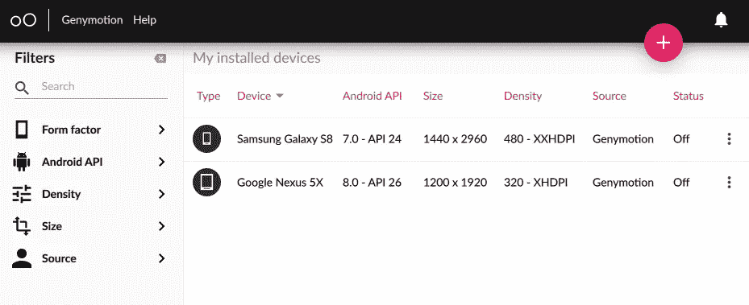

图一。Genymotion 仪表板

在这里，我已经安装了两个设备，但是您可以通过单击右上角的加号图标并选择您想要的模板来安装新设备，对于此示例，我将安装三星 Galaxy S9 (8.0 — API 26)

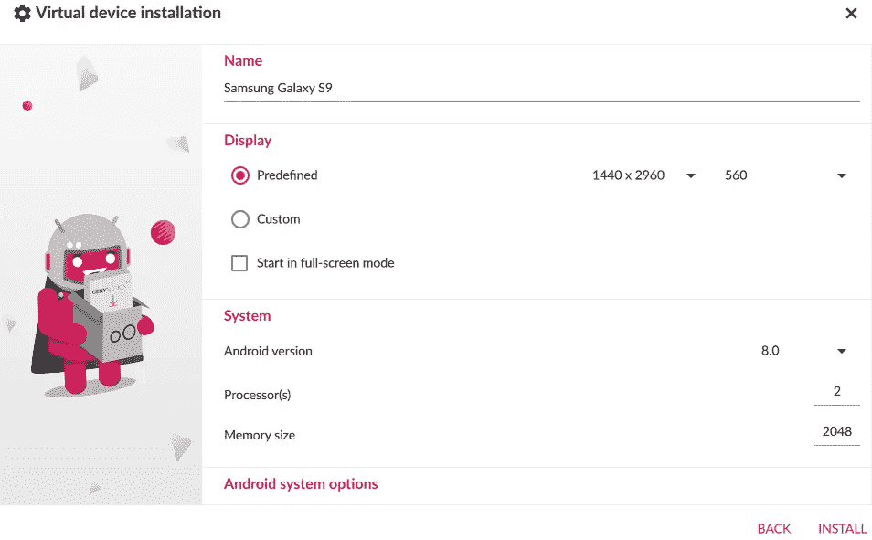

图二。安装三星 galaxy s9

## 配置 Genymotion

启动装置后，有几件事需要考虑:

*   **ARM 翻译器:**

如果某个应用程序包含 ARM 本机代码，那么 Genymotion 将无法运行该应用程序，因为它由 x86 (32 位)架构组成，并将引发错误。可以通过在仿真设备中安装 ARM 翻译库来避免这个问题: [link](https://github.com/m9rco/Genymotion_ARM_Translation)

> **注意:**目前这个库只支持 android 版本，所以请根据您的仿真设备的规格下载正确的包。

*   **拯救 APK(安卓包):**

通过工具栏中的 Open Gapps 小部件，将目标应用程序安装到仿真设备变得更加容易，如图 3 所示。

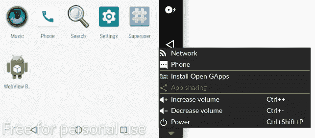

图 3。在 genymotion 中安装 Gapps

安装后，您可以直接从 Play Store 下载您的目标应用程序。但是将这个 apk 保存到主机系统中是有益的，主要有两个原因:

1.  无需将相同版本的应用程序下载到具有相同规格的不同仿真设备中。
2.  反编译程序审查源代码进行静态分析所必需的。

那么我们如何拯救他们呢？

通常你有两种方法获得 apk，要么从像 evozi 这样的网站下载，要么使用 adb (Android debug bridge)下载

> **注意:** Genymotion 已经在它的安装目录中预装了这个工具，我的位于~/genymotion/tools/

出于演示目的，我将使用 Twitter Lite 应用程序:

```
# Call package manager (pm) and filter out twitter's package name
$- **./adb shell pm list packages | grep twitter**# Check the absolute path 
$- **./adb shell pm path com.twitter.android.lite**# Pull apk and rename to twitter_lite.apk
$- **./adb pull /data/app/com.twitter.android.lite-somevalue.apk twitter_lite.apk**
```

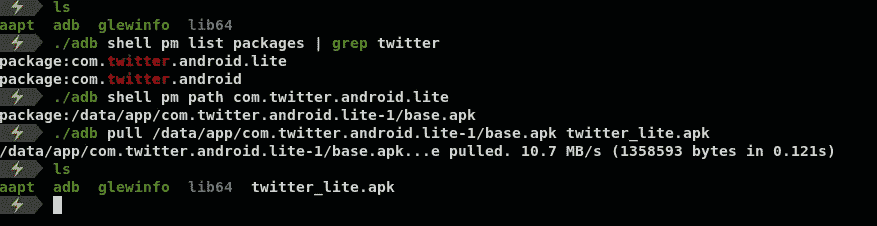

图 4。将 apk 从 Genymotion 传输到主机

现在只需将这些 apk 拖放到仿真设备中。

# 2.打嗝组曲

我假设读者已经安装了 burp 套件，如果没有，那么只需下载其社区版本:[链接](https://portswigger.net/burp/releases/community/latest/)

> 在这里，我将只向你展示如何配置 android 仿真设备。

Android Nougat 和更高版本(API >= 24)仅信任系统级 CA(证书颁发机构)证书，用于安全通信，尤其是 WebView。你可以从这里了解更多:[链接](https://serializethoughts.com/2016/09/10/905)

因此，绕过这一限制的最简单的方法是安装 Burp CA 的证书作为系统信任证书，这种方法也将防止我们设置锁定屏幕 PIN😎

## 步骤:

**1。**将打嗝 CA 导出为 der 格式

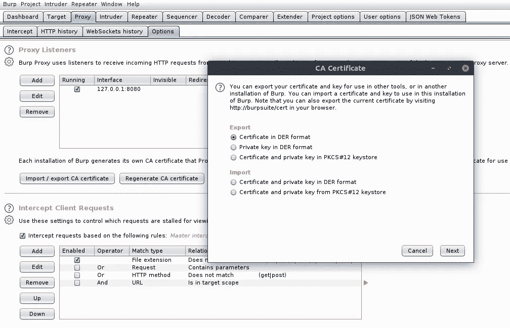

图 5。以 der 格式导出 Burp CA 的证书

**2。**使用 [Openssl](https://github.com/openssl/openssl) 将 DER 转换为 PEM 并重命名为<cert-hash>0

```
# Convert certificate format from DER to PEM
$- **openssl x509 -inform DER -in cacert.der -out cacert.pem**# Display the "hash" of the certificate subject name
$- **openssl x509 -inform PEM -subject_hash_old -in cacert.pem | head -1**# Move cert.pem and rename to <hash>.0
$- **mv cacert.pem 9a5ba575.0**
```

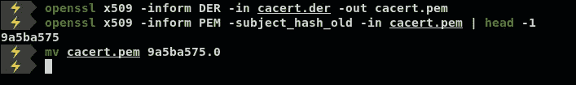

图 6。使用 openssl 准备 Burp CA

> 注意:如果你的 openssl < 1.0，使用 **-subject_hash**

**3** 。使用 adb 在仿真设备中移动证书

```
# Change /system partition into writable mode with remount
$- **./adb remount**# Transfer certificate
$- **./adb push 9a5ba575.0 /system/etc/security/cacerts/**# Change its permissions
$- **./adb shell chmod 644 /system/etc/security/cacerts/9a5ba575.0**# Reboot to let changes occur
$- **./adb shell reboot**
```

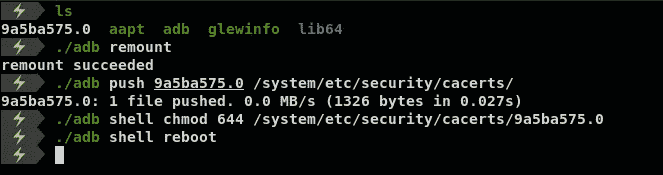

图 7。转移证书

现在，您的证书应该安装为系统信任的 CA 证书，您可以通过导航进行确认:

设置→安全性和位置→加密和凭证→可信凭证

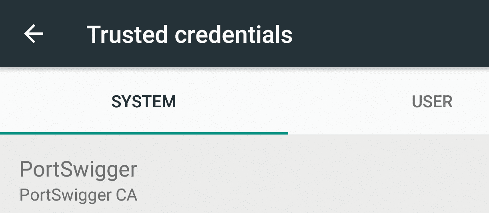

图 8。确认 Burp 的证书

**4。**配置 burp suite 的代理

导航到代理→选项→代理监听程序→添加

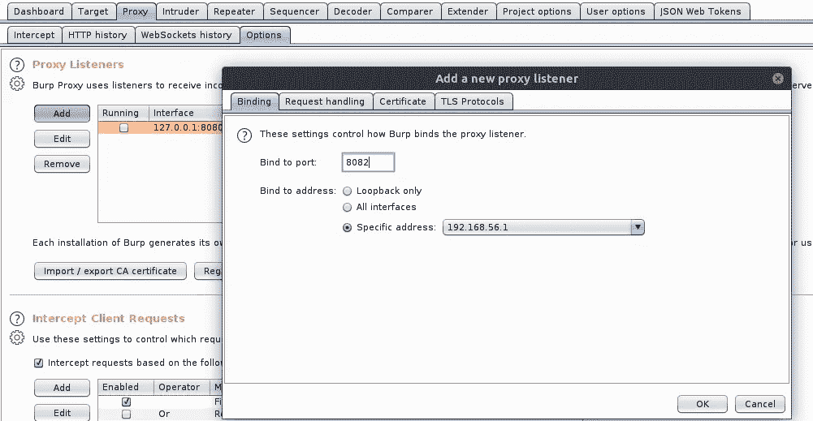

图 9。在 Burp 中配置代理

在这里，我将端口 8082 绑定到我的 VirtualBox 的接口 IP

**5。**在仿真设备上，配置 WiFi 设置。

导航到 WiFi →长按 WiFi 名称→修改网络→高级选项→将代理无更改为手动

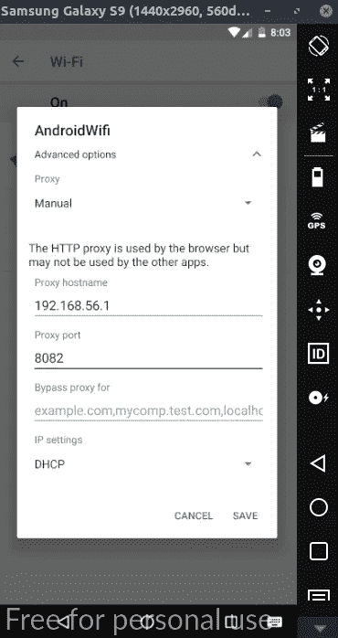

图 10。配置 WiFi 网络

之后你可以在 burp 的历史中看到网络流量

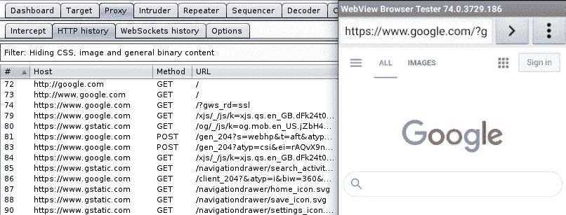

图 11。拦截流量

# 3.弗里达

基本上，Frida 是一个动态代码工具套件，它允许您动态地将代码片段注入到应用程序的运行过程中，以改变其行为，这正是我们需要绕过 SSL 锁定的，但现在您可能会想知道这是什么？

SSL 固定是一种在应用中使用的技术，作为应用流量的附加安全层，以防止 MitM(中间人)等攻击，这不允许 burp 拦截流量，除非我们使用 Frida 等工具来挂钩绕过此功能的特定代码。

**安装**

1.  使用 cli 在主机中安装带有 pip3 的 frida-tools

```
$- **pip3 install frida-tools**
```

2.只下载 x86 版本的 Frida 服务器，因为 Genymotion 的虚拟设备是基于 x86 的，您可以如图 12 所示进行验证。

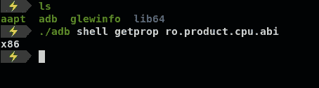

图 12。三星 galaxy s9 (x86) arch

下载[链接](https://github.com/frida/frida/releases)

```
# Downloading using wget as an example
$- **wget** [**https://github.com/frida/frida/releases/download/<version>/frida-server-<version>-android-x86.xz**](https://github.com/frida/frida/releases/download/12.11.9/frida-server-12.11.9-android-x86.xz)# Decompress using unxz
$- **unxz frida-server-<version>-android-x86.xz**# Rename for ease
$- **mv frida-server-<version>-x86.xz frida-server**# Transfer into the emulated device using adb
$- **./adb push ~/Downloads/frida-server /data/local/tmp**# Change its permissions
$- **./adb shell chmod 755 /data/local/tmp/frida-server**# Run Frida-server in the background
$- **./adb shell /data/local/tmp/frida-server &**
```

现在，在设置 Frida 服务器之后，我们将能够使用我们的脚本，但是首先我们需要找到 APK 的名字，你可以通过任何一种方式找到它

```
# Old method using pm
$- **./adb shell pm list packages | grep someapp**# Another way using Frida but for this app first need to be started
$- **frida-ps -U | grep someapp**
```

出于演示目的，我的目标是**s drill**，我使用的是[**这个**](https://codeshare.frida.re/@sowdust/universal-android-ssl-pinning-bypass-2/) bypass 脚本，只需将它保存到一个 js 文件中

现在让我们看看 Skrill 是否抛出了任何 SSL 错误

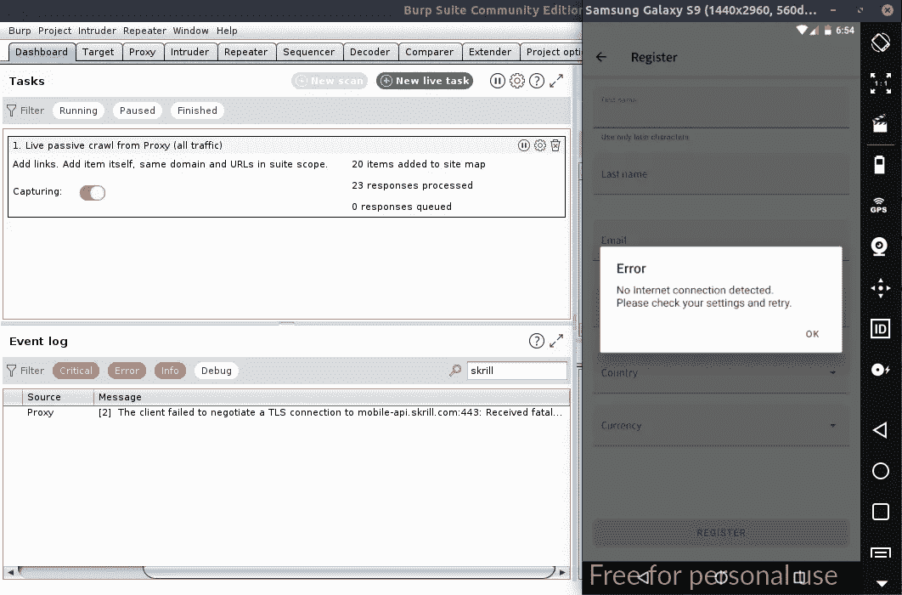

图 13。Skrill 正在使用 SSL 固定

正如预期的那样，现在使用 Frida 和一个旁路脚本来拦截网络流量

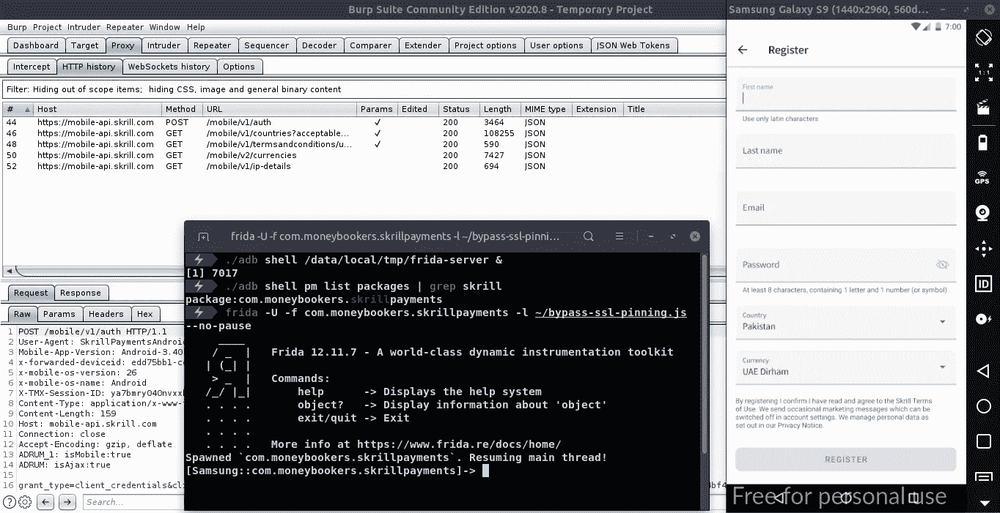

图 14。旁路成功

正如你现在看到的，在使用 FRIDA 成功绕过 SSL pin 之后，我们可以继续测试😃

# 4.字节码查看器

静态分析是一个简单的过程，它通过检查应用程序的源代码来了解应用程序的执行情况。然而，反编译它的源代码可能很难，为此有一些反编译程序，如 [jadx](https://github.com/skylot/jadx)

但是我个人喜欢[字节码查看器](https://github.com/Konloch/bytecode-viewer),因为它有大量不同的 Java 反编译器、两个字节码编辑器和许多其他特性。

下载[链接](https://github.com/konloch/bytecode-viewer/releases)

下载后，只需运行反编译程序，将文件拖放到文件部分进行反编译。

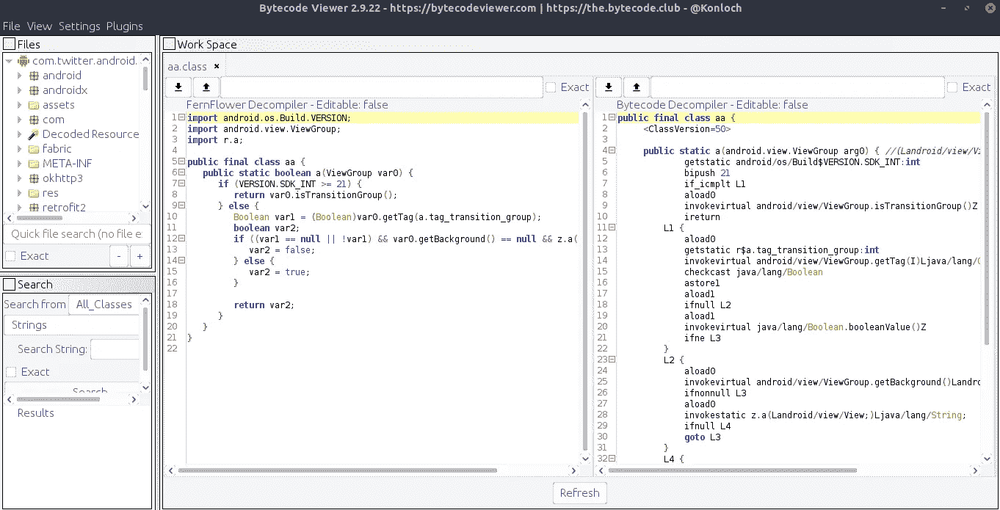

图 15。运行字节码查看器

暂时就这样了😃

希望这能消除你的一些疑虑，让你能够创建自己的 android 实验室。

祝圣灵降临节快乐！