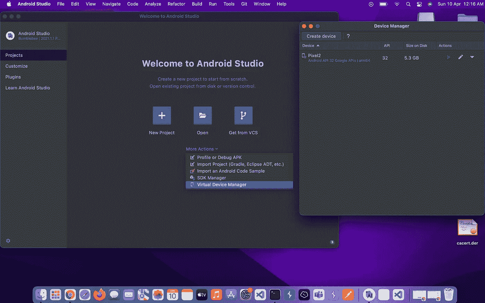
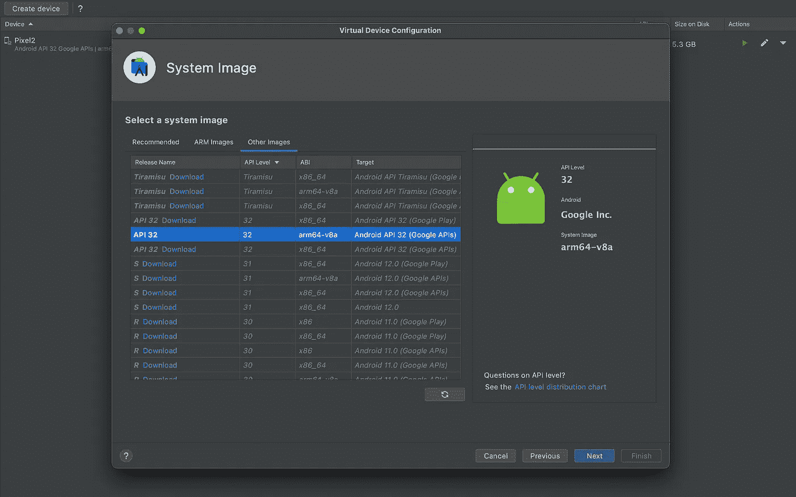
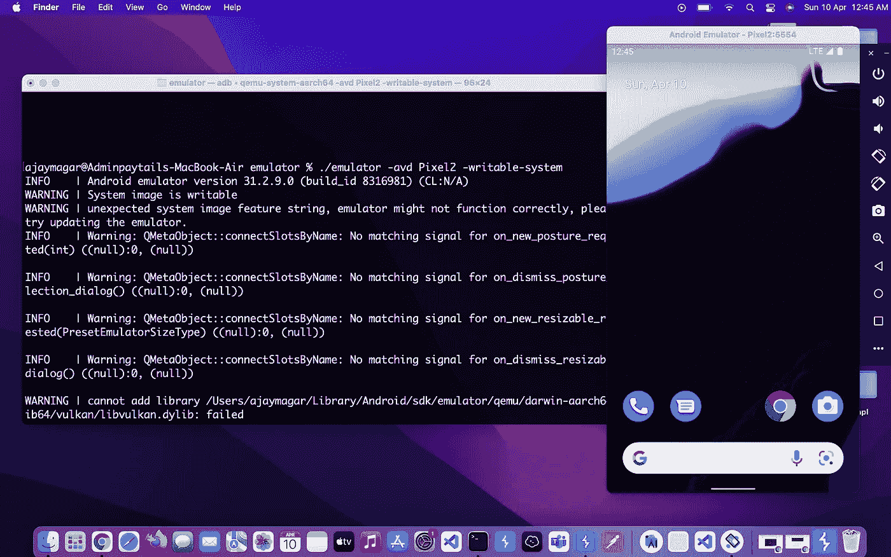
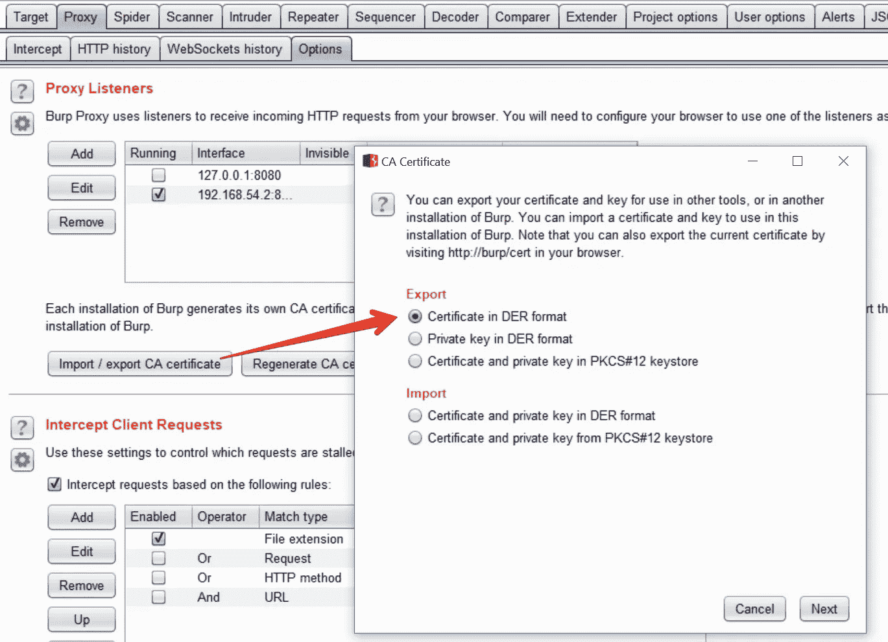
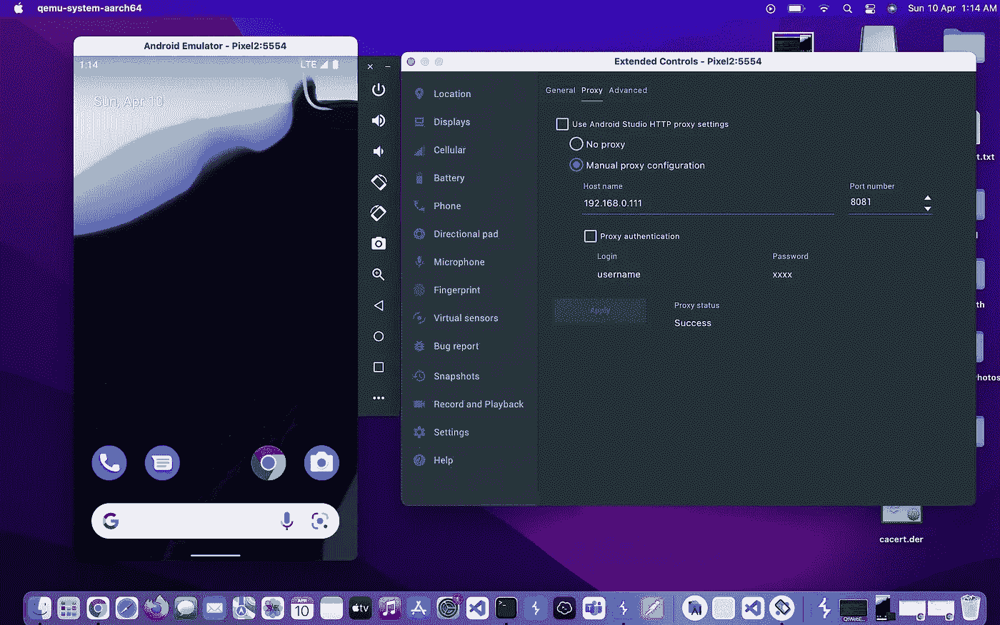
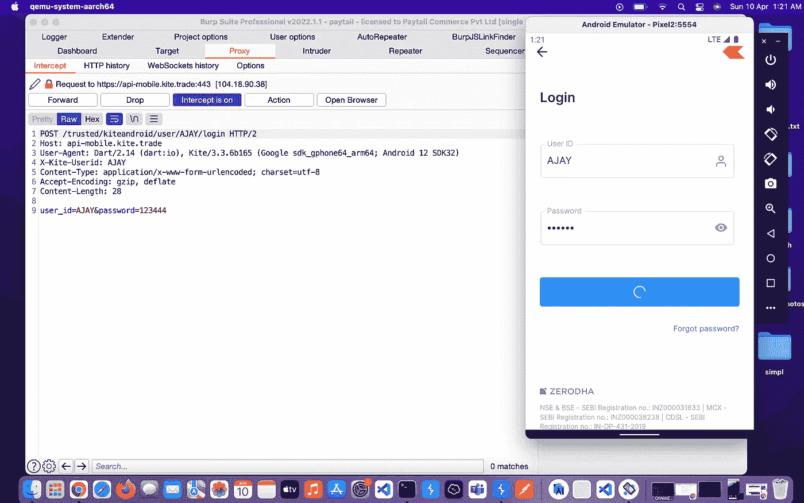

# Macbook M1 上的 Android 测试设置

> 原文：<https://infosecwriteups.com/android-pentesting-setup-on-macbook-m1-d2f1f0a8db4b?source=collection_archive---------0----------------------->

你好黑客们，

众所周知，对于人工智能测试，我们需要物理设备或仿真器。当我开始学习模拟器时，我参考了互联网上的一些视频和博客，每个人都建议使用 Genymotion 模拟器。用了一段时间后，我注意到它基于 x-86 的架构，所以我们不能测试基于 x-64 架构的应用。此外，在基于 Flutter 的应用程序中，他们为 SSL pin 提供了内部安全性。最近，我转移到 Macbook m1 进行全职测试。M1 芯片不支持虚拟化，所以没有 Virtualbox。而且 Gennymotion 对 virtualbox 有依赖性。没有 virtualbox 它不会工作。经过一番研究，我找到了比基因运动更好的方法

对于模拟器，我选择 Andriod 工作室。Andriod 工作室有他们的虚拟设备。从他们的官方网站下载最新的 Andriod studio。关于安装，你可以参考任何 Youtube 视频，这很简单。

## 安卓工作室大黄蜂 2021.1.1 补丁 3

[https://developer.android.com/studio?gclid = cjwkcajw3cssbgbgeiwavii 0 z 4 hem 14 aycdbnnrs 0 faw H9 ri-ge 77 eobpqd 6v _ 6 dnppygicnqefk 7 bockpkqavd _ BwE&gcl src = aw . ds](https://developer.android.com/studio?gclid=CjwKCAjw3cSSBhBGEiwAVII0Z4hEm14aycDbNNrS0fAwH9rI-Ge77EObpqD6V_6DnppYgICNQEfk7BoCKPkQAvD_BwE&gclsrc=aw.ds)

安装后打开 Andriod Studio 并创建一个设备



我选择 Pixel2 API 级别— 32 arm64-v8a



每个现代应用程序都支持这种配置。

创建设备后，将设备名称复制到剪贴板上。走这条路。/Users/your name/Library/Android/SDK/Emulator，然后用这个命令**打开仿真器。/emulator-avd pixel 2-writable-system**

Pixel2 是我自定义设备名称，在您的情况下，使用此命令查找您的设备名称会有所不同。 **/emulator -list-avds** 和-writable -system 对于安装 burp 证书非常重要



最重要的部分来自这里安装 Burpsuite 证书作为系统级可信 CA，这是对 SSL 锁定的渗透解决方案。

所有可信 CA 都存储在 Andriod 中的路径**/system/etc/security/cacerts**中。经过一些修改的 root 权限允许我们在这里添加我们的证书

**导出并转换打嗝 CA** 第一步是获得正确格式的打嗝 CA。使用 Burp Suite，以 DER 格式导出 CA 证书。我把它保存为`cacert.der`



Android 希望证书采用 PEM 格式，并且文件名等于附加了`.0`的`subject_hash_old`值。

使用`openssl`将 DER 转换为 PEM，然后输出`subject_hash_old`并重命名文件:

```
openssl x509 -inform DER -in cacert.der -out cacert.pemopenssl x509 -inform PEM -subject_hash_old -in cacert.pem | head -1
9a5ba575\.     #output hash value mv cacert.pem 9a5ba575.0        # change name 
```

**将证书复制到设备**我们可以使用`adb`来复制证书，但是由于它必须被复制到`/system`文件系统，我们必须将其重新挂载为**可写的**。作为根，这很容易与`adb remount`。

。/emulator -avd Pixel2 - **可写-系统。#对于这个可写系统是 IMP**

```
adb root
adb remount
adb push 9a5ba575.0 /sdcard/
```

只需放入一个 shell ( `adb shell`)并将文件移动到`/system/etc/security/cacerts`并将其更改为 644:

```
mv /sdcard/9a5ba575.0 /system/etc/security/cacerts/
chmod 644 /system/etc/security/cacerts/9a5ba575.0
```

现在用 **adb 重启**重启仿真器，并开始用 Burpsuite 代理

复制机器的 IVP4 地址，在模拟器中打开扩展控制，然后转到代理选项卡—手动代理配置—根据您的主机名和端口名。Burpsuite 配置。



我们现在可以走了。

黑客快乐…..！

[](https://www.linkedin.com/in/ajay-magar/) [## Ajay Magar -安全研究员- HackerOne | LinkedIn

### 查看 Ajay Magar 在全球最大的职业社区 LinkedIn 上的个人资料。Ajay 有 2 份工作列在他们的…

www.linkedin.com](https://www.linkedin.com/in/ajay-magar/)