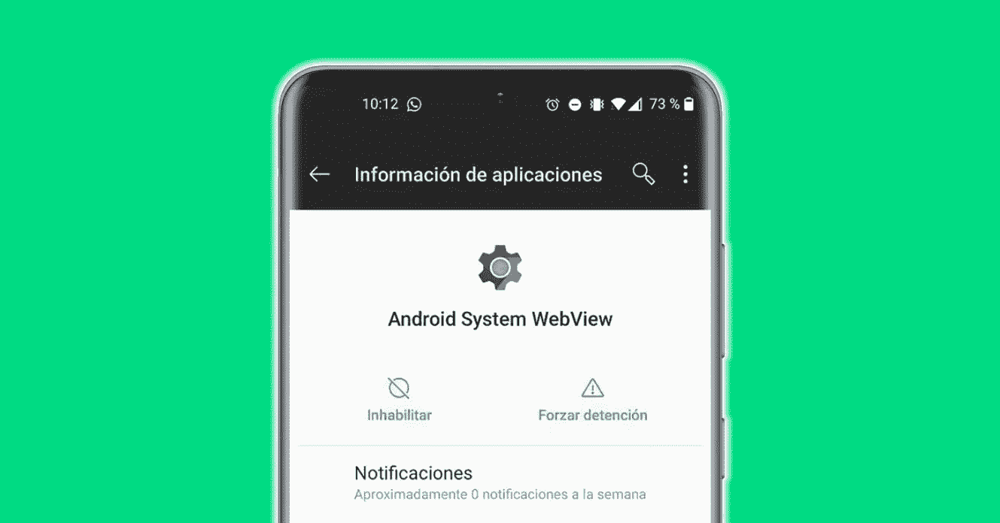
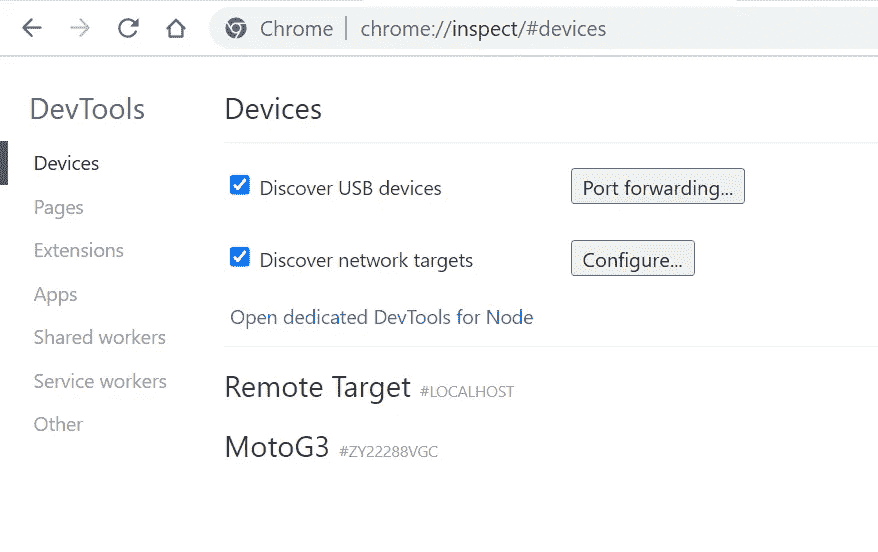
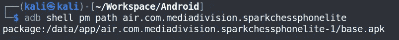
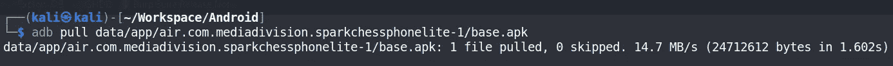
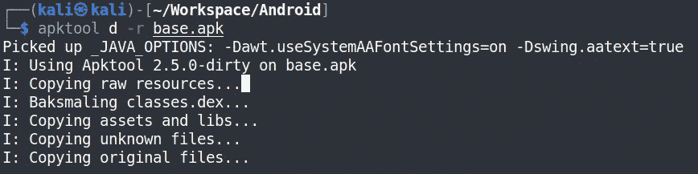
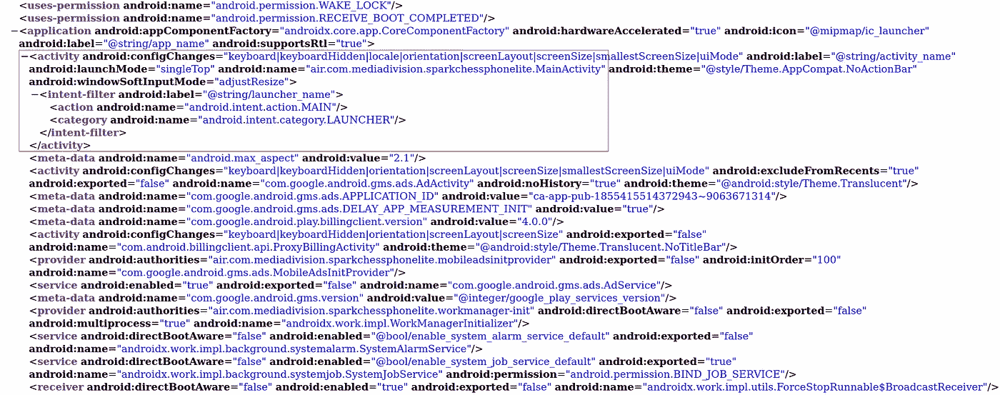
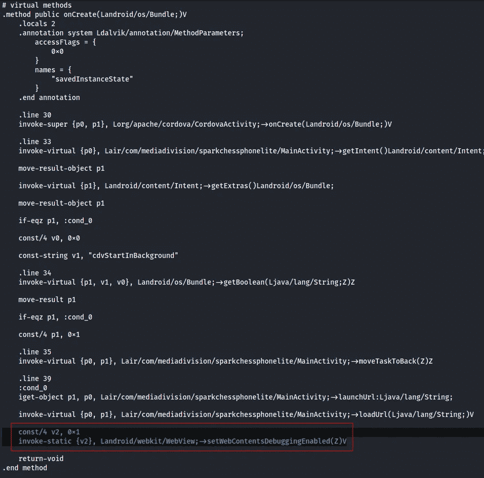
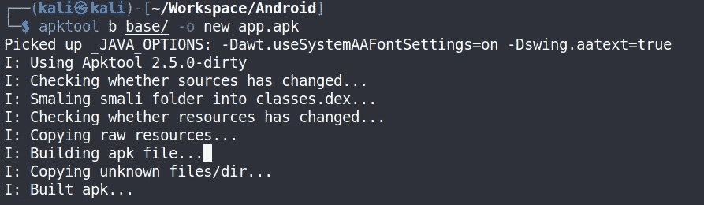
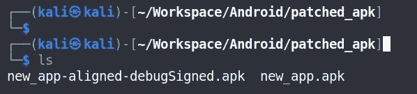
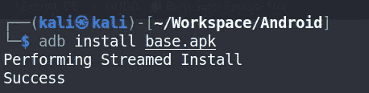

# Android WebView 黑客—启用 WebView 调试

> 原文：<https://infosecwriteups.com/android-webview-hacking-enable-webview-debugging-d292b53f7a63?source=collection_archive---------1----------------------->



# **TL；博士**

如果您曾经遇到过使用 javascript 和 WebView 的应用程序，这些技巧将帮助您轻松调试应用程序。

有两种方法可以启用 WebView 调试:

1.  微小修改
2.  使用 Frida 工具

# 介绍

有太多的应用程序只是网页的包装器，或者存储在应用程序中的网页内容。

如果:

*   一个开发者不想用本地语言创建一个 Kotlin (Android)或 Swift (iOS)的应用程序。
*   开发人员希望在 html、css 和 javascript 开发中使用某些本机平台功能。

有大量很酷的新框架可用，开发人员可以使用它们来构建跨平台支持的应用程序，或者想要进行混合应用程序开发。

## 跨平台应用

跨平台是一种能够在多种计算平台上运行的软件，如 Android、iOS、Windows、Blackberry 等。

基于该框架构建的应用程序不需要为每个平台单独编码，相反，一次编码将为应用程序在所有平台上高效运行奠定基础。

它超级酷，因为你只需要编码一次，应用程序可以发布到所有的平台。许多框架都是基于 javascript 构建的，这为开发人员提供了一个优势，他们不必学习新的语言来构建应用程序。

## 混合应用

混合应用程序本质上是一个 web 应用程序，但它有一个轻量级的本机应用程序“容器”，允许它利用 web 应用程序无法访问的某些本机平台功能和设备硬件(例如，设备的摄像头、日历、推送通知以及收缩和展开功能)。

***然而，这种方法在应用程序中打开了一个攻击媒介，我将在这里与您分享。***

# 什么是 WebView？

Android WebView 是 Android 操作系统(OS)的一个系统组件，允许 Android 应用程序直接在应用程序中显示来自 web 的内容。WebView 应用程序主要由 Javascript、CSS 和 HTML 文件组成。基本上，应用程序是一个或多个网页。这些网页组成了你的前端界面。如果开发者想要将浏览器功能添加到应用中，他/她可以包括 WebView 库并创建 WebView 类的实例；这实际上是在应用程序中嵌入了一个浏览器，来完成诸如渲染网页和执行 JavaScript 之类的任务。

# 什么是 WebView 调试？

在 Android WebViews 中有一个调试功能，允许你使用 chrome 的 [ADB 远程调试扩展](https://chrome.google.com/webstore/detail/adb/dpngiggdglpdnjdoaefidgiigpemgage)来调试 WebView 的内容。发布在 app store 上的大多数应用程序通常都是关闭的，但是如果您正在测试，您可以在演示应用程序或试运行应用程序中找到该功能。所以这些小技巧就是在 app store 下载的 Android 应用上启用该功能。

基本上有 **2 种方法**来启用 WebView 调试

1.  微小修改
2.  使用 Frida 工具

# 方法 1:小规模修改

## 启用 WebView 的步骤:

*   下载应用程序进行修改
*   删除已禁用 WebView 的应用程序。(原始申请)
*   反编译应用程序
*   打开 WebView 调试(少量修改)
*   重新编译并重新提交应用程序
*   分析应用程序

我们来举个例子学习一下。我们将采用用 [Cordova 框架](https://cordova.apache.org/)编写的以下应用程序: [SparkChess](https://play.google.com/store/apps/details?id=air.com.mediadivision.sparkchessphonelite&hl=en_IN&gl=US)

## 检查 WebView 状态

我们需要检查的第一件事是应用程序默认启用了 WebView。

我们可以通过Chrome 浏览器中的 *chrome://inspect/* 轻松验证。如果您在连接的设备下看到任何东西，则表示它已启用。



## 从手机下载应用程序

*   识别包的路径

```
adb shell pm path air.com.mediavision.sparkchessphonelite
```



*   打开 apk

```
adb pull /data/app/air.com.mediavision.sparkchessphonelite-1/base.apk
```



## 反编译应用程序

*   使用 apktool 反编译应用程序

```
apktool d base.apk
```



## 识别注入点

人们需要弄清楚把神奇的代码行放在哪里。我通常喜欢在应用程序的启动器活动上做，因为当应用程序启动时，它总是会运行。

我们可以通过在 AndroidManifest.xml 文件中查找带有“LAUNCHER”意图过滤器的活动来解决这个问题。在这种情况下，启动器类是“air . com . media vision . sparkchesphonelite . main activity”



## WebView 的少量修改

在方法的返回之前添加以下行

```
const/4 v2, 0x1
invoke-static {v2}, Landroid/webkitWebView;->setWebContentsDebuggingEnabled(Z)V
```



第一行将一个变量设置为 true，第二行将该变量传递给 WebView 类中的静态方法“setWebContentsDebuggingEnabled”。
*上面突出显示了启用调试的附加代码。*

## 重新编译和重新签名

*   使用 apktool 重新编译应用程序

```
apktool b base/ -o new_app.apk
```



*   使用[优步 Apk 签名者](https://github.com/patrickfav/uber-apk-signer)工具提交申请

```
java -jar uber-apk-signer-1.2.1.jar -a ./patched_apk — out ./patched_apk
```


其中 ***patched_apk*** 是包含 apk 的文件夹，输出将存储到同一个文件夹。

*   观察新签署的应用程序



## 安装修改后的应用程序

*   首先你要确保删除你的旧应用程序

```
adb uninstall air.com.mediavision.sparkchessphonelite
```

*   安装修改后的应用程序

```
adb install new_app-aligned-debugSigned.apk
```



## 观察变化

瞧啊。我们现在有了一个启用了 WebView 调试的应用程序。让我们通过首先打开应用程序，然后打开我们心爱的 Chrome 开发工具来检查它。
转到: *chrome://inspect*


# 方法 2:使用 Frida 工具

你们中的一些人可能是动态仪器的粉丝。您只需要运行这个 frida 脚本来启用 WebView 调试:

[弗里达剧本](https://gist.github.com/n1sh1th/d3ccd68ee17eb9b94b28ecfd6514854b)

您可以按照上述方法中提到的相同步骤来观察应用程序中的变化。

# 参考

*   [https://blog . speed fox . co . uk/articles/1524219174-Android _ webview _ hackery/](https://blog.speedfox.co.uk/articles/1524219174-android_webview_hackery/)
*   [https://book . hack tricks . XYZ/mobile-pentesting/Android-app-pentesting/webview-attacks](https://book.hacktricks.xyz/mobile-pentesting/android-app-pentesting/webview-attacks)

希望你学到了新的东西，喜欢我的博客。保持安全，保持好奇。

感谢阅读！

~Nishith K

与我联系:

推特:[https://twitter.com/busk3r](https://twitter.com/busk3r)

领英:[https://www.linkedin.com/in/nishithkhadadiya](https://www.linkedin.com/in/nishithkhadadiya)