# Angler 漏洞利用工具包感染 1 —恶意软件流量分析

> 原文：<https://infosecwriteups.com/angler-exploitation-kit-infection-1-malware-traffic-analysis-b746514d42c8?source=collection_archive---------3----------------------->


[琵琶鱼](https://www.mcsuk.org/news/eight-scary-halloween-sea-creatures/)

在本文中，我使用 NetworkMiner、Wireshark 和 Brim 来分析一个 PCAP 文件，该文件捕获了属于 Angler 漏洞利用工具包感染的网络流量。PCAP 的文件属于蓝队在[网络卫士](https://cyberdefenders.org/blueteam-ctf-challenges/21)网站上的聚焦挑战，名为“*恶意软件流量分析 3* ”，由 [Brad Duncan](https://twitter.com/malware_traffic) 创建。

# 放弃

我喜欢在文章之前添加一个简短的免责声明，以鼓励人们在阅读本文之前尝试挑战，因为在这篇文章中显然会有**剧透****。我相信，如果你先自己尝试，然后在遇到困难或需要提示时再回来写这篇文章，你会更喜欢这个挑战。因此，没有任何进一步的拖延，让我们开始吧！**

# **挑战问题**

> **1.受感染的 Windows 主机的 IP 地址是什么？**

**我们可以从使用 NetworkMiner 打开挑战 PCAP 文件开始。向下查看 NetworkMiner **hosts** 选项卡，我们可以看到一系列内部私有 IP 地址，包括一台 Windows 机器的地址。由于我们在组织的内部专用网络中看不到任何其他 Windows 计算机，我们可以假设这很可能是受感染的 Windows 虚拟机，但我们需要执行更深入的分析来确认这一点。**

**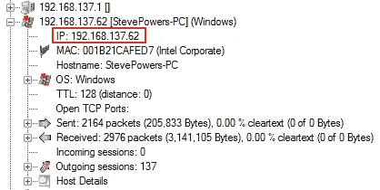**

**受感染的 Windows 主机的 IP 地址。**

> **2.漏洞利用工具包(EK)的名称是什么？(两个字)**

**要找到漏洞利用工具包(EK)名称，我们可以将整个 PCAP 上传到 VirusTotal 并查看 snort 警报。这里，我们知道使用了**钓鱼器 EK** 。**

**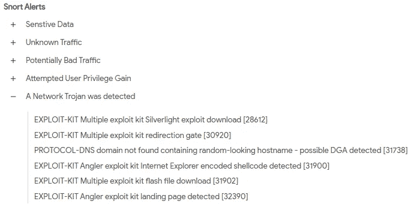**

**Angler EK 的病毒总数 Snort 警报。**

> **3.提供漏洞工具包的 FQDN 是什么？**

**如果我们继续查看为上传的 PCAP 文件提供的 VirusTotal 详细信息，我们可以看到有三个 HTTP 请求被标记为有趣。**

**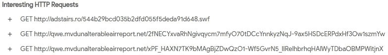**

**VirusTotal 有趣的 HTTP 请求。**

**查看这些请求的详细信息，我可以看到下载了两个 flash 文件和一个 ZIP 文件。**

**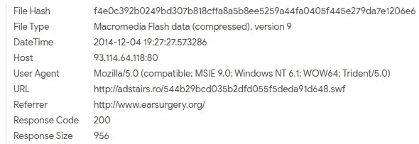**

**闪存文件版本 9。**

**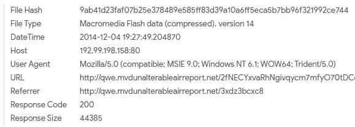**

**闪存文件版本 14。**

**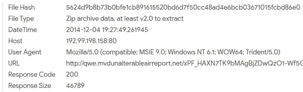**

**ZIP 存档文件。**

**我可以用 Wireshark 导出这些文件，然后上传到 VirusTotal。**

**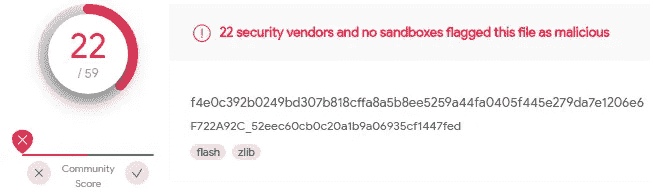**

**病毒总计闪存文件版本 9。**

**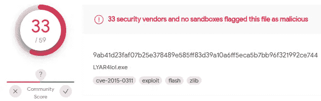**

**病毒总计闪存文件版本 14**

**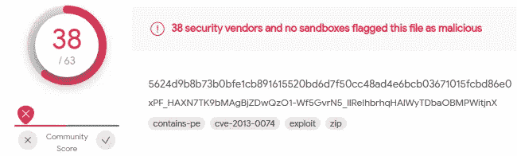**

**病毒总压缩存档文件。**

**如果我们检查 VirusTotal 提供的 ZIP 存档的详细信息，我们会看到与该文件相关联的一个名称引用了“ *AnglerEK* ”。**

**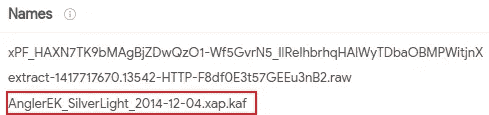**

**VirusTotal 对 AnglerEK 的引用，用于 ZIP 存档。**

**这表明与下载 ZIP 存档相关的 FQDN 用于下载 Angler EK。**

> **4.指向漏洞利用工具包登录页面的重定向 URL 是什么？**

**在 NetworkMiner 的“sessions”选项卡下，我们可以看到 Windows 虚拟机第一次访问漏洞利用工具包登录页面。往回看，我可以看到 Windows 虚拟机在被重定向到漏洞利用工具包登录页面之前访问的 FQDN。**

**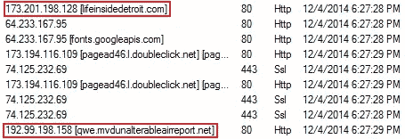**

**NetworkMiner 会话时间表。**

**转到 Wireshark，我们可以过滤 HTTP 流量，并找到上面突出显示的第一个 FQDN 的 HTTP 流。**

**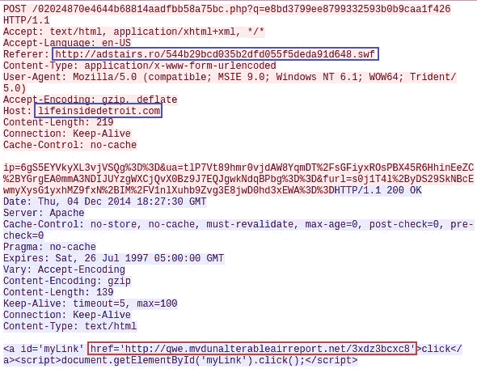**

**“lifeinsidedetroit”网站的 HTTP 流。**

**我可以看到 Windows VM 从“ *adstairs* ”网站访问了“ *lifeinsidedetroit* ”网站，之前看到的恶意 flash 文件就是在这里下载的。发出 POST 请求，在响应中，我们可以看到 EK 登录页面的链接。如果我们继续跟踪这个流，我们可以看到指向漏洞利用工具包登录页面的重定向 URL。**

**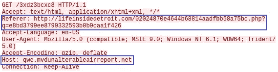**

**重定向指向漏洞利用工具包登录页面的 URL。**

**查看上面对 HTTP GET 请求的响应，我可以看到在网站的 HTML 代码中隐藏了大量可疑的 base64 编码文本。**

**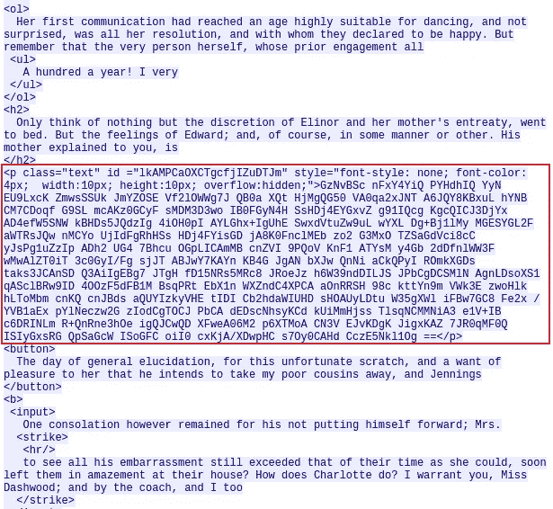**

**HTML 页面中隐藏的可疑 Base64 文本块。**

**在访问了上面的网页之后，我们可以看到下一个 HTTP GET 请求检索了被标识为 Angler EK 的 ZIP 存档文件( **PK** 文件头)。**

**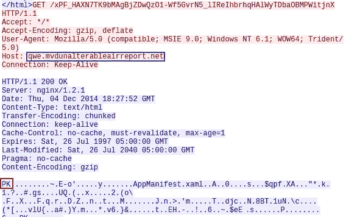**

**HTTP GET 请求检索 Angler EK。**

> **5.被入侵网站的 FQDN 是多少？**

**之前我们看到 Windows VM 从“ *adstairs* ”网站访问了“ *lifeinsidedetroit* ”网站。我们可以通过查看 Wireshark 中“ *adstairs* ”网站的 HTTP 流来继续追溯我们的步骤。**

**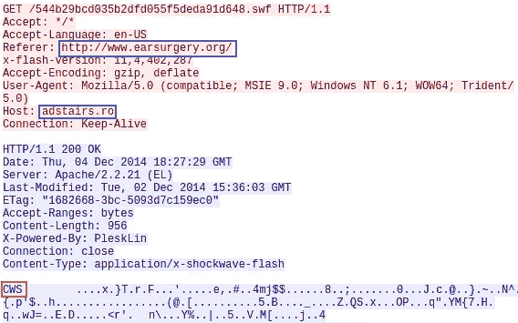**

**HTTP GET 请求检索恶意 Flash 版本 9 文件。**

**查看 HTTP 流，我们可以在 referrer 请求头中看到受损网站的 FQDN。然后我们可以看到一个 HTTP GET 请求来下载 flash 文件( **CWS** 文件头)。**

> **6.哪个 TCP 流显示正在传送恶意软件负载？提供流编号**

**我们可以过滤属于提供漏洞利用工具包的 FQDN 的 HTTP 对象。**

**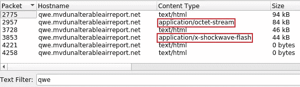**

**过滤属于发送漏洞利用工具包的 FQDN 的 HTTP 对象。**

**我们可以看到恶意软件有效载荷和闪存文件的数据包编号。如果我们使用 mime _ type "*application/octet-stream*"跟踪 TCP 流中的数据包编号，我们可以看到流编号。**

**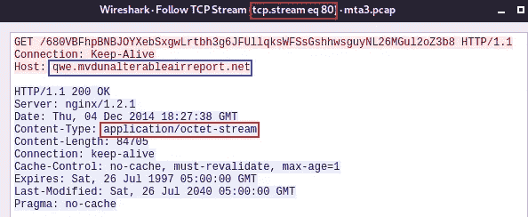**

**TCP 流显示正在传送的恶意软件负载。**

> **7.C&C 服务器的 IP 地址是什么？**

**根据之前 PCAP 上传的 VirusTotal 详细信息，我们可以看到恶意软件正在使用 SSL 加密。**

**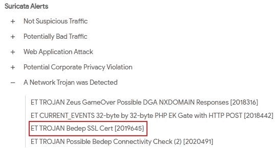**

**病毒总数 SSL。**

**如果我们导航到 Wireshark 中的“*统计数据>会话> TCP 选项卡*，并按照数据包数量从高到低对会话进行排序，我们可以看到前几个会话正在使用端口 443(即 HTTPS)。**

**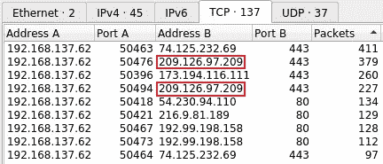**

**按数据包数量排序的 TCP 会话。**

**我们可以排除第一个 IP 地址，它与“[*【fonts.gstatic.com】*](https://developers.google.com/fonts/faq)”相关。在 NetworkMiner 的“hosts”选项卡下，我们可以看到上面以红色突出显示的第二个顶级 IP 地址有一个可疑的 FQDN。**

**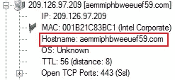**

**可疑的 FQDN。**

**使用 Brim 查看 SSL 流量事件，我们还可以看到主机的两个证书都是[自签名的](https://attack.mitre.org/techniques/T1587/003/)，这是一种用于加密 C2 流量的常用技术。**

**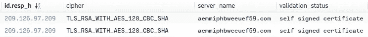**

**自签名证书。**

**由于该 IP 地址有一个可疑的 FQDN，正在与 Windows VM 交换大量的数据包，并且正在使用带有自签名证书的端口 443(通常使用 SSL 加密来隐藏 C & C 对话),我们可以相当有把握地说这是 C & C 服务器 IP 地址。**

> **8.SSL 证书的到期日期是什么时候？**

**在 NetworkMiner 中，我们可以在 files 选项卡下找到自签名证书。选择该文件将为我们提供 SSL 证书的到期日期。**

**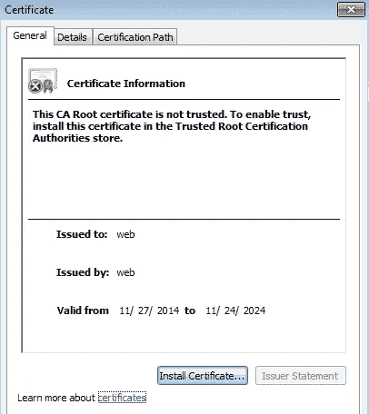**

**NetworkMiner SSL 证书到期日期。**

**我们还可以使用 [Wireshark](https://www.wireshark.org/lists/wireshark-users/201003/msg00080.html) ，通过查看包含 SSL 握手消息“certificate”的数据包，找到 SSL 证书的到期日期。**

**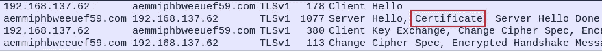**

**SSL 握手消息。**

**然后，我们可以展开数据包的详细信息，并获得到期日期。**

**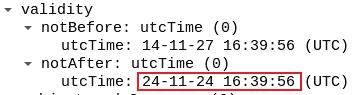**

**Wireshark SSL 证书到期日期。**

> **10.恶意域名提供了一个 ZIP 存档。此存档中包含的 DLL 文件的名称是什么？**

**要找到 ZIP 存档中包含的 DLL 文件的名称，我们可以将该文件上传到 VirusTotal，并在 relations 选项卡中查看任何捆绑文件。**

**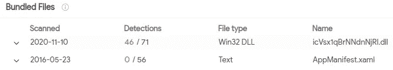**

**VirusTotal 捆绑文件。**

**我们可以看到 ZIP 存档中包含的 DLL 文件的名称。我们还可以使用 Wireshark 查看捆绑的文件，并检查对下载 ZIP 存档的 HTTP GET 请求的响应:**

**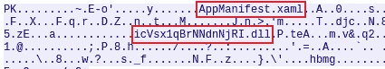**

**Wireshark 捆绑文件。**

> **11.提取恶意软件的有效载荷，去除它的泡沫，并删除开头的外壳代码。这将为您提供用于感染的实际负载(一个 DLL 文件)。有效载荷的 MD5 哈希是什么？**

**我们可以从在 Wireshark 中导航到“*文件>导出对象> HTTP* ”并提取恶意软件有效载荷开始。**

**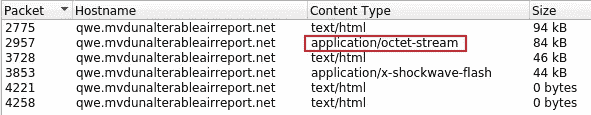**

**从 Wireshark 提取恶意软件负载。**

**如果我们在 Wireshark 中查看这个恶意软件负载，我们可以看到大量可疑的重复文本。**

**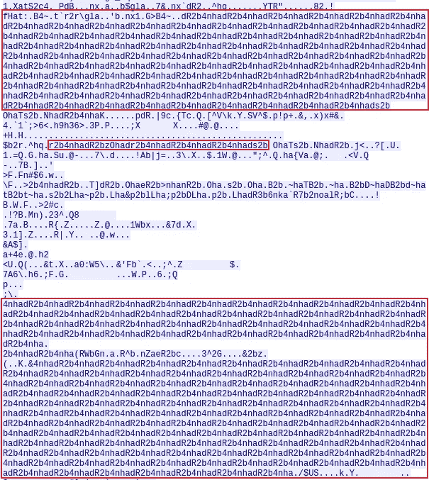**

**可疑的重复文本。**

**接下来，我们需要检查使用了什么模糊处理。在网上做一些研究，我们可以找到几篇[文章](https://forensicblogs.com/tag/angler-ek/page/9/)展示 Angler EK 如何使用 [XOR](https://www.geeksforgeeks.org/xor-cipher/#:~:text=XOR%20Encryption%20is%20an%20encryption,match%20with%20the%20correct%20one.) 加密。我们还可以看到 Angler EK 使用过的一些 XOR 密钥。**

**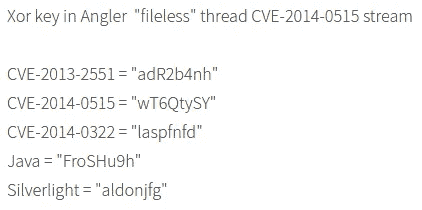**

**Angler EK 使用的 XOR 密钥。**

**查看上面的可疑文本块，我们可以使用 CyberChef 检查 Angler EK 之前使用的任何 XOR 密钥是否与可疑的重复文本匹配。**

**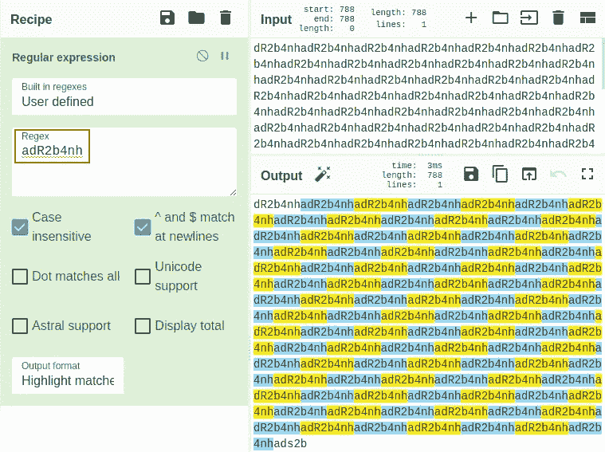**

**CyberChef XOR 密钥。**

**我们得到 XOR 密钥“ *adR2b4nh* ”的匹配。接下来，我们将恶意软件有效负载上传到 CyberChef，并将其与识别出的密钥进行异或运算。然后，我们可以将输出下载到一个新文件中。**

**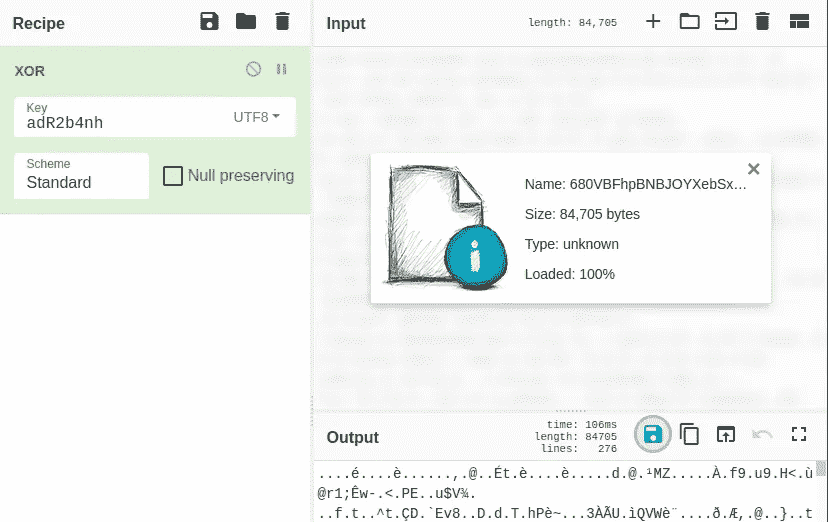**

**将恶意软件负载与 CyberChef 中的密钥进行异或运算。**

**接下来，我们需要删除文件开头的外壳代码。我们可以通过使用 binwalk 提取 PE 文件来实现这一点。**

```
$ binwalk -D='.*' download.datDECIMAL       HEXADECIMAL     DESCRIPTION
-----------------------------------------------------------------
1425          0x591           Microsoft executable, portable (PE)
```

**一旦文件被提取，我们就可以计算文件的 MD5 哈希。**

```
$ md5sum 591 **3dfa337e5b3bdb9c2775503bd7539b1c**  591
```

> **12.PE 文件编译期间启用了哪两种保护方法？(逗号分隔)**

**我首先使用 **pesec** 来标识第一种保护方法:**

```
$ pesec 591
```

**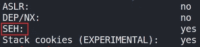**

**SEH 保护方法。**

**我可以看到第一种保护方法是 **SEH** ，但我无法识别第二种保护方法。**

> **13.DLL 文件是什么时候编译的？**

**如果我们将 PE 文件上传到 VirusTotal，我们可以看到该文件的编译时间:**

**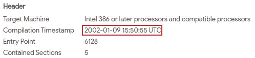**

**DLL 文件编译时间。**

> **14.Flash 文件与重定向 URL 一起使用。使用了什么 URL 来检索这个 flash 文件？**

**之前，我们看到 Windows VM 从“ *adstairs* ”网站访问了“ *lifeinsidedetroit* ”网站，恶意 flash 文件就是从这个网站下载的。**

****

**与重定向 URL 结合使用的 Flash 文件。**

> **15.被利用漏洞的 CVE 是什么？**

**如果我们回头看看展示 Angler EK 如何使用 XOR 加密的文章，我们可以看到与 XOR 密钥相关的 CVE。**

****

**被利用的弱点的 CVE。**

> **16.受感染主机使用的 web 浏览器版本是什么？**

**我们可以使用 Wireshark 或 NetworkMiner 来查看 **Web 浏览器用户代理**字段。**

**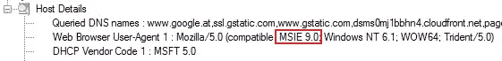**

**NetworkMiner web 浏览器版本。**

**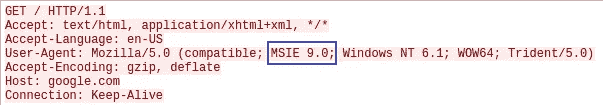**

**Wireshark 网络浏览器版本。**

**我们可以看到正在使用的 web 浏览器版本是 Microsoft Internet Explorer 版本 9。**

> **17.具有最高 RTT 的 DNS 查询是什么？**

**为了找到具有最高 [RTT](https://www.imperva.com/learn/performance/round-trip-time-rtt/) 的 DNS 查询，我们可以使用 Wireshark 来[显示数据包之间的时间差](https://stackoverflow.com/questions/28726136/time-difference-between-two-packets-in-wireshark#:~:text=Here's%20how%20I%20did%20it,5.&text=Then%2C%20go%20to%20View%20%3E%20Time,taken%20between%20those%20two%20packets.)。然后，我们可以从最长时间到最短时间对数据包进行排序，并过滤 DNS 数据包，以获得具有最高 RTT 的 DNS 查询。**

**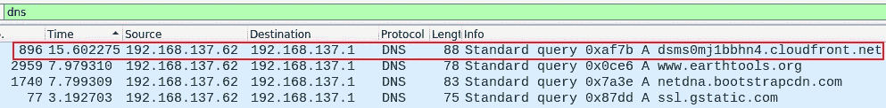**

**具有最高 RTT 的 DNS 查询。**

> **18.出现最多的 SSL 证书颁发者的名称是什么？(一个词)**

**我们可以使用 NetworkMiner，在文件选项卡下，过滤**。cer** 文件扩展名。我们可以看到出现最多的 SSL 证书颁发者是 **Google** 。**

**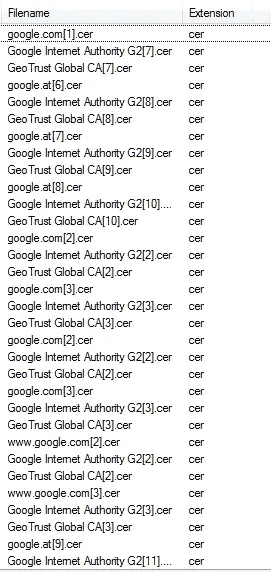**

**网络矿工证书文件。**

**我们还可以使用 Brim 来过滤 SSL 事件，并统计一个唯一的颁发者出现的次数。**

**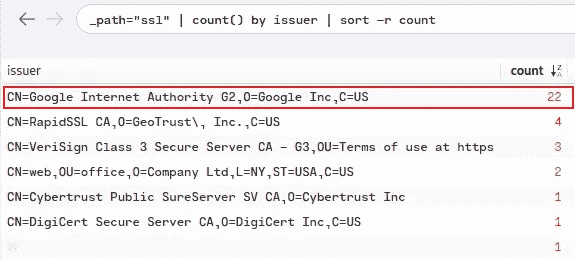**

**Brim SSL 证书颁发者。**

# **结束语**

**我发现这个挑战对于使用 NetworkMiner、Brim 和 Wireshark 进行练习来说非常棒。我也真的很喜欢通过这个 PCAP 挑战文件工作，并了解如何钓鱼开发工具包感染 Windows 虚拟机。谢谢你一直读到最后，继续黑下去😄！**

# **🔈 🔈Infosec Writeups 正在组织其首次虚拟会议和网络活动。如果你对信息安全感兴趣，这是最酷的地方，有 16 个令人难以置信的演讲者和 10 多个小时充满力量的讨论会议。[查看更多详情并在此注册。](https://iwcon.live/)**

**[](https://iwcon.live/) [## IWCon2022 - Infosec 书面报告虚拟会议

### 与世界上最优秀的信息安全专家建立联系。了解网络安全专家如何取得成功。将新技能添加到您的…

iwcon.live](https://iwcon.live/)**