# Angler 漏洞利用工具包感染 2 —恶意软件流量分析

> 原文：<https://infosecwriteups.com/angler-exploitation-kit-infection-2-malware-traffic-analysis-d4fc6ce8790b?source=collection_archive---------1----------------------->

[琵琶鱼](https://www.flickr.com/photos/allan_bruce/398032677)

在本文中，我使用 Network Miner、Wireshark 和 Brim 来分析一个 PCAP 文件，该文件捕获了属于 Angler 漏洞利用工具包感染的网络流量。PCAP 的文件属于蓝色团队在[网络卫士](https://cyberdefenders.org/blueteam-ctf-challenges/57)网站上发起的挑战，名为“*恶意软件流量分析 4* ”，由 [Brad Duncan](https://twitter.com/malware_traffic) 创建。

# 放弃

我喜欢在一篇文章之前添加一个简短的免责声明，以鼓励人们在阅读本文之前尝试挑战，因为这篇文章中显然会有**剧透****。我相信，如果你先自己尝试，然后在遇到困难或需要提示时再回来写这篇文章，你会更喜欢这个挑战。所以不要再拖延了，让我们开始吧！**

# **挑战问题**

> **1.受害者 IP 地址是什么？**
> 
> **2.受害者的主机名是什么？**

**在 NetworkMiner 的 hosts 选项卡下，我可以看到两个私有内部网络，它们都包含一台 windows 机器。**

**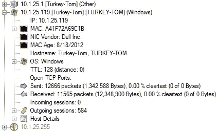**

**专用内部网络。**

**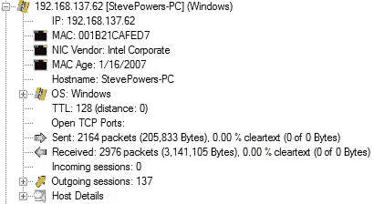**

**专用内部网络。**

**在 Wireshark 中，我可以导航到“*统计数据>端点> IPv4 选项卡*”，并根据数据包的数量对 IP 进行排序。可以看到**土耳其-汤姆的** Windows 机流量很大。**

**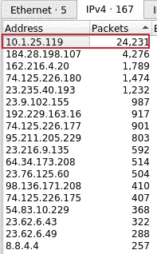**

**Wireshark 端点。**

**根据以上信息，我们可以假设 **Turkey-Tom 的** Windows 机器是被感染的主机，但需要更深入的调查来确认这一点。**

> **3.漏洞利用工具包的名称是什么？**

**在 Wireshark 中，我们可以导航到“*统计数据>对话> TCP 选项卡*”，并根据数据包的数量对对话进行排序。我可以看到最上面的对话是在土耳其汤姆的 T21 Windows 机器和下面突出显示的 IP 之间。**

**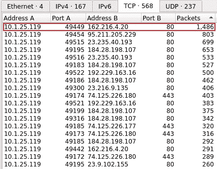**

**Wireshark 顶级 TCP 对话。**

**在 NetworkMiner 中，我可以看到 IP 地址的详细信息。**

**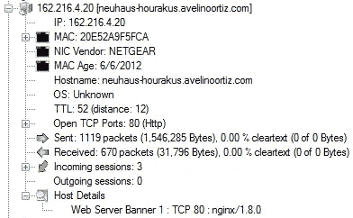**

**NetworkMiner IP 地址详细信息。**

**我可以看到对话发生在端口 80 上，所以我决定看看可以从 Wireshark 导出哪些与 IP 地址的 FQDN 相关的 HTTP 对象。**

**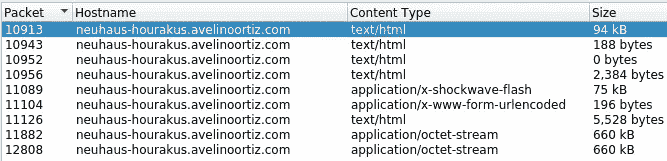**

**与 IP 地址的 FQDN 相关的 HTTP 对象。**

**如果我们导出这些 HTTP 对象并将它们上传到 VirusTotal，我们可以看到其中两个被标记为恶意的。**

**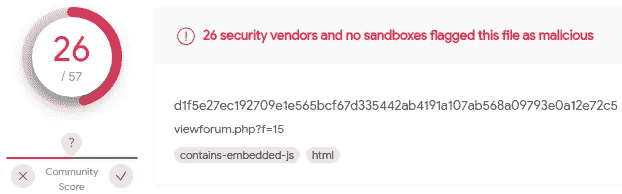**

**嵌入 JS 的 VirusTotal HTML 文件。**

**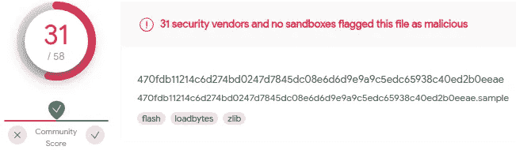**

**病毒总数闪存文件。**

**在 VirusTotal 中，我们可以看到一些安全供应商已经确定这些恶意文件与 Angler EK 有关。在 AlienVault 中，我们还可以看到，从中检索到这些恶意文件的 web 服务器的 IP 地址是 Angler EK 的一个[网络 IoC。最后，在 Brim 中我们可以看到 Bedep 有效载荷，这是一个 Angler 独有的恶意软件下载器。](https://otx.alienvault.com/pulse/56c490f067db8c1250175b9d/)**

**根据 [MalwareBytes](https://blog.malwarebytes.com/detections/trojan-bedep/) :**

> **木马。Bedep 在受感染的系统上打开后门，可以下载额外的[恶意软件](https://blog.malwarebytes.com/glossary/malware/)到系统中。
> 该木马通常通过[漏洞利用工具包](https://blog.malwarebytes.com/glossary/exploit-kit/)投放到受影响的系统上。**

**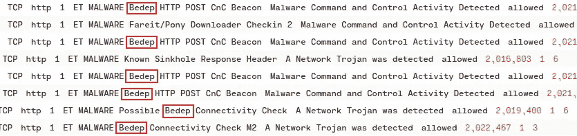**

**边缘比德普警报。**

> **4.为该漏洞提供服务的 IP 地址是什么？**

**正如我们前面已经看到的，可以在 NetworkMiner 中找到利用漏洞的 IP 地址。**

****

**利用该漏洞的 IP 地址。**

> **5.用于指示闪存版本的 HTTP 报头是什么？**

**在 Wireshark 中，我们可以查看用于下载恶意 flash 文件的 HTTP GET 请求，并查看用于指示 flash 版本的标头。**

****

**Flash 版本的 HTTP 标头。**

> **6.重定向到利用漏洞的服务器的恶意 URL 是什么？**

**在 Wireshark 中，我们可以查看包含嵌入 JS 代码的恶意 HTML 文件的 HTTP 流。在这里，我们可以看到重定向到利用漏洞的服务器的恶意 URL。**

**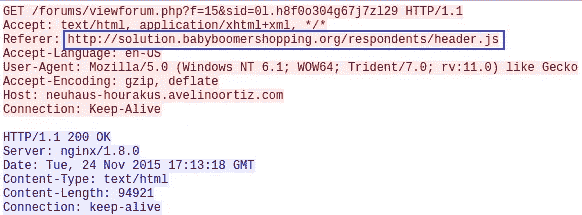**

**重定向到利用漏洞的服务器的恶意 URL。**

> **7.用于将受害者重定向到漏洞服务器的技术对应的 CAPEC ID 是什么？capec.mitre.org 的更多信息**

**为了确定使用何种技术将受害者重定向到漏洞利用服务器，我们需要使用 Wireshark 追溯感染事件的时间线。查看上面问题 6 的图像，我们可以看到受害者为了访问利用漏洞的服务器而访问的网站。在 Wireshark 中，我们可以查看恶意重定向 URL 的 HTTP 流。**

**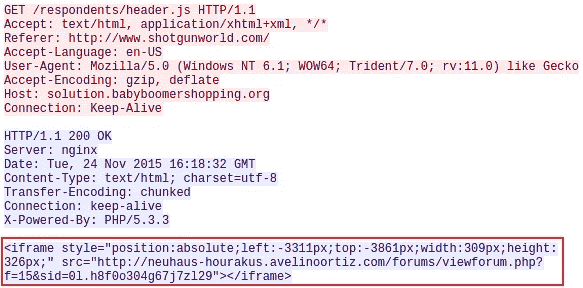**

**Wireshark iFrame 覆盖。**

**我们可以看到，iFrame 覆盖攻击被用来将受害者重定向到漏洞利用登录页面。我们可以在谷歌上进行快速搜索，找到这次攻击对应的 CAPEC ID(即 [CAPEC-222: iFrame Overlay](https://capec.mitre.org/data/definitions/222.html) )。**

> **8.被入侵网站的 FQDN 是多少？**
> 
> **9.受损网站包含恶意 js，可将用户重定向到另一个网站。传递给“document.write”函数的变量名是什么？**

**仍然追溯我们在 Wireshark 中的步骤，我们可以在问题 7 的上图中看到受害者根据 referrer 请求头值访问的网站。查看这个网站的 HTTP 对象，我可以看到一个 JS 代码对象。**

**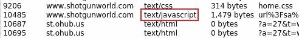**

**Wireshark HTTP JavaScript。**

**在 Wireshark 中，我们可以查看该网站的 HTTP 流和 JavaScript 代码。查看代码，我们可以看到重定向到服务于漏洞的服务器的恶意 URL，以及传递给“ *document.write* 函数的变量名。**

**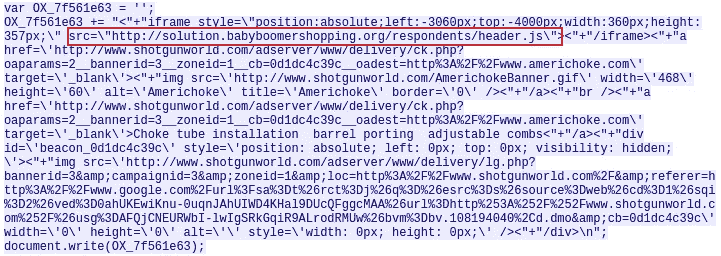**

**带有恶意 URL 的 JavaScript，该恶意 URL 重定向到利用漏洞的服务器。**

> **10.在机器上发现的恶意软件的编译时间戳是什么？格式:YYYY-MM-DD hh:mm:ss**

**在花了一段时间试图解决这个问题之后，我还是没有找到答案。**

# **结束语**

**我发现这个挑战对于使用 NetworkMiner、Brim 和 Wireshark 进行练习来说非常棒。我也真的很喜欢通过这个 PCAP 挑战文件工作，并了解如何钓鱼开发工具包感染 Windows 虚拟机。谢谢你一直读到最后，继续黑下去😄！**

# **🔈 🔈Infosec Writeups 正在组织其首次虚拟会议和网络活动。如果你对信息安全感兴趣，这是最酷的地方，有 16 个令人难以置信的演讲者和 10 多个小时充满力量的讨论会议。[查看更多详情并在此注册。](https://iwcon.live/)**

** [## IWCon2022 - Infosec 书面报告虚拟会议

### 与世界上最优秀的信息安全专家建立联系。了解网络安全专家如何取得成功。将新技能添加到您的…

iwcon.live](https://iwcon.live/)**