# angstrom CTF 2018-网络挑战[报道]

> 原文：<https://infosecwriteups.com/angstrom-ctf-2018-web-challenges-writeup-8a69998b0123?source=collection_archive---------0----------------------->

总体来说，CTF 的体验还是不错的。前 4 个网络挑战超级简单。我们在接下来的 4 个挑战中学到了一些新东西。

# **Web 1(源 Me 1) :**


到`Login`的链接出现在以下页面


查看源代码暴露了管理员的密码

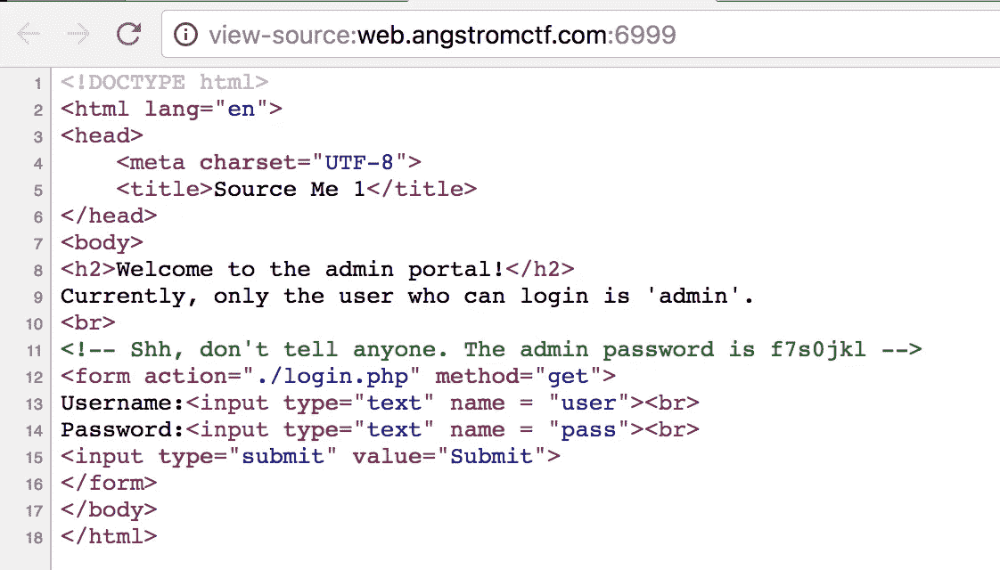

以用户名`admin` 和密码`f7s0jkl`登录返回了标志

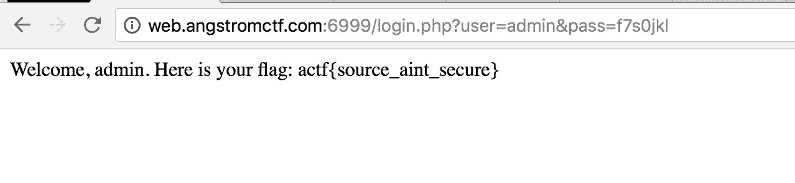

# **Web 2 (GET ME) :**


挑战链接位于以下页面

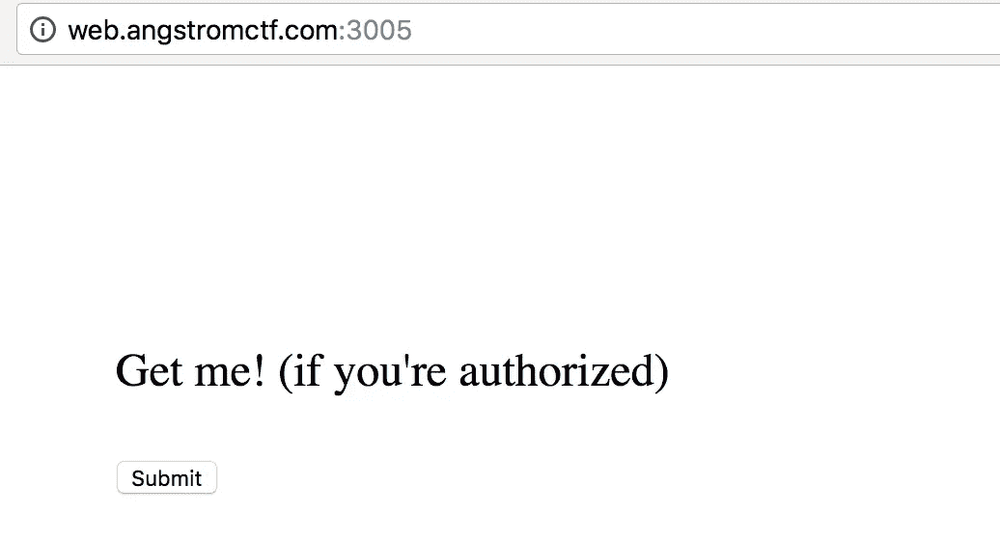

提交时，

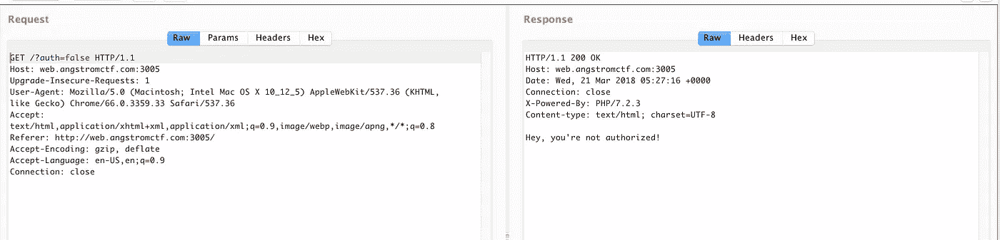

同样，这看起来很简单。修改了`auth`参数，因为`true`返回了标志。


# **Web 3(续):**


顾名思义，这是一个 SQL 注入挑战。


所以尝试了用户名和密码的基本`1' OR '1'='1`有效负载，它工作了


归还了旗帜。

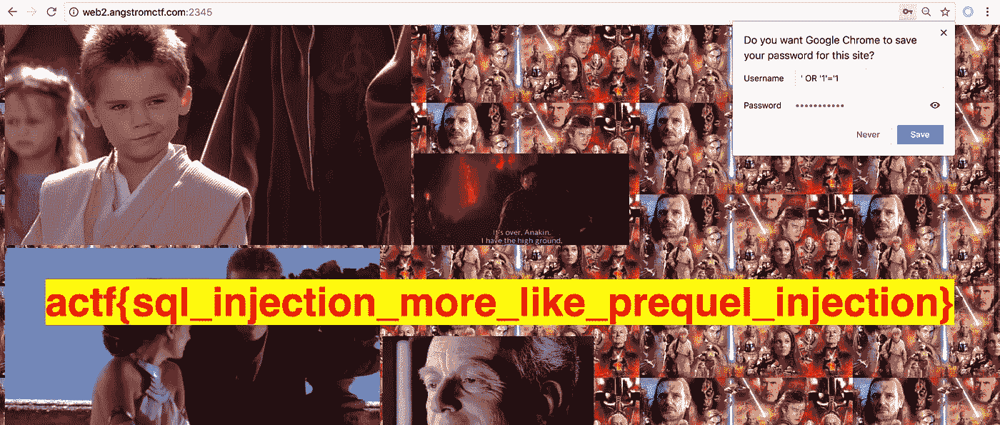

# **第四网(消息来源 ME 2) :**


到`site`的链接在下面的页面登陆。

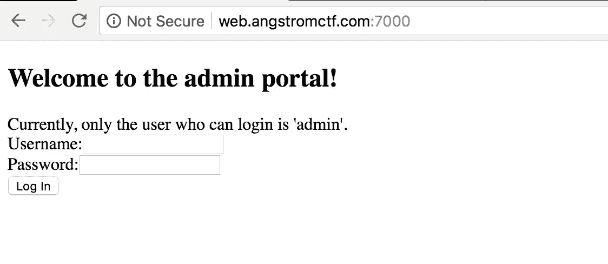

在查看页面源代码时，我们得到了用户名和密码验证的逻辑

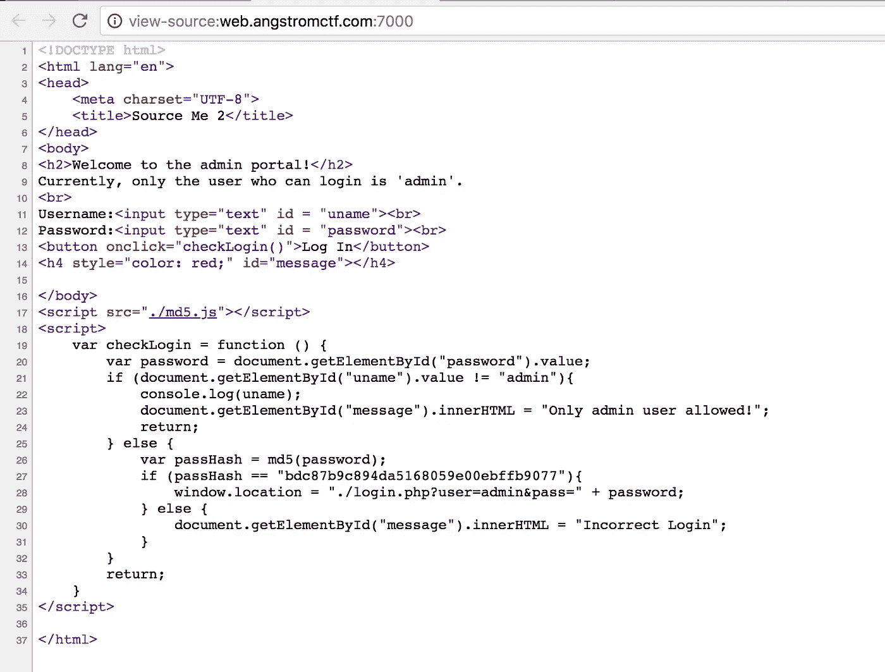

所以按照逻辑 md5( <password>)应该是 BDC 87 b 9 c 894 da 5168059 e 00 ebffb 9077。试图通过[破解站](https://crackstation.net/)破解哈希。我们拿到了密码。</password>

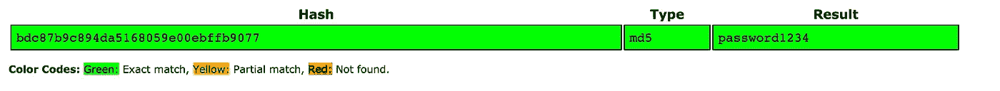

以用户名`admin`和密码`password1234`提交返回了标志。

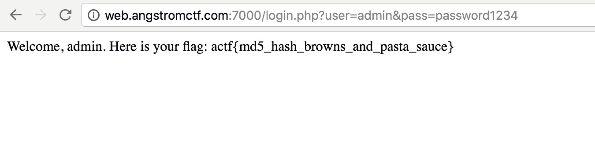

# **Web5 (MADLIBS) :**


到`website`的链接出现在以下页面

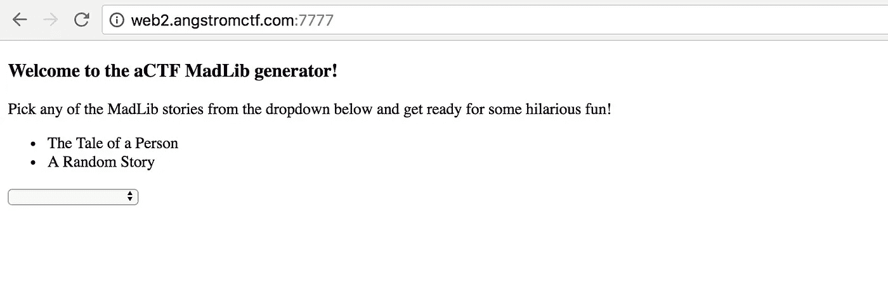

选择其中一个故事，并添加一些随机值来理解工作流程

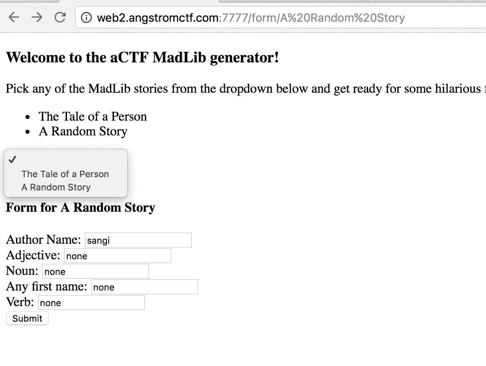

在提交了样本数据之后，我们得到了下面的页面，它清楚地显示了模板中填充了我们给出的值。此时我们猜测可能是模板注入。底部有一个链接`get-source`。

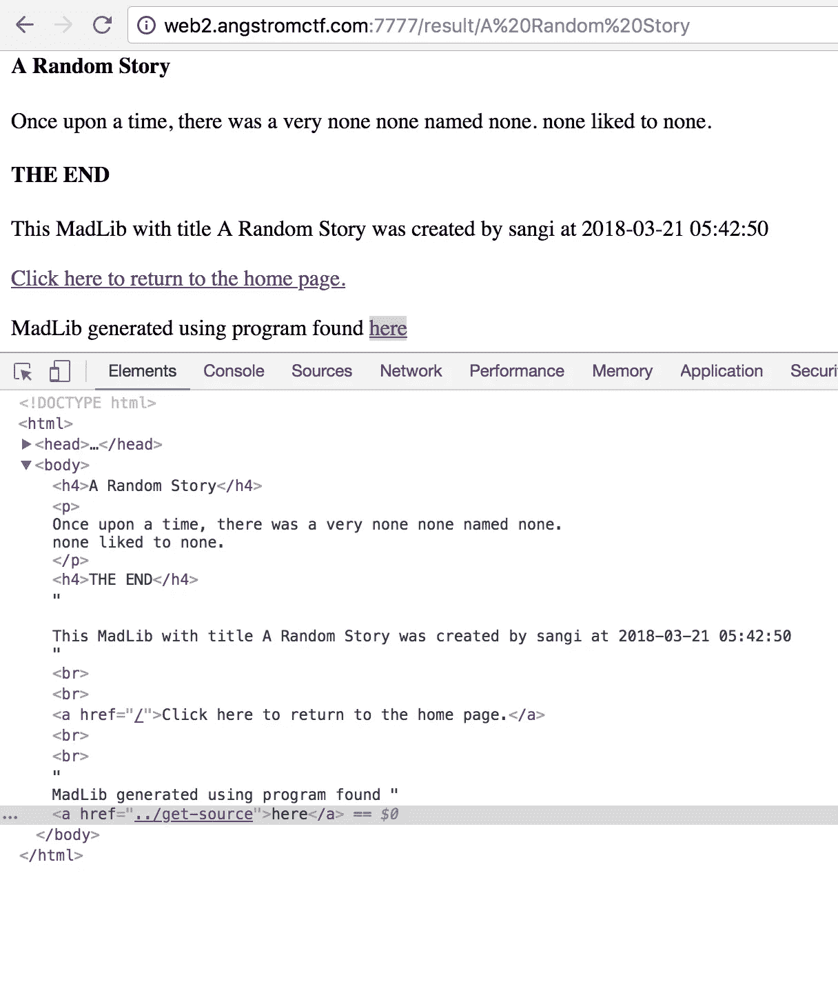

在访问/get-source 页面时，我们获得了正在运行的应用程序的完整源代码。

```
from flask import Flask, render_template, render_template_string, send_from_directory, request
from jinja2 import Environment, FileSystemLoader
from time import gmtime, strftime
template_dir = './templates'
env = Environment(loader=FileSystemLoader(template_dir))

madlib_names = ["The Tale of a Person","A Random Story"]
story_fields = {
    "The Tale of a Person":['Author Name','Adjective','Noun','Verb'],
    "A Random Story":['Author Name','Adjective','Noun','Any first name','Verb']
    }

app = Flask(__name__)
app.secret_key = open("flag.txt").read()

@app.route("/",methods=["GET"])
def home():
    return render_template("home.html",libs=madlib_names)

@app.route("/form/<templatename>",methods=["GET"])
def madlib(templatename):
    global madlib_names
    if templatename in madlib_names:  
        return render_template("home.html",libs=madlib_names,title=templatename,fields=story_fields[templatename])
    else:
        error_message = 'The MadLib with title "' + templatename + '" could not be found.'
        return render_template("home.html",libs=madlib_names,message=error_message)

@app.route("/result/<templatename>",methods=["POST"])
def output(templatename):

    if templatename not in madlib_names:    
        return "Template not found."

    inpValues = []
    for i in range(len(story_fields[templatename])):
        if not request.form[str(i+1)]: 
            return "All form fields must be filled"
        else:
            inpValues.append(request.form[str(i+1)][:24])

    authorName = inpValues.pop(0)[:12]
    try:
        comment = render_template_string('''This MadLib with title %s was created by %s at %s''' % (templatename, authorName, strftime("%Y-%m-%d %H:%M:%S", gmtime())))
    except:
        comment = "Error generating comment."
    return render_template("_".join(templatename.lower().split())+".html",libtitle=templatename,footer=comment, libentries=inpValues)

@app.route("/get-source", methods=["GET","POST"])
def source():
    return send_from_directory('./','app.py')

if __name__ == "__main__":
    app.run(host='0.0.0.0', port=7777, threaded=True)
```

查看上面的代码，很明显应用程序使用了 [jinja2](http://jinja.pocoo.org/) 模板引擎。并且该标志被设置为 app 对象的`secret_key`属性。

```
app.secret_key = open("flag.txt").read()
```

在这一部分，

```
inpValues = []
    for i in range(len(story_fields[templatename])):
        if not request.form[str(i+1)]: 
            return "All form fields must be filled"
        else:
            inpValues.append(request.form[str(i+1)][:24])

    authorName = inpValues.pop(0)[:12]
    try:
        comment = render_template_string('''This MadLib with title %s was created by %s at %s''' % (templatename, authorName, strftime("%Y-%m-%d %H:%M:%S", gmtime())))
```

从请求参数上给出的值中追加了`inpValues`数组。请求参数被限制为 24 个字符，然后通过弹出`inputValues`的第一个索引来分配`authorname`，并且只取前 12 个字符。

最后，它被传递给“render_template_string”方法。因此有效负载应该少于或等于 12 个字符。

所以首先尝试我们的通用模板注入有效负载`{{7*7}}`，只是为了确认应用程序容易受到模板注入的攻击

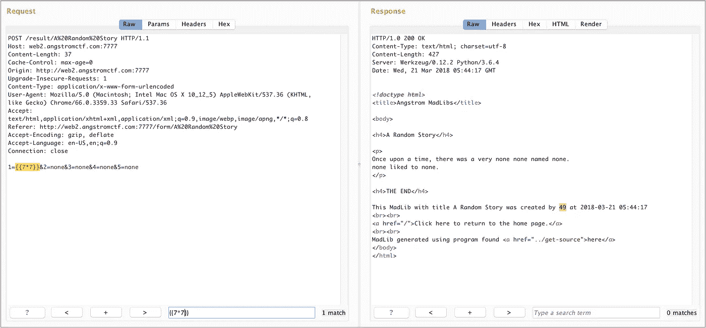

是的，所以我们这里有一个模板注入！！

是的，它是脆弱的。现在的挑战是检索有效载荷少于 12 个字符的标志。我们已经知道这个标志在 app 对象中是 secret_key。

所以在互联网上搜索——是否有任何全局对象在内存中拥有所有赋值？在更多的谷歌搜索之后，我们知道 flask 有这个`config`对象，它有所有与会话相关的值。

所以用`{{config}}`代替`{{7*7}}`，我们得到了我们的国旗。

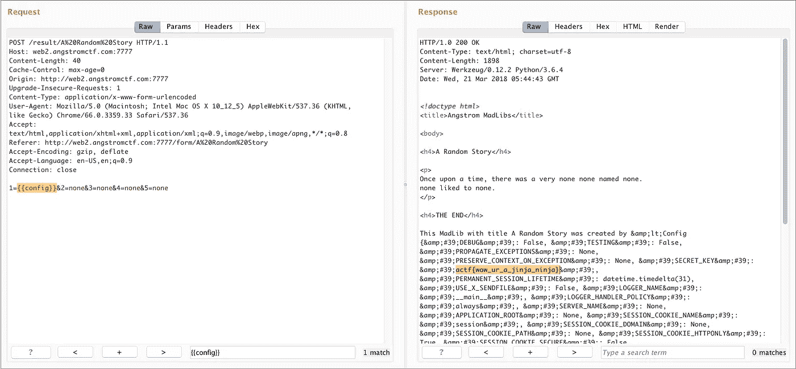

# **Web 6 (MD5) :**


到`site`的链接出现在以下页面

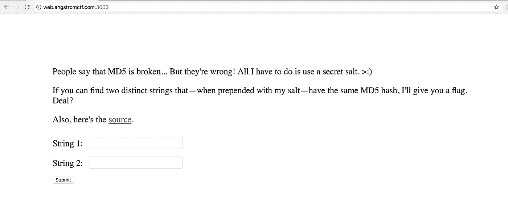

因此，在检查源代码链接时，我们得到了以下内容

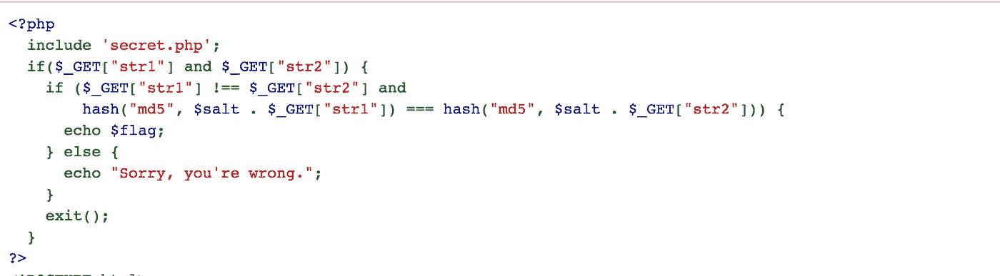

所以很明显，标志在 secret.php，输入参数`str1`和`str2`不应该相同，但是 md5 散列应该相等。怎么了？首先，我们认为——这是一种哈希碰撞吗？？

不要..

事情是这样的—如果我们将 str1=somevalue 作为 str1[]=somevalue 发送，$_GET["str1"]将返回`Array`而不是`somevalue`。所以我们需要以 str 1[]= any 和 str2=Array 的形式发送参数。当在散列函数中连接时，`Array`将被添加到两边的字符串中(对于两个参数),显然这将返回相同的散列。

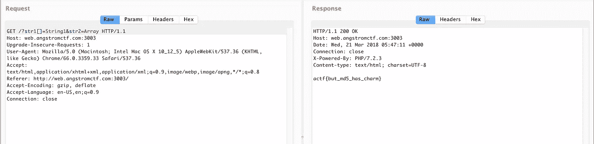

## Web 7(文件存储):


文件存储网站是注册页面上的登录。目标是找到管理员的密码。我们在访问该页面时没有任何线索。但是后来事情变得很有趣。

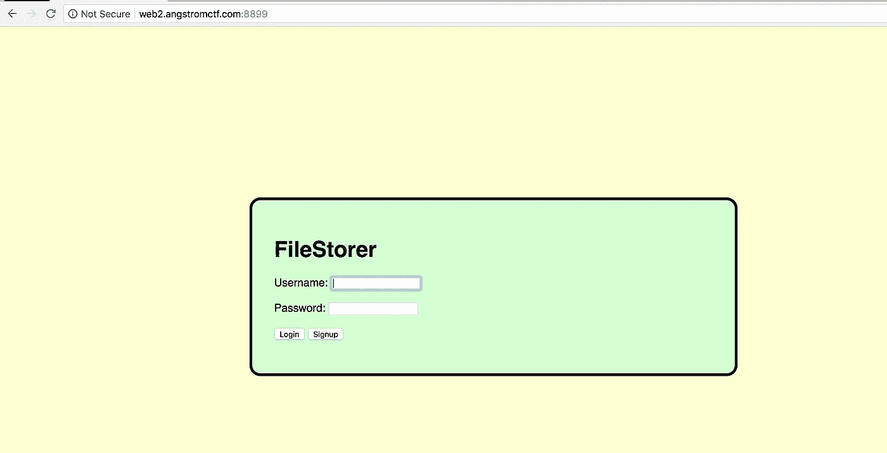

因此，只需输入一个 admin 作为用户名，一个虚拟值作为密码，以便理解工作流。它返回了错误的密码。然后注册成为新用户。

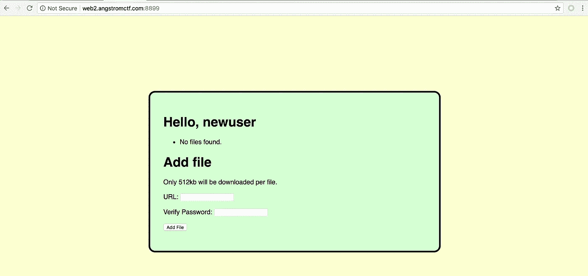

该应用程序需要 URL 和密码来下载文件。打起嗝来，检查请求和响应。检查 url 中的/flag.txt，应用程序返回“文件已经存在”

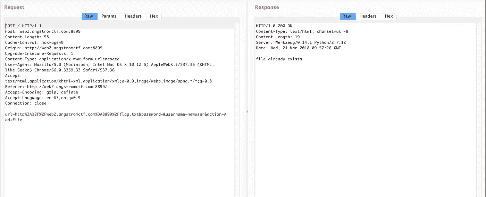

因此，该应用程序可能会检查服务器中已经存在的相同文件名，文件名是根据我们在 url 路径上给出的名称分配的。所以尝试了一个随机文件来检查它如何响应。

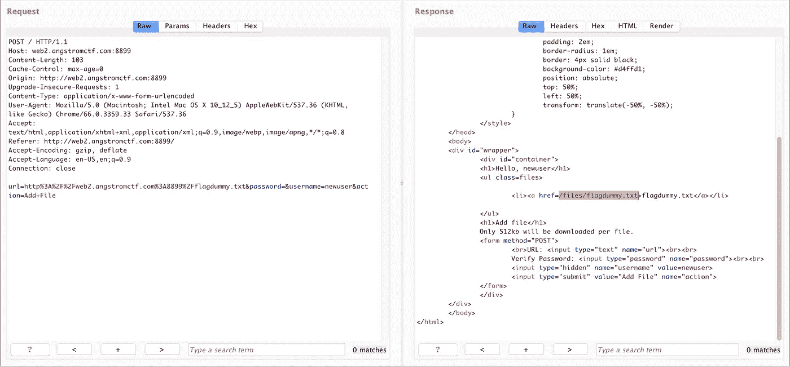

所以它实际上将文件写入文件目录。试图猜测文件夹名称，并尝试了各种 SSRF 技术和失败。

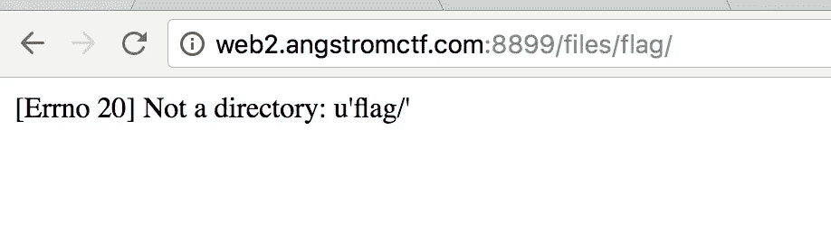

在那之后我们放弃了一个打开的暗示。提示是“解决不了？Git gud。”所以服务器上有一个本地 git repo。我们实际上尝试了/。主路径上的 git 路径不在/files/ path 上。

学习:到处列举！

所以我们最终发现在 files 下有一个. git 目录。

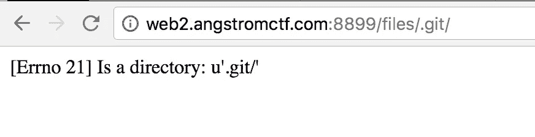

但它不是一个开放的目录。所以实际上需要通过文件的确切路径来获取每个文件。因此，首先我们检查了提交日志。


发现有一个初始提交。所以我们从对象目录下载了那个对象。通常，在 git 结构中，散列将是对象的路径，前两个字符是父目录，其余的是文件名。git 对象是压缩的数据格式，可以通过使用 zlib 包的简单 python 程序进行解压缩。

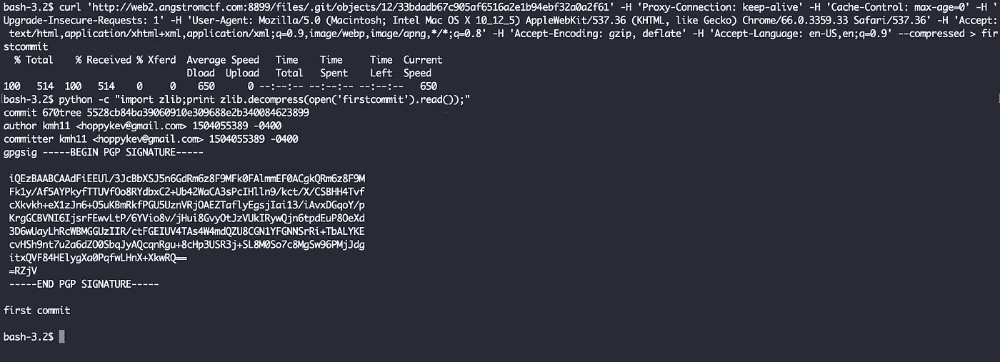

我们以 gpg 签名结束。也不知道该怎么做。

几小时过去了..

我们检查了索引文件(妈的！我们应该先检查这个)

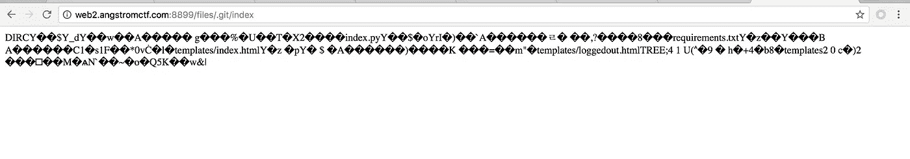

这里我们可以看到服务器上的文件。Index.py 是主应用程序。所以试图直接得到，但是..


所以下载了部分可读的索引文件。并搜索了如何阅读 git 索引文件。并在 [gist](https://gist.github.com/DQNEO/d6ee3bcc8162d4a80bb86203d6cc31c9) 上找到了一个名为 [parse_git_index.c](https://gist.github.com/DQNEO/d6ee3bcc8162d4a80bb86203d6cc31c9#file-parse_git_index-c) 的实用程序。

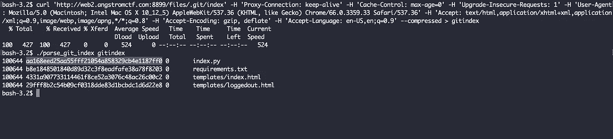

现在我们又有了哈希值，所以使用之前的技术下载了解压缩的 index.py 文件

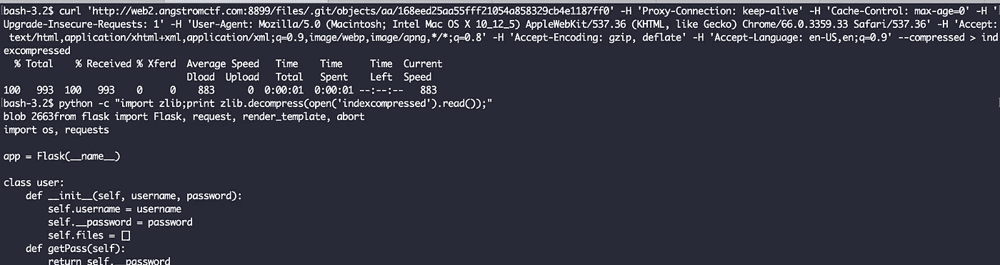

整个代码是

```
**from** flask **import** Flask, request, render_template, abort
**import** os, requests

app = Flask(__name__)

**class** user:
    **def** __init__(self, username, password):
        self.username = username
        self.__password = password
        self.files = []
    **def** getPass(self):
        **return** self.__password

users = {}

users[**"admin"**] = user(**"admin"**, os.environ[**"FLAG"**])

**def** custom500(error):
    **return** str(error), 500

@app.route(**"/"**, methods=[**"GET"**, **"POST"**])
**def** mainpage():
    **if** request.method == **"POST"**:
        **if** request.form[**"action"**] == **"Login"**:
            **if** request.form[**"username"**] **in** users:
                **if** request.form[**"password"**] == users[request.form[**"username"**]].getPass():
                    **return** render_template(**"index.html"**, user=users[request.form[**"username"**]])
                **return "wrong password"
            return "user does not exist"
        elif** request.form[**"action"**] == **"Signup"**:
            **if** request.form[**"username"**] **not in** users:
                users[request.form[**"username"**]] = user(request.form[**"username"**], request.form[**"password"**])
                **return** render_template(**"index.html"**, user=users[request.form[**"username"**]])
            **else**:
                **return "user already exists"
        elif** request.form[**"action"**] == **"Add File"**:
            **return** addfile()
    **return** render_template(**"loggedout.html"**)

*#beta feature for viewing info about other users - still testing* @app.route(**"/user/<username>"**, methods=[**'POST'**])
**def** getInfo(username):
    val = getattr(users[username], request.form[**'field'**], None)
    **if** val != None: **return** val
    **else**: **return "error"** @app.route(**"/files/<path:file>"**, methods=[**"GET"**])
**def** getFile(file):
    **if "index.py" in** file:
        **return "no! bad user! bad!"
    return** open(file, **"rb"**).read()

**def** addfile():
    **if** users[request.form[**"username"**]].getPass() == request.form[**"password"**]:
        **if** request.form[**'url'**][-1] == **"/"**: downloadurl = request.form[**'url'**][:-1]
        **else**: downloadurl = request.form[**'url'**]
        **if** downloadurl.split(**"/"**)[-1] **in** os.listdir(**"."**):
            **return "file already exists"** file = requests.get(downloadurl, stream=True)
        f = open(downloadurl.split(**"/"**)[-1], **"wb"**)
        first = True
        **for** chunk **in** file.iter_content(chunk_size=1024*512):
            **if not** first: **break** f.write(chunk)
            first = False
        f.close()
        users[request.form[**"username"**]].files.append(downloadurl.split(**"/"**)[-1])
        **return** render_template(**"index.html"**, user=users[request.form[**"username"**]])
    **return "bad password"

if** __name__ == **"__main__"**: app.run(host=**"0.0.0.0"**)
```

检查代码时，创建了一个 admin 用户对象，其标志值为 password。

```
users[**"admin"**] = user(**"admin"**, os.environ[**"FLAG"**])
```

然后发现了这个有趣的隐藏功能来查看所有用户信息

```
*#beta feature for viewing info about other users - still testing* @app.route(**"/user/<username>"**, methods=[**'POST'**])
**def** getInfo(username):
    val = getattr(users[username], request.form[**'field'**], None)
    **if** val != None: **return** val
    **else**: **return "error"**
```

原来是这么回事！
检查用户类后，有三个属性——用户名、_ _ 密码和文件。

所以我们需要用 admin __password 替换请求上的字段参数的<username>。但是失败了。</username>

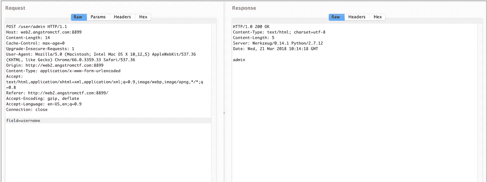

用户名属性有效，但 _ _ 密码无效


直到这时，我才知道双下划线有特殊的含义，也不知道如何处理它。所以我创建了同一个用户类，并创建了一个新对象，使用 __dict__ 检查了该对象的所有属性

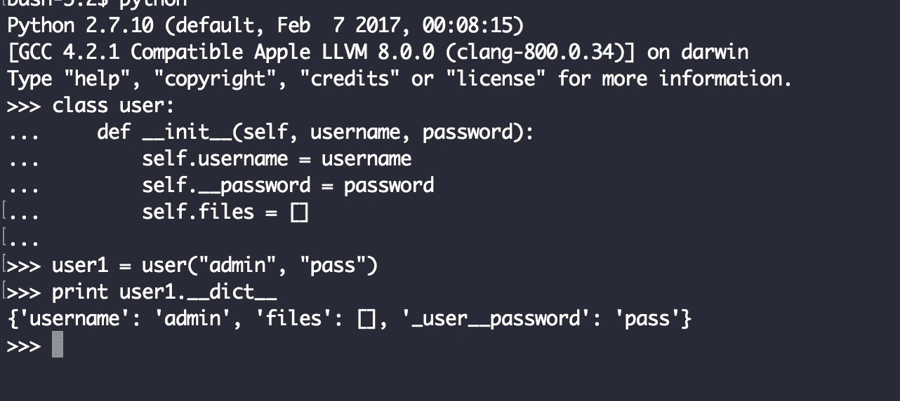

哦..在谷歌搜索了同样的概念后。
` _ _ _ '表示` _classname__attributename`。

好吧。于是，要求归档为`_user__password`，我们得到了旗帜！

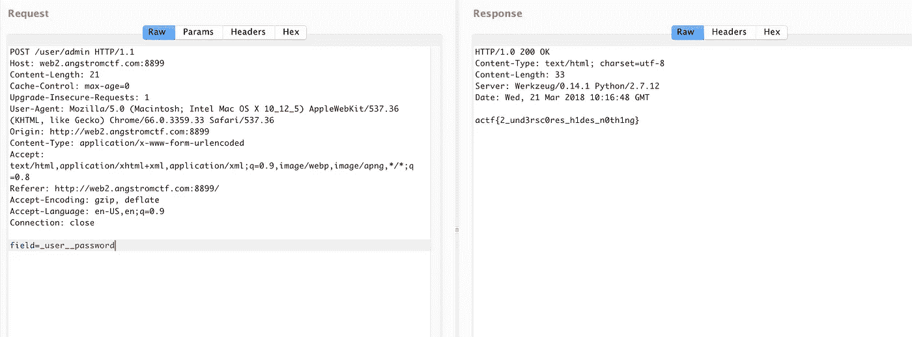

## Web 8(最佳网站):


这个挑战花了我们两天时间来解决，因为我们在寻找一个错误的漏洞。在了解情况后，我们能够在不到 15 分钟的时间内解决它，多么好的游戏 XD..

挑战链接出现在模板页面上


所以第一步我们检查了页面源代码。

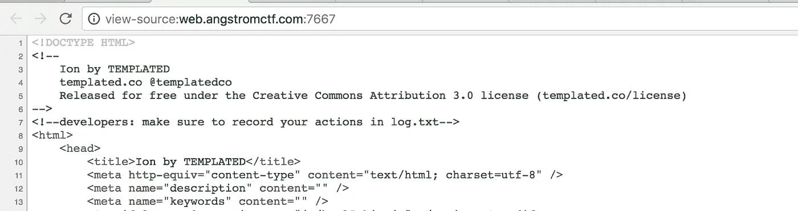

因此，我们获得了 log.txt 的链接，并检查任何可用的信息

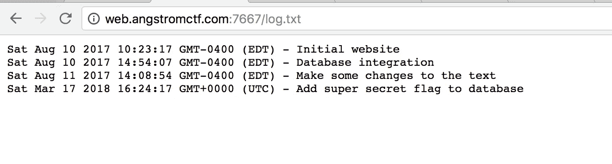

一开始没什么帮助。然后移到主页，检查所有请求，其中一个请求不是对静态资源的调用

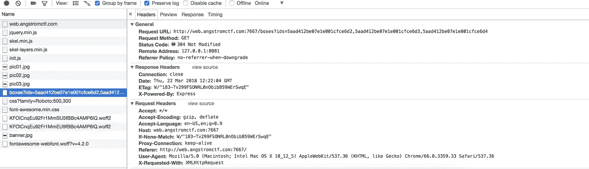

通过查看 id 的结构，我们能够猜测这些都是 mongodb 对象 id。但这是我们最初知道的唯一事情。然后搜索了所有的 NoSQL 注射文件，并尝试了地狱的有效载荷，我们无法弄清楚幕后到底发生了什么。由于我们以前没有在 mongodb 上的经验，我们花了两天时间试图理解 NoSQL 上的注入概念。没有任何帮助。

最后有一个想法——如果这不是一个注入漏洞呢？？

是的。那时，我们知道了这个 [objectId](https://docs.mongodb.com/manual/reference/method/ObjectId/#ObjectIDs-BSONObjectIDSpecification) 是如何工作的

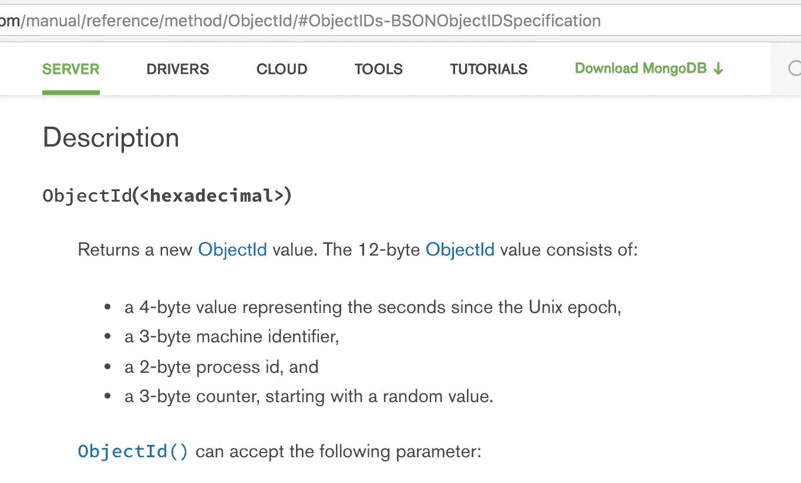

所以 ObjectId 是一个具有上述结构的十六进制字符串。
例如让我们拿一个 ObjectId—5a ad 412 be 07 E1 e 001 FCE 6d 2，

5aad412b — e07e1e — 001c — fce6d2
它是这样工作的

5aad412b —一个 4 字节的值，表示自 Unix 纪元
e07e1e 以来的秒数— 3 字节机器标识符
001c — 2 字节进程 id
fce6d 2—3 字节计数器，以随机值开始

所以这里的`machine identifier`和`process id`应该是一样的。并且变化的因素是时间戳和计数器值。

起初，我们想到了强制字节计数器(我们认为集合中的所有记录都可以一次插入)。那失败了！
我们又查了 log.txt。哦，妈的！我们忘了那个。日志中已经记录了插入时间。

因此，我们刚刚将时间戳从 2018 年 3 月 17 日星期六 16:24:17 GMT+0000 (UTC)转换为 unix 时间戳

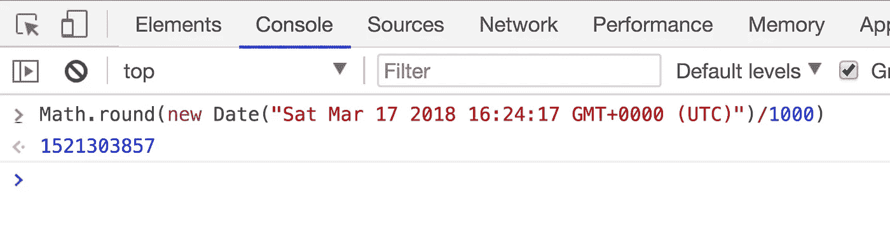

并将其转换成十六进制

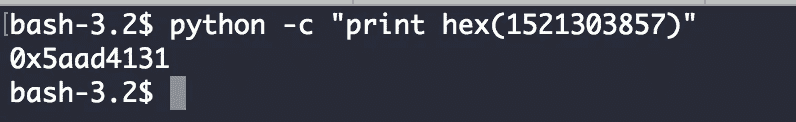

所以现在我们有了十六进制时间戳、机器标识符和进程 id(已经知道)。我们已经知道字节计数器是一个一个递增的(查看第五张截图)。

id 分别为 5 aad 412 be 07 E1 e 001 c**fce6d 2**，5 aad 412 be 07 E1 e 001 c**fce6d 3**，5 aad 412 be 07 E1 e 001 c**fce6d 4**

所以下一个增加的值应该是 **fce6d5。**这就是我们对旗帜的最终反对意见—**5a ad 4131 e 07 E1 e 001 FCE 6d 5**

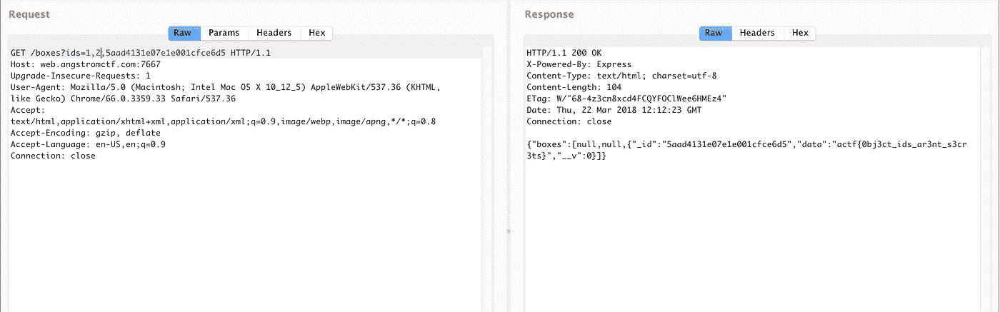

终于！

向创造了这个令人敬畏的 CTF 的蒙哥马利·布莱尔高中的学生致敬！

-H4 ckx 0 r 5 团队