# AngstromCTF 2018 网络评论—第 1 部分

> 原文：<https://infosecwriteups.com/angstromctf-2018-web-writeups-part-1-944b57b3f1b5?source=collection_archive---------1----------------------->

欢迎来到 AngstromCTF 2018 由 Abdelkader [337 HackXore]撰写的文章

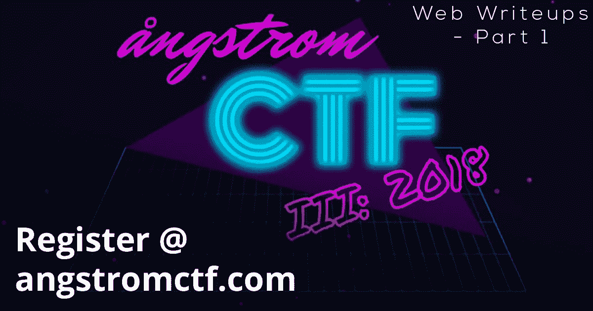

AngstromCTF 2018 网络评论—第 1 部分

AngstromCTF 2018 从 2018 年 3 月 16 日星期五 20:00 UTC 开始，到 2018 年 3 月 22 日星期四结束。我遇到了一个简单、中等和一些困难的问题。这次 CTF 竞赛是由 Darkside 团队(来自华盛顿州 DC 地区的一个高中团队)组织的。

对于网络挑战，它们都从容易到困难，最后我解决了所有的问题。

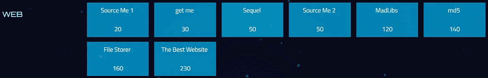

百分之百搞定！

# 来源我 1[20 分]

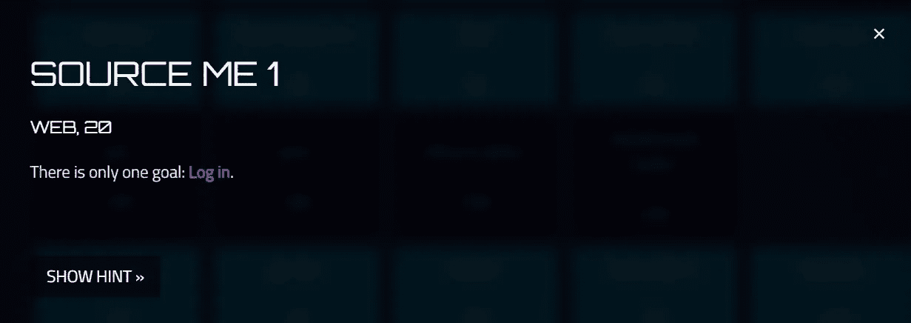

[http://web.angstromctf.com:6999/](http://web.angstromctf.com:6999/)

在这次挑战中，为参赛者提供了一个登录页面。他们必须绕过它去得到旗子，这是这个任务的解决方案。

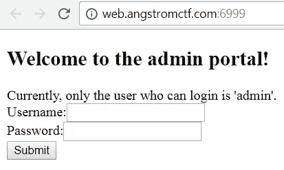

Source Me 1 的登录页面

然后它将读取 html 标签/注释之间的用户名/密码。

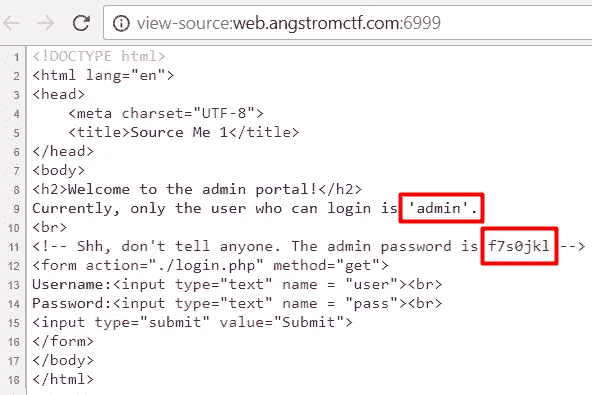

Source Me 1 的登录代码源码

使用 admin/f7s0jkl 登录以获取您的旗帜！

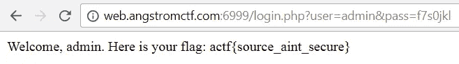

来源我 1 的是 0wned！

**标志为:actf{source_aint_secure}**

# 给我[30 分]

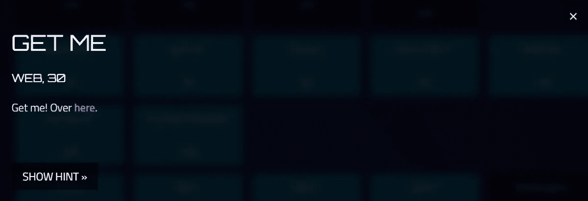

【http://web.angstromctf.com:3005/ 

在这次挑战中，参赛者被提供了一个带有提交按钮的页面，以验证带有旗帜的页面。

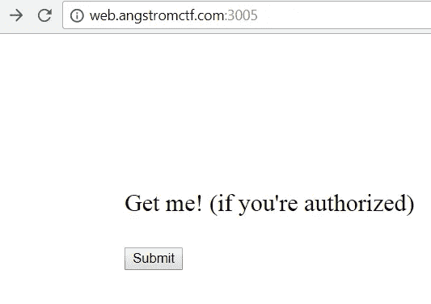

获取我的挑战页面

当我们点击提交按钮时，我们无法验证到标志页，它将我们重定向到另一个页面，告诉我们我们没有被授权！

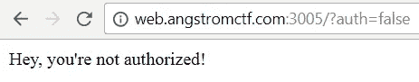

嗯…我们没有被授权！

嗯……好的，我看到有一个可以修改的认证参数:

> **/？auth=false**

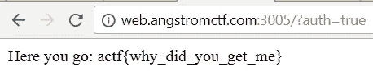

耶…我们被授权了！

耶…我们将其修改为 true，并使其获得授权，参数值变为:

> **/？auth=true**

**标志为:actf{why_did_you_get_me}**

# 续集[50 分]

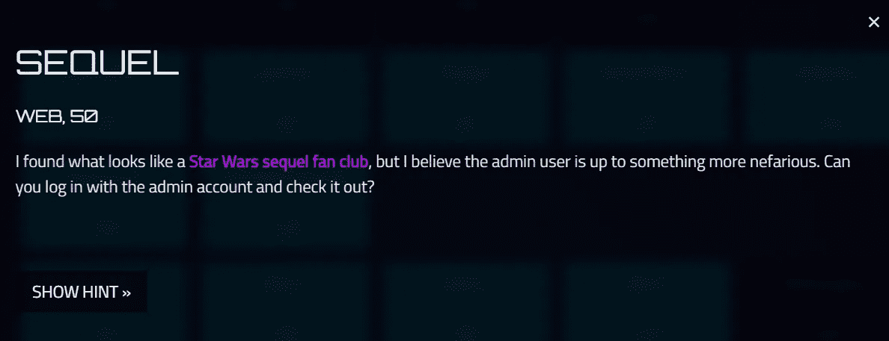

[http://web2.angstromctf.com:2345/](http://web2.angstromctf.com:2345/)

在这次挑战中，为参赛者提供了一个登录页面。他们必须绕过它去得到旗子，这是这个任务的解决方案。

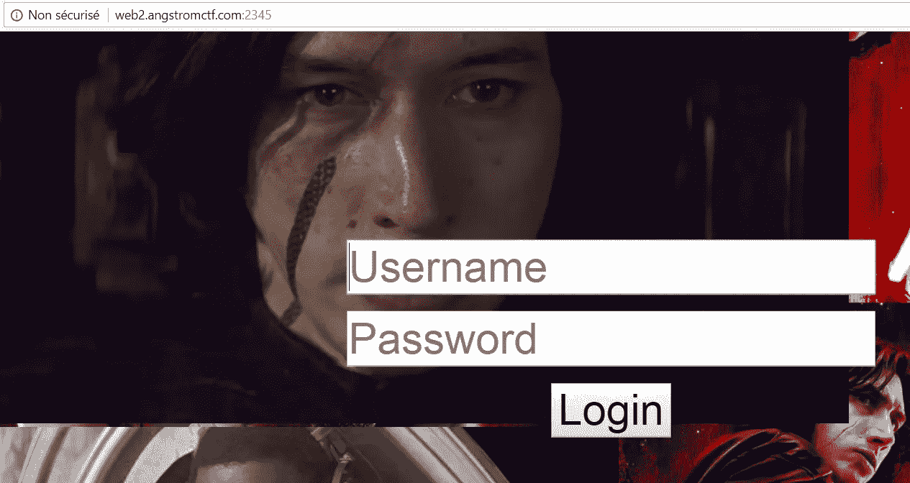

Sequel 的登录页面

嗯…根据任务的名称，我猜这是 SQL 注入，让我们试着检测一下！

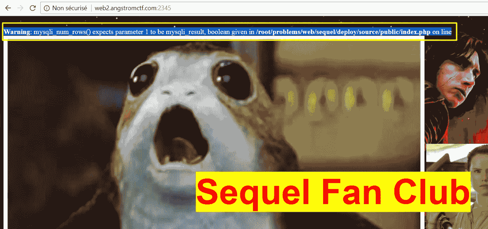

已检测到 SQLi！

我是对的…在我登录后:

> 管理员'/*

根据上面显示的错误，我检测到此登录中存在 SQL 注入漏洞。

现在，让我们尝试绕过这个登录来获取标志！

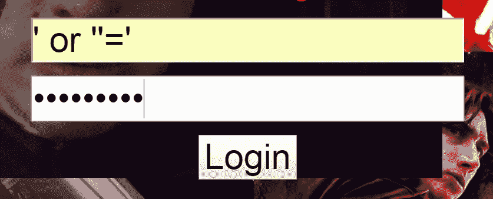

尝试绕过登录(SQLi)

我试过了:

> 或" ='/'或" = '

在我发现这是 SQLi 漏洞后，我从第一次尝试就绕过了它。

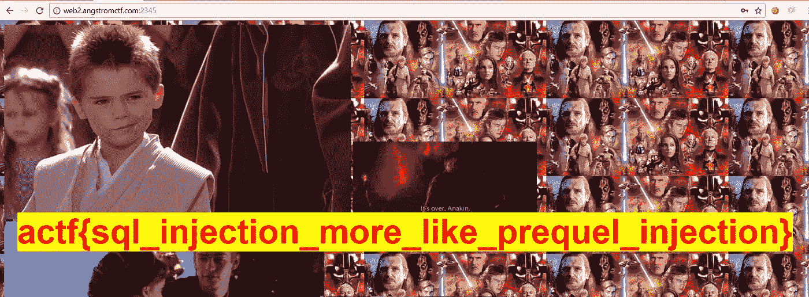

登录已被绕过！(SQLi)

**标志为:actf { SQL _ injection _ more _ like _ prequel _ injection }**

# 来源我 2[50 分]

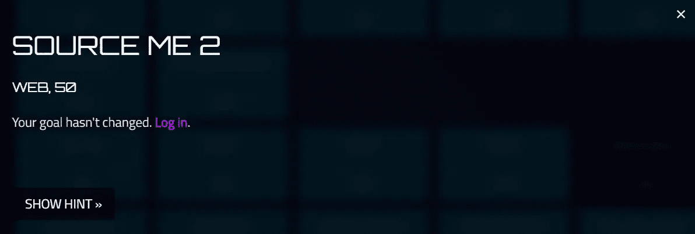

[http://web.angstromctf.com:7000/](http://web.angstromctf.com:7000/)

又一次登录！

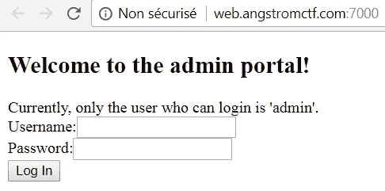

Source Me 2 的登录页面

像**Source Me 1**we**都要登录才能获得旗帜！**

View-Source 它会在那里找到一个 JavaScript 代码！

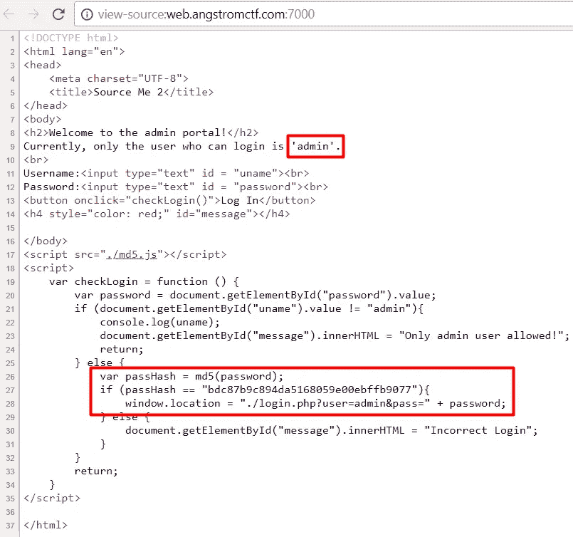

你必须阅读它才能理解它。我将得到 md5()函数，它在 md5 算法中对密码进行哈希运算，并且有一个条件检查，如果我的密码正确，它会将我重定向到标志页，要想正确，它必须是这样的:

```
**md5(password) = “bdc87b9c894da5168059e00ebffb9077”**
```

让我们尝试在[***hash killer***](https://hashkiller.co.uk/md5-decrypter.aspx)***中破解这个 md5 hash。***

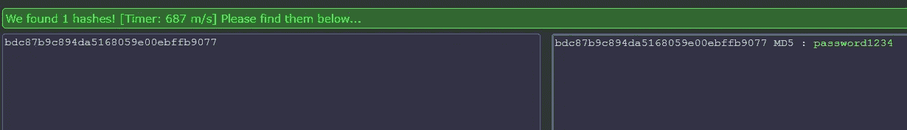

```
**md5(“password1234”) = “bdc87b9c894da5168059e00ebffb9077”**
```

所以，密码是:

> **“密码 1234”**

让我们尝试使用:admin/password1234 登录

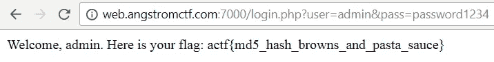

欢迎，管理员！

**标志为:actf { MD5 _ hash _ browns _ and _ pasta _ sauce }**

这是这些文章的第一部分，还有更多关于我在 [AngstromCTF 2018 网络文章第二部分](https://medium.com/@Abdelkad3r/angstromctf-2018-web-writeups-part-2-6c1ee586aa64)中解决的 4 个遗留问题的文章。