# AngstromCTF 2018 网络评论—第二部分

> 原文：<https://infosecwriteups.com/angstromctf-2018-web-writeups-part-2-6c1ee586aa64?source=collection_archive---------0----------------------->

欢迎来到 AngstromCTF 2018 由 Abdelkader [337 HackXore]撰写的文章

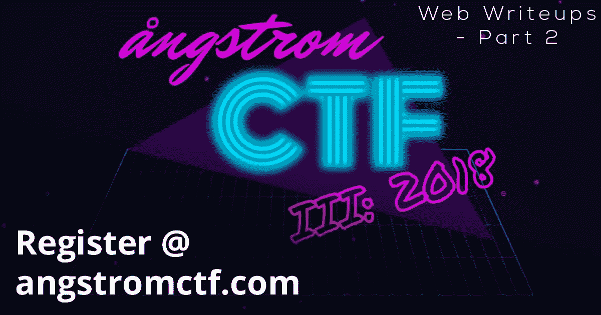

AngstromCTF 2018 网络评论—第二部分

这是我文章的第二部分，还有 4 个问题，让我们来谈谈它们的解决方案。

# 马德里布斯[120 分]


[http://web2.angstromctf.com:7777/](http://web2.angstromctf.com:7777/)

在这个挑战中，参赛者被提供了一个页面。他们必须从下拉列表中选择任何 MadLib 故事，然后填写表单，通常他们的目标是获得旗帜。

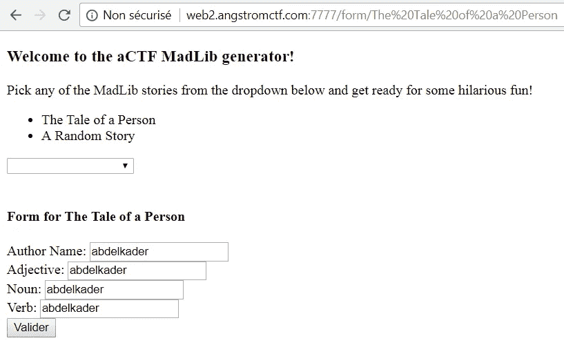

aCTF MadLib 生成器

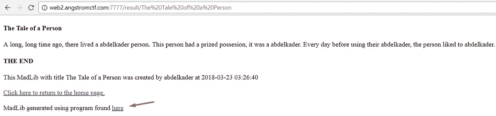

aCTF MadLib 生成器结果

我看到这个 web 应用程序有一个[源代码](http://web2.angstromctf.com:7777/get-source)！

app.py

这是一个用 ***python 语言*** 开发的 web 应用，确切的说是用 ***flask 框架(jinja2 模板引擎)*** 。

读完这段代码，也理解了它，我们必须检测这个错误，而且几乎是 flask 框架的一个错误！

让我们使用 ***Burp Suite*** 来读取 HTTP 请求和响应:

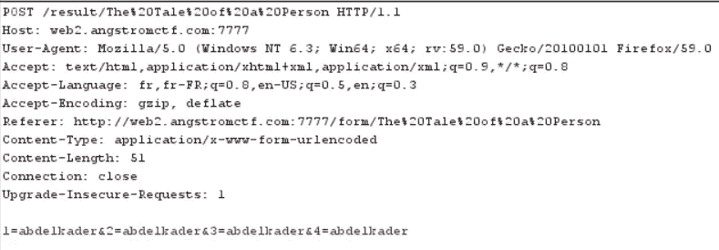

HTTP 头(请求)

我们转发给 ***中继器*** *:*

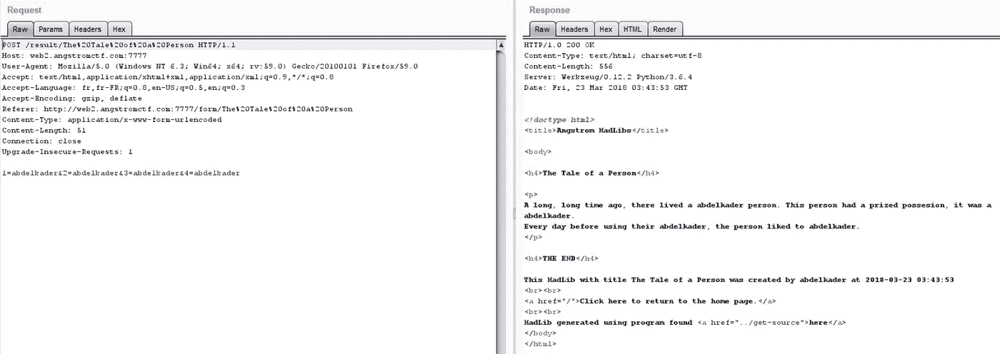

打嗝组曲中继器

有 4 个参数(1，2，3，4)，在我搜索了 flask 框架漏洞后，我发现了一些有趣的资源、文档和相关文章。

事实上，我发现了一个有趣的主题[是给你的步骤，你应该遵循在 flask 框架中找到一个模板注入漏洞，然后利用它直到攻击。](http://blog.portswigger.net/2015/08/server-side-template-injection.html)

这是以下模板注入方法:


捕捉高效攻击过程的高级方法

## **1。检测**

该漏洞可能出现在两种不同的上下文中，每种上下文都需要自己的检测方法:明文上下文和代码上下文。

在尝试了多次之后，基于明文上下文检测方法，我只是通过在第一个参数中注入这个字符串来指出错误: **{{7*7}}**

在我得到结果后，我得到它是由服务器在第一个参数中执行的！

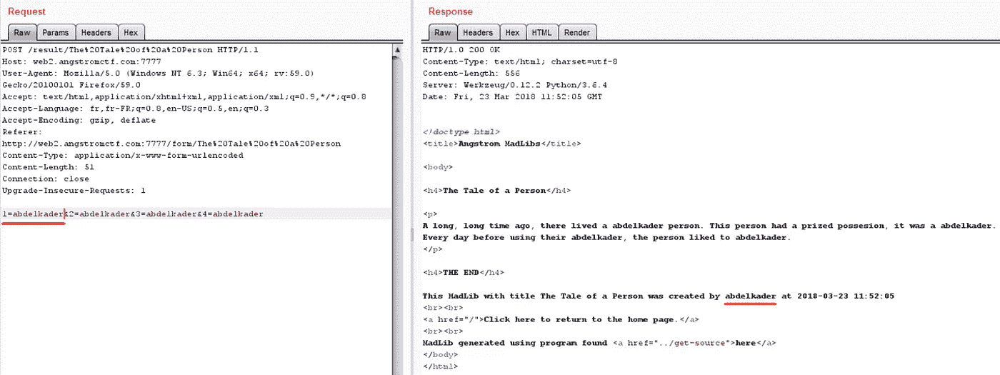

正常情况下作者姓名的参数(1=)

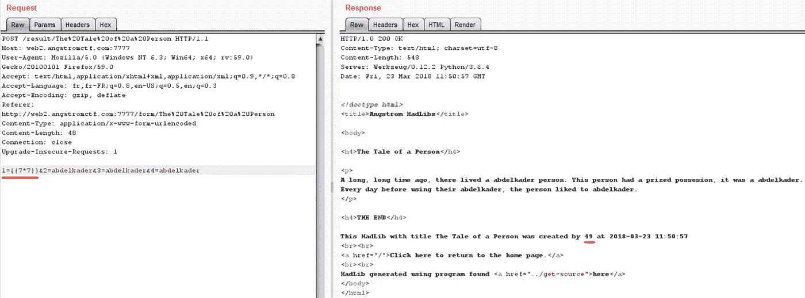

bug 已经被检测出来了！

我检测到的是 [***服务器端烧瓶模板注入(SSTI)漏洞***](https://nvisium.com/resources/blog/2015/12/07/injecting-flask.html)

## **2。识别**

在检测到这是 SSTI 漏洞后，下一步就是识别使用中的模板引擎。这一步有时就像提交无效语法一样简单，因为模板引擎可能会在产生的错误消息中识别自己。然而，当错误消息被抑制时，这种技术会失败，并且不太适合自动化。相反，我们在 ***Burp Suite*** 中使用特定语言有效负载的决策树来自动化这一点。绿色和红色箭头分别代表“成功”和“失败”响应。在某些情况下，单个有效负载可以有多个不同的成功响应—例如，如果没有使用模板语言，探测器 **{{7*'7'}}** 将导致**分支**中的 **49** ， **7777777** 中的 **Jinja2、**中的**和【无】。**

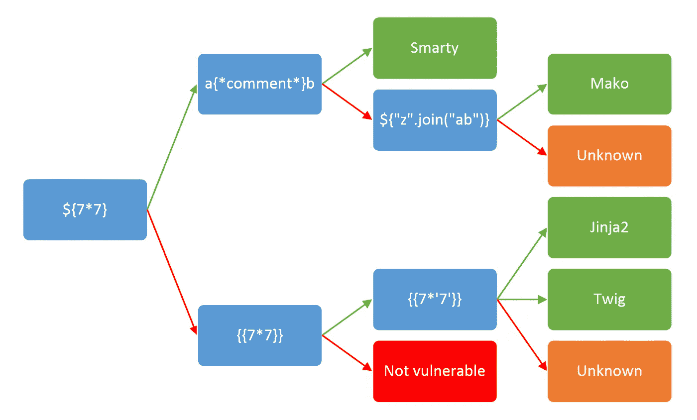

特定于语言的有效负载树

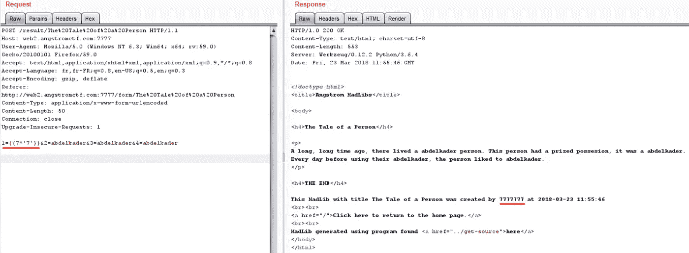

试图通过跟踪树来识别这个 bug

好的，我刚刚执行了 **{{7*7}}** 然后我执行了 **{{7*'7'}}** ，并且基于树；这是**小枝**或**金贾 2** 模板引擎！

让我们回到[源代码](http://web2.angstromctf.com:7777/get-source)，正如我在本文开头提到的；我们可以注意到那是 **Jinja2** 模板引擎。

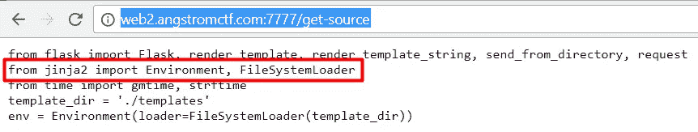

这是 Jinja2 模板引擎

我鉴定出那是 [***服务器端烧瓶 Jinja2 模板注入(SSTI)漏洞***](https://nvisium.com/resources/blog/2015/12/07/injecting-flask.html) 。

## **3。利用**

实际上，我在这一步中遵循了三个子步骤:阅读、探索然后攻击。

**3.1 改为**

找到 SSTI 漏洞并确定模板引擎后的第一步是阅读文档。不应低估这一步骤的重要性；接下来的一个零日漏洞纯粹来自于对文档的仔细阅读。感兴趣的主要领域有:

1.  获取模板作者介绍基本语法的章节。
2.  “安全考虑”——开发你正在测试的应用程序的人很可能没有读过这篇文章，它可能包含一些有用的提示。
3.  内置方法、函数、过滤器和变量的列表。
4.  扩展/插件列表—有些可能默认启用。

**3.2 探索**

假设没有漏洞出现，下一步是探索环境，找出您可以访问的确切内容。您可以期望找到模板引擎提供的默认对象，以及开发人员传递给模板的特定于应用程序的对象。许多模板系统公开一个包含范围内所有内容的“自身”或名称空间对象，以及一种列出对象的属性和方法的惯用方式。

如果没有内置的 self 对象，你将不得不基于单词表强制使用 PHP 项目中使用的变量名称，并通过 [***SecLists***](https://github.com/danielmiessler/SecLists/blob/25d4ac447efb9e50b640649f1a09023e280e5c9c/Discovery/Web-Content/burp-parameter-names.txt) 和 ***Burp 入侵者的*** 单词表集合公开发布。

开发人员提供的对象很可能包含敏感信息，并且在一个应用程序中的不同模板之间可能会有所不同，所以这个过程应该理想地单独应用于每个不同的模板。

**3.3 攻击**

此时，您应该对可用的攻击面有了一个明确的概念，并且能够继续使用传统的安全审计技术，检查每个功能是否存在可利用的漏洞。在更广泛的应用程序环境中处理这一点很重要——一些函数可以用来利用特定于应用程序的特性。

根据最后的子步骤，我基于一些文档和博客利用了这个漏洞，我从这个开始:[在 Flask/Jinja2 中探索 SSTI，第二部分](https://nvisium.com/resources/blog/2016/03/11/exploring-ssti-in-flask-jinja2-part-ii.html)，我试图选择一个新样式的对象用于访问*对象*基类。我使用了一些基于上一篇文章的属性。在注入一些对象和属性后，我注意到了一件事；第一个参数只允许注入 12 个字节，第二个参数只允许注入 24 个字节(长度限制)！

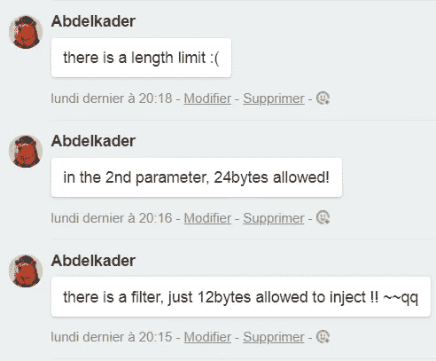

马德里布斯的特雷罗卡评论

嗯……我必须注入第一个参数，它限制在 12 个字节允许注入！

在 [github](https://github.com/swisskyrepo/PayloadsAllTheThings/tree/master/Server%20Side%20Template%20injections) 中阅读了关于模板注入的主题后，我发现我可以使用一个短的有效载荷(<12 字节)来利用它。

我试图在第一个参数中以代码形式执行自身对象:

> **{{自我}}**

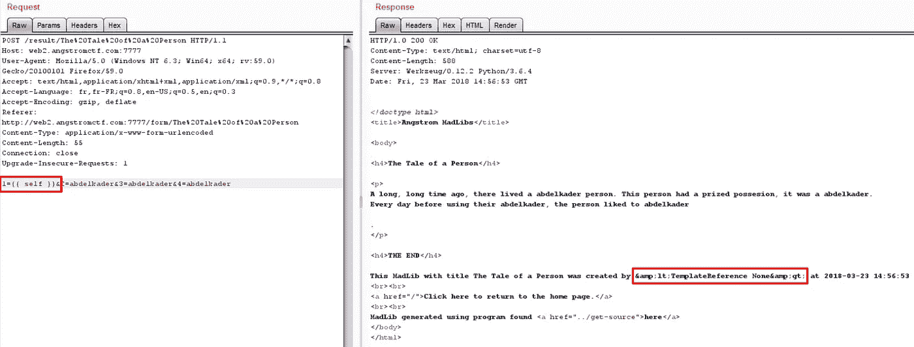

{{ self }}已成功执行

嗯…在回应中有一些有趣的事情，我看到自我目标代码已经被成功执行，它也注入了！

让我们尝试在第一个参数中执行 config-object 代码:

> {{配置}}

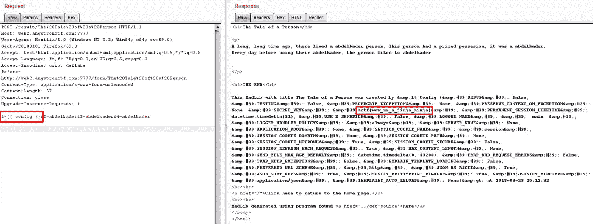

{{ config }}已成功执行

耶…配置对象也被注入，并且成功地作为代码执行了！

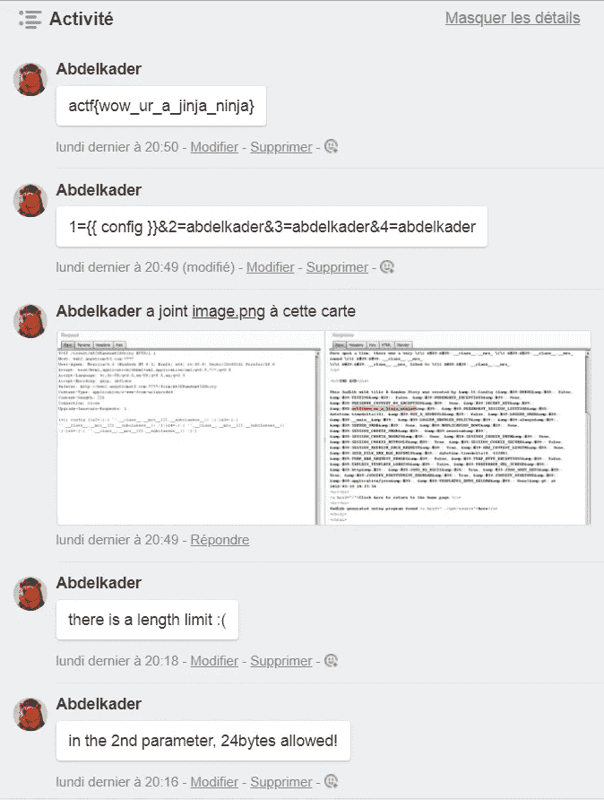

马德里布斯的特雷罗卡评论

**旗帜为:actf{wow_ur_a_jinja_ninja}**

# MD5[140 分]


http://web.angstromctf.com:3003/

在这个挑战中，参赛者被提供了一个页面。他们必须找到具有相同 md5 散列的两个不同的字符串！

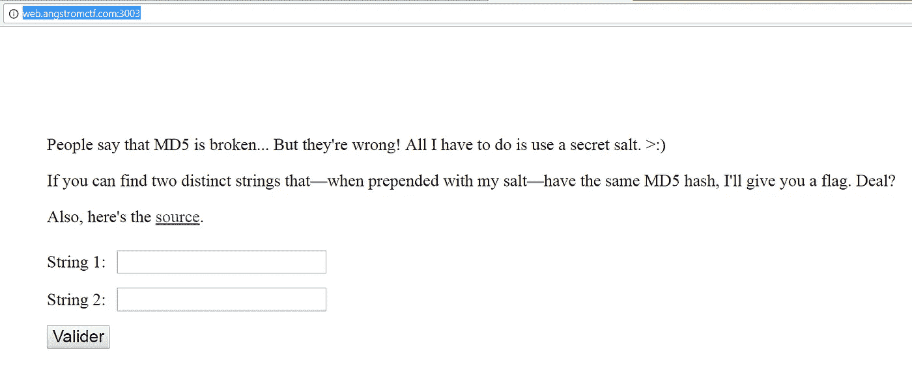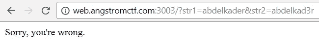

对不起，你错了。

有一个[的源代码](http://web.angstromctf.com:3003/src)，读出来:

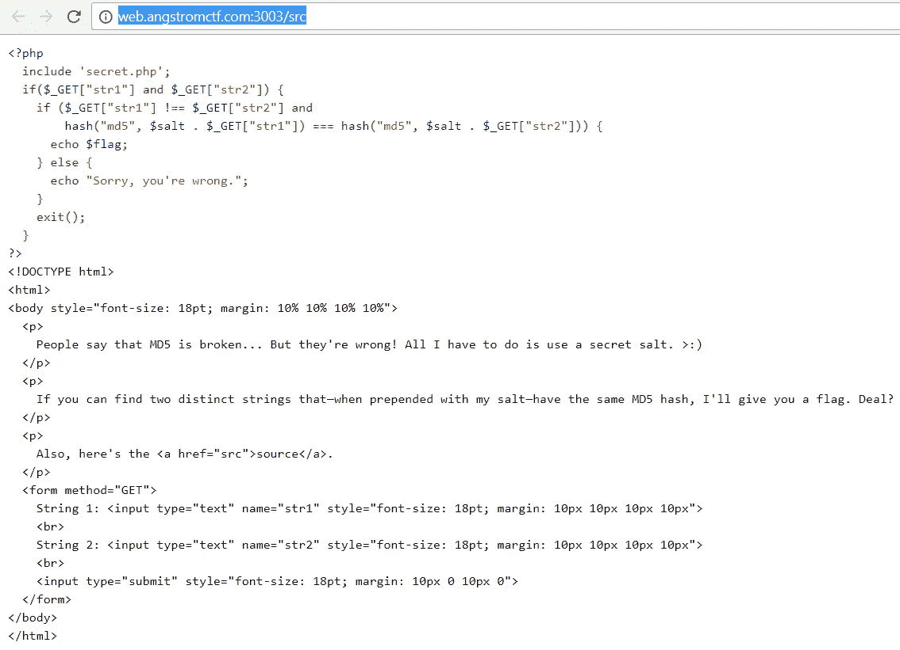

md5 挑战的源代码

这是 PHP，我们也要理解它才能解决这个问题！

我注意到他们通过使用检查条件在 **str1** 和 **str2** 之间进行比较，所以我尝试搜索具有相同 md5 哈希的两个字符串，并尝试生成 base64 代码作为字符串，在我放置它们后，我没有得到我需要的！

过了一段时间，我考虑了发送两个不同值的数组，而不是字符串！

为什么我想发送两个不同值的数组而不是字符串？

首先，让我们看看当我第一次尝试得到错误的消息时发生了什么！

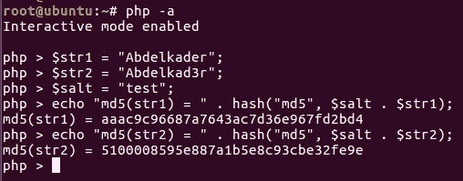

不同的字符串给我不同的 MD5 哈希(错！)

好的，如果我们把一个数组和一个字符串连接起来，这就是我们的结果:

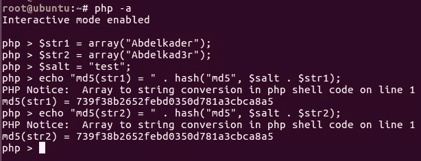

不同的字符串给了我相同的 MD5 哈希

简单地说，它会给我一个成功的信息！

因此，让我们在 GET 请求中发送数组，而不是字符串:

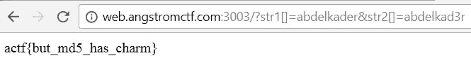

耶……(成功！)

**标志为:actf{but_md5_has_charm}**

# 文件存储器[160 分]

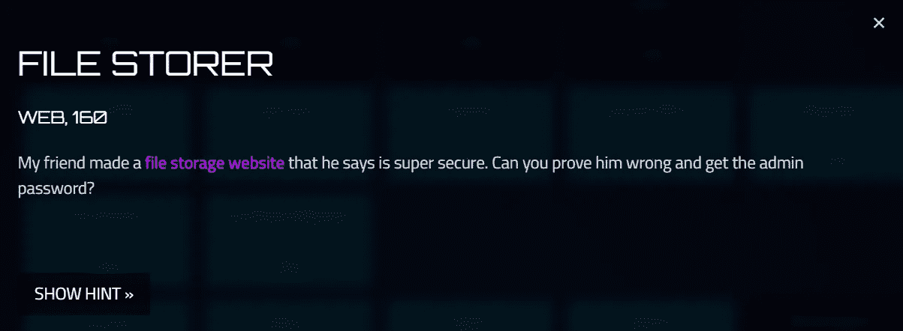

[http://web2.angstromctf.com:8899/](http://web2.angstromctf.com:8899/)

在本次挑战赛中，为参赛者提供了一个注册/登录页面。他们必须注册然后登录:

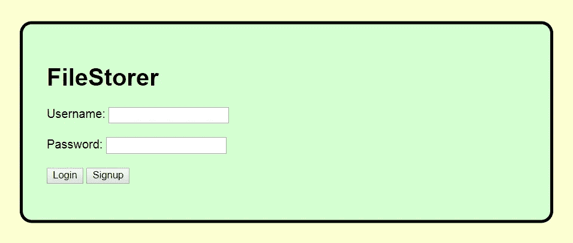

文件存储的登录页面

他们会从 URL 找到一个文件上传程序:


从 URL 上传文件

第一次，我尝试从 URL 上传任何文件，并使用 HTTP 头来读取 HTTP 请求/响应中发生的情况:

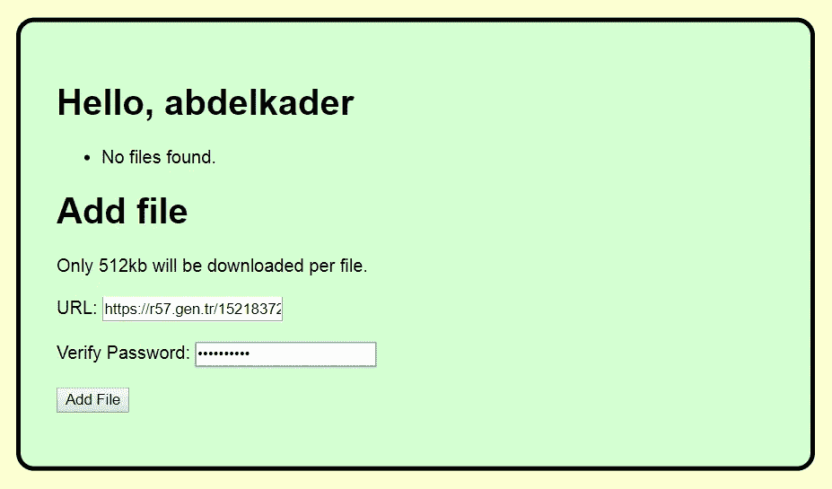

正在尝试上传文件…

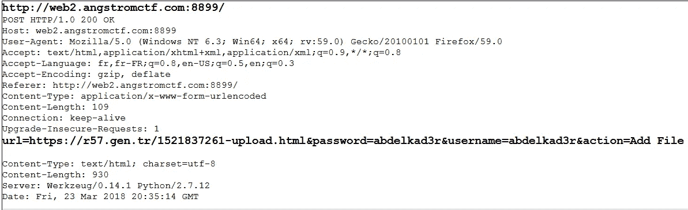

HTTP 标头

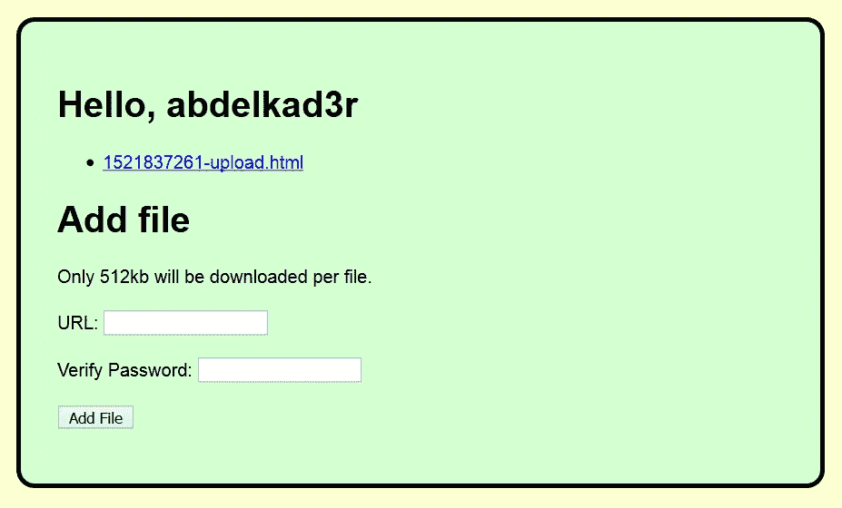

我们的文件已经上传了！

嗯……我注意到有:

> 服务器:Werkzeug/0.14.1 Python/2.7.12

是新的 Python 框架 Bug？~~

好的，让我们继续我们的搜索…让我们检查这个文件上传到哪里？

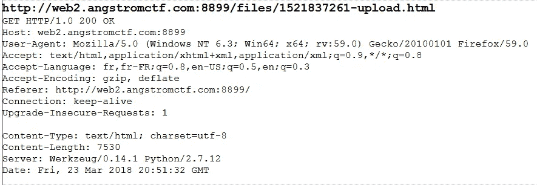

HTTP 标头


[http://web 2 . angstromctf . com:8899/files/1521837261-upload . html](http://web2.angstromctf.com:8899/files/1521837261-upload.html)

嗯……让我们回到**/文件**目录去看看那里有什么！

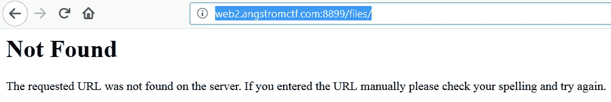

没有找到！

好了，让我们检查一下 ***。git*** 文件夹是存在那里的！

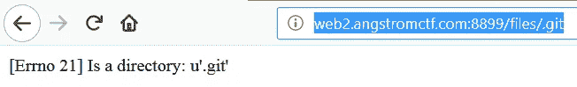

/.git 文件夹存在！

有一个 **/。服务器上的 git/** 文件夹，我们用[***git dumper***](https://github.com/internetwache/GitTools)转储吧:

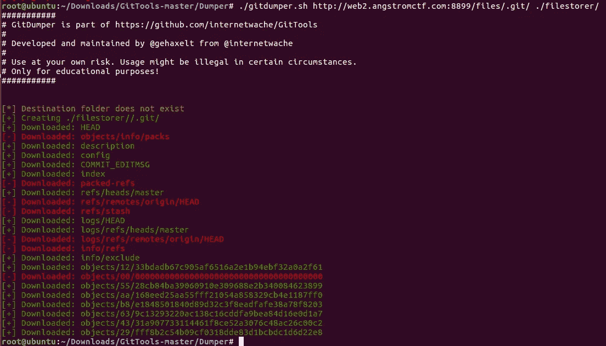

甩了/。使用 Getdumper 工具创建 git/ folder

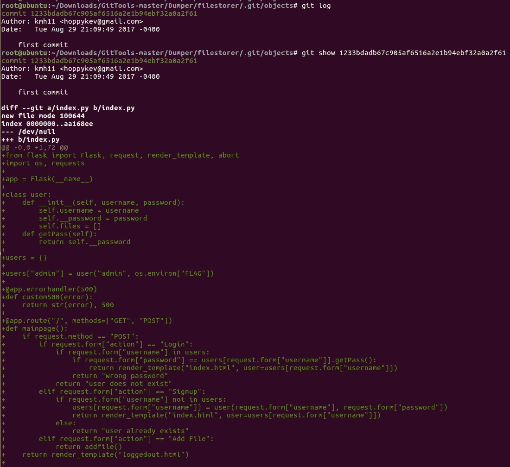

找到了 b/index.py！

甩了**后*。git*** repo，检查日志并使用 ***显示提交。git 命令*** 我们发现了一个非常有趣的 python 脚本‘b/index . py’，因为它意味着这是一个由***Flask Framework***开发的 python web 应用程序。

这是 ***index.py*** 脚本:

索引. py

在我读完代码后，我注意到有一个有趣的 bug，我喜欢尝试一下，这就是 [***遍历目录***](https://www.owasp.org/index.php/Path_Traversal) 。

我建议你像我在发现、识别和利用它之前一样去阅读它！

这些是我读到的主题: [***通过 PHP 多文件上传进行目录遍历***](https://nealpoole.com/blog/tag/directory-traversal/) 。

尽管这是 Python 易受攻击的 Web 应用程序，但我只是基于 PHP 开发文章来使其可被利用！

通常，我们会使用路径来引用磁盘或其他资源上的文件。 ***路径遍历攻击*** 是指攻击者提供与我们的路径一起使用的输入，以访问文件系统上我们并不打算访问的文件。输入通常试图打开应用程序的工作目录，并访问文件系统中其他地方的文件。通过使用受限文件权限配置文件来限制文件系统访问的范围和减少表面，可以缓解这类攻击。

web 应用程序中 ***路径遍历*** 的典型远程向量可能涉及在文件系统上提供或存储文件。

由于攻击者控制直接用于构建路径的输入，因此他们能够访问系统上的任何文件。我第一次尝试用这个方法读取 ***/etc/passwd*** 但是被过滤了！

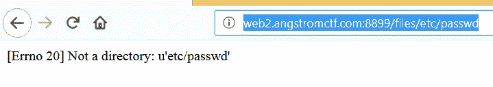

正在尝试读取/etc/passwd

基于 Neal Poole 的第一篇博客，我刚刚生成了另一个有效载荷来绕过这个过滤器，然后最后我读取了 ***/etc/passwd***


阅读/etc/passwd

我只是用这个有效载荷读取了 ***/etc/passwd*** :

> /文件/..%2f..%2f..%2f..%2f..%2fetc%2fpasswd

让我们试着找到旗子存放的地方！

经过一番搜索:

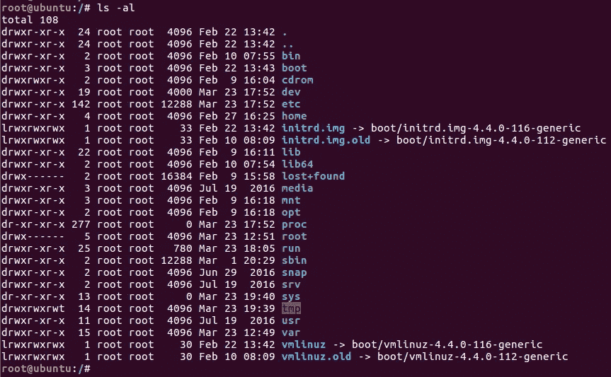

/

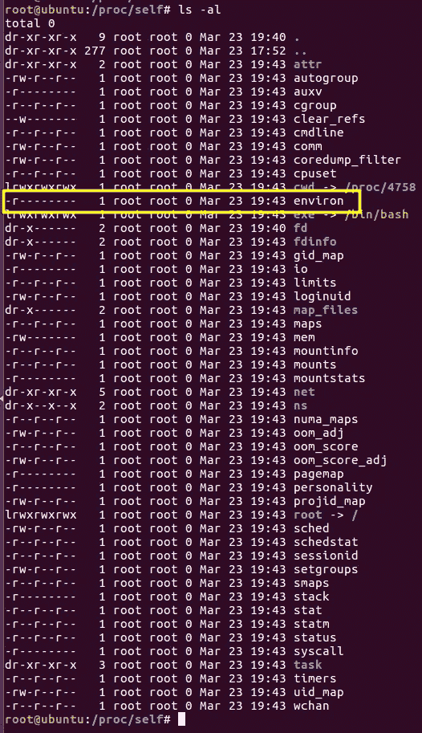

/proc/self/

我刚刚检查了所有的文件，我得到标志存储在一个名为 **FLAG** 的环境变量中***/proc/self/environ***

> FLAG = actf { 2 _ und 3 RSC 0 RES _ h1 des _ n0th 1 ng }


旗子快没了！

我只是用这个有效载荷读取了***/proc/self/environ***:

> /文件/..%2f..%2f..%2f..%2f..%2fproc%2fself%2fenviron

**标志为:actf { 2 _ und 3 RSC 0 RES _ h1 des _ n 0 th1ng }**

# 最佳网站[230 分]

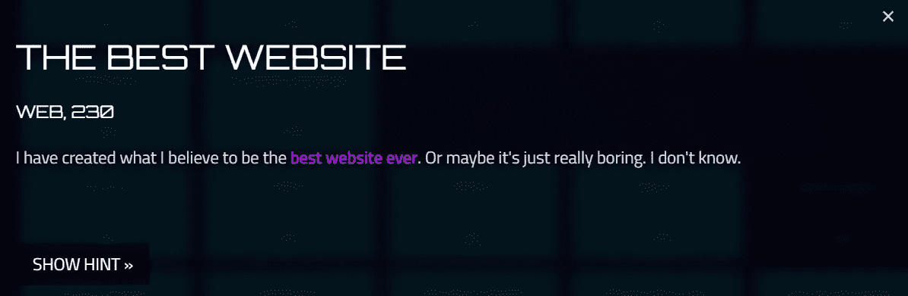

[http://web.angstromctf.com:7667](http://web.angstromctf.com:7667/)

对于这个挑战，参赛者提供了一个网站，他们应该做一些事情来获得旗帜！

查看-来源 it:

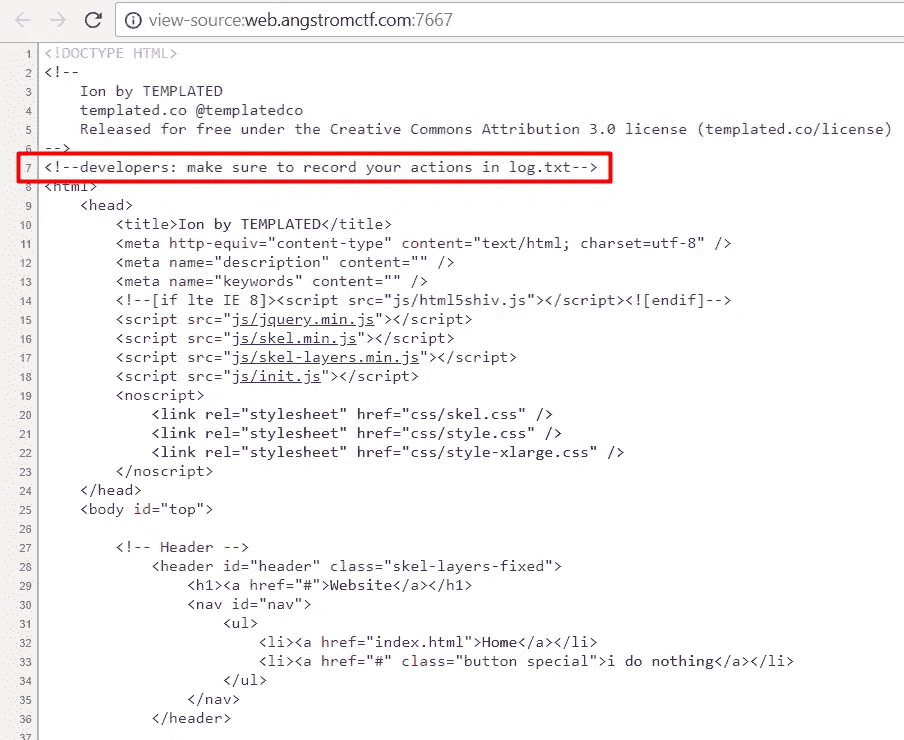

最佳网站的源代码

嗯…那就够有趣的了！

让我们试着查一下 ***log.txt*** :

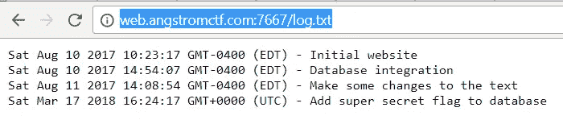

/log.txt

听起来不错，这是一个访问日志文件！

同样的源代码中，还有另外一个有趣的 JS 脚本 ***js/init.js*** :

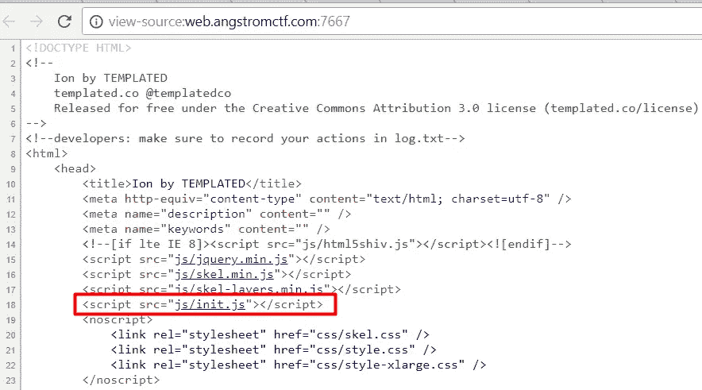

最佳网站的源代码

让我们来看看:

js/初始化. js

这是 HTTP 头(GET 请求):

```
GET /boxes?ids=5aad412be07e1e001cfce6d2,5aad412be07e1e001cfce6d3,5aad412be07e1e001cfce6d4 HTTP/1.1
Host: web.angstromctf.com:7667
User-Agent: Mozilla/5.0 (Windows NT 6.3; Win64; x64; rv:59.0) Gecko/20100101 Firefox/59.0
Accept: */*
Accept-Language: fr,fr-FR;q=0.8,en-US;q=0.5,en;q=0.3
Accept-Encoding: gzip, deflate
Referer: [http://web.angstromctf.com:7667/](http://web.angstromctf.com:7667/)
X-Requested-With: XMLHttpRequest
Connection: close
If-None-Match: W/”183-Tv299FSONRL0nObibB59WErSwqE”
```

嗯……有个有趣的三个 id；都在 ***init.js*** 和 ***HTTP 头*** ！

还有另一种机制:

> x-Requested-With:XMLHttpRequest

这些信息让我困惑的思考着 [***CSRF 漏洞***](https://www.owasp.org/index.php/Cross-Site_Request_Forgery_(CSRF))*！*

*我浪费时间搜索和阅读更多关于 ***CSRF 漏洞*** 以及如何利用它在我的情况下，我读了一大堆文章和博客，最后我得到了没有办法…这不是 ***CSRF 漏洞*** ，这是另一个错误！*

*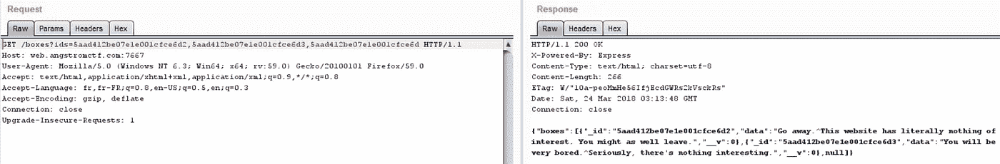*

*HTTP GET 请求/响应*

*这是到目前为止的 HTTP 响应:*

```
*{“boxes”:[{“_id”:”5aad412be07e1e001cfce6d2",”data”:”Go away.^This website has literally nothing of interest. You might as well leave.”,”__v”:0},{“_id”:”5aad412be07e1e001cfce6d3",”data”:”You will be very bored.^Seriously, there’s nothing interesting.”,”__v”:0},null]}*
```

*好像是 JSON！*

*在我搜索了这到底是什么并询问了管理员之后，我得到的答案是这取决于[***MongoDB***](https://en.wikipedia.org/wiki/MongoDB)。*

*准确的说，我最后得到的是**数据库中的[](https://en.wikipedia.org/wiki/BSON)**，这三个 id 是[***MongoDB ObjectIds***](https://docs.mongodb.com/manual/reference/method/ObjectId/)。*****

****这是**的 *ObjectId* 的**组件:****

****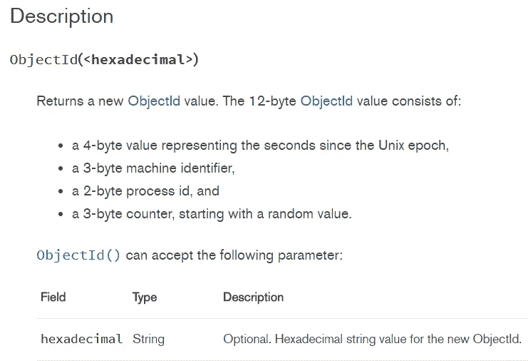****

****读完之后，我只是浪费了一点时间去思考如何才能得到这个标志，我没有办法访问那里的任何数据库~~****

****我考虑过 [***盲目 SQL 注入***](https://www.owasp.org/index.php/Blind_SQL_Injection) 但是我试了很多次，没有发现任何有趣的结果。****

****但是，为什么 ***log.txt*** 文件是存在的呢？****

*******log.txt*** 文件给我们一些带有日期的事件。正如我们所知， ***ObjectId*** 的第一部分是 4 个字节的值，表示自 Unix epoch 以来的秒数。所以， ***log.txt*** 文件和 ***ObjectId*** 之间是有关系的。****

****我想通了，可以用 ***log.txt*** 中的最后一个事件日期生成一个新的 ***ObjectId*** 。****

******生成新的 ObjectId:******

****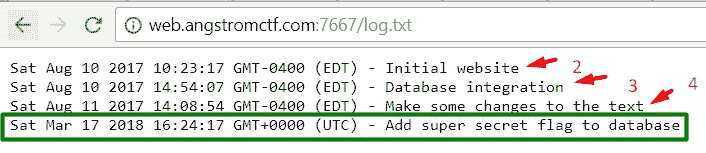****

****log.txt 文件中的事件****

****我们的目标:****

```
**5aad412be07e1e001c**fce6d2 <- counter, random value (the 1st event)**
5aad412be07e1e001c**fce6d3 <- counter, random value (the 2nd event)** 
5aad412be07e1e001c**fce6d4 <- counter, random value (the 3rd event)****
```

****我将编辑基于时间戳的第一部分，让我们基于第 5 个事件的新时间戳生成一个新的 ObjectId(“将超级机密标志添加到数据库”)，以读取由[***MongoDB ObjectId-to-Timestamp 转换器***](https://steveridout.github.io/mongo-object-time/)***:***添加到数据库的超级机密标志****

****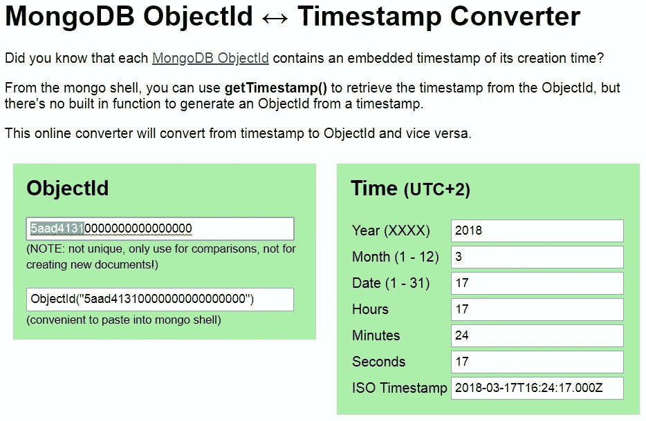****

****MongoDB ObjectId 时间戳转换器****

****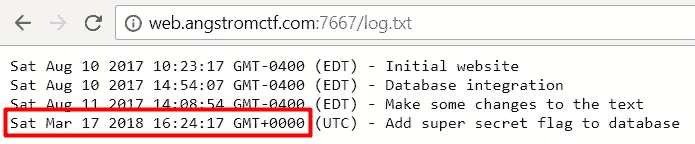****

****根据这个日期生成您的时间戳****

****最后，我得到了我的新 *ObjectId* 的第一部分！****

****第二部分(机器标识符)和第三部分(pid)在任何 *ObjectId* 之间是公共的，第四部分和最后一部分(计数器)从 *ObjectId* 变为另一个。****

****我们的 ObjectIds 计数器随机从 **0xfce6d2** 开始，在 flag 的事件之前我们有 3 个事件，因此我们的 flag 的事件是第 4 个事件，并且将把 **0xfce6d5** 作为计数器值。****

****我们的第四个 *ObjectId* 将是:****

```
****5aad4131**e07e1e001c**fce6d5****
```

****让我们尝试用这个 *ObjectId* 而不是旧的*ObjectId*重新发送请求:****

```
**GET /boxes?ids=**5aad4131**e07e1e001c**fce6d5**,5aad412be07e1e001cfce6d3,5aad412be07e1e001cfce6d4 HTTP/1.1
Host: web.angstromctf.com:7667
User-Agent: Mozilla/5.0 (Windows NT 6.3; Win64; x64; rv:59.0) Gecko/20100101 Firefox/59.0
Accept: */*
Accept-Language: fr,fr-FR;q=0.8,en-US;q=0.5,en;q=0.3
Accept-Encoding: gzip, deflate
Referer: [http://web.angstromctf.com:7667/](http://web.angstromctf.com:7667/)
X-Requested-With: XMLHttpRequest
Connection: close
If-None-Match: W/"183-Tv299FSONRL0nObibB59WErSwqE"**
```

****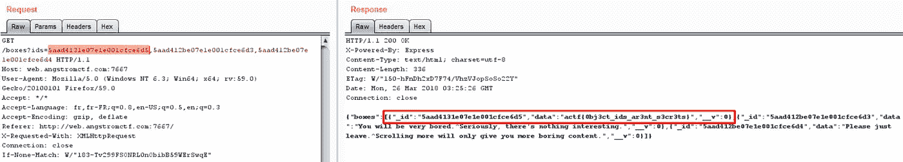****

****重新发送新的 ObjectId，而不是旧的 ObjectId****

```
**HTTP/1.1 200 OK
X-Powered-By: Express
Content-Type: text/html; charset=utf-8
Content-Length: 336
ETag: W/"150-hFnDh2xD7F74/VhzVJopSoSo22Y"
Date: Mon, 26 Mar 2018 03:25:26 GMT
Connection: close{"boxes":[{"_id":"5aad4131e07e1e001cfce6d5","data":"**actf{0bj3ct_ids_ar3nt_s3cr3ts}**","__v":0},{"_id":"5aad412be07e1e001cfce6d3","data":"You will be very bored.^Seriously, there's nothing interesting.","__v":0},{"_id":"5aad412be07e1e001cfce6d4","data":"Please just leave.^Scrolling more will only give you more boring content.","__v":0}]}**
```

******标志为:actf { 0 bj 3c t _ ids _ ar3nt _ s 3c R3 ts }******

# ****结论****

****我希望这种风格的报道能激励其他 CTF 球员揭露更多他们遇到的失败，而不仅仅是强调他们的成功。至于激励信息安全专业人士。我希望这个未经审查的账户能激励你继续努力，不管你遇到什么样的障碍。****

****最后，我想真诚地感谢 AngstromCTF 2018 组织者为所有这些好的网络问题。没有 AngstromCTF，这整个学习机会是不可能的。****